Social Mistreatment and Alcohol Use Problem Trajectories: The Moderating
Effects of Brain Network Activations during the Stop Signal Task
================

# Intro

## Background

The risk for alcohol use disorder (AUD) is related to increased adverse
life experiences such as social mistreatment. On the other hand,
cognitive control is fundamental to facilitate self-control and
psychological resilience, and has been proposed as a protector for AUD.
However, the neural mechanism underlying the longitudinal association
between these constructs remains unclear. This study examined the
relationship between social mistreatment and the trajectories of alcohol
use problem, while determining the moderating role of motor inhibition
and error processing, which are the two important elements of cognitive
control, using questionnaires, Stop Signal Task, and fMRI. In our
preliminary analyses where we examined the relationship between AUDIT
and social experiences and the moderation of inhibition (without
modeling the trajectories). It seems that they might not relate to each
other when we look at the data by separate waves of data collection.
However, there are significant effects of social experiences and
moderation of inhibition when we used ΔAUDIT as the outcome variable.
Therefore, it is worth of trying to run HLM to model the slope of AUDIT.

## RQ

- Does social mistreatment predict the trajectories of alcohol problem
  in young adults?
- Does inhibitory control and error processing moderate the relationship
  between social mistreatment and the trajectories of alcohol problem in
  young adults?

## Hypothesis

- Social mistreatment is related to a greater increase of AUDIT score
  over time (i.e., steeper slope).
- Faster stop signal reaction time (SSRT) and greater post-error slowing
  (PES) are related mitigate the impact of social mistreatment on the
  AUDIT slope.
- Increased brain network activations of inhibition and error processing
  mitigate the impact of social mistreatment on the AUDIT slope.

## Methods

This is a longitudinal study where participants completed questionnaires
and a Stop Signal Task during fMRI scanning at baseline (T0), and
completed three yearly follow-up surveys (T1-T3). At baseline, the
participants are all freshmen students in South Carolina; baseline n =
144, 1st follow-up n = 114, 2nd follow-up n = 83, 3rd follow-up n = 78.
Exclusion criteria: 1) incomplete Stop Signal Task or fMRI data, 2)
incomplete questionnaire data at baseline. All participants are
right-handed. The fMRI data has been preprocessed and group-level
comparisons were conducted: successful stop vs. go (SS-GO) and SS
vs. failed stop (SS-FS) was completed (based on p = .001, cluster size =
31).<br>

The current study oprationalized inhibition as SSRT and brain network
activations during the Stop Signal Task based on the atlas of Power et
al. (2011), which has 13 networks including 1. Sensory/somatomotor Hand,
2. Sensory/somatomotor Mouth, 3. Cingulo-opercular Task Control, 4.
Auditory, 5. Default mode, 6. Memory retrieval?, 7. Visual, 8.
Fronto-parietal Task Control, 9. Salience, 10. Subcortical, 11. Ventral
attention, 12. Dorsal attention, and 13. Cerebellar. The activations in
these networks were calculated as the betas of “successful stop - go”
contrast averaged in each network.<br>

We used the hierachical linear modeling approach to build linear growth
models. Item-wise missing data within each questionnaire was
interpolated with mean values if the response rate of that questionnaire
is \>= 50%; otherwise, the composite score was written as missing value
(i.e., 9999).

### What we have tried in the previous analyses

We identified ROIs in the ss_stop-go contrast via 1) narrowing the
significant level to p-value to 0.0000001 (cluster size still set as
31), 2) searching for the clusters where their peaks are located in
inhibition areas based on the literature (i.e., IFG and insula), 3)
looking at the coordinates of peak signals in those clusters, and 4)
creating masks with a 10-mm radius sphere around these peaks. Four ROIs
were identified (see the bolded ROIs below), which cover rIFG, lIFG,
right insula, and left insula. Additionally, we also ran a correlation
between SSRT and ss_stop-go contrast, and clusters of right (+19.5,
+39.5, +51.5) and left SFG (-16.5, +55.5, +35.5) were identified (p =
.001, cluster size = 31).<br>

**Peak coordinates (order: LPI)**<br> **p = .0000001, cluster = 31**<br>
**+55.5 +17.5 +31.5: rIFG, rMiddleFG, right precentralG** (this site
survives even after clustering size 500)<br> **-54.5 +13.5 +33.5: lIFG,
lMiddleFG, left precentralG** (this site survives even after clustering
size 500)<br> **+49.5 +19.5 -8.5: rIFG, rInsula, rTemporal pole**<br>
**-48.5 +19.5 -8.5: lIFG, lTemporal pole** (this was also included in
our analysis to represent left insula, although the coordinate of the
peak is not exactly on left insula)<br> +29.5 +55.5 +29.5: rSFG,
rMiddleFG<br> -30.5 +1.5 +67.5: lSFG, left precentralG<br> -0.5 -30.5
+27.5: lPCC, lPCC, lMiddle CC, lMiddle CC<br> +63.5 +7.5 +27.5: rIFG,
right precentralG<br> **p = .0000001, cluster = 500**<br> +55.5 +17.5
+31.5: rIFG, rMiddleFG, right precentralG<br> -54.5 +13.5 +33.5: lIFG,
rMiddleFG, right precentralG<br><br>

We also tried the network activations using the atlas from Yeo et
al. (2011), which has 7-network and 17-network versions of segmentation.
We ended up with Power’s 13-network atlas since it gives similar results
as Yeo’s and has a medium number of networks compared to Yeo’s 7 and 17
networks.

# Data preparation and quick check

``` r
# df <- read_excel('lia1.xlsx', col_names = TRUE, sheet = 'sstTemp')
df <- read_excel('lia1.xlsx', col_names = TRUE, sheet = 'sstTemp')
df <- df[,!names(df) %in% c("mriID_T1", "mriID_T2", "mriID_T3")]
df <- df %>%
  rename(AUDIT_T0 = auditTotal_T0, AUDIT_T1 = auditTotal_T1, AUDIT_T2 = auditTotal_T2, AUDIT_T3 = auditTotal_T3, SocialMis_T0 = ICSRLE_generalSocialMistreatment_T0, SocialMis_T1 = ICSRLE_generalSocialMistreatment_T1, SocialMis_T2 = ICSRLE_generalSocialMistreatment_T2, SocialMis_T3 = ICSRLE_generalSocialMistreatment_T3, NegLife_T0 = ICSRLE_total_T0, NegLife_T1 = ICSRLE_total_T1, NegLife_T2 = ICSRLE_total_T2, NegLife_T3 = ICSRLE_total_T3, NegLife_other_T0 = ICSRLE_other_T0, NegLife_other_T1 = ICSRLE_other_T1, NegLife_other_T2 = ICSRLE_other_T2, NegLife_other_T3 = ICSRLE_other_T3, AdChild = ACE_totalCorrected, CDRISC_Resilience = connorDavidsonResilienceScaleTotal, SUPPS_Impulsive = SUPPS_impulsiveBehaviorTotalCorrected, BIS_Impulsive = barrattImpulsivenessTotalCorrected, stateAnxiety = stateAnxietyInventoryCorrected, traitAnxiety = traitAnxietyInventoryCorrect, BDI_depression = bdiCorrected,
         GoAcc = goAcc, GoRT = goRT, StopAcc = stopAcc, SSD = ssd, SSRT = ssrt, go_subcortical = go_network_13_10,

         ss_somatomotorHand = ss_net_13_1, ss_somatomotorMouth = ss_net_13_2, ss_cinguloOpercularTaskControl = ss_net_13_3, ss_auditory = ss_net_13_4, ss_default = ss_net_13_5, ss_memoryRetrieval = ss_net_13_6, ss_visual = ss_net_13_7, ss_frontoParietalTaskControl =  ss_net_13_8, ss_salience =  ss_net_13_9, ss_subcortical =   ss_net_13_10, ss_ventralAttention = ss_net_13_11, ss_dorsalAttention =  ss_net_13_12, ss_cerebellar = ss_net_13_13,

         fs_somatomotorHand = fs_net_13_1, fs_somatomotorMouth = fs_net_13_2, fs_cinguloOpercularTaskControl = fs_net_13_3, fs_auditory = fs_net_13_4, fs_default = fs_net_13_5, fs_memoryRetrieval = fs_net_13_6, fs_visual = fs_net_13_7,fs_frontoParietalTaskControl =   fs_net_13_8,    fs_salience = fs_net_13_9, fs_subcortical = fs_net_13_10, fs_ventralAttention = fs_net_13_11, fs_dorsalAttention = fs_net_13_12, fs_cerebellar = fs_net_13_13,

         ssgo_somatomotorHand = ss_go_net_13_1, ssgo_somatomotorMouth = ss_go_net_13_2, ssgo_cinguloOpercularTaskControl = ss_go_net_13_3, ssgo_auditory = ss_go_net_13_4, ssgo_default = ss_go_net_13_5, ssgo_memoryRetrieval = ss_go_net_13_6, ssgo_visual = ss_go_net_13_7, ssgo_frontoParietalTaskControl = ss_go_net_13_8, ssgo_salience = ss_go_net_13_9, ssgo_subcortical = ss_go_net_13_10, ssgo_ventralAttention = ss_go_net_13_11, ssgo_dorsalAttention = ss_go_net_13_12, ssgo_cerebellar = ss_go_net_13_13,

         ssfs_somatomotorHand = ssfs_net_13_1, ssfs_somatomotorMouth = ssfs_net_13_2, ssfs_cinguloOpercularTaskControl = ssfs_net_13_3, ssfs_auditory = ssfs_net_13_4, ssfs_default = ssfs_net_13_5, ssfs_memoryRetrieval = ssfs_net_13_6, ssfs_visual = ssfs_net_13_7, ssfs_frontoParietalTaskControl = ssfs_net_13_8, ssfs_salience = ssfs_net_13_9, ssfs_subcortical = ssfs_net_13_10, ssfs_ventralAttention = ssfs_net_13_11, ssfs_dorsalAttention = ssfs_net_13_12, ssfs_cerebellar = ssfs_net_13_13,

         fsgo_somatomotorHand = fsgo_net_13_1, fsgo_somatomotorMouth = fsgo_net_13_2, fsgo_cinguloOpercularTaskControl = fsgo_net_13_3, fsgo_auditory = fsgo_net_13_4, fsgo_default = fsgo_net_13_5, fsgo_memoryRetrieval = fsgo_net_13_6, fsgo_visual = fsgo_net_13_7, fsgo_frontoParietalTaskControl = fsgo_net_13_8, fsgo_salience = fsgo_net_13_9, fsgo_subcortical = fsgo_net_13_10, fsgo_ventralAttention = fsgo_net_13_11, fsgo_dorsalAttention = fsgo_net_13_12, fsgo_cerebellar = fsgo_net_13_13,

         pfs_go_somatomotorHand = pfs_go_net_13_1, pfs_go_somatomotorMouth = pfs_go_net_13_2, pfs_go_cinguloOpercularTaskControl = pfs_go_net_13_3, pfs_go_auditory = pfs_go_net_13_4, pfs_go_default = pfs_go_net_13_5, pfs_go_memoryRetrieval = pfs_go_net_13_6, pfs_go_visual = pfs_go_net_13_7, pfs_go_frontoParietalTaskControl = pfs_go_net_13_8, pfs_go_salience = pfs_go_net_13_9, pfs_go_subcortical = pfs_go_net_13_10, pfs_go_ventralAttention = pfs_go_net_13_11, pfs_go_dorsalAttention = pfs_go_net_13_12, pfs_go_cerebellar = pfs_go_net_13_13,

         pss_go_somatomotorHand = pss_go_net_13_1, pss_go_somatomotorMouth = pss_go_net_13_2, pss_go_cinguloOpercularTaskControl = pss_go_net_13_3, pss_go_auditory = pss_go_net_13_4, pss_go_default = pss_go_net_13_5, pss_go_memoryRetrieval = pss_go_net_13_6, pss_go_visual = pss_go_net_13_7, pss_go_frontoParietalTaskControl = pss_go_net_13_8, pss_go_salience = pss_go_net_13_9, pss_go_subcortical = pss_go_net_13_10, pss_go_ventralAttention = pss_go_net_13_11, pss_go_dorsalAttention = pss_go_net_13_12, pss_go_cerebellar = pss_go_net_13_13)

# Since we only have SS-FS contrast in LIA1, here we copy and reverse the sign of SS-FS contrast betas to represent error processing (i.e., get FS-SS by * -1)
df <- df %>%
  mutate(across(
    c('ssfs_somatomotorHand', 'ssfs_somatomotorMouth', 'ssfs_cinguloOpercularTaskControl', 'ssfs_auditory', 'ssfs_default', 'ssfs_memoryRetrieval', 'ssfs_visual', 'ssfs_frontoParietalTaskControl', 'ssfs_salience', 'ssfs_subcortical', 'ssfs_ventralAttention','ssfs_dorsalAttention', 'ssfs_cerebellar'),
    ~ .x * -1, .names = "fsss_{sub('ssfs_', '', .col)}"))

# df <- df %>%
#   mutate(SocialMisdev_T0 = 0, SocialMisBaseline = SocialMis_T0,
#     SocialMisdev_T1 = SocialMis_T1 - SocialMis_T0,
#     SocialMisdev_T2 = SocialMis_T2 - SocialMis_T0,
#     SocialMisdev_T3 = SocialMis_T3 - SocialMis_T0)
df[df == 9999] <- NA # Replace 9999 with NA
# R
vars <- c("AUDIT_T0","AUDIT_T1","AUDIT_T2","AUDIT_T3", "SocialMis_T0","SocialMis_T1","SocialMis_T2","SocialMis_T3")
counts <- colSums(!is.na(df[vars]))
print(counts)
```

    ##     AUDIT_T0     AUDIT_T1     AUDIT_T2     AUDIT_T3 SocialMis_T0 SocialMis_T1 SocialMis_T2 SocialMis_T3 
    ##          144          114           83           78          144          109           77           68

## Examine post-error performance before removing outliers, and examine if stop accuracy differs from 50%

``` r
# Descriptive statistics
# pgc: post-go correct; pse: post-stop error; psc: post-stop correct; pea: post-error accuracy; pes: post-error slowing
vars <- c("pgc_trials", "pse_trials", "psc_trials", "post_stop_cor_acc", "post_stop_err_acc", "pea_pse_psc", "post_stop_cor_rt", "post_stop_err_rt", "pes_pse_psc")
for (v in vars) {
  cat("\nDescriptive stats for", v, ":\n")
  x <- df[[v]]
  cat(sprintf("Mean = %.3f, SD = %.3f, range: %.3f - %.3f (n = %d)\n",
            mean(x, na.rm = TRUE), sd(x, na.rm = TRUE), min(x, na.rm = TRUE), max(x, na.rm = TRUE), sum(!is.na(x))))}
```

    ## 
    ## Descriptive stats for pgc_trials :
    ## Mean = 118.528, SD = 7.398, range: 65.000 - 122.000 (n = 144)
    ## 
    ## Descriptive stats for pse_trials :
    ## Mean = 25.972, SD = 3.464, range: 14.000 - 33.000 (n = 144)
    ## 
    ## Descriptive stats for psc_trials :
    ## Mean = 18.028, SD = 3.464, range: 11.000 - 30.000 (n = 144)
    ## 
    ## Descriptive stats for post_stop_cor_acc :
    ## Mean = 97.326, SD = 7.828, range: 40.278 - 100.000 (n = 144)
    ## 
    ## Descriptive stats for post_stop_err_acc :
    ## Mean = 97.356, SD = 4.739, range: 75.000 - 100.000 (n = 144)
    ## 
    ## Descriptive stats for pea_pse_psc :
    ## Mean = -0.173, SD = 5.379, range: -16.667 - 31.667 (n = 144)
    ## 
    ## Descriptive stats for post_stop_cor_rt :
    ## Mean = 710.587, SD = 170.250, range: 398.231 - 1270.158 (n = 144)
    ## 
    ## Descriptive stats for post_stop_err_rt :
    ## Mean = 747.072, SD = 187.063, range: 408.078 - 1415.741 (n = 144)
    ## 
    ## Descriptive stats for pes_pse_psc :
    ## Mean = 36.501, SD = 69.873, range: -129.258 - 187.478 (n = 144)

``` r
# Paired t-test with effect size and 95%CI
paired_ttest <- function(x, y, xname, yname) {
  res <- t.test(x, y, paired = TRUE)
  d <- cohen.d(x, y, paired = TRUE, na.rm = TRUE)
  cat("\nPaired t-test:", xname, "vs.", yname, "\n")
  cat(sprintf("t = %.3f (p = %.3f, Cohen's d = %.3f, 95%% CI = %.3f to %.3f)\n",
            res$statistic, res$p.value, d$estimate, res$conf.int[1], res$conf.int[2]))}

# Run paired t-tests using dfUnscaled
paired_ttest(df$post_stop_err_acc, df$post_go_cor_acc, "post_stop_err_acc", "post_go_cor_acc")
```

    ## 
    ## Paired t-test: post_stop_err_acc vs. post_go_cor_acc 
    ## t = -1.357 (p = 0.177, Cohen's d = -0.103, 95% CI = -1.100 to 0.204)

``` r
paired_ttest(df$post_stop_err_acc, df$post_stop_cor_acc, "post_stop_err_acc", "post_stop_cor_acc")
```

    ## 
    ## Paired t-test: post_stop_err_acc vs. post_stop_cor_acc 
    ## t = 0.057 (p = 0.955, Cohen's d = 0.004, 95% CI = -1.014 to 1.074)

``` r
paired_ttest(df$post_stop_err_rt, df$post_go_cor_rt, "post_stop_err_rt", "post_go_cor_rt")
```

    ## 
    ## Paired t-test: post_stop_err_rt vs. post_go_cor_rt 
    ## t = -4.831 (p = 0.000, Cohen's d = -0.127, 95% CI = -35.077 to -14.706)

``` r
paired_ttest(df$post_stop_err_rt, df$post_stop_cor_rt, "post_stop_err_rt", "post_stop_cor_rt")
```

    ## 
    ## Paired t-test: post_stop_err_rt vs. post_stop_cor_rt 
    ## t = 6.319 (p = 0.000, Cohen's d = 0.198, 95% CI = 25.071 to 47.898)

``` r
# normality
print(shapiro_res <- tryCatch(shapiro.test(df$StopAcc), error = function(e) e))
```

    ## 
    ##  Shapiro-Wilk normality test
    ## 
    ## data:  df$StopAcc
    ## W = 0.77002, p-value = 9.437e-14

``` r
# one-sample t-test vs 50 with 95% CI
t_res <- t.test(df$StopAcc, mu = 50, alternative = "two.sided", conf.level = 0.95)
print(t_res)
```

    ## 
    ##  One Sample t-test
    ## 
    ## data:  df$StopAcc
    ## t = -14.67, df = 143, p-value < 2.2e-16
    ## alternative hypothesis: true mean is not equal to 50
    ## 95 percent confidence interval:
    ##  39.63622 42.09752
    ## sample estimates:
    ## mean of x 
    ##  40.86687

``` r
cat("95% CI for mean:", round(t_res$conf.int[1],2), "-", round(t_res$conf.int[2],2), "\n\n")
```

    ## 95% CI for mean: 39.64 - 42.1

``` r
cat("Cohen's d (one-sample) =", round(d <- (mean(df$StopAcc) - 50) / sd(df$StopAcc), 3), "\n")
```

    ## Cohen's d (one-sample) = -1.222

``` r
print(summary(df$StopAcc))
```

    ##    Min. 1st Qu.  Median    Mean 3rd Qu.    Max. 
    ##   32.05   36.08   38.68   40.87   42.31   69.12

### Distribution of PES and PEA before removing outliers

``` r
mean_err_rt <- mean(df$post_stop_err_rt, na.rm = TRUE)
mean_go_cor_rt <- mean(df$post_go_cor_rt, na.rm = TRUE)
mean_stop_cor_rt <- mean(df$post_stop_cor_rt, na.rm = TRUE)
mean_err_acc <- mean(df$post_stop_err_acc, na.rm = TRUE)
mean_go_cor_acc <- mean(df$post_go_cor_acc, na.rm = TRUE)
mean_stop_cor_acc <- mean(df$post_stop_cor_acc, na.rm = TRUE)

# Post-stop-error vs post-go-correct RTs
p1 <- ggplot(df, aes(x = post_stop_err_rt)) +
  geom_density(aes(fill = "post_stop_err_rt"), alpha = 0.5) +
  geom_density(aes(x = post_go_cor_rt, fill = "post_go_cor_rt"), alpha = 0.5) +
  geom_vline(xintercept = mean_err_rt, color = "#377eb8", linetype = "dashed", linewidth = 1) +
  geom_vline(xintercept = mean_go_cor_rt, color = "#e41a1c", linetype = "dashed", linewidth = 1) +
  labs(title = "Go RTs following correct Go vs. FS", x = "RT (ms)", y = "Density", fill = "Variable") +
  scale_fill_manual(name = NULL, values = c("post_stop_err_rt" = "#377eb8", "post_go_cor_rt" = "#e41a1c"),
                    labels = c("post_stop_err_rt" = "Go RT following FS", "post_go_cor_rt" = "Go RT following correct Go")) +
  theme_classic()

# Post-stop-error vs post-stop-correct RTs
p2 <- ggplot(df, aes(x = post_stop_err_rt)) +
  geom_density(aes(fill = "post_stop_err_rt"), alpha = 0.5) +
  geom_density(aes(x = post_stop_cor_rt, fill = "post_stop_cor_rt"), alpha = 0.5) +
  geom_vline(xintercept = mean_err_rt, color = "#377eb8", linetype = "dashed", linewidth = 1) +
  geom_vline(xintercept = mean_stop_cor_rt, color = "#e41a1c", linetype = "dashed", linewidth = 1) +
  labs(title = "Go RTs following SS vs. FS", x = "RT (ms)", y = "Density", fill = "Variable") +
  scale_fill_manual(name = NULL, values = c("post_stop_err_rt" = "#377eb8", "post_stop_cor_rt" = "#e41a1c"),
                    labels = c("post_stop_err_rt" = "Go RT following FS", "post_stop_cor_rt" = "Go RT following SS")) +
  theme_classic()

# Post-stop-error vs post-go-correct Accuracies
p3 <- ggplot(df, aes(x = post_stop_err_acc)) +
  geom_density(aes(fill = "post_stop_err_acc"), alpha = 0.5) +
  geom_density(aes(x = post_go_cor_acc, fill = "post_go_cor_acc"), alpha = 0.5) +
  geom_vline(xintercept = mean_err_acc, color = "#377eb8", linetype = "dashed", linewidth = 1) +
  geom_vline(xintercept = mean_go_cor_acc, color = "#e41a1c", linetype = "dashed", linewidth = 1) +
  labs(title = "Go accuracies following correct Go vs. FS", x = "Accuracy (%)", y = "Density", fill = "Variable") +
  scale_fill_manual(name = NULL, values = c("post_stop_err_acc" = "#377eb8", "post_go_cor_acc" = "#e41a1c"),
                    labels = c("post_stop_err_acc" = "Go accuracy following FS", "post_go_cor_acc" = "Go accuracy following correct Go")) +
  theme_classic()

# Post-stop-error vs post-stop-correct Accuracies
p4 <- ggplot(df, aes(x = post_stop_err_acc)) +
  geom_density(aes(fill = "post_stop_err_acc"), alpha = 0.5) +
  geom_density(aes(x = post_stop_cor_acc, fill = "post_stop_cor_acc"), alpha = 0.5) +
  geom_vline(xintercept = mean_err_acc, color = "#377eb8", linetype = "dashed", linewidth = 1.2) +
  geom_vline(xintercept = mean_stop_cor_acc, color = "#e41a1c", linetype = "dashed", linewidth = 1) +
  labs(title = "Go accuracies following SS vs. FS", x = "Accuracy (%)", y = "Density", fill = "Variable") +
  scale_fill_manual(name = NULL, values = c("post_stop_err_acc" = "#377eb8", "post_stop_cor_acc" = "#e41a1c"),
                    labels = c("post_stop_err_acc" = "Go accuracy following FS", "post_stop_cor_acc" = "Go accuracy following SS")) +
  theme_classic()

# Based on the t-tests and distribution plots, we can see significant post-error speeding (i.e., negative PES) when comparing post-stop-error RT to post-go-correct RT, and significant post-error-slowing (i.e., positive PES) when comparing post-stop-error RT to post-stop correct RT.
ggarrange(p1, p3, ncol = 1, nrow = 2, common.legend = FALSE, legend = "right")
```

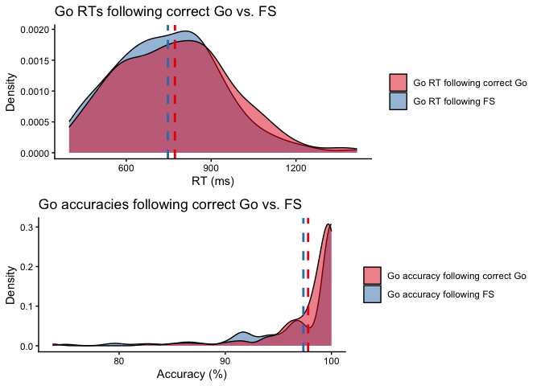<!-- -->

``` r
ggarrange(p2, p4, ncol = 1, nrow = 2, common.legend = FALSE, legend = "right")
```

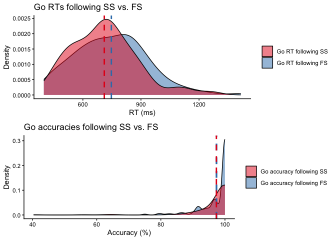<!-- -->

``` r
tiff('Post_stop_err_post_go_cor_distribution_w.outlier.tiff', width = 5333, height = 5333, res = 800)
ggarrange(p1, p3, ncol = 1, nrow = 2, common.legend = FALSE, legend = "right")
dev.off()
```

    ## quartz_off_screen 
    ##                 2

``` r
# png('Post_stop_err_post_stop_cor_distribution_w.outlier.png', width = 1600, height = 1067, res = 300)
tiff('Post_stop_err_post_stop_cor_distribution_w.outlier.tiff', width = 5333, height = 5333, res = 800)
ggarrange(p2, p4, ncol = 1, nrow = 2, common.legend = FALSE, legend = "right")
dev.off()
```

    ## quartz_off_screen 
    ##                 2

## Correlations before removing outliers: 1) SSRT and SS-Go brain activations, 2) pea_pse_psc, pes_pse_psc, and FS-SS brain activations, and 3) pea_pse_psc, pes_pse_psc, and FS brain activations

``` r
behav_corr <- corr_coef(df[, c("GoAcc", "GoRT", "StopAcc", "SSD", "SSRT", "pes_pse_psc", "pea_pse_psc")])
behav_corr
```

    ## ---------------------------------------------------------------------------
    ## Pearson's correlation coefficient
    ## ---------------------------------------------------------------------------
    ##              GoAcc    GoRT StopAcc     SSD    SSRT pes_pse_psc pea_pse_psc
    ## GoAcc        1.000 -0.1657 -0.4287 -0.2029 -0.1319      0.1792     -0.4980
    ## GoRT        -0.166  1.0000  0.7577  0.9322  0.0832      0.2854     -0.1925
    ## StopAcc     -0.429  0.7577  1.0000  0.6694 -0.0223      0.0922     -0.0500
    ## SSD         -0.203  0.9322  0.6694  1.0000 -0.2028      0.2956     -0.0942
    ## SSRT        -0.132  0.0832 -0.0223 -0.2028  1.0000     -0.1070     -0.0450
    ## pes_pse_psc  0.179  0.2854  0.0922  0.2956 -0.1070      1.0000     -0.1684
    ## pea_pse_psc -0.498 -0.1925 -0.0500 -0.0942 -0.0450     -0.1684      1.0000
    ## ---------------------------------------------------------------------------
    ## p-values for the correlation coefficients
    ## ---------------------------------------------------------------------------
    ##                GoAcc     GoRT  StopAcc      SSD   SSRT pes_pse_psc pea_pse_psc
    ## GoAcc       0.00e+00 4.71e-02 8.31e-08 1.47e-02 0.1149    0.031624    2.13e-10
    ## GoRT        4.71e-02 0.00e+00 4.22e-28 1.52e-64 0.3213    0.000526    2.08e-02
    ## StopAcc     8.31e-08 4.22e-28 0.00e+00 4.62e-20 0.7903    0.271823    5.51e-01
    ## SSD         1.47e-02 1.52e-64 4.62e-20 0.00e+00 0.0148    0.000322    2.61e-01
    ## SSRT        1.15e-01 3.21e-01 7.90e-01 1.48e-02 0.0000    0.201653    5.93e-01
    ## pes_pse_psc 3.16e-02 5.26e-04 2.72e-01 3.22e-04 0.2017    0.000000    4.36e-02
    ## pea_pse_psc 2.13e-10 2.08e-02 5.51e-01 2.61e-01 0.5925    0.043616    0.00e+00

``` r
plot(behav_corr, col.low = "blue", col.mid = "white", col.high ="red", order = "original")
```

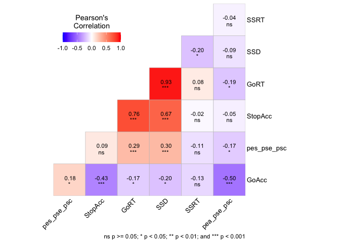<!-- -->

``` r
# SSRT didn't correlate with PEA_pse_psc or PES_pse_psc.
# pes_pse_psc had significantly negative correlation with pea_pse_psc, indicating that greater post-error slowing is related to lower post-error accuracy.

# Correlation between SSRT and SS-Go brain activations
df <- df %>% rename("Somatomotor-Hand" = ssgo_somatomotorHand, "Somatomotor-Mouth" = ssgo_somatomotorMouth, "Cingulo-Opercular" = ssgo_cinguloOpercularTaskControl, Auditory = ssgo_auditory, "Default Mode" = ssgo_default, "Memory Retrieval" = ssgo_memoryRetrieval,  Visual = ssgo_visual,  "Fronto-Parietal" = ssgo_frontoParietalTaskControl, Salience = ssgo_salience, Subcortical = ssgo_subcortical, "Ventral Attention" = ssgo_ventralAttention, "Dorsal Attention" = ssgo_dorsalAttention, Cerebellar = ssgo_cerebellar)
ssrt_ssgo_corr <- corr_coef(df[, c("Cerebellar", "Somatomotor-Hand", "Somatomotor-Mouth", "Cingulo-Opercular", "Auditory", "Default Mode", "Memory Retrieval", "Dorsal Attention", "Fronto-Parietal", "Salience", "Ventral Attention", "Subcortical", "Visual", "SSRT")])
ssrt_ssgo_corr
```

    ## ---------------------------------------------------------------------------
    ## Pearson's correlation coefficient
    ## ---------------------------------------------------------------------------
    ##                   Cerebellar Somatomotor-Hand Somatomotor-Mouth Cingulo-Opercular Auditory Default Mode Memory Retrieval Dorsal Attention Fronto-Parietal Salience Ventral Attention Subcortical Visual    SSRT
    ## Cerebellar            1.0000            0.496             0.389            0.6176    0.464       0.1323            0.270            0.451          0.4289    0.475             0.322       0.635  0.382  0.0626
    ## Somatomotor-Hand      0.4957            1.000             0.725            0.6358    0.859       0.3697            0.442            0.655          0.4061    0.379             0.495       0.401  0.559 -0.1455
    ## Somatomotor-Mouth     0.3891            0.725             1.000            0.4753    0.740       0.4054            0.379            0.481          0.4181    0.360             0.495       0.303  0.506 -0.1375
    ## Cingulo-Opercular     0.6176            0.636             0.475            1.0000    0.731       0.0833            0.256            0.599          0.4281    0.713             0.514       0.716  0.426 -0.0051
    ## Auditory              0.4642            0.859             0.740            0.7309    1.000       0.3967            0.428            0.603          0.4181    0.452             0.587       0.483  0.568 -0.1674
    ## Default Mode          0.1323            0.370             0.405            0.0833    0.397       1.0000            0.661            0.311          0.3721    0.153             0.649       0.193  0.492 -0.3676
    ## Memory Retrieval      0.2703            0.442             0.379            0.2562    0.428       0.6609            1.000            0.554          0.4296    0.335             0.575       0.265  0.597 -0.3017
    ## Dorsal Attention      0.4514            0.655             0.481            0.5987    0.603       0.3113            0.554            1.000          0.6115    0.589             0.605       0.416  0.716 -0.1516
    ## Fronto-Parietal       0.4289            0.406             0.418            0.4281    0.418       0.3721            0.430            0.612          1.0000    0.727             0.642       0.400  0.416 -0.0174
    ## Salience              0.4750            0.379             0.360            0.7127    0.452       0.1529            0.335            0.589          0.7267    1.000             0.597       0.570  0.364  0.1082
    ## Ventral Attention     0.3217            0.495             0.495            0.5145    0.587       0.6493            0.575            0.605          0.6416    0.597             1.000       0.393  0.571 -0.1599
    ## Subcortical           0.6351            0.401             0.303            0.7157    0.483       0.1933            0.265            0.416          0.3997    0.570             0.393       1.000  0.316 -0.0820
    ## Visual                0.3824            0.559             0.506            0.4265    0.568       0.4917            0.597            0.716          0.4156    0.364             0.571       0.316  1.000 -0.2209
    ## SSRT                  0.0626           -0.145            -0.137           -0.0051   -0.167      -0.3676           -0.302           -0.152         -0.0174    0.108            -0.160      -0.082 -0.221  1.0000
    ## ---------------------------------------------------------------------------
    ## p-values for the correlation coefficients
    ## ---------------------------------------------------------------------------
    ##                   Cerebellar Somatomotor-Hand Somatomotor-Mouth Cingulo-Opercular Auditory Default Mode Memory Retrieval Dorsal Attention Fronto-Parietal Salience Ventral Attention Subcortical   Visual     SSRT
    ## Cerebellar          0.00e+00         2.67e-10          1.44e-06          1.65e-16 4.64e-09     1.14e-01         1.05e-03         1.36e-08        8.19e-08 1.80e-09          8.43e-05    1.25e-17 2.25e-06 4.56e-01
    ## Somatomotor-Hand    2.67e-10         0.00e+00          1.01e-24          1.12e-17 3.35e-43     5.10e-06         3.02e-08         5.58e-19        4.41e-07 2.85e-06          2.90e-10    6.35e-07 3.48e-13 8.19e-02
    ## Somatomotor-Mouth   1.44e-06         1.01e-24          0.00e+00          1.74e-09 3.29e-26     4.63e-07         2.82e-06         1.08e-09        1.84e-07 9.51e-06          2.80e-10    2.27e-04 1.01e-10 1.00e-01
    ## Cingulo-Opercular   1.65e-16         1.12e-17          1.74e-09          0.00e+00 2.53e-25     3.21e-01         1.94e-03         2.28e-15        8.68e-08 1.27e-23          4.22e-11    6.71e-24 9.81e-08 9.52e-01
    ## Auditory            4.64e-09         3.35e-43          3.29e-26          2.53e-25 0.00e+00     8.57e-07         9.01e-08         1.26e-15        1.84e-07 1.27e-08          9.92e-15    8.96e-10 1.14e-13 4.50e-02
    ## Default Mode        1.14e-01         5.10e-06          4.63e-07          3.21e-01 8.57e-07     0.00e+00         2.00e-19         1.46e-04        4.39e-06 6.73e-02          1.35e-18    2.03e-02 3.88e-10 5.82e-06
    ## Memory Retrieval    1.05e-03         3.02e-08          2.82e-06          1.94e-03 9.01e-08     2.00e-19         0.00e+00         5.94e-13        7.76e-08 3.95e-05          4.93e-14    1.30e-03 2.89e-15 2.38e-04
    ## Dorsal Attention    1.36e-08         5.58e-19          1.08e-09          2.28e-15 1.26e-15     1.46e-04         5.94e-13         0.00e+00        3.91e-16 8.07e-15          9.05e-16    2.18e-07 6.44e-24 6.97e-02
    ## Fronto-Parietal     8.19e-08         4.41e-07          1.84e-07          8.68e-08 1.84e-07     4.39e-06         7.76e-08         3.91e-16        0.00e+00 6.34e-25          4.54e-18    6.95e-07 2.22e-07 8.36e-01
    ## Salience            1.80e-09         2.85e-06          9.51e-06          1.27e-23 1.27e-08     6.73e-02         3.95e-05         8.07e-15        6.34e-25 0.00e+00          3.00e-15    8.90e-14 7.43e-06 1.97e-01
    ## Ventral Attention   8.43e-05         2.90e-10          2.80e-10          4.22e-11 9.92e-15     1.35e-18         4.93e-14         9.05e-16        4.54e-18 3.00e-15          0.00e+00    1.10e-06 7.58e-14 5.56e-02
    ## Subcortical         1.25e-17         6.35e-07          2.27e-04          6.71e-24 8.96e-10     2.03e-02         1.30e-03         2.18e-07        6.95e-07 8.90e-14          1.10e-06    0.00e+00 1.14e-04 3.28e-01
    ## Visual              2.25e-06         3.48e-13          1.01e-10          9.81e-08 1.14e-13     3.88e-10         2.89e-15         6.44e-24        2.22e-07 7.43e-06          7.58e-14    1.14e-04 0.00e+00 7.79e-03
    ## SSRT                4.56e-01         8.19e-02          1.00e-01          9.52e-01 4.50e-02     5.82e-06         2.38e-04         6.97e-02        8.36e-01 1.97e-01          5.56e-02    3.28e-01 7.79e-03 0.00e+00

``` r
# tiff('ssrt_ssgo_corr_plot.tiff', width = 2800, height = 2000, res = 300)
# plot(ssrt_ssgo_corr, col.low = "blue", col.mid = "white", col.high ="red", reorder = FALSE, caption = FALSE, type = "upper", legend.position = "upper right")
# dev.off()
plot(ssrt_ssgo_corr, col.low = "blue", col.mid = "white", col.high ="red", reorder = FALSE, caption = FALSE, type = "upper", legend.position = "upper right")
```

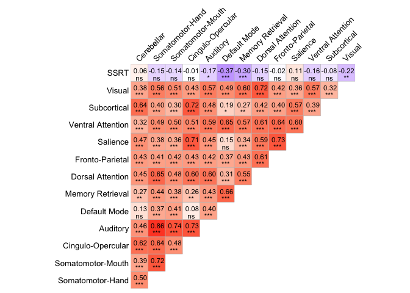<!-- -->

``` r
df <- df %>% rename(ssgo_somatomotorHand = "Somatomotor-Hand", ssgo_somatomotorMouth = "Somatomotor-Mouth", ssgo_cinguloOpercularTaskControl = "Cingulo-Opercular", ssgo_auditory = Auditory,
  ssgo_default = "Default Mode",  ssgo_memoryRetrieval = "Memory Retrieval", ssgo_visual = Visual, ssgo_frontoParietalTaskControl = "Fronto-Parietal", ssgo_salience = Salience, ssgo_subcortical = Subcortical,
  ssgo_ventralAttention = "Ventral Attention", ssgo_dorsalAttention = "Dorsal Attention", ssgo_cerebellar = Cerebellar)
# SSRT had significantly negative correlations with networks 4 (auditory), 5 (default), 6 (memoryRetrieval), and 7 (visual), greater activations in these networks are related to better inhibition (i.e., lower SSRT).

# Correlation between pes_pse_psc and FS-Go brain activations
df <- df %>% rename(PES = pes_pse_psc, "Somatomotor-Hand" = fsgo_somatomotorHand, "Somatomotor-Mouth" = fsgo_somatomotorMouth, "Cingulo-Opercular" = fsgo_cinguloOpercularTaskControl, Auditory = fsgo_auditory, "Default Mode" = fsgo_default, "Memory Retrieval" = fsgo_memoryRetrieval,  Visual = fsgo_visual,  "Fronto-Parietal" = fsgo_frontoParietalTaskControl, Salience = fsgo_salience, Subcortical = fsgo_subcortical, "Ventral Attention" = fsgo_ventralAttention, "Dorsal Attention" = fsgo_dorsalAttention, Cerebellar = fsgo_cerebellar)
pes_fsgo_corr <- corr_coef(df[, c("PES", "Cerebellar", "Somatomotor-Hand", "Somatomotor-Mouth", "Cingulo-Opercular", "Auditory", "Default Mode", "Memory Retrieval", "Dorsal Attention", "Fronto-Parietal", "Salience", "Ventral Attention", "Subcortical", "Visual")])
pes_fsgo_corr
```

    ## ---------------------------------------------------------------------------
    ## Pearson's correlation coefficient
    ## ---------------------------------------------------------------------------
    ##                       PES Cerebellar Somatomotor-Hand Somatomotor-Mouth Cingulo-Opercular Auditory Default Mode Memory Retrieval Dorsal Attention Fronto-Parietal Salience Ventral Attention Subcortical  Visual
    ## PES                1.0000     -0.134          -0.0934           -0.0683           -0.1581   -0.156       0.0589          -0.0209          -0.1042          -0.132   -0.172            0.0955      -0.165 -0.0646
    ## Cerebellar        -0.1344      1.000           0.6816            0.5330            0.6802    0.676       0.2016           0.4389           0.6852           0.449    0.597            0.4766       0.600  0.6081
    ## Somatomotor-Hand  -0.0934      0.682           1.0000            0.6002            0.6728    0.745       0.1280           0.3493           0.7056           0.291    0.454            0.3362       0.483  0.5933
    ## Somatomotor-Mouth -0.0683      0.533           0.6002            1.0000            0.3650    0.671       0.2354           0.2518           0.4369           0.241    0.333            0.3883       0.298  0.4279
    ## Cingulo-Opercular -0.1581      0.680           0.6728            0.3650            1.0000    0.713      -0.0888           0.3434           0.6414           0.350    0.697            0.3938       0.681  0.4187
    ## Auditory          -0.1556      0.676           0.7452            0.6710            0.7130    1.000       0.1161           0.2821           0.5767           0.202    0.466            0.4169       0.543  0.5434
    ## Default Mode       0.0589      0.202           0.1280            0.2354           -0.0888    0.116       1.0000           0.4765           0.0301           0.309    0.144            0.4751       0.103  0.2453
    ## Memory Retrieval  -0.0209      0.439           0.3493            0.2518            0.3434    0.282       0.4765           1.0000           0.5160           0.502    0.479            0.3405       0.351  0.3819
    ## Dorsal Attention  -0.1042      0.685           0.7056            0.4369            0.6414    0.577       0.0301           0.5160           1.0000           0.511    0.585            0.4286       0.510  0.6495
    ## Fronto-Parietal   -0.1316      0.449           0.2912            0.2410            0.3502    0.202       0.3087           0.5022           0.5106           1.000    0.680            0.4357       0.385  0.2452
    ## Salience          -0.1720      0.597           0.4536            0.3326            0.6974    0.466       0.1442           0.4790           0.5846           0.680    1.000            0.4684       0.646  0.3986
    ## Ventral Attention  0.0955      0.477           0.3362            0.3883            0.3938    0.417       0.4751           0.3405           0.4286           0.436    0.468            1.0000       0.350  0.4258
    ## Subcortical       -0.1654      0.600           0.4828            0.2983            0.6811    0.543       0.1025           0.3507           0.5099           0.385    0.646            0.3497       1.000  0.3324
    ## Visual            -0.0646      0.608           0.5933            0.4279            0.4187    0.543       0.2453           0.3819           0.6495           0.245    0.399            0.4258       0.332  1.0000
    ## ---------------------------------------------------------------------------
    ## p-values for the correlation coefficients
    ## ---------------------------------------------------------------------------
    ##                      PES Cerebellar Somatomotor-Hand Somatomotor-Mouth Cingulo-Opercular Auditory Default Mode Memory Retrieval Dorsal Attention Fronto-Parietal Salience Ventral Attention Subcortical   Visual
    ## PES               0.0000   1.08e-01         2.65e-01          4.16e-01          5.83e-02 6.25e-02     4.83e-01         8.04e-01         2.14e-01        1.16e-01 3.93e-02          2.55e-01    4.75e-02 4.42e-01
    ## Cerebellar        0.1082   0.00e+00         5.36e-21          6.08e-12          6.89e-21 1.52e-20     1.54e-02         3.74e-08         2.76e-21        1.67e-08 2.92e-15          1.55e-09    1.98e-15 6.27e-16
    ## Somatomotor-Hand  0.2653   5.36e-21         0.00e+00          1.87e-15          2.55e-20 9.26e-27     1.26e-01         1.78e-05         5.43e-23        3.98e-04 1.13e-08          3.79e-05    8.87e-10 4.63e-15
    ## Somatomotor-Mouth 0.4160   6.08e-12         1.87e-15          0.00e+00          6.86e-06 3.49e-20     4.51e-03         2.34e-03         4.38e-08        3.61e-03 4.63e-05          1.51e-06    2.81e-04 8.82e-08
    ## Cingulo-Opercular 0.0583   6.89e-21         2.55e-20          6.86e-06          0.00e+00 1.20e-23     2.90e-01         2.51e-05         4.66e-18        1.69e-05 2.70e-22          1.05e-06    5.77e-21 1.76e-07
    ## Auditory          0.0625   1.52e-20         9.26e-27          3.49e-20          1.20e-23 0.00e+00     1.66e-01         6.14e-04         3.90e-14        1.52e-02 4.06e-09          2.01e-07    2.05e-12 1.95e-12
    ## Default Mode      0.4830   1.54e-02         1.26e-01          4.51e-03          2.90e-01 1.66e-01     0.00e+00         1.57e-09         7.20e-01        1.67e-04 8.47e-02          1.78e-09    2.21e-01 3.04e-03
    ## Memory Retrieval  0.8036   3.74e-08         1.78e-05          2.34e-03          2.51e-05 6.14e-04     1.57e-09         0.00e+00         3.60e-11        1.43e-10 1.26e-09          2.97e-05    1.63e-05 2.32e-06
    ## Dorsal Attention  0.2141   2.76e-21         5.43e-23          4.38e-08          4.66e-18 3.90e-14     7.20e-01         3.60e-11         0.00e+00        6.21e-11 1.43e-14          8.38e-08    6.68e-11 1.30e-18
    ## Fronto-Parietal   0.1158   1.67e-08         3.98e-04          3.61e-03          1.69e-05 1.52e-02     1.67e-04         1.43e-10         6.21e-11        0.00e+00 7.69e-21          4.83e-08    1.92e-06 3.06e-03
    ## Salience          0.0393   2.92e-15         1.13e-08          4.63e-05          2.70e-22 4.06e-09     8.47e-02         1.26e-09         1.43e-14        7.69e-21 0.00e+00          3.22e-09    2.21e-18 7.50e-07
    ## Ventral Attention 0.2551   1.55e-09         3.79e-05          1.51e-06          1.05e-06 2.01e-07     1.78e-09         2.97e-05         8.38e-08        4.83e-08 3.22e-09          0.00e+00    1.74e-05 1.04e-07
    ## Subcortical       0.0475   1.98e-15         8.87e-10          2.81e-04          5.77e-21 2.05e-12     2.21e-01         1.63e-05         6.68e-11        1.92e-06 2.21e-18          1.74e-05    0.00e+00 4.70e-05
    ## Visual            0.4416   6.27e-16         4.63e-15          8.82e-08          1.76e-07 1.95e-12     3.04e-03         2.32e-06         1.30e-18        3.06e-03 7.50e-07          1.04e-07    4.70e-05 0.00e+00

``` r
# tiff('pes_fsgo_corr_plot.tiff', width = 2800, height = 2000, res = 300)
# plot(pes_fsgo_corr, col.low = "blue", col.mid = "white", col.high ="red", reorder = FALSE, caption = FALSE, legend.position = "right")
# dev.off()
plot(pes_fsgo_corr, col.low = "blue", col.mid = "white", col.high ="red", reorder = FALSE, caption = FALSE, legend.position = "right")
```

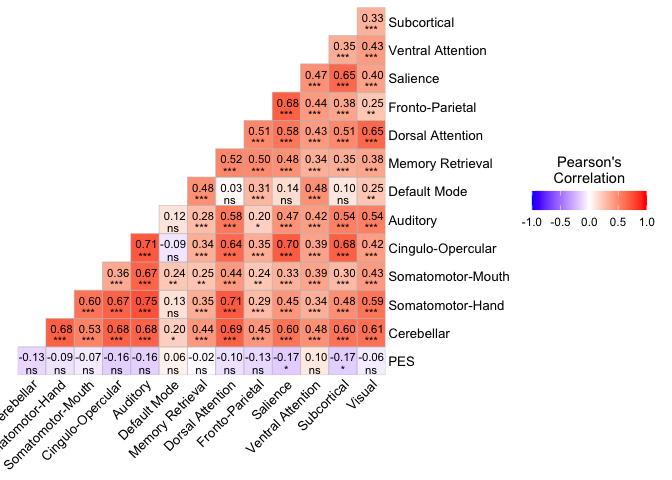<!-- -->

``` r
df <- df %>% rename(pes_pse_psc = PES, fsgo_somatomotorHand = "Somatomotor-Hand", fsgo_somatomotorMouth = "Somatomotor-Mouth", fsgo_cinguloOpercularTaskControl = "Cingulo-Opercular", fsgo_auditory = Auditory, fsgo_default = "Default Mode",  fsgo_memoryRetrieval = "Memory Retrieval", fsgo_visual = Visual, fsgo_frontoParietalTaskControl = "Fronto-Parietal", fsgo_salience = Salience, fsgo_subcortical = Subcortical,  fsgo_ventralAttention = "Ventral Attention", fsgo_dorsalAttention = "Dorsal Attention", fsgo_cerebellar = Cerebellar)
# PEA_pse_psc didn't correlated with any networks, and it is not observed in LIA1. PES_pse_psc had significantly negative correlations with salience and subcortical networks.

# Combine the above plots into one figure for publication
p1 <- plot(ssrt_ssgo_corr, col.low = "blue", col.mid = "white", col.high = "red", reorder = FALSE, caption = FALSE, type = "upper", legend.position = "upper right")
p2 <- plot(pes_fsgo_corr, col.low = "blue", col.mid = "white", col.high = "red", reorder = FALSE, caption = FALSE, legend.position = "upper right")
combined_plot <- ggarrange(p1, p2, labels = c("(a) SSRT", "(b) PES"), label.x = 0.2)
tiff('behav_net_corr_plots.tiff', width = 4000, height = 2000, res = 300)
print(combined_plot)
dev.off()
```

    ## quartz_off_screen 
    ##                 2

``` r
# Extra analyses that aren't included in the manuscript
pe_fsss_corr <- corr_coef(df[, c("pes_pse_psc", "pea_pse_psc", 'fsss_somatomotorHand', 'fsss_somatomotorMouth', 'fsss_cinguloOpercularTaskControl', 'fsss_auditory', 'fsss_default', 'fsss_memoryRetrieval', 'fsss_visual', 'fsss_frontoParietalTaskControl', 'fsss_salience', 'fsss_subcortical', 'fsss_ventralAttention', 'fsss_dorsalAttention', 'fsss_cerebellar')])
pe_fsss_corr
```

    ## ---------------------------------------------------------------------------
    ## Pearson's correlation coefficient
    ## ---------------------------------------------------------------------------
    ##                                  pes_pse_psc pea_pse_psc fsss_somatomotorHand fsss_somatomotorMouth fsss_cinguloOpercularTaskControl fsss_auditory fsss_default fsss_memoryRetrieval fsss_visual fsss_frontoParietalTaskControl fsss_salience fsss_subcortical fsss_ventralAttention fsss_dorsalAttention
    ## pes_pse_psc                          1.00000     -0.1684               0.0942                0.0434                           0.0112        0.0461      -0.0384              -0.0123      0.0594                        0.00907      -0.00352          -0.0918                 0.118                0.101
    ## pea_pse_psc                         -0.16841      1.0000              -0.3295               -0.1818                          -0.1488       -0.2226      -0.1340              -0.1420     -0.1955                       -0.15015      -0.10369           0.0523                -0.294               -0.230
    ## fsss_somatomotorHand                 0.09416     -0.3295               1.0000                0.6756                           0.5623        0.8065       0.3863               0.4158      0.6943                        0.31559       0.30072           0.2439                 0.596                0.701
    ## fsss_somatomotorMouth                0.04336     -0.1818               0.6756                1.0000                           0.3746        0.7337       0.4194               0.2659      0.5117                        0.21463       0.21152           0.2019                 0.538                0.427
    ## fsss_cinguloOpercularTaskControl     0.01121     -0.1488               0.5623                0.3746                           1.0000        0.7241       0.0942               0.4247      0.4323                        0.43443       0.71960           0.6952                 0.549                0.632
    ## fsss_auditory                        0.04611     -0.2226               0.8065                0.7337                           0.7241        1.0000       0.3639               0.4537      0.6236                        0.30744       0.42636           0.4184                 0.669                0.632
    ## fsss_default                        -0.03841     -0.1340               0.3863                0.4194                           0.0942        0.3639       1.0000               0.6141      0.4324                        0.39207       0.24691           0.1315                 0.634                0.276
    ## fsss_memoryRetrieval                -0.01232     -0.1420               0.4158                0.2659                           0.4247        0.4537       0.6141               1.0000      0.5322                        0.49873       0.48442           0.3399                 0.539                0.591
    ## fsss_visual                          0.05940     -0.1955               0.6943                0.5117                           0.4323        0.6236       0.4324               0.5322      1.0000                        0.28347       0.34476           0.2486                 0.579                0.733
    ## fsss_frontoParietalTaskControl       0.00907     -0.1501               0.3156                0.2146                           0.4344        0.3074       0.3921               0.4987      0.2835                        1.00000       0.76750           0.4689                 0.541                0.566
    ## fsss_salience                       -0.00352     -0.1037               0.3007                0.2115                           0.7196        0.4264       0.2469               0.4844      0.3448                        0.76750       1.00000           0.6763                 0.561                0.542
    ## fsss_subcortical                    -0.09176      0.0523               0.2439                0.2019                           0.6952        0.4184       0.1315               0.3399      0.2486                        0.46887       0.67634           1.0000                 0.403                0.410
    ## fsss_ventralAttention                0.11768     -0.2935               0.5962                0.5383                           0.5489        0.6685       0.6335               0.5386      0.5790                        0.54125       0.56070           0.4029                 1.000                0.606
    ## fsss_dorsalAttention                 0.10103     -0.2304               0.7011                0.4268                           0.6319        0.6320       0.2756               0.5905      0.7332                        0.56576       0.54154           0.4097                 0.606                1.000
    ## fsss_cerebellar                      0.01396      0.0577               0.4939                0.4087                           0.7020        0.5918       0.1418               0.4015      0.4782                        0.46004       0.60059           0.6855                 0.412                0.585
    ##                                  fsss_cerebellar
    ## pes_pse_psc                               0.0140
    ## pea_pse_psc                               0.0577
    ## fsss_somatomotorHand                      0.4939
    ## fsss_somatomotorMouth                     0.4087
    ## fsss_cinguloOpercularTaskControl          0.7020
    ## fsss_auditory                             0.5918
    ## fsss_default                              0.1418
    ## fsss_memoryRetrieval                      0.4015
    ## fsss_visual                               0.4782
    ## fsss_frontoParietalTaskControl            0.4600
    ## fsss_salience                             0.6006
    ## fsss_subcortical                          0.6855
    ## fsss_ventralAttention                     0.4123
    ## fsss_dorsalAttention                      0.5854
    ## fsss_cerebellar                           1.0000
    ## ---------------------------------------------------------------------------
    ## p-values for the correlation coefficients
    ## ---------------------------------------------------------------------------
    ##                                  pes_pse_psc pea_pse_psc fsss_somatomotorHand fsss_somatomotorMouth fsss_cinguloOpercularTaskControl fsss_auditory fsss_default fsss_memoryRetrieval fsss_visual fsss_frontoParietalTaskControl fsss_salience fsss_subcortical fsss_ventralAttention fsss_dorsalAttention
    ## pes_pse_psc                           0.0000    4.36e-02             2.62e-01              6.06e-01                         8.94e-01      5.83e-01     6.48e-01             8.83e-01    4.79e-01                       9.14e-01      9.67e-01         2.74e-01              1.60e-01             2.28e-01
    ## pea_pse_psc                           0.0436    0.00e+00             5.51e-05              2.92e-02                         7.51e-02      7.33e-03     1.09e-01             8.95e-02    1.89e-02                       7.24e-02      2.16e-01         5.33e-01              3.57e-04             5.46e-03
    ## fsss_somatomotorHand                  0.2616    5.51e-05             0.00e+00              1.56e-20                         2.23e-13      3.17e-34     1.73e-06             2.19e-07    4.95e-22                       1.17e-04      2.50e-04         3.23e-03              3.18e-15             1.33e-22
    ## fsss_somatomotorMouth                 0.6059    2.92e-02             1.56e-20              0.00e+00                         3.74e-06      1.34e-25     1.68e-07             1.27e-03    5.58e-11                       9.79e-03      1.09e-02         1.52e-02              3.44e-12             9.59e-08
    ## fsss_cinguloOpercularTaskControl      0.8940    7.51e-02             2.23e-13              3.74e-06                         0.00e+00      1.13e-24     2.62e-01             1.13e-07    6.29e-08                       5.32e-08      2.97e-24         4.19e-22              1.06e-12             2.01e-17
    ## fsss_auditory                         0.5831    7.33e-03             3.17e-34              1.34e-25                         1.13e-24      0.00e+00     7.36e-06             1.12e-08    6.94e-17                       1.78e-04      9.92e-08         1.80e-07              5.40e-20             1.97e-17
    ## fsss_default                          0.6476    1.09e-01             1.73e-06              1.68e-07                         2.62e-01      7.36e-06     0.00e+00             2.74e-16    6.21e-08                       1.17e-06      2.85e-03         1.16e-01              1.58e-17             8.29e-04
    ## fsss_memoryRetrieval                  0.8834    8.95e-02             2.19e-07              1.27e-03                         1.13e-07      1.12e-08     2.74e-16             0.00e+00    6.63e-12                       1.99e-10      7.65e-10         3.07e-05              3.31e-12             6.71e-15
    ## fsss_visual                           0.4795    1.89e-02             4.95e-22              5.58e-11                         6.29e-08      6.94e-17     6.21e-08             6.63e-12    0.00e+00                       5.75e-04      2.32e-05         2.66e-03              2.94e-14             1.49e-25
    ## fsss_frontoParietalTaskControl        0.9141    7.24e-02             1.17e-04              9.79e-03                         5.32e-08      1.78e-04     1.17e-06             1.99e-10    5.75e-04                       0.00e+00      3.29e-29         3.08e-09              2.49e-12             1.48e-13
    ## fsss_salience                         0.9666    2.16e-01             2.50e-04              1.09e-02                         2.97e-24      9.92e-08     2.85e-03             7.65e-10    2.32e-05                       3.29e-29      0.00e+00         1.37e-20              2.70e-13             2.41e-12
    ## fsss_subcortical                      0.2740    5.33e-01             3.23e-03              1.52e-02                         4.19e-22      1.80e-07     1.16e-01             3.07e-05    2.66e-03                       3.08e-09      1.37e-20         0.00e+00              5.55e-07             3.41e-07
    ## fsss_ventralAttention                 0.1601    3.57e-04             3.18e-15              3.44e-12                         1.06e-12      5.40e-20     1.58e-17             3.31e-12    2.94e-14                       2.49e-12      2.70e-13         5.55e-07              0.00e+00             8.33e-16
    ## fsss_dorsalAttention                  0.2282    5.46e-03             1.33e-22              9.59e-08                         2.01e-17      1.97e-17     8.29e-04             6.71e-15    1.49e-25                       1.48e-13      2.41e-12         3.41e-07              8.33e-16             0.00e+00
    ## fsss_cerebellar                       0.8681    4.92e-01             3.16e-10              3.67e-07                         1.11e-22      5.67e-15     9.01e-02             6.11e-07    1.34e-09                       6.59e-09      1.76e-15         2.58e-21              2.82e-07             1.30e-14
    ##                                  fsss_cerebellar
    ## pes_pse_psc                             8.68e-01
    ## pea_pse_psc                             4.92e-01
    ## fsss_somatomotorHand                    3.16e-10
    ## fsss_somatomotorMouth                   3.67e-07
    ## fsss_cinguloOpercularTaskControl        1.11e-22
    ## fsss_auditory                           5.67e-15
    ## fsss_default                            9.01e-02
    ## fsss_memoryRetrieval                    6.11e-07
    ## fsss_visual                             1.34e-09
    ## fsss_frontoParietalTaskControl          6.59e-09
    ## fsss_salience                           1.76e-15
    ## fsss_subcortical                        2.58e-21
    ## fsss_ventralAttention                   2.82e-07
    ## fsss_dorsalAttention                    1.30e-14
    ## fsss_cerebellar                         0.00e+00

``` r
plot(pe_fsss_corr, col.low = "blue", col.mid = "white", col.high ="red", order = "original")
```

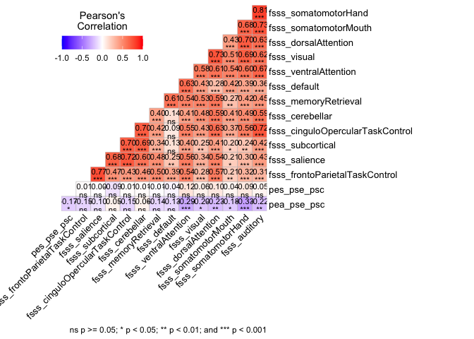<!-- -->

``` r
# PES_pse_psc didn't have significant correlations with any networks; but, PEA_pse_psc had significantly negative correlations with auditory, somatomotor-hand, somatomotor-mouth, dorsal attention, visual, and ventral attention networks, indicating that greater activations in these networks are related to lower improment in post-error accuracy. But, PEA didn't exist in LIA1.

# Neither pea_pse_psc nor pes_pse_psc had significant correlations with pfs_go networks.
pe_pfsgo_corr <- corr_coef(df[, c("pes_pse_psc", "pea_pse_psc", 'pfs_go_somatomotorHand', 'pfs_go_somatomotorMouth', 'pfs_go_cinguloOpercularTaskControl', 'pfs_go_auditory', 'pfs_go_default', 'pfs_go_memoryRetrieval', 'pfs_go_visual', 'pfs_go_frontoParietalTaskControl', 'pfs_go_salience', 'pfs_go_subcortical', 'pfs_go_ventralAttention', 'pfs_go_dorsalAttention', 'pfs_go_cerebellar')])
pe_pfsgo_corr
```

    ## ---------------------------------------------------------------------------
    ## Pearson's correlation coefficient
    ## ---------------------------------------------------------------------------
    ##                                    pes_pse_psc pea_pse_psc pfs_go_somatomotorHand pfs_go_somatomotorMouth pfs_go_cinguloOpercularTaskControl pfs_go_auditory pfs_go_default pfs_go_memoryRetrieval pfs_go_visual pfs_go_frontoParietalTaskControl pfs_go_salience pfs_go_subcortical
    ## pes_pse_psc                           1.000000    -0.16841                 -0.106                 -0.0354                             0.0462        0.000918       -0.04961                -0.1374      0.000722                          -0.0912         -0.0433             -0.102
    ## pea_pse_psc                          -0.168412     1.00000                 -0.013                  0.0963                             0.0267        0.008984        0.00559                 0.0136      0.046704                           0.0641          0.0666              0.064
    ## pfs_go_somatomotorHand               -0.105740    -0.01303                  1.000                  0.4779                             0.5580        0.687537        0.28263                 0.2822      0.279324                           0.2640          0.2315              0.574
    ## pfs_go_somatomotorMouth              -0.035446     0.09631                  0.478                  1.0000                             0.4526        0.653610        0.15121                 0.0897      0.162675                           0.2259          0.1395              0.423
    ## pfs_go_cinguloOpercularTaskControl    0.046183     0.02674                  0.558                  0.4526                             1.0000        0.677232       -0.15591                 0.1696      0.415739                           0.3656          0.6691              0.661
    ## pfs_go_auditory                       0.000918     0.00898                  0.688                  0.6536                             0.6772        1.000000        0.05898                 0.0850      0.246766                           0.1223          0.2009              0.596
    ## pfs_go_default                       -0.049614     0.00559                  0.283                  0.1512                            -0.1559        0.058976        1.00000                 0.4397     -0.007359                           0.3031          0.0590              0.142
    ## pfs_go_memoryRetrieval               -0.137427     0.01360                  0.282                  0.0897                             0.1696        0.084973        0.43973                 1.0000      0.356299                           0.4828          0.3433              0.307
    ## pfs_go_visual                         0.000722     0.04670                  0.279                  0.1627                             0.4157        0.246766       -0.00736                 0.3563      1.000000                           0.3190          0.3876              0.290
    ## pfs_go_frontoParietalTaskControl     -0.091152     0.06409                  0.264                  0.2259                             0.3656        0.122251        0.30308                 0.4828      0.319050                           1.0000          0.6842              0.418
    ## pfs_go_salience                      -0.043283     0.06664                  0.231                  0.1395                             0.6691        0.200870        0.05902                 0.3433      0.387599                           0.6842          1.0000              0.467
    ## pfs_go_subcortical                   -0.101979     0.06403                  0.574                  0.4232                             0.6607        0.596171        0.14239                 0.3073      0.289642                           0.4176          0.4667              1.000
    ## pfs_go_ventralAttention              -0.034873     0.14261                  0.371                  0.4170                             0.5193        0.365559        0.33000                 0.3607      0.358969                           0.6631          0.6414              0.503
    ## pfs_go_dorsalAttention                0.004493     0.05323                  0.432                  0.2546                             0.6407        0.353525       -0.08805                 0.4121      0.724269                           0.5940          0.5729              0.435
    ## pfs_go_cerebellar                    -0.074442    -0.08774                  0.562                  0.3925                             0.5812        0.536022        0.11367                 0.3856      0.557626                           0.3628          0.3898              0.598
    ##                                    pfs_go_ventralAttention pfs_go_dorsalAttention pfs_go_cerebellar
    ## pes_pse_psc                                        -0.0349                0.00449           -0.0744
    ## pea_pse_psc                                         0.1426                0.05323           -0.0877
    ## pfs_go_somatomotorHand                              0.3707                0.43153            0.5619
    ## pfs_go_somatomotorMouth                             0.4170                0.25460            0.3925
    ## pfs_go_cinguloOpercularTaskControl                  0.5193                0.64074            0.5812
    ## pfs_go_auditory                                     0.3656                0.35353            0.5360
    ## pfs_go_default                                      0.3300               -0.08805            0.1137
    ## pfs_go_memoryRetrieval                              0.3607                0.41207            0.3856
    ## pfs_go_visual                                       0.3590                0.72427            0.5576
    ## pfs_go_frontoParietalTaskControl                    0.6631                0.59400            0.3628
    ## pfs_go_salience                                     0.6414                0.57292            0.3898
    ## pfs_go_subcortical                                  0.5029                0.43473            0.5980
    ## pfs_go_ventralAttention                             1.0000                0.52061            0.4702
    ## pfs_go_dorsalAttention                              0.5206                1.00000            0.6121
    ## pfs_go_cerebellar                                   0.4702                0.61214            1.0000
    ## ---------------------------------------------------------------------------
    ## p-values for the correlation coefficients
    ## ---------------------------------------------------------------------------
    ##                                    pes_pse_psc pea_pse_psc pfs_go_somatomotorHand pfs_go_somatomotorMouth pfs_go_cinguloOpercularTaskControl pfs_go_auditory pfs_go_default pfs_go_memoryRetrieval pfs_go_visual pfs_go_frontoParietalTaskControl pfs_go_salience pfs_go_subcortical
    ## pes_pse_psc                             0.0000      0.0436               2.07e-01                6.73e-01                           5.83e-01        9.91e-01       5.55e-01               1.00e-01      9.93e-01                         2.77e-01        6.06e-01           2.24e-01
    ## pea_pse_psc                             0.0436      0.0000               8.77e-01                2.51e-01                           7.50e-01        9.15e-01       9.47e-01               8.71e-01      5.78e-01                         4.45e-01        4.27e-01           4.46e-01
    ## pfs_go_somatomotorHand                  0.2072      0.8768               0.00e+00                1.38e-09                           3.69e-13        1.78e-21       5.99e-04               6.10e-04      6.98e-04                         1.39e-03        5.24e-03           5.72e-14
    ## pfs_go_somatomotorMouth                 0.6732      0.2508               1.38e-09                0.00e+00                           1.23e-08        6.66e-19       7.04e-02               2.85e-01      5.14e-02                         6.47e-03        9.54e-02           1.26e-07
    ## pfs_go_cinguloOpercularTaskControl      0.5826      0.7503               3.69e-13                1.23e-08                           0.00e+00        1.17e-20       6.20e-02               4.21e-02      2.20e-07                         6.60e-06        4.86e-20           2.06e-19
    ## pfs_go_auditory                         0.9913      0.9149               1.78e-21                6.66e-19                           1.17e-20        0.00e+00       4.83e-01               3.11e-01      2.87e-03                         1.44e-01        1.58e-02           3.18e-15
    ## pfs_go_default                          0.5548      0.9470               5.99e-04                7.04e-02                           6.20e-02        4.83e-01       0.00e+00               3.50e-08      9.30e-01                         2.22e-04        4.82e-01           8.87e-02
    ## pfs_go_memoryRetrieval                  0.1005      0.8715               6.10e-04                2.85e-01                           4.21e-02        3.11e-01       3.50e-08               0.00e+00      1.17e-05                         8.88e-10        2.53e-05           1.79e-04
    ## pfs_go_visual                           0.9931      0.5783               6.98e-04                5.14e-02                           2.20e-07        2.87e-03       9.30e-01               1.17e-05      0.00e+00                         9.72e-05        1.59e-06           4.30e-04
    ## pfs_go_frontoParietalTaskControl        0.2772      0.4453               1.39e-03                6.47e-03                           6.60e-06        1.44e-01       2.22e-04               8.88e-10      9.72e-05                         0.00e+00        3.29e-21           1.91e-07
    ## pfs_go_salience                         0.6065      0.4275               5.24e-03                9.54e-02                           4.86e-20        1.58e-02       4.82e-01               2.53e-05      1.59e-06                         3.29e-21        0.00e+00           3.73e-09
    ## pfs_go_subcortical                      0.2239      0.4458               5.72e-14                1.26e-07                           2.06e-19        3.18e-15       8.87e-02               1.79e-04      4.30e-04                         1.91e-07        3.73e-09           0.00e+00
    ## pfs_go_ventralAttention                 0.6782      0.0882               4.79e-06                2.01e-07                           2.57e-11        6.62e-06       5.36e-05               8.97e-06      9.95e-06                         1.37e-19        4.70e-18           1.33e-10
    ## pfs_go_dorsalAttention                  0.9574      0.5263               6.67e-08                2.07e-03                           5.20e-18        1.38e-05       2.94e-01               2.87e-07      1.09e-24                         4.24e-15        6.21e-14           5.19e-08
    ## pfs_go_cerebellar                       0.3752      0.2957               2.36e-13                1.14e-06                           2.21e-14        4.41e-12       1.75e-01               1.82e-06      3.87e-13                         7.87e-06        1.37e-06           2.49e-15
    ##                                    pfs_go_ventralAttention pfs_go_dorsalAttention pfs_go_cerebellar
    ## pes_pse_psc                                       6.78e-01               9.57e-01          3.75e-01
    ## pea_pse_psc                                       8.82e-02               5.26e-01          2.96e-01
    ## pfs_go_somatomotorHand                            4.79e-06               6.67e-08          2.36e-13
    ## pfs_go_somatomotorMouth                           2.01e-07               2.07e-03          1.14e-06
    ## pfs_go_cinguloOpercularTaskControl                2.57e-11               5.20e-18          2.21e-14
    ## pfs_go_auditory                                   6.62e-06               1.38e-05          4.41e-12
    ## pfs_go_default                                    5.36e-05               2.94e-01          1.75e-01
    ## pfs_go_memoryRetrieval                            8.97e-06               2.87e-07          1.82e-06
    ## pfs_go_visual                                     9.95e-06               1.09e-24          3.87e-13
    ## pfs_go_frontoParietalTaskControl                  1.37e-19               4.24e-15          7.87e-06
    ## pfs_go_salience                                   4.70e-18               6.21e-14          1.37e-06
    ## pfs_go_subcortical                                1.33e-10               5.19e-08          2.49e-15
    ## pfs_go_ventralAttention                           0.00e+00               2.25e-11          2.74e-09
    ## pfs_go_dorsalAttention                            2.25e-11               0.00e+00          3.59e-16
    ## pfs_go_cerebellar                                 2.74e-09               3.59e-16          0.00e+00

``` r
plot(pe_pfsgo_corr, col.low = "blue", col.mid = "white", col.high ="red", order = "original")
```

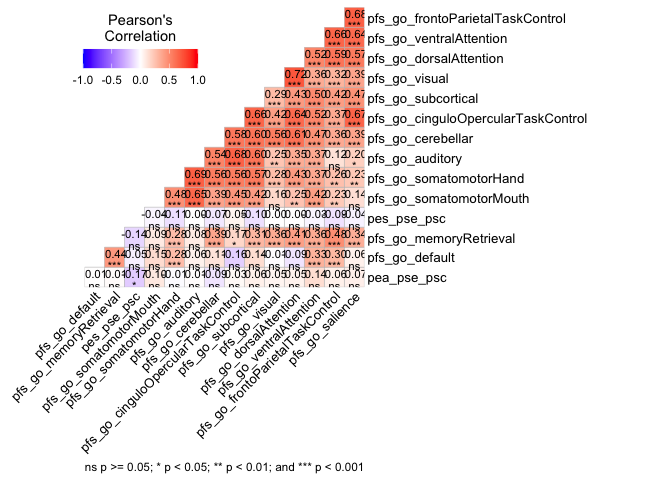<!-- -->

``` r
# Supplementary analyses: partial PES-fsgo correlations controlling for StopAcc
# Correlation between pes_pse_psc and networks controlling for StopAcc
vars <- c("pes_pse_psc", "pea_pse_psc", 'fsgo_somatomotorHand', 'fsgo_somatomotorMouth', 'fsgo_cinguloOpercularTaskControl', 'fsgo_auditory', 'fsgo_default', 'fsgo_memoryRetrieval', 'fsgo_visual', 'fsgo_frontoParietalTaskControl', 'fsgo_salience', 'fsgo_subcortical', 'fsgo_ventralAttention', 'fsgo_dorsalAttention', 'fsgo_cerebellar')
results <- data.frame(variable = character(), estimate = numeric(), p.value = numeric(), stringsAsFactors = FALSE)
for (v in vars) {
  res <- pcor.test(df[[v]], df$pes_pse_psc, df[, c("StopAcc", "GoRT", "sex")])
  results <- rbind(results, data.frame(variable = v, estimate = res$estimate, p.value = res$p.value))}
```

    ## Warning in pcor(xyz, method = method): The inverse of variance-covariance matrix is calculated using Moore-Penrose generalized matrix invers due to its determinant of zero.

    ## Warning in sqrt((n - 2 - gp)/(1 - pcor^2)): NaNs produced

``` r
print(results)
```

    ##                            variable     estimate    p.value
    ## 1                       pes_pse_psc -1.000000000        NaN
    ## 2                       pea_pse_psc -0.096350089 0.25572390
    ## 3              fsgo_somatomotorHand -0.091828958 0.27881192
    ## 4             fsgo_somatomotorMouth -0.041814432 0.62249706
    ## 5  fsgo_cinguloOpercularTaskControl -0.085937961 0.31094126
    ## 6                     fsgo_auditory -0.116241678 0.16985663
    ## 7                      fsgo_default  0.002634036 0.97527028
    ## 8              fsgo_memoryRetrieval -0.034495557 0.68467888
    ## 9                       fsgo_visual -0.096577815 0.25459681
    ## 10   fsgo_frontoParietalTaskControl -0.101674761 0.23026150
    ## 11                    fsgo_salience -0.149908241 0.07602075
    ## 12                 fsgo_subcortical -0.140345532 0.09693412
    ## 13            fsgo_ventralAttention  0.091919227 0.27833764
    ## 14             fsgo_dorsalAttention -0.083906325 0.32256085
    ## 15                  fsgo_cerebellar -0.120295338 0.15535225

``` r
pcor.test(df$pes_pse_psc, df$fsgo_subcortical, df[, c("StopAcc", "GoRT", "sex")])
```

    ##     estimate    p.value statistic   n gp  Method
    ## 1 -0.1403455 0.09693412  -1.67119 144  3 pearson

## Remove outliers and standardize data

``` r
# Exclude individuals with AUDIT_T0 >= 8
# df <- df %>%
#   filter(AUDIT_T0 < 8)
dfUnscaled <- df # Save the unscaled data for later descriptive statistics

# List of variables to scale
variables_to_scale <- c("CTQ_TotalCorrected", "AdChild", "SUPPS_Impulsive", "BIS_Impulsive", "CDRISC_Resilience", "stateAnxiety",   "traitAnxiety", "BDI_depression", "GoAcc", "GoRT", "StopAcc", "SSD", "SSRT", "pea_pse_psc", "pes_pse_psc",

"rIFG_ss_go", "lIFG_ss_go", "rInsula_ss_go", "lInsula_ss_go", "biIFGInsula_ss_go",  "rSFG_ssrt", "lSFG_ssrt", "biIFGSFGInsula_ssrt", "lMidOrbG_socialMis", "lSMedG_socialMis", "lMidFGIFG_socialMis", "lMidFG_socialMis", "ave_socialMis",

"net_7_1", "net_7_2", "net_7_3", "net_7_4", "net_7_5", "net_7_6", "net_7_7", "net_17_1", "net_17_2", "net_17_3", "net_17_4", "net_17_5", "net_17_6", "net_17_7", "net_17_8", "net_17_9", "net_17_10", "net_17_11", "net_17_12", "net_17_13", "net_17_14", "net_17_15", "net_17_16", "net_17_17",

"ss_somatomotorHand", "ss_somatomotorMouth", "ss_cinguloOpercularTaskControl", "ss_auditory", "ss_default", "ss_memoryRetrieval", "ss_visual", "ss_frontoParietalTaskControl", "ss_salience", "ss_subcortical", "ss_ventralAttention", "ss_dorsalAttention", "ss_cerebellar",

"fs_somatomotorHand", "fs_somatomotorMouth", "fs_cinguloOpercularTaskControl", "fs_auditory", "fs_default", "fs_memoryRetrieval", "fs_visual", "fs_frontoParietalTaskControl", "fs_salience", "fs_subcortical", "fs_ventralAttention", "fs_dorsalAttention", "fs_cerebellar",

"ssgo_somatomotorHand", "ssgo_somatomotorMouth", "ssgo_cinguloOpercularTaskControl", "ssgo_auditory", "ssgo_default", "ssgo_memoryRetrieval", "ssgo_visual", "ssgo_frontoParietalTaskControl", "ssgo_salience", "ssgo_subcortical", "ssgo_ventralAttention", "ssgo_dorsalAttention", "ssgo_cerebellar",

"fsgo_somatomotorHand", "fsgo_somatomotorMouth", "fsgo_cinguloOpercularTaskControl", "fsgo_auditory", "fsgo_default", "fsgo_memoryRetrieval", "fsgo_visual", "fsgo_frontoParietalTaskControl", "fsgo_salience", "fsgo_subcortical", "fsgo_ventralAttention", "fsgo_dorsalAttention", "fsgo_cerebellar",

"ssfs_somatomotorHand", "ssfs_somatomotorMouth", "ssfs_cinguloOpercularTaskControl", "ssfs_auditory", "ssfs_default", "ssfs_memoryRetrieval", "ssfs_visual", "ssfs_frontoParietalTaskControl", "ssfs_salience", "ssfs_subcortical", "ssfs_ventralAttention", "ssfs_dorsalAttention", "ssfs_cerebellar",

"fsss_somatomotorHand", "fsss_somatomotorMouth", "fsss_cinguloOpercularTaskControl", "fsss_auditory", "fsss_default", "fsss_memoryRetrieval", "fsss_visual", "fsss_frontoParietalTaskControl", "fsss_salience", "fsss_subcortical", "fsss_ventralAttention", "fsss_dorsalAttention", "fsss_cerebellar")

df <- df %>%
  mutate_at(vars(all_of(variables_to_scale)), scale)

# Detect multivariate outliers. First we create a numeric matrix of the variables of interest.
numeric_data <- df[, c("AUDIT_T0", 'SocialMis_T0', "AdChild",  "sex", "SSRT", "StopAcc", "pes_pse_psc", "ssgo_auditory", "ssgo_default", "ssgo_memoryRetrieval", "ssgo_visual", "fsgo_salience", "fsgo_subcortical")]

# Calculate Mahalanobis distance
mahalanobis_dist <- mahalanobis(numeric_data, colMeans(numeric_data, na.rm = TRUE), cov(numeric_data, use = "pairwise.complete.obs"))

# Calculate the threshold using chi-square distribution (p = .05)
df_chi <- ncol(numeric_data)  # DF = number of variables
threshold <- qchisq(p = 0.95, df = df_chi)
outliers <- mahalanobis_dist > threshold
dfclean <- df[!outliers, ]
dfUnscaled <- dfUnscaled[!outliers, ]

# Print summary
cat("Number of outliers detected:", sum(outliers), "\n")
```

    ## Number of outliers detected: 11

``` r
cat("Number of observations retained:", nrow(dfclean), "\n")
```

    ## Number of observations retained: 133

``` r
cat("Percentage of data removed:", round(sum(outliers)/length(outliers) * 100, 2), "%\n")
```

    ## Percentage of data removed: 7.64 %

``` r
print(df$mriID[outliers])
```

    ##  [1] "LIA002" "LIA020" "LIA043" "LIA045" "LIA053" "LIA068" "LIA084" "LIA086" "LIA100" "LIA103" "LIA119"

## Examine post-error performance after removing outliers, and examine if stop accuracy differs from 50%

``` r
# Descriptive statistics
# pgc: post-go correct; pse: post-stop error; psc: post-stop correct; pea: post-error accuracy; pes: post-error slowing
vars <- c("pgc_trials", "pse_trials", "psc_trials", "post_stop_cor_acc", "post_stop_err_acc", "pea_pse_psc", "post_stop_cor_rt", "post_stop_err_rt", "pes_pse_psc")
for (v in vars) {
  cat("\nDescriptive stats after removing outliers for", v, ":\n")
  x <- dfUnscaled[[v]]
  cat(sprintf("Mean = %.3f, SD = %.3f, range: %.3f - %.3f (n = %d)\n",
            mean(x, na.rm = TRUE), sd(x, na.rm = TRUE), min(x, na.rm = TRUE), max(x, na.rm = TRUE), sum(!is.na(x))))}
```

    ## 
    ## Descriptive stats after removing outliers for pgc_trials :
    ## Mean = 119.316, SD = 5.178, range: 79.000 - 122.000 (n = 133)
    ## 
    ## Descriptive stats after removing outliers for pse_trials :
    ## Mean = 26.383, SD = 2.776, range: 14.000 - 33.000 (n = 133)
    ## 
    ## Descriptive stats after removing outliers for psc_trials :
    ## Mean = 17.617, SD = 2.776, range: 11.000 - 30.000 (n = 133)
    ## 
    ## Descriptive stats after removing outliers for post_stop_cor_acc :
    ## Mean = 98.151, SD = 5.077, range: 63.889 - 100.000 (n = 133)
    ## 
    ## Descriptive stats after removing outliers for post_stop_err_acc :
    ## Mean = 97.873, SD = 4.036, range: 75.000 - 100.000 (n = 133)
    ## 
    ## Descriptive stats after removing outliers for pea_pse_psc :
    ## Mean = -0.437, SD = 3.589, range: -8.333 - 11.111 (n = 133)
    ## 
    ## Descriptive stats after removing outliers for post_stop_cor_rt :
    ## Mean = 696.993, SD = 153.972, range: 398.231 - 1162.216 (n = 133)
    ## 
    ## Descriptive stats after removing outliers for post_stop_err_rt :
    ## Mean = 734.821, SD = 170.996, range: 408.078 - 1203.242 (n = 133)
    ## 
    ## Descriptive stats after removing outliers for pes_pse_psc :
    ## Mean = 37.776, SD = 66.063, range: -129.258 - 187.478 (n = 133)

``` r
# Paired t-test with effect size and 95%CI
paired_ttest <- function(x, y, xname, yname) {
  res <- t.test(x, y, paired = TRUE)
  d <- cohen.d(x, y, paired = TRUE, na.rm = TRUE)
  cat("\nPaired t-test:", xname, "vs.", yname, "\n")
  cat(sprintf("t = %.3f (p = %.3f, Cohen's d = %.3f, 95%% CI = %.3f to %.3f)\n",
            res$statistic, res$p.value, d$estimate, res$conf.int[1], res$conf.int[2]))}

# Run paired t-tests using dfUnscaled
paired_ttest(dfUnscaled$post_stop_err_acc, dfUnscaled$post_go_cor_acc, "post_stop_err_acc", "post_go_cor_acc")
```

    ## 
    ## Paired t-test: post_stop_err_acc vs. post_go_cor_acc 
    ## t = -1.136 (p = 0.258, Cohen's d = -0.093, 95% CI = -0.919 to 0.248)

``` r
paired_ttest(dfUnscaled$post_stop_err_acc, dfUnscaled$post_stop_cor_acc, "post_stop_err_acc", "post_stop_cor_acc")
```

    ## 
    ## Paired t-test: post_stop_err_acc vs. post_stop_cor_acc 
    ## t = -0.705 (p = 0.482, Cohen's d = -0.060, 95% CI = -1.060 to 0.503)

``` r
paired_ttest(dfUnscaled$post_stop_err_rt, dfUnscaled$post_go_cor_rt, "post_stop_err_rt", "post_go_cor_rt")
```

    ## 
    ## Paired t-test: post_stop_err_rt vs. post_go_cor_rt 
    ## t = -4.413 (p = 0.000, Cohen's d = -0.125, 95% CI = -32.600 to -12.420)

``` r
paired_ttest(dfUnscaled$post_stop_err_rt, dfUnscaled$post_stop_cor_rt, "post_stop_err_rt", "post_stop_cor_rt")
```

    ## 
    ## Paired t-test: post_stop_err_rt vs. post_stop_cor_rt 
    ## t = 6.751 (p = 0.000, Cohen's d = 0.225, 95% CI = 26.744 to 48.912)

``` r
# normality
print(shapiro_res <- tryCatch(shapiro.test(dfUnscaled$StopAcc), error = function(e) e))
```

    ## 
    ##  Shapiro-Wilk normality test
    ## 
    ## data:  dfUnscaled$StopAcc
    ## W = 0.85327, p-value = 3.621e-10

``` r
# one-sample t-test vs 50 with 95% CI
t_res <- t.test(dfUnscaled$StopAcc, mu = 50, alternative = "two.sided", conf.level = 0.95)
print(t_res)
```

    ## 
    ##  One Sample t-test
    ## 
    ## data:  dfUnscaled$StopAcc
    ## t = -21.912, df = 132, p-value < 2.2e-16
    ## alternative hypothesis: true mean is not equal to 50
    ## 95 percent confidence interval:
    ##  38.85974 40.70456
    ## sample estimates:
    ## mean of x 
    ##  39.78215

``` r
cat("95% CI for mean:", round(t_res$conf.int[1],2), "-", round(t_res$conf.int[2],2), "\n\n")
```

    ## 95% CI for mean: 38.86 - 40.7

``` r
cat("Cohen's d (one-sample) =", round(d <- (mean(df$StopAcc) - 50) / sd(df$StopAcc), 3), "\n")
```

    ## Cohen's d (one-sample) = -50

``` r
print(summary(dfUnscaled$StopAcc))
```

    ##    Min. 1st Qu.  Median    Mean 3rd Qu.    Max. 
    ##   32.05   36.00   38.57   39.78   41.24   67.95

### Distribution of PES and PEA after removing outliers

``` r
mean_err_rt <- mean(dfUnscaled$post_stop_err_rt, na.rm = TRUE)
mean_go_cor_rt <- mean(dfUnscaled$post_go_cor_rt, na.rm = TRUE)
mean_stop_cor_rt <- mean(dfUnscaled$post_stop_cor_rt, na.rm = TRUE)
mean_err_acc <- mean(dfUnscaled$post_stop_err_acc, na.rm = TRUE)
mean_go_cor_acc <- mean(dfUnscaled$post_go_cor_acc, na.rm = TRUE)
mean_stop_cor_acc <- mean(dfUnscaled$post_stop_cor_acc, na.rm = TRUE)

# Post-stop-error vs post-go-correct RTs
p1 <- ggplot(dfUnscaled, aes(x = post_stop_err_rt)) +
  geom_density(aes(fill = "post_stop_err_rt"), alpha = 0.5) +
  geom_density(aes(x = post_go_cor_rt, fill = "post_go_cor_rt"), alpha = 0.5) +
  geom_vline(xintercept = mean_err_rt, color = "#377eb8", linetype = "dashed", linewidth = 1) +
  geom_vline(xintercept = mean_go_cor_rt, color = "#e41a1c", linetype = "dashed", linewidth = 1) +
  labs(title = "Go RTs following correct Go vs. FS", x = "RT (ms)", y = "Density", fill = "Variable") +
  scale_fill_manual(name = NULL, values = c("post_stop_err_rt" = "#377eb8", "post_go_cor_rt" = "#e41a1c"),
                    labels = c("post_stop_err_rt" = "Go RT following FS", "post_go_cor_rt" = "Go RT following correct Go")) +
  theme_classic()

# Post-stop-error vs post-stop-correct RTs
p2 <- ggplot(dfUnscaled, aes(x = post_stop_err_rt)) +
  geom_density(aes(fill = "post_stop_err_rt"), alpha = 0.5) +
  geom_density(aes(x = post_stop_cor_rt, fill = "post_stop_cor_rt"), alpha = 0.5) +
  geom_vline(xintercept = mean_err_rt, color = "#377eb8", linetype = "dashed", linewidth = 1) +
  geom_vline(xintercept = mean_stop_cor_rt, color = "#e41a1c", linetype = "dashed", linewidth = 1) +
  labs(title = "Go RTs following SS vs. FS", x = "RT (ms)", y = "Density", fill = "Variable") +
  scale_fill_manual(name = NULL, values = c("post_stop_err_rt" = "#377eb8", "post_stop_cor_rt" = "#e41a1c"),
                    labels = c("post_stop_err_rt" = "Go RT following FS", "post_stop_cor_rt" = "Go RT following SS")) +
  theme_classic()

# Post-stop-error vs post-go-correct Accuracies
p3 <- ggplot(dfUnscaled, aes(x = post_stop_err_acc)) +
  geom_density(aes(fill = "post_stop_err_acc"), alpha = 0.5) +
  geom_density(aes(x = post_go_cor_acc, fill = "post_go_cor_acc"), alpha = 0.5) +
  geom_vline(xintercept = mean_err_acc, color = "#377eb8", linetype = "dashed", linewidth = 1) +
  geom_vline(xintercept = mean_go_cor_acc, color = "#e41a1c", linetype = "dashed", linewidth = 1) +
  labs(title = "Go accuracies following correct Go vs. FS", x = "Accuracy (%)", y = "Density", fill = "Variable") +
  scale_fill_manual(name = NULL, values = c("post_stop_err_acc" = "#377eb8", "post_go_cor_acc" = "#e41a1c"),
                    labels = c("post_stop_err_acc" = "Go accuracy following FS", "post_go_cor_acc" = "Go accuracy following correct Go")) +
  theme_classic()

# Post-stop-error vs post-stop-correct Accuracies
p4 <- ggplot(dfUnscaled, aes(x = post_stop_err_acc)) +
  geom_density(aes(fill = "post_stop_err_acc"), alpha = 0.5) +
  geom_density(aes(x = post_stop_cor_acc, fill = "post_stop_cor_acc"), alpha = 0.5) +
  geom_vline(xintercept = mean_err_acc, color = "#377eb8", linetype = "dashed", linewidth = 1) +
  geom_vline(xintercept = mean_stop_cor_acc, color = "#e41a1c", linetype = "dashed", linewidth = 1) +
  labs(title = "Go accuracies following SS vs. FS", x = "Accuracy (%)", y = "Density", fill = "Variable") +
  scale_fill_manual(name = NULL, values = c("post_stop_err_acc" = "#377eb8", "post_stop_cor_acc" = "#e41a1c"),
                    labels = c("post_stop_err_acc" = "Go accuracy following FS", "post_stop_cor_acc" = "Go accuracy following SS")) +
  theme_classic()

# Based on the t-tests and distribution plots, we can see significant post-error speeding (i.e., negative PES) when comparing post-stop-error RT to post-go-correct RT, and significant post-error-slowing (i.e., positive PES) when comparing post-stop-error RT to post-stop correct RT.
ggarrange(p1, p3, ncol = 1, nrow = 2, common.legend = FALSE, legend = "right")
```

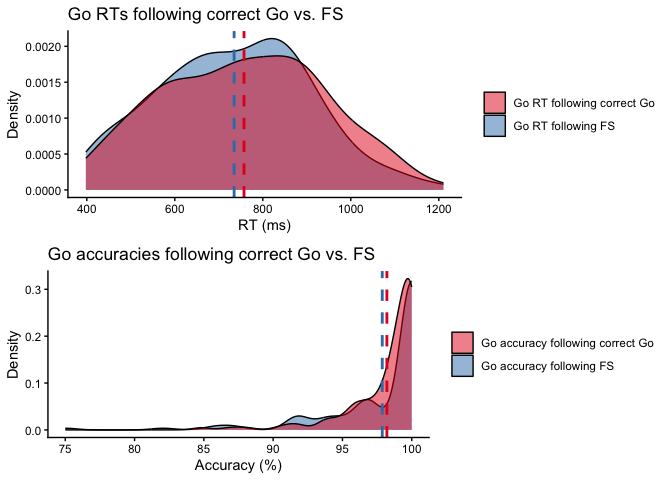<!-- -->

``` r
ggarrange(p2, p4, ncol = 1, nrow = 2, common.legend = FALSE, legend = "right")
```

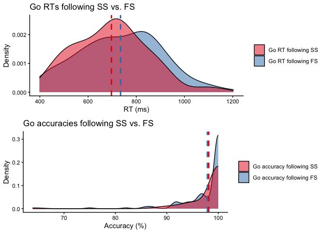<!-- -->

``` r
tiff('Post_stop_err_post_go_cor_distribution_wo.outlier.tiff', width = 2000, height = 2000, res = 300)
ggarrange(p1, p3, ncol = 1, nrow = 2, common.legend = FALSE, legend = "right")
dev.off()
```

    ## quartz_off_screen 
    ##                 2

``` r
tiff('Post_stop_err_post_stop_cor_distribution_wo.outlier.tiff', width = 2000, height = 2000, res = 300)
ggarrange(p2, p4, ncol = 1, nrow = 2, common.legend = FALSE, legend = "right")
dev.off()
```

    ## quartz_off_screen 
    ##                 2

# Sample characteristics w/o outliers

``` r
# Display counts and proportions for categorical variables
cat_vars <- c("sex", "race", "ethnicity")

for (var in cat_vars) {
  cat("\nDescriptive statistics for", var, ":\n")
  print(table(dfclean[[var]], useNA = "ifany"))
  print(prop.table(table(dfclean[[var]], useNA = "ifany")))}
```

    ## 
    ## Descriptive statistics for sex :
    ## 
    ##  0  1 
    ## 86 47 
    ## 
    ##         0         1 
    ## 0.6466165 0.3533835 
    ## 
    ## Descriptive statistics for race :
    ## 
    ## American Indian or Alaska Native                            Asian        Black or African American               More than One Race                            White                             <NA> 
    ##                                1                               34                               11                               12                               74                                1 
    ## 
    ## American Indian or Alaska Native                            Asian        Black or African American               More than One Race                            White                             <NA> 
    ##                      0.007518797                      0.255639098                      0.082706767                      0.090225564                      0.556390977                      0.007518797 
    ## 
    ## Descriptive statistics for ethnicity :
    ## 
    ##     Hispanic or Latino Not Hispanic or Latino 
    ##                     17                    116 
    ## 
    ##     Hispanic or Latino Not Hispanic or Latino 
    ##              0.1278195              0.8721805

``` r
# Count n in each wave
n_T0 <- sum(!is.na(dfclean$AUDIT_T0) & !is.na(dfclean$SocialMis_T0))
n_T1 <- sum(!is.na(dfclean$AUDIT_T1) & !is.na(dfclean$SocialMis_T1))
n_T2 <- sum(!is.na(dfclean$AUDIT_T2) & !is.na(dfclean$SocialMis_T2))
n_T3 <- sum(!is.na(dfclean$AUDIT_T3) & !is.na(dfclean$SocialMis_T3))

cat("T0:", n_T0, "\nT1:", n_T1, "\nT2:", n_T2, "\nT3:", n_T3, "\n")
```

    ## T0: 133 
    ## T1: 101 
    ## T2: 71 
    ## T3: 64

``` r
# Count by sex for each wave
count_by_sex <- function(audit, socialmis, sex) {
  table(
    sex = dfclean[[sex]][!is.na(dfclean[[audit]]) & !is.na(dfclean[[socialmis]])],
    useNA = "ifany")}

cat("T0:\n"); print(count_by_sex("AUDIT_T0", "SocialMis_T0", "sex"))
```

    ## T0:

    ## sex
    ##  0  1 
    ## 86 47

``` r
cat("T1:\n"); print(count_by_sex("AUDIT_T1", "SocialMis_T1", "sex"))
```

    ## T1:

    ## sex
    ##  0  1 
    ## 68 33

``` r
cat("T2:\n"); print(count_by_sex("AUDIT_T2", "SocialMis_T2", "sex"))
```

    ## T2:

    ## sex
    ##  0  1 
    ## 52 19

``` r
cat("T3:\n"); print(count_by_sex("AUDIT_T3", "SocialMis_T3", "sex"))
```

    ## T3:

    ## sex
    ##  0  1 
    ## 46 18

## Descriptive statistics for questionnaire and behavioral data w/o outliers

``` r
vars <- c("AUDIT_T0", "AUDIT_T1", "AUDIT_T2", "AUDIT_T3", "SocialMis_T0", "SocialMis_T1", "SocialMis_T2", "SocialMis_T3", "AdChild", "GoAcc", "GoRT", "StopAcc", "SSD", "SSRT", "pea_pse_psc", "pes_pse_psc")
desc <- map_dfr(vars, ~{
  x <- dfUnscaled[[.x]]
  mean_x <- mean(x, na.rm = TRUE)
  sd_x   <- sd(x, na.rm = TRUE)
  n_x    <- sum(!is.na(x))
  tibble(Variable = .x, Mean = mean_x, SD = sd_x, N = n_x,
         Summary = sprintf("%.2f (%.2f), %d", mean_x, sd_x, n_x))})
knitr::kable(desc %>% select(Variable, Summary), format = "html", caption = "Descriptive statistics") %>%
  kableExtra::kable_styling(full_width = FALSE, bootstrap_options = c("striped", "hover", "condensed"))
```

<table class="table table-striped table-hover table-condensed" style="width: auto !important; margin-left: auto; margin-right: auto;">

<caption>

Descriptive statistics
</caption>

<thead>

<tr>

<th style="text-align:left;">

Variable
</th>

<th style="text-align:left;">

Summary
</th>

</tr>

</thead>

<tbody>

<tr>

<td style="text-align:left;">

AUDIT_T0
</td>

<td style="text-align:left;">

2.29 (2.59), 133
</td>

</tr>

<tr>

<td style="text-align:left;">

AUDIT_T1
</td>

<td style="text-align:left;">

3.23 (3.56), 105
</td>

</tr>

<tr>

<td style="text-align:left;">

AUDIT_T2
</td>

<td style="text-align:left;">

3.79 (3.35), 77
</td>

</tr>

<tr>

<td style="text-align:left;">

AUDIT_T3
</td>

<td style="text-align:left;">

3.82 (3.08), 72
</td>

</tr>

<tr>

<td style="text-align:left;">

SocialMis_T0
</td>

<td style="text-align:left;">

10.09 (3.15), 133
</td>

</tr>

<tr>

<td style="text-align:left;">

SocialMis_T1
</td>

<td style="text-align:left;">

9.47 (3.42), 101
</td>

</tr>

<tr>

<td style="text-align:left;">

SocialMis_T2
</td>

<td style="text-align:left;">

9.15 (3.41), 71
</td>

</tr>

<tr>

<td style="text-align:left;">

SocialMis_T3
</td>

<td style="text-align:left;">

8.47 (2.81), 64
</td>

</tr>

<tr>

<td style="text-align:left;">

AdChild
</td>

<td style="text-align:left;">

1.43 (1.65), 133
</td>

</tr>

<tr>

<td style="text-align:left;">

GoAcc
</td>

<td style="text-align:left;">

97.91 (4.02), 133
</td>

</tr>

<tr>

<td style="text-align:left;">

GoRT
</td>

<td style="text-align:left;">

733.27 (167.15), 133
</td>

</tr>

<tr>

<td style="text-align:left;">

StopAcc
</td>

<td style="text-align:left;">

39.78 (5.38), 133
</td>

</tr>

<tr>

<td style="text-align:left;">

SSD
</td>

<td style="text-align:left;">

524.81 (181.94), 133
</td>

</tr>

<tr>

<td style="text-align:left;">

SSRT
</td>

<td style="text-align:left;">

251.20 (47.29), 133
</td>

</tr>

<tr>

<td style="text-align:left;">

pea_pse_psc
</td>

<td style="text-align:left;">

-0.44 (3.59), 133
</td>

</tr>

<tr>

<td style="text-align:left;">

pes_pse_psc
</td>

<td style="text-align:left;">

37.78 (66.06), 133
</td>

</tr>

</tbody>

</table>

``` r
# Shapiro-Wilk normality test
shapiro.test(dfUnscaled$StopAcc[!is.na(dfUnscaled$StopAcc)])
```

    ## 
    ##  Shapiro-Wilk normality test
    ## 
    ## data:  dfUnscaled$StopAcc[!is.na(dfUnscaled$StopAcc)]
    ## W = 0.85327, p-value = 3.621e-10

``` r
# Q-Q plot
qqnorm(dfUnscaled$StopAcc, main = "Q-Q Plot for StopAcc")
qqline(dfUnscaled$StopAcc, col = "red")
```

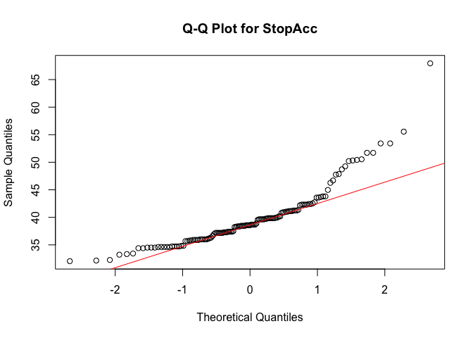<!-- -->

``` r
stopacc_range <- range(dfUnscaled$StopAcc, na.rm = TRUE)
print(stopacc_range)
```

    ## [1] 32.05128 67.94872

``` r
library(ggplot2)
ggplot(dfUnscaled, aes(x = StopAcc)) +
  geom_histogram(aes(y = ..density..), bins = 30, fill = "#377eb8", color = "white", na.rm = TRUE) +
  geom_density(color = "#e41a1c", linewidth = 1, na.rm = TRUE) +
  labs(title = "Distribution of StopAcc", x = "StopAcc", y = "Density") +
  theme_classic()
```

    ## Warning: The dot-dot notation (`..density..`) was deprecated in ggplot2 3.4.0.
    ## ℹ Please use `after_stat(density)` instead.
    ## This warning is displayed once every 8 hours.
    ## Call `lifecycle::last_lifecycle_warnings()` to see where this warning was generated.

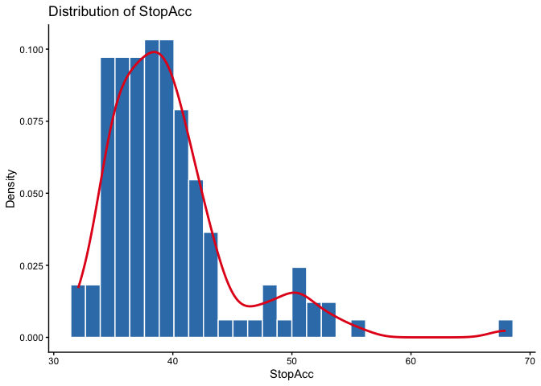<!-- -->

## Correlations between questionnaire and behavioral data w/o outliers

``` r
corr_df <- dfUnscaled[,names(dfUnscaled) %in% c('AUDIT_T0', 'SocialMis_T0', 'AdChild', "SUPPS_Impulsive", "BIS_Impulsive", "CDRISC_Resilience", "stateAnxiety", "traitAnxiety", "BDI_depression", "GoAcc", "GoRT", "StopAcc", "SSRT", "pea_pse_psc", "pes_pse_psc")]

corr <- cor(corr_df, use = "pairwise.complete.obs")
rTest <- cor.mtest(corr_df, conf.level = 0.95)
tiff('questionnaire-behavior corr.tiff', width = 2000, height = 2000, res = 300)
corrplot(corr, p.mat = rTest$p, method = 'color', diag = FALSE, type = 'upper', order = 'original',
         sig.level = c(0.001, 0.01, 0.05), pch.cex = 0.9, insig = 'label_sig', pch.col = 'grey20', col = colorRampPalette(c("blue", "white", "red"))(10))
dev.off()
```

    ## quartz_off_screen 
    ##                 2

``` r
correltable(data = corr_df)
```

    ## $table
    ##                   GoAcc GoRT   StopAcc SSRT    pea_pse_psc pes_pse_psc AUDIT_T0 AdChild SocialMis_T0 SUPPS_Impulsive BIS_Impulsive CDRISC_Resilience stateAnxiety traitAnxiety BDI_depression
    ## GoAcc                   -.26** -.40*** -.39*** -.05        .26**       .15      .02     .09          .08             .13           -.02              .05          .04          .03           
    ## GoRT                           .82***  -.14    -.11        .30***      .00      .09     .03          .03             .03           .00               .07          .13          .10           
    ## StopAcc                                -.13    -.06        .09         -.05     .11     -.02         -.03            -.09          .05               .03          .08          .03           
    ## SSRT                                           .04         -.27**      .06      -.12    .06          -.09            -.03          -.11              -.01         -.05         .02           
    ## pea_pse_psc                                                -.21*       .10      .04     .05          .05             .02           .02               -.01         -.01         -.02          
    ## pes_pse_psc                                                            .01      .13     .04          .06             .07           -.07              .20*         .17          .01           
    ## AUDIT_T0                                                                        .16     .09          .14             .12           -.01              .02          .06          .14           
    ## AdChild                                                                                 .31***       .02             .09           -.11              .30***       .33***       .24**         
    ## SocialMis_T0                                                                                         -.08            .06           -.26**            .55***       .58***       .51***        
    ## SUPPS_Impulsive                                                                                                      .62***        .00               -.07         -.04         -.03          
    ## BIS_Impulsive                                                                                                                      -.11              .08          .07          .06           
    ## CDRISC_Resilience                                                                                                                                    -.39***      -.48***      -.11          
    ## stateAnxiety                                                                                                                                                      .79***       .44***        
    ## traitAnxiety                                                                                                                                                                   .50***        
    ## BDI_depression                                                                                                                                                                               
    ## 
    ## $caption
    ## [1] "Note. This table presents Pearson correlation coefficients with pairwise deletion. N=2 missing SUPPS_Impulsive. N=2 missing BIS_Impulsive.  * p<.05, ** p<.01, *** p<.001"

``` r
# If desired, partial correlation can be calculated
# pcor.test(df$cinguloOpercularTaskControl, df$SSRT, df$sex) # correlation between x and y when controlling for sex
```

# Hypothesis Testing

In the initial model by nlme, which is not shown in this markdown, we
included the covariates (i.e., sex and AdChild), predictors (i.e.,
SocialMis and inhibition-related variables) and the interaction between
predictors in the formulas of intercept and slope. We also modeled
random intercept and random slope as we believe that people with a
higher starting AUDIT can have a less change in AUDIT slope. However,
this approach can cause convergence issue in several models. Therefore,
we decided to analyze two types of models using lmer: 1. a
cross-sectional model using baseline data only: AUDIT_T0 ~ sex +
AdChild + SocialMis + Inhibition + SocialMis*Inhibition, and 2. a
trajectory model: AUDIT ~ sex + AdChild + SocialMis +Inhibition +
SocialMis*Inhibition\*Time.<br>

There are 16 models being examined in total, each one has its own
moderator: 1 with SSRT, 1 with SUPPS, 1 with BIS, and 13 with brain
network activations.<br><br>

## Cross-sectional model (i.e., with baseline data only)

``` r
base.lme <- (lm(AUDIT_T0 ~ 1 + sex + AdChild + SocialMis_T0, data = dfclean, na.action = na.exclude))
summary(base.lme)
```

    ## 
    ## Call:
    ## lm(formula = AUDIT_T0 ~ 1 + sex + AdChild + SocialMis_T0, data = dfclean, 
    ##     na.action = na.exclude)
    ## 
    ## Residuals:
    ##     Min      1Q  Median      3Q     Max 
    ## -3.4268 -1.9789 -0.7026  1.2974  9.0453 
    ## 
    ## Coefficients:
    ##              Estimate Std. Error t value Pr(>|t|)  
    ## (Intercept)   2.02199    0.80197   2.521   0.0129 *
    ## sex          -0.40225    0.48292  -0.833   0.4064  
    ## AdChild       0.35282    0.26063   1.354   0.1782  
    ## SocialMis_T0  0.04197    0.07491   0.560   0.5763  
    ## ---
    ## Signif. codes:  0 '***' 0.001 '**' 0.01 '*' 0.05 '.' 0.1 ' ' 1
    ## 
    ## Residual standard error: 2.576 on 129 degrees of freedom
    ## Multiple R-squared:  0.03339,    Adjusted R-squared:  0.01091 
    ## F-statistic: 1.485 on 3 and 129 DF,  p-value: 0.2216

``` r
ggplot(data = dfclean, aes(x = SocialMis_T0, y = AUDIT_T0)) +
  geom_point(alpha = 0.6) +  # Scatter points
  geom_smooth(method = "lm", formula = y ~ x, color = "blue") +  # Regression line
  labs(
    x = "Social Mistreatment (T0)",
    y = "AUDIT (T0)",
    title = "Scatter Plot with Regression Line"
  ) + theme_minimal()
```

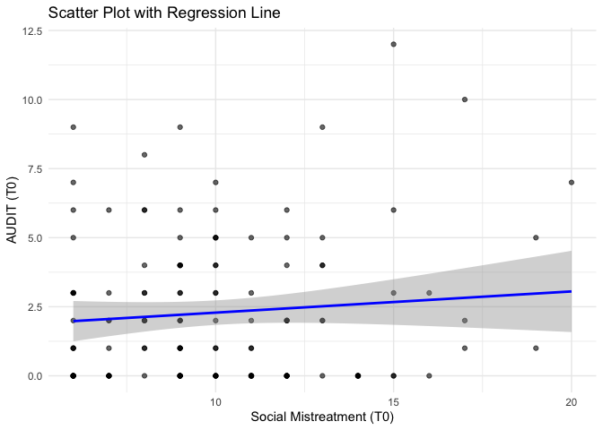<!-- -->

``` r
# Test the moderation of inhibition-related variables if needed, I did but found the reversed direction of results as compared to the trajectory model.
variables <- c("SUPPS_Impulsive", "BIS_Impulsive", "GoAcc", "GoRT", "StopAcc", "SSD", "SSRT", "pes_pse_psc", "ssgo_auditory", "ssgo_default", "ssgo_memoryRetrieval", "ssgo_visual", "fsgo_salience", "fsgo_subcortical")

for (var in variables) {
  cat("\nProcessing variable:", var, "\n")
  formula <- as.formula(paste("AUDIT_T0 ~ 1 + sex + AdChild + SocialMis_T0 *", var))
  base.lme <- (lm(formula, data = dfclean, na.action = na.exclude))
  print(summary(base.lme))
  print(simple_slopes(base.lme, pred = "SocialMis_T0", mod1 = var))
  eval(substitute(
    print(interact_plot(base.lme, pred = "SocialMis_T0", modx = MODX, interval = TRUE)),
    list(MODX = as.name(var))
  ))}
```

    ## 
    ## Processing variable: SUPPS_Impulsive 
    ## 
    ## Call:
    ## lm(formula = formula, data = dfclean, na.action = na.exclude)
    ## 
    ## Residuals:
    ##     Min      1Q  Median      3Q     Max 
    ## -3.2585 -1.9652 -0.5833  1.4428  8.8633 
    ## 
    ## Coefficients:
    ##                              Estimate Std. Error t value Pr(>|t|)  
    ## (Intercept)                   1.85079    0.82452   2.245   0.0265 *
    ## sex                          -0.34249    0.49045  -0.698   0.4863  
    ## AdChild                       0.32989    0.26488   1.245   0.2153  
    ## SocialMis_T0                  0.05950    0.07698   0.773   0.4410  
    ## SUPPS_Impulsive               0.29086    0.73859   0.394   0.6944  
    ## SocialMis_T0:SUPPS_Impulsive  0.00833    0.07153   0.116   0.9075  
    ## ---
    ## Signif. codes:  0 '***' 0.001 '**' 0.01 '*' 0.05 '.' 0.1 ' ' 1
    ## 
    ## Residual standard error: 2.582 on 125 degrees of freedom
    ##   (2 observations deleted due to missingness)
    ## Multiple R-squared:  0.05301,    Adjusted R-squared:  0.01513 
    ## F-statistic: 1.399 on 5 and 125 DF,  p-value: 0.229
    ## 
    ##   SocialMis_T0 SUPPS_Impulsive Test Estimate Std. Error t value  df Pr(>|t|) Sig.
    ## 1     6.896046          sstest        0.3483     0.3098  1.1242 125   0.2631     
    ## 2    10.045802          sstest        0.3745     0.2292  1.6338 125   0.1048     
    ## 3    13.195558          sstest        0.4008     0.3326  1.2049 125   0.2305     
    ## 4       sstest       -1.012367        0.0511     0.1130  0.4518 125   0.6522     
    ## 5       sstest       -0.017485        0.0594     0.0772  0.7692 125   0.4432     
    ## 6       sstest        0.977398        0.0676     0.0962  0.7029 125   0.4834

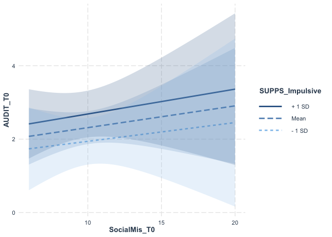<!-- -->

    ## 
    ## Processing variable: BIS_Impulsive 
    ## 
    ## Call:
    ## lm(formula = formula, data = dfclean, na.action = na.exclude)
    ## 
    ## Residuals:
    ##     Min      1Q  Median      3Q     Max 
    ## -3.2271 -1.9050 -0.7473  1.2303  9.1031 
    ## 
    ## Coefficients:
    ##                            Estimate Std. Error t value Pr(>|t|)  
    ## (Intercept)                 2.01413    0.82482   2.442    0.016 *
    ## sex                        -0.35274    0.49215  -0.717    0.475  
    ## AdChild                     0.32000    0.26521   1.207    0.230  
    ## SocialMis_T0                0.04266    0.07755   0.550    0.583  
    ## BIS_Impulsive               0.04100    0.72371   0.057    0.955  
    ## SocialMis_T0:BIS_Impulsive  0.02253    0.06876   0.328    0.744  
    ## ---
    ## Signif. codes:  0 '***' 0.001 '**' 0.01 '*' 0.05 '.' 0.1 ' ' 1
    ## 
    ## Residual standard error: 2.595 on 125 degrees of freedom
    ##   (2 observations deleted due to missingness)
    ## Multiple R-squared:  0.04359,    Adjusted R-squared:  0.005334 
    ## F-statistic: 1.139 on 5 and 125 DF,  p-value: 0.3431
    ## 
    ##   SocialMis_T0 BIS_Impulsive Test Estimate Std. Error t value  df Pr(>|t|) Sig.
    ## 1     6.896046        sstest        0.1964     0.3141  0.6252 125   0.5330     
    ## 2    10.045802        sstest        0.2673     0.2325  1.1496 125   0.2525     
    ## 3    13.195558        sstest        0.3383     0.3214  1.0524 125   0.2946     
    ## 4       sstest     -0.996568        0.0202     0.1123  0.1799 125   0.8575     
    ## 5       sstest     -0.012405        0.0424     0.0777  0.5453 125   0.5865     
    ## 6       sstest      0.971759        0.0645     0.0929  0.6950 125   0.4884

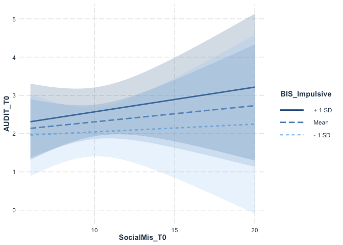<!-- -->

    ## 
    ## Processing variable: GoAcc 
    ## 
    ## Call:
    ## lm(formula = formula, data = dfclean, na.action = na.exclude)
    ## 
    ## Residuals:
    ##     Min      1Q  Median      3Q     Max 
    ## -3.5886 -2.0803 -0.6452  1.3890  9.0881 
    ## 
    ## Coefficients:
    ##                     Estimate Std. Error t value Pr(>|t|)  
    ## (Intercept)         2.020187   0.826394   2.445   0.0159 *
    ## sex                -0.230185   0.496640  -0.463   0.6438  
    ## AdChild             0.379825   0.261136   1.455   0.1483  
    ## SocialMis_T0        0.030772   0.080061   0.384   0.7014  
    ## GoAcc               0.523056   1.329365   0.393   0.6946  
    ## SocialMis_T0:GoAcc -0.002142   0.162219  -0.013   0.9895  
    ## ---
    ## Signif. codes:  0 '***' 0.001 '**' 0.01 '*' 0.05 '.' 0.1 ' ' 1
    ## 
    ## Residual standard error: 2.574 on 127 degrees of freedom
    ## Multiple R-squared:  0.04961,    Adjusted R-squared:  0.01219 
    ## F-statistic: 1.326 on 5 and 127 DF,  p-value: 0.2573
    ## 
    ##   SocialMis_T0     GoAcc Test Estimate Std. Error t value  df Pr(>|t|) Sig.
    ## 1     6.941251    sstest        0.5082     0.3784  1.3431 127   0.1816     
    ## 2    10.090226    sstest        0.5014     0.4925  1.0182 127   0.3105     
    ## 3      13.2392    sstest        0.4947     0.9294  0.5323 127   0.5955     
    ## 4       sstest -0.563666        0.0320     0.1406  0.2275 127   0.8204     
    ## 5       sstest  0.110036        0.0305     0.0759  0.4026 127   0.6880     
    ## 6       sstest  0.783737        0.0291     0.1250  0.2327 127   0.8164

    ## Warning: 0.78373673171289 is outside the observed range of GoAcc

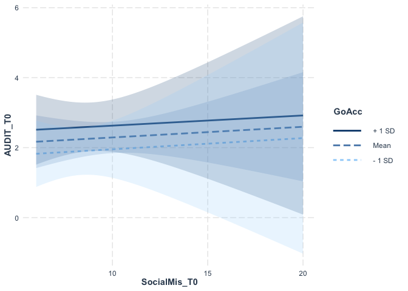<!-- -->

    ## 
    ## Processing variable: GoRT 
    ## 
    ## Call:
    ## lm(formula = formula, data = dfclean, na.action = na.exclude)
    ## 
    ## Residuals:
    ##     Min      1Q  Median      3Q     Max 
    ## -3.3041 -1.9611 -0.6679  1.5668  8.6693 
    ## 
    ## Coefficients:
    ##                   Estimate Std. Error t value Pr(>|t|)  
    ## (Intercept)        2.08276    0.81007   2.571   0.0113 *
    ## sex               -0.35480    0.49444  -0.718   0.4743  
    ## AdChild            0.35831    0.26394   1.358   0.1770  
    ## SocialMis_T0       0.03367    0.07584   0.444   0.6578  
    ## GoRT              -0.75995    0.87310  -0.870   0.3857  
    ## SocialMis_T0:GoRT  0.07438    0.08401   0.885   0.3776  
    ## ---
    ## Signif. codes:  0 '***' 0.001 '**' 0.01 '*' 0.05 '.' 0.1 ' ' 1
    ## 
    ## Residual standard error: 2.588 on 127 degrees of freedom
    ## Multiple R-squared:  0.03936,    Adjusted R-squared:  0.001541 
    ## F-statistic: 1.041 on 5 and 127 DF,  p-value: 0.3967
    ## 
    ##   SocialMis_T0      GoRT Test Estimate Std. Error t value  df Pr(>|t|) Sig.
    ## 1     6.941251    sstest       -0.2436     0.3556 -0.6851 127   0.4945     
    ## 2    10.090226    sstest       -0.0094     0.2496 -0.0377 127   0.9699     
    ## 3      13.2392    sstest        0.2248     0.3716  0.6049 127   0.5463     
    ## 4       sstest -0.996371       -0.0404     0.1197 -0.3380 127   0.7360     
    ## 5       sstest -0.076306        0.0280     0.0769  0.3641 127   0.7164     
    ## 6       sstest   0.84376        0.0964     0.0972  0.9917 127   0.3232

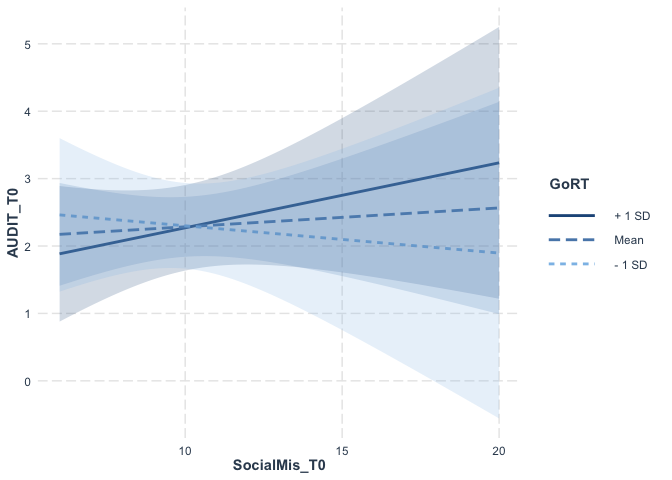<!-- -->

    ## 
    ## Processing variable: StopAcc 
    ## 
    ## Call:
    ## lm(formula = formula, data = dfclean, na.action = na.exclude)
    ## 
    ## Residuals:
    ##     Min      1Q  Median      3Q     Max 
    ## -3.4300 -1.9796 -0.6607  1.5782  9.0391 
    ## 
    ## Coefficients:
    ##                      Estimate Std. Error t value Pr(>|t|)  
    ## (Intercept)           1.86499    0.81729   2.282   0.0242 *
    ## sex                  -0.27751    0.49880  -0.556   0.5789  
    ## AdChild               0.37363    0.26537   1.408   0.1616  
    ## SocialMis_T0          0.05090    0.07629   0.667   0.5058  
    ## StopAcc              -1.26271    1.13877  -1.109   0.2696  
    ## SocialMis_T0:StopAcc  0.10535    0.10734   0.981   0.3282  
    ## ---
    ## Signif. codes:  0 '***' 0.001 '**' 0.01 '*' 0.05 '.' 0.1 ' ' 1
    ## 
    ## Residual standard error: 2.583 on 127 degrees of freedom
    ## Multiple R-squared:  0.04329,    Adjusted R-squared:  0.005626 
    ## F-statistic: 1.149 on 5 and 127 DF,  p-value: 0.3379
    ## 
    ##   SocialMis_T0   StopAcc Test Estimate Std. Error t value  df Pr(>|t|) Sig.
    ## 1     6.941251    sstest       -0.5314     0.4732 -1.1230 127   0.2636     
    ## 2    10.090226    sstest       -0.1997     0.3215 -0.6211 127   0.5356     
    ## 3      13.2392    sstest        0.1320     0.4597  0.2873 127   0.7744     
    ## 4       sstest -0.865015       -0.0402     0.1103 -0.3648 127   0.7158     
    ## 5       sstest -0.145192        0.0356     0.0754  0.4725 127   0.6374     
    ## 6       sstest  0.574631        0.1114     0.1056  1.0557 127   0.2931

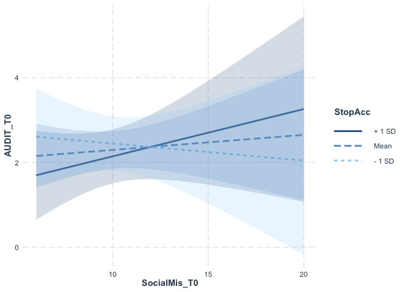<!-- -->

    ## 
    ## Processing variable: SSD 
    ## 
    ## Call:
    ## lm(formula = formula, data = dfclean, na.action = na.exclude)
    ## 
    ## Residuals:
    ##    Min     1Q Median     3Q    Max 
    ## -3.474 -1.993 -0.715  1.422  9.076 
    ## 
    ## Coefficients:
    ##                  Estimate Std. Error t value Pr(>|t|)  
    ## (Intercept)       2.02870    0.81145   2.500   0.0137 *
    ## sex              -0.36120    0.49674  -0.727   0.4685  
    ## AdChild           0.36763    0.26509   1.387   0.1679  
    ## SocialMis_T0      0.03952    0.07604   0.520   0.6042  
    ## SSD              -0.22432    0.84341  -0.266   0.7907  
    ## SocialMis_T0:SSD  0.01403    0.08201   0.171   0.8644  
    ## ---
    ## Signif. codes:  0 '***' 0.001 '**' 0.01 '*' 0.05 '.' 0.1 ' ' 1
    ## 
    ## Residual standard error: 2.594 on 127 degrees of freedom
    ## Multiple R-squared:  0.03465,    Adjusted R-squared:  -0.003352 
    ## F-statistic: 0.9118 on 5 and 127 DF,  p-value: 0.4757
    ## 
    ##   SocialMis_T0       SSD Test Estimate Std. Error t value  df Pr(>|t|) Sig.
    ## 1     6.941251    sstest       -0.1269     0.3344 -0.3796 127   0.7049     
    ## 2    10.090226    sstest       -0.0827     0.2314 -0.3575 127   0.7213     
    ## 3      13.2392    sstest       -0.0386     0.3587 -0.1075 127   0.9146     
    ## 4       sstest -1.043018        0.0249     0.1212  0.2054 127   0.8376     
    ## 5       sstest -0.044615        0.0389     0.0766  0.5079 127   0.6124     
    ## 6       sstest  0.953788        0.0529     0.1022  0.5174 127   0.6058

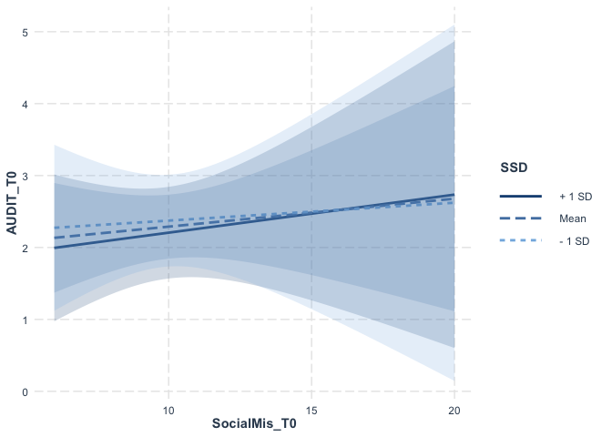<!-- -->

    ## 
    ## Processing variable: SSRT 
    ## 
    ## Call:
    ## lm(formula = formula, data = dfclean, na.action = na.exclude)
    ## 
    ## Residuals:
    ##     Min      1Q  Median      3Q     Max 
    ## -3.3231 -2.0257 -0.4763  1.4753  8.1483 
    ## 
    ## Coefficients:
    ##                   Estimate Std. Error t value Pr(>|t|)   
    ## (Intercept)        2.11901    0.79769   2.656  0.00891 **
    ## sex               -0.41319    0.47693  -0.866  0.38794   
    ## AdChild            0.35404    0.26002   1.362  0.17575   
    ## SocialMis_T0       0.03132    0.07435   0.421  0.67434   
    ## SSRT              -1.75206    0.98116  -1.786  0.07654 . 
    ## SocialMis_T0:SSRT  0.19227    0.08972   2.143  0.03402 * 
    ## ---
    ## Signif. codes:  0 '***' 0.001 '**' 0.01 '*' 0.05 '.' 0.1 ' ' 1
    ## 
    ## Residual standard error: 2.544 on 127 degrees of freedom
    ## Multiple R-squared:  0.07212,    Adjusted R-squared:  0.03559 
    ## F-statistic: 1.974 on 5 and 127 DF,  p-value: 0.08684
    ## 
    ##   SocialMis_T0      SSRT Test Estimate Std. Error t value  df Pr(>|t|) Sig.
    ## 1     6.941251    sstest       -0.4175     0.4316 -0.9673 127  0.33525     
    ## 2    10.090226    sstest        0.1880     0.2997  0.6271 127  0.53170     
    ## 3      13.2392    sstest        0.7934     0.3912  2.0284 127  0.04461    *
    ## 4       sstest -0.812151       -0.1248     0.1056 -1.1825 127  0.23921     
    ## 5       sstest -0.060913        0.0196     0.0747  0.2624 127  0.79343     
    ## 6       sstest  0.690324        0.1640     0.0954  1.7193 127  0.08800    .

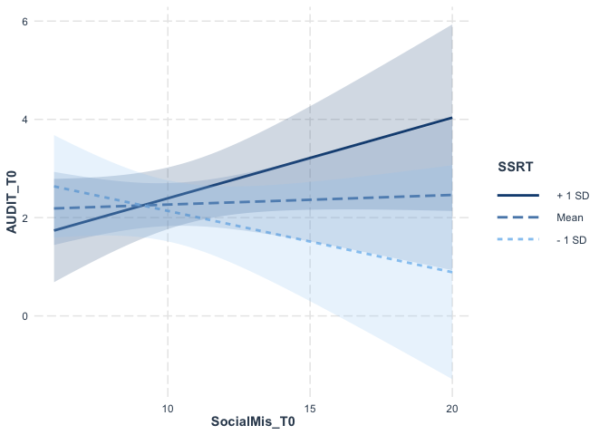<!-- -->

    ## 
    ## Processing variable: pes_pse_psc 
    ## 
    ## Call:
    ## lm(formula = formula, data = dfclean, na.action = na.exclude)
    ## 
    ## Residuals:
    ##     Min      1Q  Median      3Q     Max 
    ## -3.3308 -1.9159 -0.7149  1.4403  9.3299 
    ## 
    ## Coefficients:
    ##                          Estimate Std. Error t value Pr(>|t|)  
    ## (Intercept)               1.93147    0.81177   2.379   0.0188 *
    ## sex                      -0.38220    0.48607  -0.786   0.4332  
    ## AdChild                   0.30483    0.26923   1.132   0.2597  
    ## SocialMis_T0              0.05100    0.07587   0.672   0.5027  
    ## pes_pse_psc               0.74837    0.87114   0.859   0.3919  
    ## SocialMis_T0:pes_pse_psc -0.07894    0.08510  -0.928   0.3554  
    ## ---
    ## Signif. codes:  0 '***' 0.001 '**' 0.01 '*' 0.05 '.' 0.1 ' ' 1
    ## 
    ## Residual standard error: 2.587 on 127 degrees of freedom
    ## Multiple R-squared:   0.04,  Adjusted R-squared:  0.0022 
    ## F-statistic: 1.058 on 5 and 127 DF,  p-value: 0.3868
    ## 
    ##   SocialMis_T0 pes_pse_psc Test Estimate Std. Error t value  df Pr(>|t|) Sig.
    ## 1     6.941251      sstest        0.2005     0.3444  0.5820 127   0.5616     
    ## 2    10.090226      sstest       -0.0481     0.2414 -0.1993 127   0.8424     
    ## 3      13.2392      sstest       -0.2967     0.3763 -0.7885 127   0.4319     
    ## 4       sstest   -0.927218        0.1242     0.1163  1.0679 127   0.2876     
    ## 5       sstest    0.018246        0.0496     0.0757  0.6548 127   0.5138     
    ## 6       sstest     0.96371       -0.0251     0.1043 -0.2404 127   0.8104

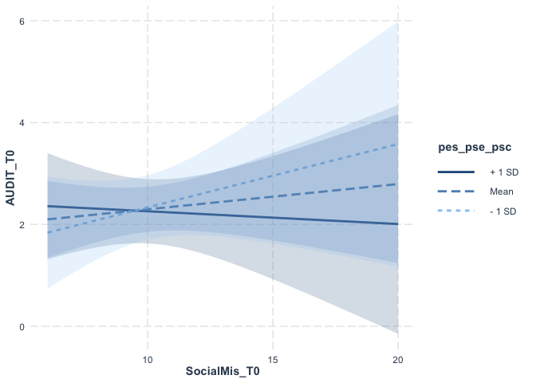<!-- -->

    ## 
    ## Processing variable: ssgo_auditory 
    ## 
    ## Call:
    ## lm(formula = formula, data = dfclean, na.action = na.exclude)
    ## 
    ## Residuals:
    ##     Min      1Q  Median      3Q     Max 
    ## -3.6161 -2.0267 -0.7373  1.4770  9.0616 
    ## 
    ## Coefficients:
    ##                            Estimate Std. Error t value Pr(>|t|)  
    ## (Intercept)                 2.20302    0.84621   2.603   0.0103 *
    ## sex                        -0.43560    0.48888  -0.891   0.3746  
    ## AdChild                     0.36838    0.26350   1.398   0.1645  
    ## SocialMis_T0                0.02435    0.07926   0.307   0.7592  
    ## ssgo_auditory               0.51098    0.86898   0.588   0.5576  
    ## SocialMis_T0:ssgo_auditory -0.06105    0.08887  -0.687   0.4933  
    ## ---
    ## Signif. codes:  0 '***' 0.001 '**' 0.01 '*' 0.05 '.' 0.1 ' ' 1
    ## 
    ## Residual standard error: 2.591 on 127 degrees of freedom
    ## Multiple R-squared:  0.03735,    Adjusted R-squared:  -0.0005456 
    ## F-statistic: 0.9856 on 5 and 127 DF,  p-value: 0.4293
    ## 
    ##   SocialMis_T0 ssgo_auditory Test Estimate Std. Error t value  df Pr(>|t|) Sig.
    ## 1     6.941251        sstest        0.0872     0.3355  0.2599 127   0.7954     
    ## 2    10.090226        sstest       -0.1051     0.2683 -0.3916 127   0.6960     
    ## 3      13.2392        sstest       -0.2973     0.4336 -0.6857 127   0.4942     
    ## 4       sstest     -0.908108        0.0798     0.0942  0.8469 127   0.3986     
    ## 5       sstest     -0.036344        0.0266     0.0783  0.3391 127   0.7351     
    ## 6       sstest      0.835421       -0.0267     0.1241 -0.2148 127   0.8302

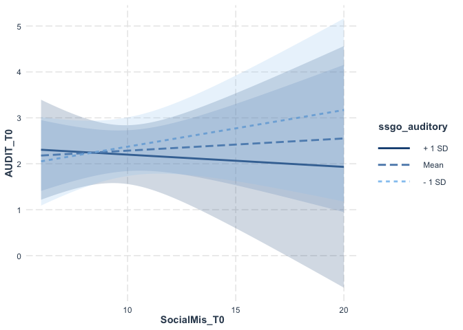<!-- -->

    ## 
    ## Processing variable: ssgo_default 
    ## 
    ## Call:
    ## lm(formula = formula, data = dfclean, na.action = na.exclude)
    ## 
    ## Residuals:
    ##     Min      1Q  Median      3Q     Max 
    ## -4.0827 -1.9644 -0.5521  1.3172 10.0995 
    ## 
    ## Coefficients:
    ##                           Estimate Std. Error t value Pr(>|t|)   
    ## (Intercept)                2.08202    0.79365   2.623  0.00977 **
    ## sex                       -0.39084    0.47442  -0.824  0.41158   
    ## AdChild                    0.31359    0.26234   1.195  0.23417   
    ## SocialMis_T0               0.02965    0.07446   0.398  0.69111   
    ## ssgo_default               1.98688    0.83530   2.379  0.01887 * 
    ## SocialMis_T0:ssgo_default -0.20117    0.07655  -2.628  0.00965 **
    ## ---
    ## Signif. codes:  0 '***' 0.001 '**' 0.01 '*' 0.05 '.' 0.1 ' ' 1
    ## 
    ## Residual standard error: 2.526 on 127 degrees of freedom
    ## Multiple R-squared:  0.08471,    Adjusted R-squared:  0.04868 
    ## F-statistic: 2.351 on 5 and 127 DF,  p-value: 0.04447
    ## 
    ##   SocialMis_T0 ssgo_default Test Estimate Std. Error t value  df Pr(>|t|) Sig.
    ## 1     6.941251       sstest        0.5905     0.3617  1.6325 127  0.10504     
    ## 2    10.090226       sstest       -0.0430     0.2447 -0.1755 127  0.86095     
    ## 3      13.2392       sstest       -0.6764     0.3243 -2.0861 127  0.03897    *
    ## 4       sstest    -0.951015        0.2210     0.1023  2.1597 127  0.03267    *
    ## 5       sstest    -0.022645        0.0342     0.0744  0.4597 127  0.64653     
    ## 6       sstest     0.905726       -0.1525     0.1035 -1.4740 127  0.14295

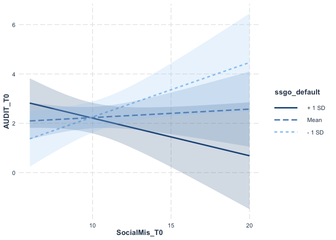<!-- -->

    ## 
    ## Processing variable: ssgo_memoryRetrieval 
    ## 
    ## Call:
    ## lm(formula = formula, data = dfclean, na.action = na.exclude)
    ## 
    ## Residuals:
    ##    Min     1Q Median     3Q    Max 
    ## -3.490 -1.911 -0.564  1.278  9.380 
    ## 
    ## Coefficients:
    ##                                   Estimate Std. Error t value Pr(>|t|)  
    ## (Intercept)                        1.98812    0.79650   2.496   0.0138 *
    ## sex                               -0.40630    0.47848  -0.849   0.3974  
    ## AdChild                            0.38036    0.25971   1.465   0.1455  
    ## SocialMis_T0                       0.04183    0.07454   0.561   0.5756  
    ## ssgo_memoryRetrieval               1.98068    0.96717   2.048   0.0426 *
    ## SocialMis_T0:ssgo_memoryRetrieval -0.17362    0.09531  -1.822   0.0709 .
    ## ---
    ## Signif. codes:  0 '***' 0.001 '**' 0.01 '*' 0.05 '.' 0.1 ' ' 1
    ## 
    ## Residual standard error: 2.55 on 127 degrees of freedom
    ## Multiple R-squared:  0.06728,    Adjusted R-squared:  0.03056 
    ## F-statistic: 1.832 on 5 and 127 DF,  p-value: 0.1111
    ## 
    ##   SocialMis_T0 ssgo_memoryRetrieval Test Estimate Std. Error t value  df Pr(>|t|) Sig.
    ## 1     6.941251               sstest        0.7756     0.3658  2.1205 127  0.03591    *
    ## 2    10.090226               sstest        0.2288     0.2423  0.9445 127  0.34673     
    ## 3      13.2392               sstest       -0.3179     0.4047 -0.7855 127  0.43365     
    ## 4       sstest            -0.917074        0.2011     0.1117  1.7991 127  0.07437    .
    ## 5       sstest             0.008193        0.0404     0.0746  0.5418 127  0.58891     
    ## 6       sstest             0.933461       -0.1202     0.1191 -1.0093 127  0.31475

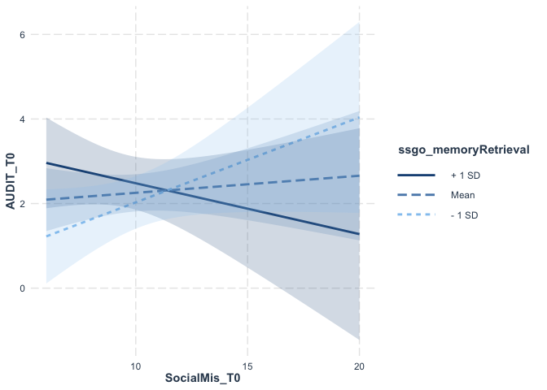<!-- -->

    ## 
    ## Processing variable: ssgo_visual 
    ## 
    ## Call:
    ## lm(formula = formula, data = dfclean, na.action = na.exclude)
    ## 
    ## Residuals:
    ##     Min      1Q  Median      3Q     Max 
    ## -3.3881 -1.9191 -0.7391  1.4339  9.3391 
    ## 
    ## Coefficients:
    ##                          Estimate Std. Error t value Pr(>|t|)   
    ## (Intercept)               2.23150    0.81559   2.736  0.00711 **
    ## sex                      -0.43429    0.49075  -0.885  0.37785   
    ## AdChild                   0.37698    0.26171   1.440  0.15219   
    ## SocialMis_T0              0.01662    0.07750   0.214  0.83051   
    ## ssgo_visual               1.38227    0.84993   1.626  0.10636   
    ## SocialMis_T0:ssgo_visual -0.13261    0.07935  -1.671  0.09717 . 
    ## ---
    ## Signif. codes:  0 '***' 0.001 '**' 0.01 '*' 0.05 '.' 0.1 ' ' 1
    ## 
    ## Residual standard error: 2.568 on 127 degrees of freedom
    ## Multiple R-squared:  0.05426,    Adjusted R-squared:  0.01702 
    ## F-statistic: 1.457 on 5 and 127 DF,  p-value: 0.2085
    ## 
    ##   SocialMis_T0 ssgo_visual Test Estimate Std. Error t value  df Pr(>|t|) Sig.
    ## 1     6.941251      sstest        0.4618     0.3615  1.2774 127   0.2038     
    ## 2    10.090226      sstest        0.0442     0.2497  0.1771 127   0.8597     
    ## 3      13.2392      sstest       -0.3734     0.3448 -1.0828 127   0.2809     
    ## 4       sstest   -0.953365        0.1430     0.0965  1.4820 127   0.1408     
    ## 5       sstest   -0.027591        0.0203     0.0771  0.2631 127   0.7929     
    ## 6       sstest    0.898182       -0.1025     0.1156 -0.8867 127   0.3769

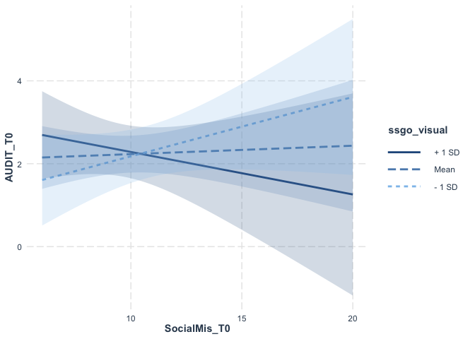<!-- -->

    ## 
    ## Processing variable: fsgo_salience 
    ## 
    ## Call:
    ## lm(formula = formula, data = dfclean, na.action = na.exclude)
    ## 
    ## Residuals:
    ##     Min      1Q  Median      3Q     Max 
    ## -4.2752 -2.0042 -0.5285  1.3781  8.6178 
    ## 
    ## Coefficients:
    ##                            Estimate Std. Error t value Pr(>|t|)  
    ## (Intercept)                 1.89539    0.80665   2.350   0.0203 *
    ## sex                        -0.40879    0.47916  -0.853   0.3952  
    ## AdChild                     0.33519    0.25855   1.296   0.1972  
    ## SocialMis_T0                0.06291    0.07587   0.829   0.4086  
    ## fsgo_salience              -1.67952    0.81249  -2.067   0.0408 *
    ## SocialMis_T0:fsgo_salience  0.17531    0.08496   2.063   0.0411 *
    ## ---
    ## Signif. codes:  0 '***' 0.001 '**' 0.01 '*' 0.05 '.' 0.1 ' ' 1
    ## 
    ## Residual standard error: 2.553 on 127 degrees of freedom
    ## Multiple R-squared:  0.06544,    Adjusted R-squared:  0.02865 
    ## F-statistic: 1.779 on 5 and 127 DF,  p-value: 0.1218
    ## 
    ##   SocialMis_T0 fsgo_salience Test Estimate Std. Error t value  df Pr(>|t|) Sig.
    ## 1     6.941251        sstest       -0.4627     0.2992 -1.5465 127  0.12447     
    ## 2    10.090226        sstest        0.0894     0.2449  0.3648 127  0.71584     
    ## 3      13.2392        sstest        0.6414     0.4167  1.5393 127  0.12623     
    ## 4       sstest     -0.971021       -0.1073     0.1031 -1.0411 127  0.29982     
    ## 5       sstest      0.000137        0.0629     0.0759  0.8294 127  0.40844     
    ## 6       sstest      0.971295        0.2332     0.1204  1.9362 127  0.05506    .

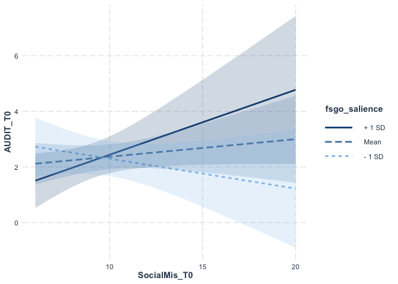<!-- -->

    ## 
    ## Processing variable: fsgo_subcortical 
    ## 
    ## Call:
    ## lm(formula = formula, data = dfclean, na.action = na.exclude)
    ## 
    ## Residuals:
    ##     Min      1Q  Median      3Q     Max 
    ## -4.7371 -1.8791 -0.5737  1.2290  7.7803 
    ## 
    ## Coefficients:
    ##                               Estimate Std. Error t value Pr(>|t|)    
    ## (Intercept)                    1.94504    0.77195   2.520 0.012988 *  
    ## sex                           -0.21269    0.46880  -0.454 0.650821    
    ## AdChild                        0.21832    0.25339   0.862 0.390534    
    ## SocialMis_T0                   0.04062    0.07203   0.564 0.573808    
    ## fsgo_subcortical              -2.53483    0.77844  -3.256 0.001447 ** 
    ## SocialMis_T0:fsgo_subcortical  0.27429    0.07756   3.537 0.000567 ***
    ## ---
    ## Signif. codes:  0 '***' 0.001 '**' 0.01 '*' 0.05 '.' 0.1 ' ' 1
    ## 
    ## Residual standard error: 2.476 on 127 degrees of freedom
    ## Multiple R-squared:  0.1207, Adjusted R-squared:  0.08604 
    ## F-statistic: 3.485 on 5 and 127 DF,  p-value: 0.005507
    ## 
    ##   SocialMis_T0 fsgo_subcortical Test Estimate Std. Error t value  df Pr(>|t|) Sig.
    ## 1     6.941251           sstest       -0.6309     0.3173 -1.9882 127 0.048940    *
    ## 2    10.090226           sstest        0.2328     0.2502  0.9302 127 0.354042     
    ## 3      13.2392           sstest        1.0965     0.3792  2.8912 127 0.004516   **
    ## 4       sstest        -0.886825       -0.2026     0.0997 -2.0314 127 0.044303    *
    ## 5       sstest         -0.00928        0.0381     0.0720  0.5285 127 0.598053     
    ## 6       sstest         0.868266        0.2788     0.0984  2.8316 127 0.005387   **

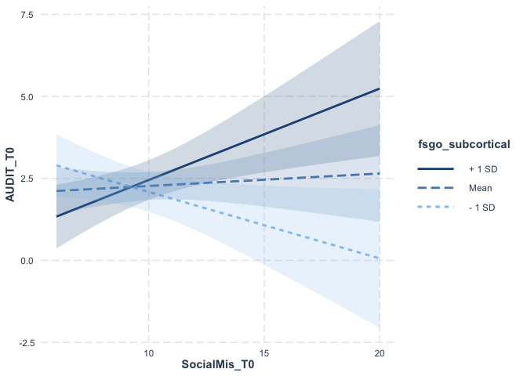<!-- -->

``` r
# # The default values of BDI score and go accuracy picked by simple_slopes exceed the data range (+-1SD), thus we run simple_slopes for them separately using mean, 1st and 3rd quantiles.
# bdi.lme <- lm(AUDIT_T0 ~ 1 + sex + AdChild + SocialMis_T0 * BDI_depression, data = df, na.action = na.exclude)
# print(simple_slopes(bdi.lme, pred = "SocialMis_T0", mod1 = BDI_depression, levels = c(-0.503426, -0.503426, 0.170718)))
# interact_plot(bdi.lme, pred = "SocialMis_T0", modx = "BDI_depression", interval = TRUE, modxvals = c(-0.503426, 0.006155, 0.170718))
# goacc.lme <- lm(AUDIT_T0 ~1 + sex + AdChild + SocialMis_T0 * GoAcc, data = df, na.action = na.exclude)
# print(simple_slopes(goacc.lme, pred = "SocialMis_T0", mod1 = "GoAcc", levels = c(0.1164, 0.1020, 0.4602)))
# interact_plot(goacc.lme, pred = "SocialMis_T0", modx = "GoAcc", interval = TRUE, modxvals = c(0.1164, 0.2935, 0.4602))
```

``` r
# Reshape data to long format while preserving NA values
df_long <- dfclean %>%
  pivot_longer(
    cols = matches("(_T[0-3])$"),            # only columns that end with _T0/_T1/_T2/_T3
    names_to = c(".value", "Time"),          # .value -> make measure names columns; time -> the wave index
    names_pattern = "(.+)_T([0-3])$"         # capture measure name and time digit
  ) %>%
  mutate(Time = as.integer(Time)) %>%        # convert time to numeric 0..3 (or +1 if preferred)
  filter(!if_all(matches("^(AUDIT|SocialMis|.*)$"), is.na)) # drop rows where all time-varying measures are NA
```

    ## Warning: Using one column matrices in `filter()` was deprecated in dplyr 1.1.0.
    ## ℹ Please use one dimensional logical vectors instead.
    ## This warning is displayed once every 8 hours.
    ## Call `lifecycle::last_lifecycle_warnings()` to see where this warning was generated.

``` r
  # filter(!if_all(matches("^(AUDIT|SocialMis|SocialMisdev|.*)$"), is.na))

# quick checks
nrow(df_long)       # should be ~ n_subjects * 4 (e.g., 133*4 = 532)
```

    ## [1] 532

``` r
table(df_long$Time) # counts per wave
```

    ## 
    ##   0   1   2   3 
    ## 133 133 133 133

``` r
head(df_long, 12)
```

    ## # A tibble: 12 × 211
    ##    Subj  redcapID mriID  sstFMRI ddtFMRI   sex race  ethnicity              sstInputFile       rIFG_ss_go[,1] lIFG_ss_go[,1] rInsula_ss_go[,1] lInsula_ss_go[,1] biIFGInsula_ss_go[,1] rSFG_ssrt[,1] lSFG_ssrt[,1] biIFGSFGInsula_ssrt[…¹ lMidOrbG_socialMis[,1] lSMedG_socialMis[,1] lMidFGIFG_socialMis[…²
    ##    <chr>    <dbl> <chr>  <chr>   <chr>   <dbl> <chr> <chr>                  <chr>                       <dbl>          <dbl>             <dbl>             <dbl>                 <dbl>         <dbl>         <dbl>                  <dbl>                  <dbl>                <dbl>                  <dbl>
    ##  1 001          1 LIA001 y       y           0 White Not Hispanic or Latino sub-001_task-sst_…         0.522          -0.528            0.0164           -1.11                 -0.330          0.113        -1.31                 -0.566                  -1.03                -1.44                   0.369
    ##  2 001          1 LIA001 y       y           0 White Not Hispanic or Latino sub-001_task-sst_…         0.522          -0.528            0.0164           -1.11                 -0.330          0.113        -1.31                 -0.566                  -1.03                -1.44                   0.369
    ##  3 001          1 LIA001 y       y           0 White Not Hispanic or Latino sub-001_task-sst_…         0.522          -0.528            0.0164           -1.11                 -0.330          0.113        -1.31                 -0.566                  -1.03                -1.44                   0.369
    ##  4 001          1 LIA001 y       y           0 White Not Hispanic or Latino sub-001_task-sst_…         0.522          -0.528            0.0164           -1.11                 -0.330          0.113        -1.31                 -0.566                  -1.03                -1.44                   0.369
    ##  5 003          4 LIA003 y       y           1 White Not Hispanic or Latino sub-003_task-sst_…         0.0131         -0.245           -0.157             0.560                 0.0439         0.327         0.458                 0.231                   0.383               -0.429                  0.134
    ##  6 003          4 LIA003 y       y           1 White Not Hispanic or Latino sub-003_task-sst_…         0.0131         -0.245           -0.157             0.560                 0.0439         0.327         0.458                 0.231                   0.383               -0.429                  0.134
    ##  7 003          4 LIA003 y       y           1 White Not Hispanic or Latino sub-003_task-sst_…         0.0131         -0.245           -0.157             0.560                 0.0439         0.327         0.458                 0.231                   0.383               -0.429                  0.134
    ##  8 003          4 LIA003 y       y           1 White Not Hispanic or Latino sub-003_task-sst_…         0.0131         -0.245           -0.157             0.560                 0.0439         0.327         0.458                 0.231                   0.383               -0.429                  0.134
    ##  9 004          3 LIA004 y       y           0 White Not Hispanic or Latino sub-004_task-sst_…        -0.788           0.476            1.34              0.0406                0.315         -0.622        -0.560                -0.0737                  0.180                0.515                  1.33 
    ## 10 004          3 LIA004 y       y           0 White Not Hispanic or Latino sub-004_task-sst_…        -0.788           0.476            1.34              0.0406                0.315         -0.622        -0.560                -0.0737                  0.180                0.515                  1.33 
    ## 11 004          3 LIA004 y       y           0 White Not Hispanic or Latino sub-004_task-sst_…        -0.788           0.476            1.34              0.0406                0.315         -0.622        -0.560                -0.0737                  0.180                0.515                  1.33 
    ## 12 004          3 LIA004 y       y           0 White Not Hispanic or Latino sub-004_task-sst_…        -0.788           0.476            1.34              0.0406                0.315         -0.622        -0.560                -0.0737                  0.180                0.515                  1.33 
    ## # ℹ abbreviated names: ¹​biIFGSFGInsula_ssrt[,1], ²​lMidFGIFG_socialMis[,1]
    ## # ℹ 191 more variables: lMidFG_socialMis <dbl[,1]>, ave_socialMis <dbl[,1]>, net_7_1 <dbl[,1]>, net_7_2 <dbl[,1]>, net_7_3 <dbl[,1]>, net_7_4 <dbl[,1]>, net_7_5 <dbl[,1]>, net_7_6 <dbl[,1]>, net_7_7 <dbl[,1]>, net_17_1 <dbl[,1]>, net_17_2 <dbl[,1]>, net_17_3 <dbl[,1]>, net_17_4 <dbl[,1]>,
    ## #   net_17_5 <dbl[,1]>, net_17_6 <dbl[,1]>, net_17_7 <dbl[,1]>, net_17_8 <dbl[,1]>, net_17_9 <dbl[,1]>, net_17_10 <dbl[,1]>, net_17_11 <dbl[,1]>, net_17_12 <dbl[,1]>, net_17_13 <dbl[,1]>, net_17_14 <dbl[,1]>, net_17_15 <dbl[,1]>, net_17_16 <dbl[,1]>, net_17_17 <dbl[,1]>, go_subcortical <dbl>,
    ## #   ssgo_somatomotorHand <dbl[,1]>, ssgo_somatomotorMouth <dbl[,1]>, ssgo_cinguloOpercularTaskControl <dbl[,1]>, ssgo_auditory <dbl[,1]>, ssgo_default <dbl[,1]>, ssgo_memoryRetrieval <dbl[,1]>, ssgo_visual <dbl[,1]>, ssgo_frontoParietalTaskControl <dbl[,1]>, ssgo_salience <dbl[,1]>,
    ## #   ssgo_subcortical <dbl[,1]>, ssgo_ventralAttention <dbl[,1]>, ssgo_dorsalAttention <dbl[,1]>, ssgo_cerebellar <dbl[,1]>, ss_somatomotorHand <dbl[,1]>, ss_somatomotorMouth <dbl[,1]>, ss_cinguloOpercularTaskControl <dbl[,1]>, ss_auditory <dbl[,1]>, ss_default <dbl[,1]>,
    ## #   ss_memoryRetrieval <dbl[,1]>, ss_visual <dbl[,1]>, ss_frontoParietalTaskControl <dbl[,1]>, ss_salience <dbl[,1]>, ss_subcortical <dbl[,1]>, ss_ventralAttention <dbl[,1]>, ss_dorsalAttention <dbl[,1]>, ss_cerebellar <dbl[,1]>, fs_somatomotorHand <dbl[,1]>, fs_somatomotorMouth <dbl[,1]>,
    ## #   fs_cinguloOpercularTaskControl <dbl[,1]>, fs_auditory <dbl[,1]>, fs_default <dbl[,1]>, fs_memoryRetrieval <dbl[,1]>, fs_visual <dbl[,1]>, fs_frontoParietalTaskControl <dbl[,1]>, fs_salience <dbl[,1]>, fs_subcortical <dbl[,1]>, fs_ventralAttention <dbl[,1]>, fs_dorsalAttention <dbl[,1]>, …

``` r
# Visulaing the AUDIT slope
tiff('audit_slope_trajectories.tiff', width = 6400, height = 6400, res = 800)
average_audit <- df_long %>%
  group_by(Time) %>%
  summarise(mean_audit = mean(AUDIT, na.rm = TRUE))

ggplot(data = df_long, aes(x = Time, y = AUDIT, group = mriID)) +
    geom_point(size = 5, alpha = .2) + geom_line() +
    geom_line(data = average_audit, aes(x = Time, y = mean_audit, group = 1), color = "red", linewidth = 1.2) +
    theme_classic() +
    scale_x_continuous(limits=c(0, 3), breaks = c(0, 1, 2, 3), name = "Time") +
    scale_y_continuous(limits=c(0, 25), breaks = c(0, 5, 10, 15, 20, 25), name = "AUDIT")
```

    ## Warning: Removed 145 rows containing missing values or values outside the scale range (`geom_point()`).

    ## Warning: Removed 132 rows containing missing values or values outside the scale range (`geom_line()`).

``` r
dev.off()
```

    ## quartz_off_screen 
    ##                 2

``` r
unique_mriID_count <- df_long %>%
  summarise(unique_count = n_distinct(mriID))
print(unique_mriID_count)
```

    ## # A tibble: 1 × 1
    ##   unique_count
    ##          <int>
    ## 1          133

``` r
sample_size_per_time <- df_long %>%
  group_by(Time) %>%
  summarise(sample_size = n())
print(sample_size_per_time)
```

    ## # A tibble: 4 × 2
    ##    Time sample_size
    ##   <int>       <int>
    ## 1     0         133
    ## 2     1         133
    ## 3     2         133
    ## 4     3         133

``` r
# Reduce the data observations (rows) so that all the following models have the same number of observations. This is important for comparing model fit indices (e.g., AIC, BIC, anova) across models.
# This code removes the rows (not mriID) with missing values for SocialMis
socialMis.lme <- lmer(AUDIT ~ 1 + sex + AdChild + SocialMis*Time + (1 | mriID), data = df_long, REML = FALSE, na.action = na.exclude)
mf <- model.frame(socialMis.lme)                     # data used for socialMis.lme
used_rows <- as.integer(rownames(mf))                # row numbers in df_long used by that model
df_long <- df_long[used_rows, , drop = FALSE]      # subset original data

pairs <- list(c("AUDIT_T1", "SocialMis_T1"), c("AUDIT_T2", "SocialMis_T2"), c("AUDIT_T3", "SocialMis_T3"))
for (p in pairs) {
  col1 <- p[1]; col2 <- p[2]
  complete_idx <- complete.cases(dfUnscaled[[col1]], dfUnscaled[[col2]])
  n <- sum(complete_idx)
  if (n > 0) {
    m1 <- mean(dfUnscaled[[col1]][complete_idx], na.rm = TRUE)
    s1 <- sd(dfUnscaled[[col1]][complete_idx], na.rm = TRUE)
    m2 <- mean(dfUnscaled[[col2]][complete_idx], na.rm = TRUE)
    s2 <- sd(dfUnscaled[[col2]][complete_idx], na.rm = TRUE)
    cat(sprintf("%s & %s: n = %d\n  %s: mean = %.2f, sd = %.2f\n  %s: mean = %.2f, sd = %.2f\n\n",
                col1, col2, n, col1, m1, s1, col2, m2, s2))
  } else {
    cat(sprintf("%s & %s: no complete pairs\n\n", col1, col2))}}
```

    ## AUDIT_T1 & SocialMis_T1: n = 101
    ##   AUDIT_T1: mean = 3.22, sd = 3.58
    ##   SocialMis_T1: mean = 9.47, sd = 3.42
    ## 
    ## AUDIT_T2 & SocialMis_T2: n = 71
    ##   AUDIT_T2: mean = 3.82, sd = 3.39
    ##   SocialMis_T2: mean = 9.15, sd = 3.41
    ## 
    ## AUDIT_T3 & SocialMis_T3: n = 64
    ##   AUDIT_T3: mean = 3.86, sd = 3.21
    ##   SocialMis_T3: mean = 8.47, sd = 2.81

``` r
nrow(model.frame(socialMis.lme))                     # should show 369
```

    ## [1] 369

``` r
nrow(df_long)
```

    ## [1] 369

## Hierarchical Linear Modeling (HLM) for Longitudinal Data

### The full model looks like this:

### Level 1 (within-person model)

AUDIT<sub>ij</sub> = β<sub>0j</sub> + β<sub>1j</sub>Time<sub>ij</sub> +
e<sub>ij</sub> <br><br>

### Level 2 (between-person model)

β<sub>1j</sub> = γ<sub>10</sub> + γ<sub>11</sub>Sex<sub>j</sub> +
γ<sub>12</sub>AdChild<sub>j</sub> +
γ<sub>13</sub>SocialMis<sub>j</sub> +
γ<sub>14</sub>Inhibition<sub>j</sub> +
γ<sub>15</sub>SocialMis<sub>j</sub>\*Inhibition<sub>j</sub> +
r<sub>2j</sub><br><br>

Sex and AdChild are time-invariant covariates, which means they didn’t
vary within individuals over time, thus they are included at level
2.<br> The SocialMis at level 2 is the between-individual difference in
SocialMis, to reflect, for example, does AUDIT increase when a person
has a higher SocialMis than other people?<br> In our analyses, we allow
the intercept and slope to be random across participants.<br>

## Step 1: calculate ICC

``` r
null.lme <- lmer(AUDIT ~ 1 + (1 | mriID), data=df_long, REML = FALSE, na.action = na.exclude)
summary(null.lme)
```

    ## Linear mixed model fit by maximum likelihood . t-tests use Satterthwaite's method ['lmerModLmerTest']
    ## Formula: AUDIT ~ 1 + (1 | mriID)
    ##    Data: df_long
    ## 
    ##       AIC       BIC    logLik -2*log(L)  df.resid 
    ##    1842.5    1854.3    -918.3    1836.5       366 
    ## 
    ## Scaled residuals: 
    ##     Min      1Q  Median      3Q     Max 
    ## -2.6216 -0.4787 -0.2008  0.3456  4.1507 
    ## 
    ## Random effects:
    ##  Groups   Name        Variance Std.Dev.
    ##  mriID    (Intercept) 4.780    2.186   
    ##  Residual             5.582    2.363   
    ## Number of obs: 369, groups:  mriID, 133
    ## 
    ## Fixed effects:
    ##             Estimate Std. Error       df t value Pr(>|t|)    
    ## (Intercept)   3.0996     0.2318 128.2892   13.37   <2e-16 ***
    ## ---
    ## Signif. codes:  0 '***' 0.001 '**' 0.01 '*' 0.05 '.' 0.1 ' ' 1

``` r
icc(null.lme, ci = T, set.seed(12345))
```

    ## # Intraclass Correlation Coefficient
    ## 
    ##     Adjusted ICC: 0.461 [0.339, 0.633]
    ##   Unadjusted ICC: 0.461 [0.339, 0.633]

``` r
# HLM is appropriate for our data because there was a significant intraclass correlation coefficient (adjusted ICC = .54, 95% CI = .40 to .65), while there was a trend of increased AUDIT based on the trjectory plot above.
```

## Step 2a: Unconditional growth model

### Level 1

AUDIT<sub>ij</sub> = β<sub>0j</sub> + β<sub>1j</sub>Time<sub>ij</sub> +
e<sub>ij</sub>

``` r
uncon.lme <- lmer(AUDIT ~ 1 + Time + (1 | mriID), data = df_long, REML = FALSE, na.action = na.exclude)
summary(uncon.lme)
```

    ## Linear mixed model fit by maximum likelihood . t-tests use Satterthwaite's method ['lmerModLmerTest']
    ## Formula: AUDIT ~ 1 + Time + (1 | mriID)
    ##    Data: df_long
    ## 
    ##       AIC       BIC    logLik -2*log(L)  df.resid 
    ##    1810.1    1825.7    -901.0    1802.1       365 
    ## 
    ## Scaled residuals: 
    ##     Min      1Q  Median      3Q     Max 
    ## -2.7487 -0.5075 -0.1276  0.3416  4.2576 
    ## 
    ## Random effects:
    ##  Groups   Name        Variance Std.Dev.
    ##  mriID    (Intercept) 5.227    2.286   
    ##  Residual             4.784    2.187   
    ## Number of obs: 369, groups:  mriID, 133
    ## 
    ## Fixed effects:
    ##             Estimate Std. Error       df t value Pr(>|t|)    
    ## (Intercept)   2.4054     0.2599 197.2623   9.256  < 2e-16 ***
    ## Time          0.6764     0.1105 269.1824   6.124 3.23e-09 ***
    ## ---
    ## Signif. codes:  0 '***' 0.001 '**' 0.01 '*' 0.05 '.' 0.1 ' ' 1
    ## 
    ## Correlation of Fixed Effects:
    ##      (Intr)
    ## Time -0.434

``` r
uncon.coef <- tidy(uncon.lme, conf.int = TRUE)
uncon.coef
```

    ## # A tibble: 4 × 10
    ##   effect   group    term            estimate std.error statistic    df   p.value conf.low conf.high
    ##   <chr>    <chr>    <chr>              <dbl>     <dbl>     <dbl> <dbl>     <dbl>    <dbl>     <dbl>
    ## 1 fixed    <NA>     (Intercept)        2.41      0.260      9.26  197.  3.62e-17    1.89      2.92 
    ## 2 fixed    <NA>     Time               0.676     0.110      6.12  269.  3.23e- 9    0.459     0.894
    ## 3 ran_pars mriID    sd__(Intercept)    2.29     NA         NA      NA  NA          NA        NA    
    ## 4 ran_pars Residual sd__Observation    2.19     NA         NA      NA  NA          NA        NA

``` r
confint(uncon.lme)
```

    ## Computing profile confidence intervals ...

    ##                 2.5 %    97.5 %
    ## .sig01      1.9229783 2.7047967
    ## .sigma      2.0044501 2.3989026
    ## (Intercept) 1.8933008 2.9170080
    ## Time        0.4581824 0.8934946

``` r
r.squaredGLMM(uncon.lme) - r.squaredGLMM(null.lme)
```

    ##             R2m        R2c
    ## [1,] 0.05272935 0.08602382

``` r
anova(uncon.lme, null.lme)
```

    ## Data: df_long
    ## Models:
    ## null.lme: AUDIT ~ 1 + (1 | mriID)
    ## uncon.lme: AUDIT ~ 1 + Time + (1 | mriID)
    ##           npar    AIC    BIC  logLik -2*log(L)  Chisq Df Pr(>Chisq)    
    ## null.lme     3 1842.5 1854.3 -918.27    1836.5                         
    ## uncon.lme    4 1810.1 1825.7 -901.03    1802.1 34.477  1  4.314e-09 ***
    ## ---
    ## Signif. codes:  0 '***' 0.001 '**' 0.01 '*' 0.05 '.' 0.1 ' ' 1

``` r
# The main effect of time is significant, as time increases by 1 year, AUDIT increases by .70 points (uncentered).

emm_num <- emmeans(uncon.lme, ~ Time, at = list(Time = c(0,1,2,3)))
summary(emm_num)
```

    ##  Time emmean    SE  df lower.CL upper.CL
    ##     0   2.41 0.261 200     1.89     2.92
    ##     1   3.08 0.235 131     2.62     3.55
    ##     2   3.76 0.259 174     3.25     4.27
    ##     3   4.43 0.322 293     3.80     5.07
    ## 
    ## Degrees-of-freedom method: kenward-roger 
    ## Confidence level used: 0.95

``` r
pairs(emm_num, adjust = "bonferroni")
```

    ##  contrast      estimate    SE  df t.ratio p.value
    ##  Time0 - Time1   -0.676 0.111 271  -6.103  <.0001
    ##  Time0 - Time2   -1.353 0.222 271  -6.103  <.0001
    ##  Time0 - Time3   -2.029 0.332 271  -6.103  <.0001
    ##  Time1 - Time2   -0.676 0.111 271  -6.103  <.0001
    ##  Time1 - Time3   -1.353 0.222 271  -6.103  <.0001
    ##  Time2 - Time3   -0.676 0.111 271  -6.103  <.0001
    ## 
    ## Degrees-of-freedom method: kenward-roger 
    ## P value adjustment: bonferroni method for 6 tests

## Step 2b: Model with covariates and GSM only

This step tests the main effect of GSM with and without covariates. \###
Level 1 AUDIT<sub>ij</sub> = β<sub>0j</sub> +
β<sub>1j</sub>sex<sub>ij</sub> + β<sub>2j</sub>ACEs<sub>ij</sub> +
β<sub>3j</sub>Time<sub>ij</sub> + e<sub>ij</sub>

``` r
gsmOnly.lme <- lmer(AUDIT ~ 1 + SocialMis + (1 | mriID), data = df_long, REML = FALSE, na.action = na.exclude)
summary(gsmOnly.lme)
```

    ## Linear mixed model fit by maximum likelihood . t-tests use Satterthwaite's method ['lmerModLmerTest']
    ## Formula: AUDIT ~ 1 + SocialMis + (1 | mriID)
    ##    Data: df_long
    ## 
    ##       AIC       BIC    logLik -2*log(L)  df.resid 
    ##    1843.4    1859.1    -917.7    1835.4       365 
    ## 
    ## Scaled residuals: 
    ##     Min      1Q  Median      3Q     Max 
    ## -2.6150 -0.4781 -0.1972  0.3494  4.0746 
    ## 
    ## Random effects:
    ##  Groups   Name        Variance Std.Dev.
    ##  mriID    (Intercept) 4.647    2.156   
    ##  Residual             5.610    2.368   
    ## Number of obs: 369, groups:  mriID, 133
    ## 
    ## Fixed effects:
    ##              Estimate Std. Error        df t value Pr(>|t|)    
    ## (Intercept)   2.60135    0.52334 353.95562   4.971 1.04e-06 ***
    ## SocialMis     0.05201    0.04904 364.50469   1.061     0.29    
    ## ---
    ## Signif. codes:  0 '***' 0.001 '**' 0.01 '*' 0.05 '.' 0.1 ' ' 1
    ## 
    ## Correlation of Fixed Effects:
    ##           (Intr)
    ## SocialMis -0.898

``` r
confint(gsmOnly.lme)
```

    ## Computing profile confidence intervals ...

    ##                   2.5 %    97.5 %
    ## .sig01       1.77582097 2.5842935
    ## .sigma       2.17044017 2.5979198
    ## (Intercept)  1.56680780 3.6394286
    ## SocialMis   -0.04523716 0.1495125

``` r
gsmCova.lme <- lmer(AUDIT ~ 1 + sex + AdChild + SocialMis + (1 | mriID), data = df_long, REML = FALSE, na.action = na.exclude)
summary(gsmCova.lme)
```

    ## Linear mixed model fit by maximum likelihood . t-tests use Satterthwaite's method ['lmerModLmerTest']
    ## Formula: AUDIT ~ 1 + sex + AdChild + SocialMis + (1 | mriID)
    ##    Data: df_long
    ## 
    ##       AIC       BIC    logLik -2*log(L)  df.resid 
    ##    1843.3    1866.8    -915.7    1831.3       363 
    ## 
    ## Scaled residuals: 
    ##     Min      1Q  Median      3Q     Max 
    ## -2.5482 -0.4799 -0.1785  0.3332  4.1788 
    ## 
    ## Random effects:
    ##  Groups   Name        Variance Std.Dev.
    ##  mriID    (Intercept) 4.493    2.120   
    ##  Residual             5.587    2.364   
    ## Number of obs: 369, groups:  mriID, 133
    ## 
    ## Fixed effects:
    ##              Estimate Std. Error        df t value Pr(>|t|)    
    ## (Intercept)   2.91711    0.55555 346.61209   5.251 2.65e-07 ***
    ## sex          -0.33669    0.49623 132.46501  -0.678   0.4986    
    ## AdChild       0.44806    0.26636 150.02596   1.682   0.0946 .  
    ## SocialMis     0.03316    0.04991 359.62591   0.664   0.5069    
    ## ---
    ## Signif. codes:  0 '***' 0.001 '**' 0.01 '*' 0.05 '.' 0.1 ' ' 1
    ## 
    ## Correlation of Fixed Effects:
    ##           (Intr) sex    AdChld
    ## sex       -0.288              
    ## AdChild    0.124  0.251       
    ## SocialMis -0.863 -0.010 -0.206

``` r
confint(gsmCova.lme)
```

    ## Computing profile confidence intervals ...

    ##                   2.5 %    97.5 %
    ## .sig01       1.74349218 2.5430919
    ## .sigma       2.16645228 2.5922012
    ## (Intercept)  1.82219704 4.0156787
    ## sex         -1.31939507 0.6407111
    ## AdChild     -0.07685403 0.9740735
    ## SocialMis   -0.06536077 0.1319374

## Step 3: Conditional growth model with time-invariant covariates

The unconditional model above with growth curves showed that both
intercept and the slope by time were significant. Now let’s add
time-invariant covariates to the model (i.e., sex and ACE score).

### Level 1

AUDIT<sub>ij</sub> = β<sub>0j</sub> + β<sub>1j</sub>Sex<sub>ij</sub> +
β<sub>2j</sub>AdChild<sub>ij</sub> + β<sub>3j</sub>Time<sub>ij</sub> +
e<sub>ij</sub>

``` r
concova.lme <- lmer(AUDIT ~ 1 + sex + AdChild + Time + (1 | mriID), data = df_long, REML = FALSE, na.action = na.exclude)
summary(concova.lme)
```

    ## Linear mixed model fit by maximum likelihood . t-tests use Satterthwaite's method ['lmerModLmerTest']
    ## Formula: AUDIT ~ 1 + sex + AdChild + Time + (1 | mriID)
    ##    Data: df_long
    ## 
    ##       AIC       BIC    logLik -2*log(L)  df.resid 
    ##    1809.1    1832.6    -898.6    1797.1       363 
    ## 
    ## Scaled residuals: 
    ##     Min      1Q  Median      3Q     Max 
    ## -2.6909 -0.4684 -0.1155  0.3172  4.3201 
    ## 
    ## Random effects:
    ##  Groups   Name        Variance Std.Dev.
    ##  mriID    (Intercept) 4.985    2.233   
    ##  Residual             4.776    2.185   
    ## Number of obs: 369, groups:  mriID, 133
    ## 
    ## Fixed effects:
    ##             Estimate Std. Error       df t value Pr(>|t|)    
    ## (Intercept)   2.4857     0.3102 175.0745   8.013 1.51e-13 ***
    ## sex          -0.1750     0.5027 134.4881  -0.348   0.7282    
    ## AdChild       0.5393     0.2630 142.8080   2.051   0.0421 *  
    ## Time          0.6781     0.1105 268.9815   6.139 2.96e-09 ***
    ## ---
    ## Signif. codes:  0 '***' 0.001 '**' 0.01 '*' 0.05 '.' 0.1 ' ' 1
    ## 
    ## Correlation of Fixed Effects:
    ##         (Intr) sex    AdChld
    ## sex     -0.563              
    ## AdChild -0.117  0.256       
    ## Time    -0.395  0.057  0.035

``` r
concova.coef <- tidy(concova.lme, conf.int = TRUE)
concova.coef
```

    ## # A tibble: 6 × 10
    ##   effect   group    term            estimate std.error statistic    df   p.value conf.low conf.high
    ##   <chr>    <chr>    <chr>              <dbl>     <dbl>     <dbl> <dbl>     <dbl>    <dbl>     <dbl>
    ## 1 fixed    <NA>     (Intercept)        2.49      0.310     8.01   175.  1.51e-13   1.87       3.10 
    ## 2 fixed    <NA>     sex               -0.175     0.503    -0.348  134.  7.28e- 1  -1.17       0.819
    ## 3 fixed    <NA>     AdChild            0.539     0.263     2.05   143.  4.21e- 2   0.0194     1.06 
    ## 4 fixed    <NA>     Time               0.678     0.110     6.14   269.  2.96e- 9   0.461      0.896
    ## 5 ran_pars mriID    sd__(Intercept)    2.23     NA        NA       NA  NA         NA         NA    
    ## 6 ran_pars Residual sd__Observation    2.19     NA        NA       NA  NA         NA         NA

``` r
confint(concova.lme)
```

    ## Computing profile confidence intervals ...

    ##                  2.5 %    97.5 %
    ## .sig01       1.8729567 2.6455476
    ## .sigma       2.0030111 2.3968194
    ## (Intercept)  1.8745637 3.0972496
    ## sex         -1.1691924 0.8157811
    ## AdChild      0.0202961 1.0582262
    ## Time         0.4599405 0.8951918

``` r
r.squaredGLMM(concova.lme) - r.squaredGLMM(uncon.lme)
```

    ##             R2m          R2c
    ## [1,] 0.02247982 0.0001412357

``` r
anova(concova.lme, uncon.lme)
```

    ## Data: df_long
    ## Models:
    ## uncon.lme: AUDIT ~ 1 + Time + (1 | mriID)
    ## concova.lme: AUDIT ~ 1 + sex + AdChild + Time + (1 | mriID)
    ##             npar    AIC    BIC  logLik -2*log(L) Chisq Df Pr(>Chisq)  
    ## uncon.lme      4 1810.1 1825.7 -901.03    1802.1                      
    ## concova.lme    6 1809.1 1832.6 -898.56    1797.1 4.938  2    0.08467 .
    ## ---
    ## Signif. codes:  0 '***' 0.001 '**' 0.01 '*' 0.05 '.' 0.1 ' ' 1

``` r
# The main effect of time reains significant, and we also see the main effect of AdChild and its interaction with time. Although sex doesn't have any effects, we still include it in the model since it is related to our variables of interest.
```

## Step 4: Conditional model with growth curves, time-invariant covariates, and time-varying predictor

Now let’s add the time-varying predictor (SocialMis) to the model, but
without random slope in the model.

### Level 1

AUDIT<sub>ij</sub> = β<sub>0j</sub> + β<sub>1j</sub>Sex<sub>ij</sub> +
β<sub>2j</sub>AdChild<sub>ij</sub> + β<sub>3j</sub>Time<sub>ij</sub> +
e<sub>ij</sub>

### Level 2

β<sub>3j</sub> = γ<sub>10</sub> + γ<sub>11</sub>SocialMis<sub>j</sub> +
r<sub>2j</sub><br>

### Mixed model

AUDIT<sub>ij</sub> = β<sub>0j</sub> + β<sub>1j</sub>Sex<sub>ij</sub> +
β<sub>2j</sub>AdChild<sub>ij</sub> + (γ<sub>10</sub> +
γ<sub>11</sub>SocialMis<sub>j</sub> + r<sub>2j</sub>) \*
Time<sub>ij</sub> + u<sub>ij</sub>

``` r
df_long <- df_long %>% rename(GSM = SocialMis)

socialMis.lme <- lmer(AUDIT ~ 1 + sex + AdChild + GSM*Time + (1 | mriID), data = df_long, REML = FALSE, na.action = na.exclude)
summary(socialMis.lme)
```

    ## Linear mixed model fit by maximum likelihood . t-tests use Satterthwaite's method ['lmerModLmerTest']
    ## Formula: AUDIT ~ 1 + sex + AdChild + GSM * Time + (1 | mriID)
    ##    Data: df_long
    ## 
    ##       AIC       BIC    logLik -2*log(L)  df.resid 
    ##    1799.3    1830.6    -891.6    1783.3       361 
    ## 
    ## Scaled residuals: 
    ##     Min      1Q  Median      3Q     Max 
    ## -2.6160 -0.4568 -0.1502  0.3349  4.1652 
    ## 
    ## Random effects:
    ##  Groups   Name        Variance Std.Dev.
    ##  mriID    (Intercept) 4.980    2.231   
    ##  Residual             4.543    2.131   
    ## Number of obs: 369, groups:  mriID, 133
    ## 
    ## Fixed effects:
    ##              Estimate Std. Error        df t value Pr(>|t|)    
    ## (Intercept)   2.96572    0.70733 368.99738   4.193 3.45e-05 ***
    ## sex          -0.11828    0.49928 132.63755  -0.237  0.81311    
    ## AdChild       0.48273    0.26599 147.22278   1.815  0.07159 .  
    ## GSM          -0.05432    0.06433 347.68377  -0.844  0.39902    
    ## Time         -0.42042    0.36650 297.87330  -1.147  0.25225    
    ## GSM:Time      0.12532    0.03838 302.29187   3.265  0.00122 ** 
    ## ---
    ## Signif. codes:  0 '***' 0.001 '**' 0.01 '*' 0.05 '.' 0.1 ' ' 1
    ## 
    ## Correlation of Fixed Effects:
    ##          (Intr) sex    AdChld GSM    Time  
    ## sex      -0.224                            
    ## AdChild   0.104  0.252                     
    ## GSM      -0.900 -0.024 -0.169              
    ## Time     -0.658 -0.018 -0.043  0.692       
    ## GSM:Time  0.595  0.036  0.043 -0.679 -0.954

``` r
socialMis.coef <- tidy(socialMis.lme, conf.int = TRUE)
socialMis.coef
```

    ## # A tibble: 8 × 10
    ##   effect   group    term            estimate std.error statistic    df    p.value conf.low conf.high
    ##   <chr>    <chr>    <chr>              <dbl>     <dbl>     <dbl> <dbl>      <dbl>    <dbl>     <dbl>
    ## 1 fixed    <NA>     (Intercept)       2.97      0.707      4.19   369.  0.0000345   1.57      4.36  
    ## 2 fixed    <NA>     sex              -0.118     0.499     -0.237  133.  0.813      -1.11      0.869 
    ## 3 fixed    <NA>     AdChild           0.483     0.266      1.81   147.  0.0716     -0.0429    1.01  
    ## 4 fixed    <NA>     GSM              -0.0543    0.0643    -0.844  348.  0.399      -0.181     0.0722
    ## 5 fixed    <NA>     Time             -0.420     0.366     -1.15   298.  0.252      -1.14      0.301 
    ## 6 fixed    <NA>     GSM:Time          0.125     0.0384     3.27   302.  0.00122     0.0498    0.201 
    ## 7 ran_pars mriID    sd__(Intercept)   2.23     NA         NA       NA  NA          NA        NA     
    ## 8 ran_pars Residual sd__Observation   2.13     NA         NA       NA  NA          NA        NA

``` r
confint(socialMis.lme)
```

    ## Computing profile confidence intervals ...

    ##                   2.5 %     97.5 %
    ## .sig01       1.87360614 2.64302637
    ## .sigma       1.95266714 2.33859580
    ## (Intercept)  1.57028508 4.36120752
    ## sex         -1.10561372 0.86601561
    ## AdChild     -0.04093256 1.00899222
    ## GSM         -0.18111633 0.07290216
    ## Time        -1.14062263 0.30131151
    ## GSM:Time     0.04965858 0.20074651

``` r
print(simple_slopes(socialMis.lme, pred = "Time", mod1 = GSM))
```

    ##         GSM     Time Test Estimate Std. Error       df t value  Pr(>|t|) Sig.
    ## 1  6.197971   sstest        0.3563     0.1568 283.2312  2.2720 0.0238372    *
    ## 2   9.45891   sstest        0.7650     0.1109 269.6657  6.8967 3.778e-11  ***
    ## 3 12.719849   sstest        1.1736     0.1770 291.8259  6.6292 1.629e-10  ***
    ## 4    sstest 0.075267       -0.0449     0.0624 348.8249 -0.7193 0.4724321     
    ## 5    sstest 1.178862        0.0934     0.0473 348.2676  1.9763 0.0489139    *
    ## 6    sstest 2.282457        0.2317     0.0645 308.7170  3.5915 0.0003824  ***

``` r
tiff('interact_plot_time_socialmis.tiff', width = 5333, height = 5333, res = 800)
p <- interact_plot(socialMis.lme, pred = "Time", modx = "GSM", interval = TRUE, modx.labels = c('Low', 'Mean', 'High')) + theme_classic()
print(p)
dev.off()
```

    ## quartz_off_screen 
    ##                 2

``` r
p <- interact_plot(socialMis.lme, pred = "Time", modx = "GSM", interval = TRUE, modx.labels = c('Low', 'Mean', 'High')) + theme_classic()
print(p)
```

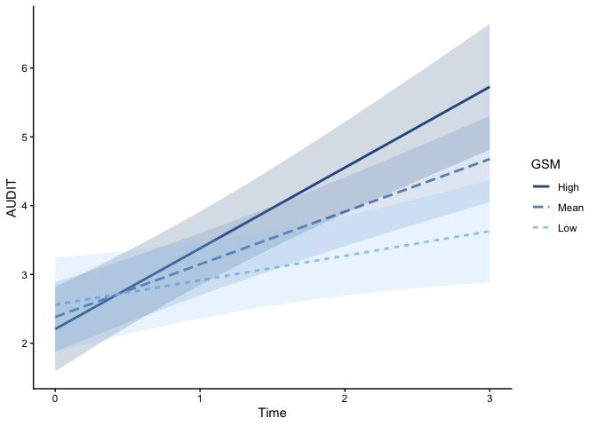<!-- -->

``` r
# Define GSM values
gsm_mean <- mean(df_long$GSM, na.rm = TRUE)
gsm_sd <- sd(df_long$GSM, na.rm = TRUE)
gsm_levels <- c(gsm_mean - gsm_sd, gsm_mean, gsm_mean + gsm_sd)

# Estimate simple slopes
slopes <- emtrends(
  socialMis.lme,
  var = "Time",
  specs = "GSM",
  at = list(GSM = gsm_levels))

# Pairwise comparisons of slopes
slope_contrasts <- contrast(slopes, method = "pairwise")
summary(slope_contrasts)
```

    ##  contrast                                  estimate    SE  df t.ratio p.value
    ##  GSM6.19797115661952 - GSM9.45891029810298   -0.409 0.126 307  -3.236  0.0038
    ##  GSM6.19797115661952 - GSM12.7198494395864   -0.817 0.253 307  -3.236  0.0038
    ##  GSM9.45891029810298 - GSM12.7198494395864   -0.409 0.126 307  -3.236  0.0038
    ## 
    ## Results are averaged over the levels of: sex 
    ## Degrees-of-freedom method: kenward-roger 
    ## P value adjustment: tukey method for comparing a family of 3 estimates

``` r
r.squaredGLMM(socialMis.lme) - r.squaredGLMM(concova.lme)
```

    ##             R2m        R2c
    ## [1,] 0.02752658 0.02446581

``` r
anova(concova.lme, socialMis.lme)
```

    ## Data: df_long
    ## Models:
    ## concova.lme: AUDIT ~ 1 + sex + AdChild + Time + (1 | mriID)
    ## socialMis.lme: AUDIT ~ 1 + sex + AdChild + GSM * Time + (1 | mriID)
    ##               npar    AIC    BIC  logLik -2*log(L)  Chisq Df Pr(>Chisq)    
    ## concova.lme      6 1809.1 1832.6 -898.56    1797.1                         
    ## socialMis.lme    8 1799.3 1830.6 -891.64    1783.3 13.832  2  0.0009919 ***
    ## ---
    ## Signif. codes:  0 '***' 0.001 '**' 0.01 '*' 0.05 '.' 0.1 ' ' 1

``` r
df_long <- df_long %>% rename(SocialMis = GSM)
# SocialMis doesn't have a significant main effect on AUDIT, but it interacts with time, as peopel with a greater SocialMis tend to have a greater increase in AUDIT over time.
```

## Step 5: Conditional model with growth curves, time-invariant covariates, time-varying predictor, and random slope

Now let’s make the slope to be random across participants.

``` r
randSlope.lme <- lmer(AUDIT ~ 1 + sex + AdChild + SocialMis*Time + (1 + Time | mriID), data = df_long, REML = FALSE, na.action = na.exclude)
summary(randSlope.lme)
```

    ## Linear mixed model fit by maximum likelihood . t-tests use Satterthwaite's method ['lmerModLmerTest']
    ## Formula: AUDIT ~ 1 + sex + AdChild + SocialMis * Time + (1 + Time | mriID)
    ##    Data: df_long
    ## 
    ##       AIC       BIC    logLik -2*log(L)  df.resid 
    ##    1790.2    1829.3    -885.1    1770.2       359 
    ## 
    ## Scaled residuals: 
    ##     Min      1Q  Median      3Q     Max 
    ## -2.7801 -0.4259 -0.1379  0.3254  4.0031 
    ## 
    ## Random effects:
    ##  Groups   Name        Variance Std.Dev. Corr
    ##  mriID    (Intercept) 3.9031   1.9756       
    ##           Time        0.4884   0.6988   0.35
    ##  Residual             3.8152   1.9533       
    ## Number of obs: 369, groups:  mriID, 133
    ## 
    ## Fixed effects:
    ##                 Estimate Std. Error        df t value Pr(>|t|)    
    ## (Intercept)      2.77032    0.65772 252.77396   4.212 3.52e-05 ***
    ## sex             -0.26329    0.48166 132.86423  -0.547   0.5855    
    ## AdChild          0.45949    0.25538 143.99729   1.799   0.0741 .  
    ## SocialMis       -0.03123    0.05996 252.05519  -0.521   0.6029    
    ## Time            -0.12823    0.38447 199.72946  -0.334   0.7391    
    ## SocialMis:Time   0.09912    0.04008 232.24897   2.473   0.0141 *  
    ## ---
    ## Signif. codes:  0 '***' 0.001 '**' 0.01 '*' 0.05 '.' 0.1 ' ' 1
    ## 
    ## Correlation of Fixed Effects:
    ##             (Intr) sex    AdChld SoclMs Time  
    ## sex         -0.232                            
    ## AdChild      0.139  0.251                     
    ## SocialMis   -0.903 -0.024 -0.210              
    ## Time        -0.610 -0.020 -0.119  0.660       
    ## SocialMs:Tm  0.575  0.028  0.123 -0.655 -0.942

``` r
randSlope.coef <- tidy(randSlope.lme, conf.int = TRUE)
randSlope.coef
```

    ## # A tibble: 10 × 10
    ##    effect   group    term                  estimate std.error statistic    df    p.value conf.low conf.high
    ##    <chr>    <chr>    <chr>                    <dbl>     <dbl>     <dbl> <dbl>      <dbl>    <dbl>     <dbl>
    ##  1 fixed    <NA>     (Intercept)             2.77      0.658      4.21   253.  0.0000352   1.48      4.07  
    ##  2 fixed    <NA>     sex                    -0.263     0.482     -0.547  133.  0.586      -1.22      0.689 
    ##  3 fixed    <NA>     AdChild                 0.459     0.255      1.80   144.  0.0741     -0.0453    0.964 
    ##  4 fixed    <NA>     SocialMis              -0.0312    0.0600    -0.521  252.  0.603      -0.149     0.0868
    ##  5 fixed    <NA>     Time                   -0.128     0.384     -0.334  200.  0.739      -0.886     0.630 
    ##  6 fixed    <NA>     SocialMis:Time          0.0991    0.0401     2.47   232.  0.0141      0.0202    0.178 
    ##  7 ran_pars mriID    sd__(Intercept)         1.98     NA         NA       NA  NA          NA        NA     
    ##  8 ran_pars mriID    cor__(Intercept).Time   0.353    NA         NA       NA  NA          NA        NA     
    ##  9 ran_pars mriID    sd__Time                0.699    NA         NA       NA  NA          NA        NA     
    ## 10 ran_pars Residual sd__Observation         1.95     NA         NA       NA  NA          NA        NA

``` r
# print(simple_slopes(randSlope.lme, pred = "Time", mod1 = SocialMis))
# print(interact_plot(randSlope.lme, pred = "Time", modx = SocialMis, interval = TRUE))

anova(socialMis.lme, randSlope.lme)
```

    ## Data: df_long
    ## Models:
    ## socialMis.lme: AUDIT ~ 1 + sex + AdChild + GSM * Time + (1 | mriID)
    ## randSlope.lme: AUDIT ~ 1 + sex + AdChild + SocialMis * Time + (1 + Time | mriID)
    ##               npar    AIC    BIC  logLik -2*log(L)  Chisq Df Pr(>Chisq)   
    ## socialMis.lme    8 1799.3 1830.6 -891.64    1783.3                        
    ## randSlope.lme   10 1790.2 1829.3 -885.08    1770.2 13.127  2   0.001411 **
    ## ---
    ## Signif. codes:  0 '***' 0.001 '**' 0.01 '*' 0.05 '.' 0.1 ' ' 1

``` r
# Although adding random slope works, we didn't do it in the following models because oflater convergence issues.
```

## Step 6a: Full model

Now let’s add the inhibition-related moderators one by one to the model.
This is now a conditional model with growth curves, time-invariant
covariates, time-varying predictor, time-invariant inhibition-related
moderators, and random intercept.

### Level 1

AUDIT<sub>ij</sub> = β<sub>0j</sub> + β<sub>1j</sub>Sex<sub>ij</sub> +
β<sub>2j</sub>AdChild<sub>ij</sub> + β<sub>3j</sub>Time<sub>ij</sub> +
e<sub>ij</sub>

### Level 2

β<sub>3j</sub> = γ<sub>10</sub> + γ<sub>11</sub>SocialMis<sub>j</sub> +
γ<sub>12</sub>Inhibition<sub>j</sub> + r<sub>2j</sub><br>

### Mixed model

AUDIT<sub>ij</sub> = β<sub>0j</sub> + β<sub>1j</sub>Sex<sub>ij</sub> +
β<sub>2j</sub>AdChild<sub>ij</sub> + (γ<sub>10</sub> +
γ<sub>11</sub>SocialMis<sub>j</sub> +
γ<sub>12</sub>Inhibition<sub>j</sub> + r<sub>2j</sub>) \*
Time<sub>ij</sub> + u<sub>ij</sub>

``` r
df_long <- df_long %>% rename(GSM = SocialMis)

moderators <- c("GoAcc", "GoRT", "StopAcc", "SSD", "SSRT", "pes_pse_psc", "pea_pse_psc", "ssgo_auditory", "ssgo_default", "ssgo_memoryRetrieval", "ssgo_visual", "fsgo_salience", "fsgo_subcortical")
#These variables are not examined becasue some of them have missing values, which can make different observations in models, then make the models not comparable. Also, they are not our variables of interest.
#"SUPPS_Impulsive", "BIS_Impulsive", "CDRISC_Resilience", "stateAnxiety", "traitAnxiety", "BDI_depression"

for (mod_var in moderators) {
  # Create model formula
  formula_str <- paste("AUDIT ~ 1 + sex + AdChild + GSM *", mod_var, "* Time + (1  | mriID)")
  model_formula <- as.formula(paste(formula_str, collapse = " "))

  cat("\nRunning model with moderator:", mod_var, "\n")
  full.lme <- lmer(model_formula, data = df_long, REML = FALSE, na.action = na.exclude)
  print(summary(full.lme))
  full.coef <- tidy(full.lme, conf.int = TRUE)
  print(full.coef)
  confint <- confint(full.lme)
  print(confint)

  delta_r2 <- r.squaredGLMM(full.lme) - r.squaredGLMM(socialMis.lme)
  print(delta_r2)
  model_compare <- anova(socialMis.lme, full.lme)
  print(model_compare)

  # Use tidy eval to pass variable names
  suppressWarnings(print(simple_slopes(full.lme, pred = "Time", levels=list('Time'=c(0, 1, 2, 3, 'sstest')))))
  print(interact_plot(full.lme, pred = "Time", modx = "GSM", mod2 = !!sym(mod_var), interval = TRUE))}
```

    ## 
    ## Running model with moderator: GoAcc 
    ## Linear mixed model fit by maximum likelihood . t-tests use Satterthwaite's method ['lmerModLmerTest']
    ## Formula: model_formula
    ##    Data: df_long
    ## 
    ##       AIC       BIC    logLik -2*log(L)  df.resid 
    ##    1797.3    1844.2    -886.6    1773.3       357 
    ## 
    ## Scaled residuals: 
    ##     Min      1Q  Median      3Q     Max 
    ## -2.6745 -0.4794 -0.1254  0.3664  4.2401 
    ## 
    ## Random effects:
    ##  Groups   Name        Variance Std.Dev.
    ##  mriID    (Intercept) 5.012    2.239   
    ##  Residual             4.369    2.090   
    ## Number of obs: 369, groups:  mriID, 133
    ## 
    ## Fixed effects:
    ##                  Estimate Std. Error         df t value Pr(>|t|)    
    ## (Intercept)      2.942857   0.705518 368.972866   4.171 3.78e-05 ***
    ## sex             -0.055532   0.512061 133.513059  -0.108  0.91380    
    ## AdChild          0.492633   0.265732 148.281809   1.854  0.06574 .  
    ## GSM             -0.060277   0.064747 344.848342  -0.931  0.35253    
    ## GoAcc            0.497027   0.966658 356.486572   0.514  0.60745    
    ## Time            -0.335810   0.369430 296.217994  -0.909  0.36409    
    ## GSM:GoAcc        0.007771   0.107630 321.743740   0.072  0.94249    
    ## GSM:Time         0.122646   0.039310 299.208752   3.120  0.00199 ** 
    ## GoAcc:Time      -1.092169   0.655643 302.169391  -1.666  0.09679 .  
    ## GSM:GoAcc:Time   0.072891   0.076513 290.959013   0.953  0.34155    
    ## ---
    ## Signif. codes:  0 '***' 0.001 '**' 0.01 '*' 0.05 '.' 0.1 ' ' 1
    ## 
    ## Correlation of Fixed Effects:
    ##             (Intr) sex    AdChld GSM    GoAcc  Time   GSM:GAc GSM:Tm GAcc:T
    ## sex         -0.234                                                         
    ## AdChild      0.090  0.256                                                  
    ## GSM         -0.891 -0.037 -0.155                                           
    ## GoAcc       -0.125  0.067  0.063  0.144                                    
    ## Time        -0.654 -0.032 -0.034  0.701  0.143                             
    ## GSM:GoAcc    0.109  0.024 -0.049 -0.186 -0.912 -0.176                      
    ## GSM:Time     0.594  0.048  0.030 -0.693 -0.177 -0.952  0.224               
    ## GoAcc:Time   0.099  0.033 -0.041 -0.164 -0.725 -0.215  0.779   0.243       
    ## GSM:GAcc:Tm -0.114 -0.028  0.048  0.188  0.707  0.218 -0.805  -0.273 -0.951
    ## # A tibble: 12 × 10
    ##    effect   group    term            estimate std.error statistic    df    p.value conf.low conf.high
    ##    <chr>    <chr>    <chr>              <dbl>     <dbl>     <dbl> <dbl>      <dbl>    <dbl>     <dbl>
    ##  1 fixed    <NA>     (Intercept)      2.94       0.706     4.17    369.  0.0000378   1.56      4.33  
    ##  2 fixed    <NA>     sex             -0.0555     0.512    -0.108   134.  0.914      -1.07      0.957 
    ##  3 fixed    <NA>     AdChild          0.493      0.266     1.85    148.  0.0657     -0.0325    1.02  
    ##  4 fixed    <NA>     GSM             -0.0603     0.0647   -0.931   345.  0.353      -0.188     0.0671
    ##  5 fixed    <NA>     GoAcc            0.497      0.967     0.514   356.  0.607      -1.40      2.40  
    ##  6 fixed    <NA>     Time            -0.336      0.369    -0.909   296.  0.364      -1.06      0.391 
    ##  7 fixed    <NA>     GSM:GoAcc        0.00777    0.108     0.0722  322.  0.942      -0.204     0.220 
    ##  8 fixed    <NA>     GSM:Time         0.123      0.0393    3.12    299.  0.00199     0.0453    0.200 
    ##  9 fixed    <NA>     GoAcc:Time      -1.09       0.656    -1.67    302.  0.0968     -2.38      0.198 
    ## 10 fixed    <NA>     GSM:GoAcc:Time   0.0729     0.0765    0.953   291.  0.342      -0.0777    0.223 
    ## 11 ran_pars mriID    sd__(Intercept)  2.24      NA        NA        NA  NA          NA        NA     
    ## 12 ran_pars Residual sd__Observation  2.09      NA        NA        NA  NA          NA        NA

    ## Computing profile confidence intervals ...

    ##                      2.5 %     97.5 %
    ## .sig01          1.88529503 2.64622730
    ## .sigma          1.91500861 2.29330899
    ## (Intercept)     1.55151550 4.33433196
    ## sex            -1.06720089 0.95462480
    ## AdChild        -0.03063323 1.01809880
    ## GSM            -0.18787604 0.06778223
    ## GoAcc          -1.40295017 2.39882483
    ## Time           -1.06176972 0.39189085
    ## GSM:GoAcc      -0.20421508 0.21928629
    ## GSM:Time        0.04511369 0.19990300
    ## GoAcc:Time     -2.38285286 0.19626537
    ## GSM:GoAcc:Time -0.07746964 0.22355712
    ##             R2m        R2c
    ## [1,] 0.01484971 0.01709204
    ## Data: df_long
    ## Models:
    ## socialMis.lme: AUDIT ~ 1 + sex + AdChild + GSM * Time + (1 | mriID)
    ## full.lme: model_formula
    ##               npar    AIC    BIC  logLik -2*log(L)  Chisq Df Pr(>Chisq)  
    ## socialMis.lme    8 1799.3 1830.6 -891.64    1783.3                       
    ## full.lme        12 1797.2 1844.2 -886.63    1773.2 10.035  4    0.03984 *
    ## ---
    ## Signif. codes:  0 '***' 0.001 '**' 0.01 '*' 0.05 '.' 0.1 ' ' 1
    ##          GSM     GoAcc   Time Test Estimate Std. Error       df t value  Pr(>|t|) Sig.
    ## 1   6.197971    sstest      0        0.5452     0.4511 279.0476  1.2085 0.2278736     
    ## 2    9.45891    sstest      0        0.5705     0.4198 237.0489  1.3589 0.1754691     
    ## 3  12.719849    sstest      0        0.5959     0.6288 362.4727  0.9476 0.3439529     
    ## 4     sstest -0.423402      0       -0.0636     0.0858 332.1416 -0.7406 0.4594360     
    ## 5     sstest  0.138887      0       -0.0592     0.0637 347.2457 -0.9295 0.3532514     
    ## 6     sstest  0.701176      0       -0.0548     0.0898 339.3914 -0.6103 0.5420529     
    ## 7   6.197971    sstest      1       -0.0952     0.4101 217.0741 -0.2321 0.8166613     
    ## 8    9.45891    sstest      1        0.1678     0.3888 164.5410  0.4317 0.6665577     
    ## 9  12.719849    sstest      1        0.4309     0.4723 243.4630  0.9124 0.3624835     
    ## 10    sstest -0.423402      1        0.0282     0.0562 332.4533  0.5020 0.6160046     
    ## 11    sstest  0.138887      1        0.0736     0.0471 352.0288  1.5604 0.1195609     
    ## 12    sstest  0.701176      1        0.1189     0.0627 346.3906  1.8972 0.0586320    .
    ## 13  6.197971    sstest      2       -0.7356     0.5096 307.7193 -1.4436 0.1498809     
    ## 14   9.45891    sstest      2       -0.2349     0.4778 252.7284 -0.4915 0.6234923     
    ## 15 12.719849    sstest      2        0.2659     0.6143 350.3810  0.4328 0.6654523     
    ## 16    sstest -0.423402      2        0.1200     0.0744 286.2432  1.6129 0.1078598     
    ## 17    sstest  0.138887      2        0.2063     0.0570 316.5462  3.6196 0.0003434  ***
    ## 18    sstest  0.701176      2        0.2927     0.0796 306.8893  3.6791 0.0002763  ***
    ## 19  6.197971    sstest      3       -1.3760     0.6913 366.3028 -1.9905 0.0472796    *
    ## 20   9.45891    sstest      3       -0.6376     0.6385 351.6466 -0.9985 0.3187448     
    ## 21 12.719849    sstest      3        0.1009     0.9266 355.6434  0.1089 0.9133784     
    ## 22    sstest -0.423402      3        0.2118     0.1204 278.8646  1.7592 0.0796460    .
    ## 23    sstest  0.138887      3        0.3391     0.0845 296.8025  4.0144 7.554e-05  ***
    ## 24    sstest  0.701176      3        0.4664     0.1236 290.8644  3.7749 0.0001940  ***
    ## 25  6.197971 -0.423402 sstest        0.6955     0.2035 300.7401  3.4168 0.0007207  ***
    ## 26   9.45891 -0.423402 sstest        0.9948     0.1709 287.4178  5.8207 1.563e-08  ***
    ## 27 12.719849 -0.423402 sstest        1.2941     0.2949 286.0293  4.3878 1.612e-05  ***
    ## 28  6.197971  0.138887 sstest        0.3354     0.1544 282.1475  2.1720 0.0306915    *
    ## 29   9.45891  0.138887 sstest        0.7684     0.1092 269.1362  7.0343 1.656e-11  ***
    ## 30 12.719849  0.138887 sstest        1.2013     0.1744 290.7213  6.8875 3.512e-11  ***
    ## 31  6.197971  0.701176 sstest       -0.0247     0.2153 298.4040 -0.1147 0.9087923     
    ## 32   9.45891  0.701176 sstest        0.5419     0.1643 281.9914  3.2991 0.0010946   **
    ## 33 12.719849  0.701176 sstest        1.1085     0.2778 285.5769  3.9904 8.389e-05  ***

    ## Warning: 0.701175831316252 is outside the observed range of GoAcc

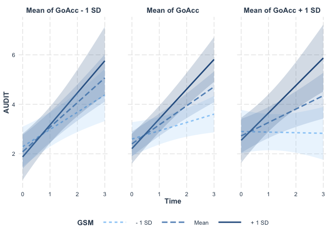<!-- -->

    ## 
    ## Running model with moderator: GoRT 
    ## Linear mixed model fit by maximum likelihood . t-tests use Satterthwaite's method ['lmerModLmerTest']
    ## Formula: model_formula
    ##    Data: df_long
    ## 
    ##       AIC       BIC    logLik -2*log(L)  df.resid 
    ##    1803.3    1850.2    -889.7    1779.3       357 
    ## 
    ## Scaled residuals: 
    ##     Min      1Q  Median      3Q     Max 
    ## -2.7108 -0.4606 -0.1412  0.3386  4.1850 
    ## 
    ## Random effects:
    ##  Groups   Name        Variance Std.Dev.
    ##  mriID    (Intercept) 5.017    2.240   
    ##  Residual             4.465    2.113   
    ## Number of obs: 369, groups:  mriID, 133
    ## 
    ## Fixed effects:
    ##                Estimate Std. Error        df t value Pr(>|t|)    
    ## (Intercept)     2.92179    0.71302 368.84018   4.098 5.13e-05 ***
    ## sex            -0.16925    0.51198 134.97383  -0.331  0.74147    
    ## AdChild         0.45658    0.26882 145.80797   1.698  0.09156 .  
    ## GSM            -0.04890    0.06507 351.27495  -0.752  0.45280    
    ## GoRT            0.04762    0.78045 368.93036   0.061  0.95138    
    ## Time           -0.37280    0.36909 300.84242  -1.010  0.31328    
    ## GSM:GoRT       -0.01148    0.07441 362.07850  -0.154  0.87749    
    ## GSM:Time        0.12090    0.03869 305.55468   3.125  0.00195 ** 
    ## GoRT:Time      -0.12240    0.43000 299.74542  -0.285  0.77611    
    ## GSM:GoRT:Time   0.03632    0.04556 302.89684   0.797  0.42598    
    ## ---
    ## Signif. codes:  0 '***' 0.001 '**' 0.01 '*' 0.05 '.' 0.1 ' ' 1
    ## 
    ## Correlation of Fixed Effects:
    ##             (Intr) sex    AdChld GSM    GoRT   Time   GSM:GoRT GSM:Tm GRT:Tm
    ## sex         -0.219                                                          
    ## AdChild      0.101  0.273                                                   
    ## GSM         -0.899 -0.038 -0.175                                            
    ## GoRT        -0.110 -0.129 -0.092  0.172                                     
    ## Time        -0.663 -0.019 -0.049  0.697  0.121                              
    ## GSM:GoRT     0.144  0.075  0.052 -0.184 -0.933 -0.135                       
    ## GSM:Time     0.602  0.039  0.051 -0.685 -0.132 -0.955  0.141                
    ## GoRT:Time    0.120 -0.005  0.040 -0.137 -0.665 -0.158  0.678    0.166       
    ## GSM:GoRT:Tm -0.127  0.003 -0.042  0.142  0.612  0.166 -0.666   -0.170 -0.961
    ## # A tibble: 12 × 10
    ##    effect   group    term            estimate std.error statistic    df    p.value conf.low conf.high
    ##    <chr>    <chr>    <chr>              <dbl>     <dbl>     <dbl> <dbl>      <dbl>    <dbl>     <dbl>
    ##  1 fixed    <NA>     (Intercept)       2.92      0.713     4.10    369.  0.0000513   1.52      4.32  
    ##  2 fixed    <NA>     sex              -0.169     0.512    -0.331   135.  0.741      -1.18      0.843 
    ##  3 fixed    <NA>     AdChild           0.457     0.269     1.70    146.  0.0916     -0.0747    0.988 
    ##  4 fixed    <NA>     GSM              -0.0489    0.0651   -0.752   351.  0.453      -0.177     0.0791
    ##  5 fixed    <NA>     GoRT              0.0476    0.780     0.0610  369.  0.951      -1.49      1.58  
    ##  6 fixed    <NA>     Time             -0.373     0.369    -1.01    301.  0.313      -1.10      0.354 
    ##  7 fixed    <NA>     GSM:GoRT         -0.0115    0.0744   -0.154   362.  0.877      -0.158     0.135 
    ##  8 fixed    <NA>     GSM:Time          0.121     0.0387    3.12    306.  0.00195     0.0448    0.197 
    ##  9 fixed    <NA>     GoRT:Time        -0.122     0.430    -0.285   300.  0.776      -0.969     0.724 
    ## 10 fixed    <NA>     GSM:GoRT:Time     0.0363    0.0456    0.797   303.  0.426      -0.0533    0.126 
    ## 11 ran_pars mriID    sd__(Intercept)   2.24     NA        NA        NA  NA          NA        NA     
    ## 12 ran_pars Residual sd__Observation   2.11     NA        NA        NA  NA          NA        NA

    ## Computing profile confidence intervals ...

    ##                     2.5 %     97.5 %
    ## .sig01         1.88048430 2.65357260
    ## .sigma         1.93531169 2.31932665
    ## (Intercept)    1.51763321 4.32622723
    ## sex           -1.18347688 0.83883345
    ## AdChild       -0.07300404 0.98791626
    ## GSM           -0.17691894 0.07938568
    ## GoRT          -1.49760908 1.59307812
    ## Time          -1.09823495 0.35336885
    ## GSM:GoRT      -0.15874513 0.13617268
    ## GSM:Time       0.04471962 0.19693154
    ## GoRT:Time     -0.96768523 0.72646390
    ## GSM:GoRT:Time -0.05365772 0.12588937
    ##             R2m         R2c
    ## [1,] 0.00800568 0.009317053
    ## Data: df_long
    ## Models:
    ## socialMis.lme: AUDIT ~ 1 + sex + AdChild + GSM * Time + (1 | mriID)
    ## full.lme: model_formula
    ##               npar    AIC    BIC  logLik -2*log(L)  Chisq Df Pr(>Chisq)
    ## socialMis.lme    8 1799.3 1830.6 -891.64    1783.3                     
    ## full.lme        12 1803.3 1850.2 -889.65    1779.3 3.9839  4     0.4082
    ##          GSM      GoRT   Time Test Estimate Std. Error       df t value  Pr(>|t|) Sig.
    ## 1   6.197971    sstest      0       -0.0235     0.3876 305.6848 -0.0607 0.9516297     
    ## 2    9.45891    sstest      0       -0.0610     0.2822 192.2678 -0.2161 0.8291629     
    ## 3  12.719849    sstest      0       -0.0984     0.3560 286.5373 -0.2764 0.7824562     
    ## 4     sstest -0.940238      0       -0.0381     0.1039 363.9288 -0.3667 0.7140889     
    ## 5     sstest -0.028319      0       -0.0486     0.0655 352.0498 -0.7418 0.4586987     
    ## 6     sstest    0.8836      0       -0.0590     0.0836 344.0640 -0.7066 0.4803148     
    ## 7   6.197971    sstest      1        0.0792     0.3172 210.4523  0.2495 0.8032037     
    ## 8    9.45891    sstest      1        0.1602     0.2568 130.4525  0.6236 0.5340057     
    ## 9  12.719849    sstest      1        0.2411     0.3116 211.8346  0.7739 0.4398350     
    ## 10    sstest -0.940238      1        0.0486     0.0755 358.9822  0.6443 0.5198160     
    ## 11    sstest -0.028319      1        0.0713     0.0480 351.7611  1.4853 0.1383576     
    ## 12    sstest    0.8836      1        0.0939     0.0637 359.8023  1.4756 0.1409344     
    ## 13  6.197971    sstest      2        0.1818     0.3369 261.3202  0.5397 0.5898502     
    ## 14   9.45891    sstest      2        0.3813     0.2848 176.5182  1.3387 0.1823954     
    ## 15 12.719849    sstest      2        0.5807     0.3884 323.2579  1.4952 0.1358363     
    ## 16    sstest -0.940238      2        0.1354     0.0916 303.3384  1.4780 0.1404499     
    ## 17    sstest -0.028319      2        0.1912     0.0579 310.7423  3.3024 0.0010705   **
    ## 18    sstest    0.8836      2        0.2469     0.0793 331.7470  3.1120 0.0020194   **
    ## 19  6.197971    sstest      3        0.2845     0.4346 362.6863  0.6547 0.5130527     
    ## 20   9.45891    sstest      3        0.6024     0.3536 294.6246  1.7033 0.0895576    .
    ## 21 12.719849    sstest      3        0.9202     0.5366 368.2881  1.7148 0.0872253    .
    ## 22    sstest -0.940238      3        0.2221     0.1374 286.4779  1.6168 0.1070121     
    ## 23    sstest -0.028319      3        0.3110     0.0862 293.6438  3.6085 0.0003619  ***
    ## 24    sstest    0.8836      3        0.3999     0.1171 305.2649  3.4153 0.0007233  ***
    ## 25  6.197971 -0.940238 sstest        0.2800     0.2376 295.8283  1.1785 0.2395386     
    ## 26   9.45891 -0.940238 sstest        0.5629     0.1545 272.6549  3.6420 0.0003237  ***
    ## 27 12.719849 -0.940238 sstest        0.8458     0.2724 301.3712  3.1046 0.0020863   **
    ## 28  6.197971 -0.028319 sstest        0.3736     0.1575 284.8874  2.3718 0.0183679    *
    ## 29   9.45891 -0.028319 sstest        0.7645     0.1101 267.4732  6.9429 2.906e-11  ***
    ## 30 12.719849 -0.028319 sstest        1.1554     0.1780 293.6415  6.4923 3.596e-10  ***
    ## 31  6.197971    0.8836 sstest        0.4673     0.2125 273.1831  2.1993 0.0286927    *
    ## 32   9.45891    0.8836 sstest        0.9661     0.1559 265.4392  6.1961 2.198e-09  ***
    ## 33 12.719849    0.8836 sstest        1.4650     0.2419 282.8420  6.0573 4.399e-09  ***

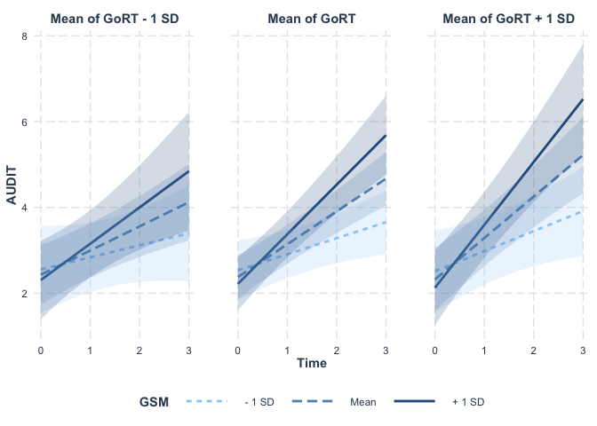<!-- -->

    ## 
    ## Running model with moderator: StopAcc 
    ## Linear mixed model fit by maximum likelihood . t-tests use Satterthwaite's method ['lmerModLmerTest']
    ## Formula: model_formula
    ##    Data: df_long
    ## 
    ##       AIC       BIC    logLik -2*log(L)  df.resid 
    ##    1803.1    1850.0    -889.5    1779.1       357 
    ## 
    ## Scaled residuals: 
    ##     Min      1Q  Median      3Q     Max 
    ## -2.7271 -0.4606 -0.1426  0.3374  4.2268 
    ## 
    ## Random effects:
    ##  Groups   Name        Variance Std.Dev.
    ##  mriID    (Intercept) 5.037    2.244   
    ##  Residual             4.455    2.111   
    ## Number of obs: 369, groups:  mriID, 133
    ## 
    ## Fixed effects:
    ##                   Estimate Std. Error        df t value Pr(>|t|)    
    ## (Intercept)        2.94204    0.71419 368.72557   4.119 4.69e-05 ***
    ## sex               -0.15473    0.51304 132.35724  -0.302  0.76344    
    ## AdChild            0.46511    0.27163 147.87054   1.712  0.08894 .  
    ## GSM               -0.05446    0.06497 349.11612  -0.838  0.40245    
    ## StopAcc            0.49730    0.97345 368.43910   0.511  0.60975    
    ## Time              -0.35587    0.36578 296.35002  -0.973  0.33140    
    ## GSM:StopAcc       -0.07576    0.09199 363.50287  -0.824  0.41074    
    ## GSM:Time           0.12061    0.03828 301.00467   3.151  0.00179 ** 
    ## StopAcc:Time      -0.20026    0.50755 290.52454  -0.395  0.69345    
    ## GSM:StopAcc:Time   0.05002    0.05216 290.19060   0.959  0.33843    
    ## ---
    ## Signif. codes:  0 '***' 0.001 '**' 0.01 '*' 0.05 '.' 0.1 ' ' 1
    ## 
    ## Correlation of Fixed Effects:
    ##             (Intr) sex    AdChld GSM    StpAcc Time   GSM:StA GSM:Tm StpA:T
    ## sex         -0.240                                                         
    ## AdChild      0.101  0.274                                                  
    ## GSM         -0.895 -0.024 -0.186                                           
    ## StopAcc      0.121 -0.135 -0.047 -0.081                                    
    ## Time        -0.654 -0.021 -0.055  0.689 -0.004                             
    ## GSM:StopAcc -0.104  0.071 -0.012  0.108 -0.929  0.002                      
    ## GSM:Time     0.590  0.041  0.058 -0.677 -0.020 -0.953  0.013               
    ## StopAcc:Tim  0.003  0.022  0.049 -0.016 -0.663 -0.030  0.664   0.059       
    ## GSM:StpAc:T -0.028 -0.019 -0.059  0.034  0.590  0.059 -0.635  -0.077 -0.951
    ## # A tibble: 12 × 10
    ##    effect   group    term             estimate std.error statistic    df    p.value conf.low conf.high
    ##    <chr>    <chr>    <chr>               <dbl>     <dbl>     <dbl> <dbl>      <dbl>    <dbl>     <dbl>
    ##  1 fixed    <NA>     (Intercept)        2.94      0.714      4.12   369.  0.0000469   1.54      4.35  
    ##  2 fixed    <NA>     sex               -0.155     0.513     -0.302  132.  0.763      -1.17      0.860 
    ##  3 fixed    <NA>     AdChild            0.465     0.272      1.71   148.  0.0889     -0.0717    1.00  
    ##  4 fixed    <NA>     GSM               -0.0545    0.0650    -0.838  349.  0.402      -0.182     0.0733
    ##  5 fixed    <NA>     StopAcc            0.497     0.973      0.511  368.  0.610      -1.42      2.41  
    ##  6 fixed    <NA>     Time              -0.356     0.366     -0.973  296.  0.331      -1.08      0.364 
    ##  7 fixed    <NA>     GSM:StopAcc       -0.0758    0.0920    -0.824  364.  0.411      -0.257     0.105 
    ##  8 fixed    <NA>     GSM:Time           0.121     0.0383     3.15   301.  0.00179     0.0453    0.196 
    ##  9 fixed    <NA>     StopAcc:Time      -0.200     0.508     -0.395  291.  0.693      -1.20      0.799 
    ## 10 fixed    <NA>     GSM:StopAcc:Time   0.0500    0.0522     0.959  290.  0.338      -0.0526    0.153 
    ## 11 ran_pars mriID    sd__(Intercept)    2.24     NA         NA       NA  NA          NA        NA     
    ## 12 ran_pars Residual sd__Observation    2.11     NA         NA       NA  NA          NA        NA

    ## Computing profile confidence intervals ...

    ##                        2.5 %     97.5 %
    ## .sig01            1.88377996 2.65908794
    ## .sigma            1.93298675 2.31703555
    ## (Intercept)       1.53107140 4.35356781
    ## sex              -1.17057178 0.85590104
    ## AdChild          -0.06939573 1.00301006
    ## GSM              -0.18272231 0.07430022
    ## StopAcc          -1.43332644 2.42896463
    ## Time             -1.07467148 0.36452829
    ## GSM:StopAcc      -0.25832856 0.10733133
    ## GSM:Time          0.04516731 0.19583300
    ## StopAcc:Time     -1.19778756 0.80137780
    ## GSM:StopAcc:Time -0.05279765 0.15251984
    ##              R2m         R2c
    ## [1,] 0.004337851 0.008970232
    ## Data: df_long
    ## Models:
    ## socialMis.lme: AUDIT ~ 1 + sex + AdChild + GSM * Time + (1 | mriID)
    ## full.lme: model_formula
    ##               npar    AIC    BIC  logLik -2*log(L) Chisq Df Pr(>Chisq)
    ## socialMis.lme    8 1799.3 1830.6 -891.64    1783.3                    
    ## full.lme        12 1803.1 1850.0 -889.54    1779.1 4.207  4     0.3787
    ##          GSM   StopAcc   Time Test Estimate Std. Error       df t value  Pr(>|t|) Sig.
    ## 1   6.197971    sstest      0        0.0277     0.4913 297.6385  0.0565 0.9550141     
    ## 2    9.45891    sstest      0       -0.2193     0.3617 187.3861 -0.6063 0.5450524     
    ## 3  12.719849    sstest      0       -0.4664     0.4476 274.7615 -1.0420 0.2983185     
    ## 4     sstest -0.829884      0        0.0084     0.0948 359.4789  0.0888 0.9293035     
    ## 5     sstest -0.109118      0       -0.0462     0.0647 349.5898 -0.7144 0.4754467     
    ## 6     sstest  0.611648      0       -0.1008     0.0904 355.5473 -1.1148 0.2656835     
    ## 7   6.197971    sstest      1        0.1375     0.3970 193.1176  0.3463 0.7294999     
    ## 8    9.45891    sstest      1        0.0535     0.3287 127.5071  0.1628 0.8709101     
    ## 9  12.719849    sstest      1       -0.0304     0.4083 201.7590 -0.0745 0.9406603     
    ## 10    sstest -0.829884      1        0.0875     0.0689 358.4931  1.2710 0.2045511     
    ## 11    sstest -0.109118      1        0.0690     0.0473 350.8008  1.4579 0.1457653     
    ## 12    sstest  0.611648      1        0.0504     0.0708 368.9907  0.7115 0.4772400     
    ## 13  6.197971    sstest      2        0.2472     0.4169 237.7725  0.5930 0.5537527     
    ## 14   9.45891    sstest      2        0.3264     0.3669 176.8040  0.8896 0.3748957     
    ## 15 12.719849    sstest      2        0.4055     0.4975 296.0208  0.8151 0.4156681     
    ## 16    sstest -0.829884      2        0.1666     0.0877 311.9531  1.8998 0.0583841    .
    ## 17    sstest -0.109118      2        0.1841     0.0579 312.1828  3.1779 0.0016318   **
    ## 18    sstest  0.611648      2        0.2016     0.0803 360.7774  2.5099 0.0125150    *
    ## 19  6.197971    sstest      3        0.3570     0.5385 356.4892  0.6629 0.5078348     
    ## 20   9.45891    sstest      3        0.5992     0.4588 296.9130  1.3061 0.1925396     
    ## 21 12.719849    sstest      3        0.8414     0.6654 367.2319  1.2645 0.2068358     
    ## 22    sstest -0.829884      3        0.2457     0.1335 295.4851  1.8401 0.0667542    .
    ## 23    sstest -0.109118      3        0.2993     0.0868 295.7293  3.4470 0.0006491  ***
    ## 24    sstest  0.611648      3        0.3528     0.1117 325.0365  3.1588 0.0017332   **
    ## 25  6.197971 -0.829884 sstest        0.3006     0.2337 294.4219  1.2862 0.1993800     
    ## 26   9.45891 -0.829884 sstest        0.5586     0.1602 275.4454  3.4856 0.0005712  ***
    ## 27 12.719849 -0.829884 sstest        0.8165     0.2705 298.0806  3.0183 0.0027618   **
    ## 28  6.197971 -0.109118 sstest        0.3797     0.1569 283.8887  2.4199 0.0161547    *
    ## 29   9.45891 -0.109118 sstest        0.7552     0.1103 267.1445  6.8483 5.126e-11  ***
    ## 30 12.719849 -0.109118 sstest        1.1307     0.1796 293.2319  6.2949 1.120e-09  ***
    ## 31  6.197971  0.611648 sstest        0.4588     0.2158 274.7367  2.1264 0.0343595    *
    ## 32   9.45891  0.611648 sstest        0.9519     0.1558 269.7290  6.1091 3.487e-09  ***
    ## 33 12.719849  0.611648 sstest        1.4449     0.2254 273.6443  6.4104 6.333e-10  ***

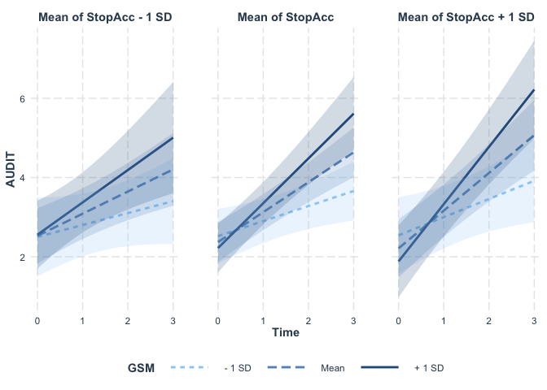<!-- -->

    ## 
    ## Running model with moderator: SSD 
    ## Linear mixed model fit by maximum likelihood . t-tests use Satterthwaite's method ['lmerModLmerTest']
    ## Formula: model_formula
    ##    Data: df_long
    ## 
    ##       AIC       BIC    logLik -2*log(L)  df.resid 
    ##    1803.6    1850.6    -889.8    1779.6       357 
    ## 
    ## Scaled residuals: 
    ##     Min      1Q  Median      3Q     Max 
    ## -2.6597 -0.4592 -0.1367  0.3349  4.1883 
    ## 
    ## Random effects:
    ##  Groups   Name        Variance Std.Dev.
    ##  mriID    (Intercept) 5.088    2.256   
    ##  Residual             4.448    2.109   
    ## Number of obs: 369, groups:  mriID, 133
    ## 
    ## Fixed effects:
    ##               Estimate Std. Error        df t value Pr(>|t|)    
    ## (Intercept)    2.87283    0.71517 368.68716   4.017 7.15e-05 ***
    ## sex           -0.18510    0.51406 134.37115  -0.360  0.71936    
    ## AdChild        0.46055    0.27039 145.81523   1.703  0.09064 .  
    ## GSM           -0.04322    0.06533 353.15701  -0.662  0.50868    
    ## SSD            0.39681    0.74467 368.93848   0.533  0.59445    
    ## Time          -0.37620    0.37233 302.48478  -1.010  0.31311    
    ## GSM:SSD       -0.05372    0.07123 359.45986  -0.754  0.45120    
    ## GSM:Time       0.12015    0.03910 307.08392   3.073  0.00231 ** 
    ## SSD:Time      -0.04043    0.38822 298.41211  -0.104  0.91713    
    ## GSM:SSD:Time   0.02353    0.04079 301.97870   0.577  0.56438    
    ## ---
    ## Signif. codes:  0 '***' 0.001 '**' 0.01 '*' 0.05 '.' 0.1 ' ' 1
    ## 
    ## Correlation of Fixed Effects:
    ##             (Intr) sex    AdChld GSM    SSD    Time   GSM:SSD GSM:Tm SSD:Tm
    ## sex         -0.215                                                         
    ## AdChild      0.107  0.275                                                  
    ## GSM         -0.900 -0.040 -0.180                                           
    ## SSD         -0.140 -0.128 -0.112  0.196                                    
    ## Time        -0.662 -0.018 -0.054  0.696  0.139                             
    ## GSM:SSD      0.166  0.073  0.073 -0.204 -0.937 -0.149                      
    ## GSM:Time     0.602  0.037  0.056 -0.683 -0.147 -0.956  0.154               
    ## SSD:Time     0.142  0.001  0.053 -0.159 -0.679 -0.210  0.693   0.219       
    ## GSM:SSD:Tim -0.148  0.000 -0.052  0.163  0.633  0.218 -0.686  -0.229 -0.962
    ## # A tibble: 12 × 10
    ##    effect   group    term            estimate std.error statistic    df    p.value conf.low conf.high
    ##    <chr>    <chr>    <chr>              <dbl>     <dbl>     <dbl> <dbl>      <dbl>    <dbl>     <dbl>
    ##  1 fixed    <NA>     (Intercept)       2.87      0.715      4.02   369.  0.0000715   1.47      4.28  
    ##  2 fixed    <NA>     sex              -0.185     0.514     -0.360  134.  0.719      -1.20      0.832 
    ##  3 fixed    <NA>     AdChild           0.461     0.270      1.70   146.  0.0906     -0.0738    0.995 
    ##  4 fixed    <NA>     GSM              -0.0432    0.0653    -0.662  353.  0.509      -0.172     0.0853
    ##  5 fixed    <NA>     SSD               0.397     0.745      0.533  369.  0.594      -1.07      1.86  
    ##  6 fixed    <NA>     Time             -0.376     0.372     -1.01   302.  0.313      -1.11      0.356 
    ##  7 fixed    <NA>     GSM:SSD          -0.0537    0.0712    -0.754  359.  0.451      -0.194     0.0864
    ##  8 fixed    <NA>     GSM:Time          0.120     0.0391     3.07   307.  0.00231     0.0432    0.197 
    ##  9 fixed    <NA>     SSD:Time         -0.0404    0.388     -0.104  298.  0.917      -0.804     0.724 
    ## 10 fixed    <NA>     GSM:SSD:Time      0.0235    0.0408     0.577  302.  0.564      -0.0567    0.104 
    ## 11 ran_pars mriID    sd__(Intercept)   2.26     NA         NA       NA  NA          NA        NA     
    ## 12 ran_pars Residual sd__Observation   2.11     NA         NA       NA  NA          NA        NA

    ## Computing profile confidence intervals ...

    ##                    2.5 %     97.5 %
    ## .sig01        1.89590781 2.66987706
    ## .sigma        1.93178397 2.31497115
    ## (Intercept)   1.46479071 4.28124722
    ## sex          -1.20326285 0.82722384
    ## AdChild      -0.07225017 0.99479510
    ## GSM          -0.17173493 0.08555043
    ## SSD          -1.07559342 1.86876768
    ## Time         -1.10800244 0.35626416
    ## GSM:SSD      -0.19443832 0.08738253
    ## GSM:Time      0.04317977 0.19698888
    ## SSD:Time     -0.80338499 0.72515152
    ## GSM:SSD:Time -0.05692674 0.10370208
    ##              R2m        R2c
    ## [1,] 0.004365657 0.01153708
    ## Data: df_long
    ## Models:
    ## socialMis.lme: AUDIT ~ 1 + sex + AdChild + GSM * Time + (1 | mriID)
    ## full.lme: model_formula
    ##               npar    AIC    BIC  logLik -2*log(L)  Chisq Df Pr(>Chisq)
    ## socialMis.lme    8 1799.3 1830.6 -891.64    1783.3                     
    ## full.lme        12 1803.6 1850.6 -889.82    1779.6 3.6523  4     0.4551
    ##          GSM       SSD   Time Test Estimate Std. Error       df t value  Pr(>|t|) Sig.
    ## 1   6.197971    sstest      0        0.0638     0.3654 311.6083  0.1747 0.8614291     
    ## 2    9.45891    sstest      0       -0.1114     0.2617 192.1161 -0.4255 0.6709349     
    ## 3  12.719849    sstest      0       -0.2865     0.3337 293.3534 -0.8587 0.3912330     
    ## 4     sstest -0.977399      0        0.0093     0.1047 365.1972  0.0887 0.9293522     
    ## 5     sstest  0.016207      0       -0.0441     0.0651 352.6135 -0.6772 0.4987040     
    ## 6     sstest  1.009812      0       -0.0975     0.0867 336.4630 -1.1236 0.2619670     
    ## 7   6.197971    sstest      1        0.1693     0.2988 217.1817  0.5665 0.5716217     
    ## 8    9.45891    sstest      1        0.0708     0.2381 129.8060  0.2975 0.7665615     
    ## 9  12.719849    sstest      1       -0.0276     0.2874 211.0022 -0.0961 0.9235289     
    ## 10    sstest -0.977399      1        0.1064     0.0762 358.9617  1.3963 0.1634812     
    ## 11    sstest  0.016207      1        0.0764     0.0479 351.0183  1.5971 0.1111348     
    ## 12    sstest  1.009812      1        0.0464     0.0648 356.5689  0.7164 0.4742381     
    ## 13  6.197971    sstest      2        0.2747     0.3110 256.7183  0.8834 0.3778729     
    ## 14   9.45891    sstest      2        0.2530     0.2603 167.8848  0.9719 0.3324898     
    ## 15 12.719849    sstest      2        0.2313     0.3446 307.4669  0.6713 0.5025427     
    ## 16    sstest -0.977399      2        0.2036     0.0912 301.2901  2.2326 0.0263068    *
    ## 17    sstest  0.016207      2        0.1970     0.0581 308.7388  3.3886 0.0007935  ***
    ## 18    sstest  1.009812      2        0.1904     0.0766 332.3560  2.4865 0.0133929    *
    ## 19  6.197971    sstest      3        0.3801     0.3947 359.5568  0.9630 0.3361826     
    ## 20   9.45891    sstest      3        0.4352     0.3190 279.8872  1.3643 0.1735739     
    ## 21 12.719849    sstest      3        0.4902     0.4688 368.9837  1.0458 0.2963487     
    ## 22    sstest -0.977399      3        0.3007     0.1359 285.0534  2.2121 0.0277503    *
    ## 23    sstest  0.016207      3        0.3175     0.0866 292.5041  3.6658 0.0002928  ***
    ## 24    sstest  1.009812      3        0.3343     0.1118 303.1558  2.9904 0.0030150   **
    ## 25  6.197971 -0.977399 sstest        0.2654     0.2363 296.6986  1.1232 0.2622680     
    ## 26   9.45891 -0.977399 sstest        0.5822     0.1534 272.5556  3.7961 0.0001812  ***
    ## 27 12.719849 -0.977399 sstest        0.8990     0.2696 304.1220  3.3347 0.0009596  ***
    ## 28  6.197971  0.016207 sstest        0.3702     0.1572 285.0316  2.3543 0.0192347    *
    ## 29   9.45891  0.016207 sstest        0.7632     0.1100 267.1548  6.9380 3.001e-11  ***
    ## 30 12.719849  0.016207 sstest        1.1563     0.1782 293.6401  6.4889 3.669e-10  ***
    ## 31  6.197971  1.009812 sstest        0.4750     0.2112 270.4156  2.2487 0.0253367    *
    ## 32   9.45891  1.009812 sstest        0.9443     0.1526 263.2408  6.1879 2.324e-09  ***
    ## 33 12.719849  1.009812 sstest        1.4136     0.2343 277.7266  6.0336 5.110e-09  ***

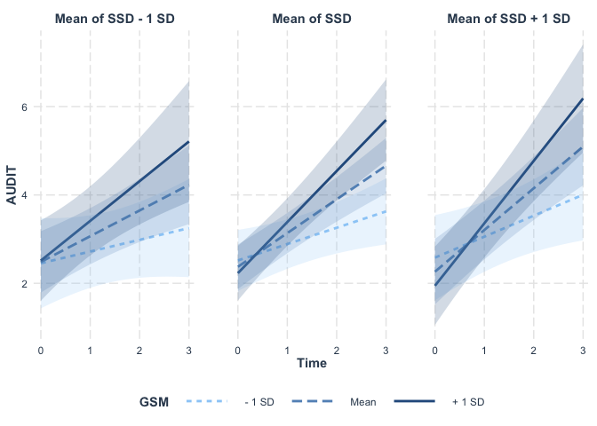<!-- -->

    ## 
    ## Running model with moderator: SSRT 
    ## Linear mixed model fit by maximum likelihood . t-tests use Satterthwaite's method ['lmerModLmerTest']
    ## Formula: model_formula
    ##    Data: df_long
    ## 
    ##       AIC       BIC    logLik -2*log(L)  df.resid 
    ##    1800.4    1847.3    -888.2    1776.4       357 
    ## 
    ## Scaled residuals: 
    ##     Min      1Q  Median      3Q     Max 
    ## -3.2525 -0.4660 -0.1715  0.3559  4.1635 
    ## 
    ## Random effects:
    ##  Groups   Name        Variance Std.Dev.
    ##  mriID    (Intercept) 4.864    2.205   
    ##  Residual             4.466    2.113   
    ## Number of obs: 369, groups:  mriID, 133
    ## 
    ## Fixed effects:
    ##                Estimate Std. Error        df t value Pr(>|t|)    
    ## (Intercept)     3.01282    0.70996 368.95947   4.244 2.78e-05 ***
    ## sex            -0.14350    0.49425 134.10549  -0.290  0.77200    
    ## AdChild         0.50115    0.26554 149.29421   1.887  0.06107 .  
    ## GSM            -0.05941    0.06461 350.47997  -0.919  0.35851    
    ## SSRT           -1.38843    0.87635 366.05955  -1.584  0.11398    
    ## Time           -0.36632    0.37722 304.28762  -0.971  0.33227    
    ## GSM:SSRT        0.15300    0.07696 341.11085   1.988  0.04760 *  
    ## GSM:Time        0.12261    0.04028 309.45124   3.044  0.00254 ** 
    ## SSRT:Time       0.88078    0.43430 288.45758   2.028  0.04348 *  
    ## GSM:SSRT:Time  -0.07097    0.04317 292.45653  -1.644  0.10123    
    ## ---
    ## Signif. codes:  0 '***' 0.001 '**' 0.01 '*' 0.05 '.' 0.1 ' ' 1
    ## 
    ## Correlation of Fixed Effects:
    ##             (Intr) sex    AdChld GSM    SSRT   Time   GSM:SSRT GSM:Tm SSRT:T
    ## sex         -0.225                                                          
    ## AdChild      0.121  0.245                                                   
    ## GSM         -0.902 -0.020 -0.180                                            
    ## SSRT         0.044 -0.012  0.073 -0.012                                     
    ## Time        -0.661 -0.013 -0.059  0.696 -0.081                              
    ## GSM:SSRT    -0.009  0.001 -0.032 -0.010 -0.922  0.081                       
    ## GSM:Time     0.596  0.029  0.063 -0.679  0.079 -0.954 -0.087                
    ## SSRT:Time   -0.080  0.001 -0.048  0.075 -0.698  0.199  0.715   -0.204       
    ## GSM:SSRT:Tm  0.089 -0.005  0.050 -0.093  0.635 -0.233 -0.709    0.267 -0.937
    ## # A tibble: 12 × 10
    ##    effect   group    term            estimate std.error statistic    df    p.value conf.low conf.high
    ##    <chr>    <chr>    <chr>              <dbl>     <dbl>     <dbl> <dbl>      <dbl>    <dbl>     <dbl>
    ##  1 fixed    <NA>     (Intercept)       3.01      0.710      4.24   369.  0.0000278  1.62       4.41  
    ##  2 fixed    <NA>     sex              -0.144     0.494     -0.290  134.  0.772     -1.12       0.834 
    ##  3 fixed    <NA>     AdChild           0.501     0.266      1.89   149.  0.0611    -0.0236     1.03  
    ##  4 fixed    <NA>     GSM              -0.0594    0.0646    -0.919  350.  0.359     -0.186      0.0677
    ##  5 fixed    <NA>     SSRT             -1.39      0.876     -1.58   366.  0.114     -3.11       0.335 
    ##  6 fixed    <NA>     Time             -0.366     0.377     -0.971  304.  0.332     -1.11       0.376 
    ##  7 fixed    <NA>     GSM:SSRT          0.153     0.0770     1.99   341.  0.0476     0.00162    0.304 
    ##  8 fixed    <NA>     GSM:Time          0.123     0.0403     3.04   309.  0.00254    0.0433     0.202 
    ##  9 fixed    <NA>     SSRT:Time         0.881     0.434      2.03   288.  0.0435     0.0260     1.74  
    ## 10 fixed    <NA>     GSM:SSRT:Time    -0.0710    0.0432    -1.64   292.  0.101     -0.156      0.0140
    ## 11 ran_pars mriID    sd__(Intercept)   2.21     NA         NA       NA  NA         NA         NA     
    ## 12 ran_pars Residual sd__Observation   2.11     NA         NA       NA  NA         NA         NA

    ## Computing profile confidence intervals ...

    ##                      2.5 %     97.5 %
    ## .sig01         1.853282424 2.61056850
    ## .sigma         1.936636648 2.31829700
    ## (Intercept)    1.613691019 4.41211551
    ## sex           -1.120329700 0.83116192
    ## AdChild       -0.021643383 1.02637548
    ## GSM           -0.186651491 0.06818675
    ## SSRT          -3.111765429 0.33420500
    ## Time          -1.107631762 0.37605648
    ## GSM:SSRT       0.001761981 0.30441552
    ## GSM:Time       0.043268265 0.20177242
    ## SSRT:Time      0.027334114 1.73700168
    ## GSM:SSRT:Time -0.156117193 0.01386170
    ##              R2m         R2c
    ## [1,] 0.009868867 0.003243704
    ## Data: df_long
    ## Models:
    ## socialMis.lme: AUDIT ~ 1 + sex + AdChild + GSM * Time + (1 | mriID)
    ## full.lme: model_formula
    ##               npar    AIC    BIC  logLik -2*log(L) Chisq Df Pr(>Chisq)
    ## socialMis.lme    8 1799.3 1830.6 -891.64    1783.3                    
    ## full.lme        12 1800.4 1847.3 -888.21    1776.4 6.877  4     0.1425
    ##          GSM      SSRT   Time Test Estimate Std. Error       df t value  Pr(>|t|) Sig.
    ## 1   6.197971    sstest      0       -0.4402     0.4744 328.0838 -0.9279  0.354154     
    ## 2    9.45891    sstest      0        0.0588     0.3494 211.6059  0.1682  0.866611     
    ## 3  12.719849    sstest      0        0.5577     0.3808 258.1448  1.4644  0.144306     
    ## 4     sstest -0.862063      0       -0.1913     0.0931 338.3481 -2.0552  0.040623    *
    ## 5     sstest -0.126384      0       -0.0787     0.0654 348.3046 -1.2033  0.229675     
    ## 6     sstest  0.609296      0        0.0338     0.0794 353.6914  0.4256  0.670627     
    ## 7   6.197971    sstest      1        0.0007     0.3865 229.4690  0.0019  0.998490     
    ## 8    9.45891    sstest      1        0.2682     0.3145 140.4195  0.8528  0.395242     
    ## 9  12.719849    sstest      1        0.5357     0.3374 170.1979  1.5878  0.114179     
    ## 10    sstest -0.862063      1       -0.0075     0.0689 361.3519 -0.1090  0.913280     
    ## 11    sstest -0.126384      1        0.0528     0.0484 353.3914  1.0924  0.275382     
    ## 12    sstest  0.609296      1        0.1132     0.0571 340.1134  1.9819  0.048297    *
    ## 13  6.197971    sstest      2        0.4416     0.3980 253.9123  1.1095  0.268260     
    ## 14   9.45891    sstest      2        0.4777     0.3486 184.1708  1.3703  0.172250     
    ## 15 12.719849    sstest      2        0.5137     0.4106 263.8924  1.2510  0.212033     
    ## 16    sstest -0.862063      2        0.1763     0.0724 347.4463  2.4361  0.015348    *
    ## 17    sstest -0.126384      2        0.1844     0.0589 320.5088  3.1322  0.001895   **
    ## 18    sstest  0.609296      2        0.1925     0.0773 297.1319  2.4912  0.013278    *
    ## 19  6.197971    sstest      3        0.8825     0.5022 355.0497  1.7575  0.079698    .
    ## 20   9.45891    sstest      3        0.6871     0.4357 299.0482  1.5772  0.115808     
    ## 21 12.719849    sstest      3        0.4917     0.5563 361.2739  0.8840  0.377284     
    ## 22    sstest -0.862063      3        0.3601     0.1007 309.4175  3.5758  0.000405  ***
    ## 23    sstest -0.126384      3        0.3160     0.0875 301.8721  3.6096  0.000359  ***
    ## 24    sstest  0.609296      3        0.2719     0.1202 294.3645  2.2621  0.024423    *
    ## 25  6.197971 -0.862063 sstest        0.0135     0.2196 272.7487  0.0616  0.950904     
    ## 26   9.45891 -0.862063 sstest        0.6129     0.1502 266.4634  4.0814 5.921e-05  ***
    ## 27 12.719849 -0.862063 sstest        1.2122     0.2092 271.4542  5.7934 1.907e-08  ***
    ## 28  6.197971 -0.126384 sstest        0.3379     0.1561 283.9723  2.1640  0.031297    *
    ## 29   9.45891 -0.126384 sstest        0.7670     0.1115 272.1427  6.8781 4.155e-11  ***
    ## 30 12.719849 -0.126384 sstest        1.1960     0.1820 295.8425  6.5706 2.256e-10  ***
    ## 31  6.197971  0.609296 sstest        0.6622     0.2153 294.1377  3.0756  0.002299   **
    ## 32   9.45891  0.609296 sstest        0.9211     0.1645 285.6629  5.5991 5.057e-08  ***
    ## 33 12.719849  0.609296 sstest        1.1799     0.2627 307.6381  4.4905 1.006e-05  ***

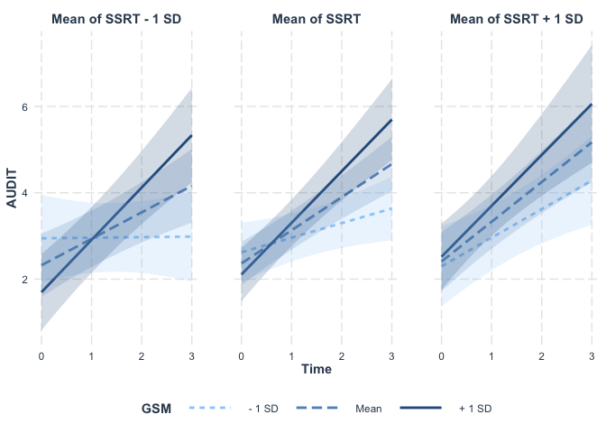<!-- -->

    ## 
    ## Running model with moderator: pes_pse_psc 
    ## Linear mixed model fit by maximum likelihood . t-tests use Satterthwaite's method ['lmerModLmerTest']
    ## Formula: model_formula
    ##    Data: df_long
    ## 
    ##       AIC       BIC    logLik -2*log(L)  df.resid 
    ##    1799.3    1846.2    -887.7    1775.3       357 
    ## 
    ## Scaled residuals: 
    ##     Min      1Q  Median      3Q     Max 
    ## -2.7657 -0.4469 -0.1210  0.3867  4.4077 
    ## 
    ## Random effects:
    ##  Groups   Name        Variance Std.Dev.
    ##  mriID    (Intercept) 4.989    2.234   
    ##  Residual             4.409    2.100   
    ## Number of obs: 369, groups:  mriID, 133
    ## 
    ## Fixed effects:
    ##                       Estimate Std. Error        df t value Pr(>|t|)    
    ## (Intercept)            3.04216    0.70139 368.99609   4.337 1.86e-05 ***
    ## sex                   -0.13792    0.49838 131.74901  -0.277  0.78241    
    ## AdChild                0.51597    0.26759 147.29222   1.928  0.05575 .  
    ## GSM                   -0.06058    0.06377 346.73156  -0.950  0.34285    
    ## pes_pse_psc           -0.13472    0.71115 361.72423  -0.189  0.84985    
    ## Time                  -0.40098    0.36733 296.63733  -1.092  0.27590    
    ## GSM:pes_pse_psc        0.01040    0.06727 332.45350   0.155  0.87726    
    ## GSM:Time               0.11816    0.03901 301.57700   3.029  0.00267 ** 
    ## pes_pse_psc:Time      -0.63202    0.37007 288.66572  -1.708  0.08874 .  
    ## GSM:pes_pse_psc:Time   0.06284    0.03988 291.96469   1.575  0.11623    
    ## ---
    ## Signif. codes:  0 '***' 0.001 '**' 0.01 '*' 0.05 '.' 0.1 ' ' 1
    ## 
    ## Correlation of Fixed Effects:
    ##             (Intr) sex    AdChld GSM    ps_ps_ Time   GSM:p__ GSM:Tm ps__:T
    ## sex         -0.227                                                         
    ## AdChild      0.107  0.241                                                  
    ## GSM         -0.899 -0.022 -0.170                                           
    ## pes_pse_psc -0.044  0.039 -0.116  0.050                                    
    ## Time        -0.652 -0.014 -0.044  0.688  0.017                             
    ## GSM:ps_ps_p  0.048 -0.025  0.081 -0.064 -0.925 -0.032                      
    ## GSM:Time     0.584  0.030  0.045 -0.668 -0.034 -0.953  0.055               
    ## ps_ps_psc:T  0.016 -0.016  0.049 -0.030 -0.732 -0.037  0.759   0.084       
    ## GSM:ps_p_:T -0.028  0.018 -0.043  0.045  0.677  0.085 -0.754  -0.145 -0.954
    ## # A tibble: 12 × 10
    ##    effect   group    term                 estimate std.error statistic    df    p.value conf.low conf.high
    ##    <chr>    <chr>    <chr>                   <dbl>     <dbl>     <dbl> <dbl>      <dbl>    <dbl>     <dbl>
    ##  1 fixed    <NA>     (Intercept)            3.04      0.701      4.34   369.  0.0000186   1.66      4.42  
    ##  2 fixed    <NA>     sex                   -0.138     0.498     -0.277  132.  0.782      -1.12      0.848 
    ##  3 fixed    <NA>     AdChild                0.516     0.268      1.93   147.  0.0558     -0.0128    1.04  
    ##  4 fixed    <NA>     GSM                   -0.0606    0.0638    -0.950  347.  0.343      -0.186     0.0649
    ##  5 fixed    <NA>     pes_pse_psc           -0.135     0.711     -0.189  362.  0.850      -1.53      1.26  
    ##  6 fixed    <NA>     Time                  -0.401     0.367     -1.09   297.  0.276      -1.12      0.322 
    ##  7 fixed    <NA>     GSM:pes_pse_psc        0.0104    0.0673     0.155  332.  0.877      -0.122     0.143 
    ##  8 fixed    <NA>     GSM:Time               0.118     0.0390     3.03   302.  0.00267     0.0414    0.195 
    ##  9 fixed    <NA>     pes_pse_psc:Time      -0.632     0.370     -1.71   289.  0.0887     -1.36      0.0964
    ## 10 fixed    <NA>     GSM:pes_pse_psc:Time   0.0628    0.0399     1.58   292.  0.116      -0.0157    0.141 
    ## 11 ran_pars mriID    sd__(Intercept)        2.23     NA         NA       NA  NA          NA        NA     
    ## 12 ran_pars Residual sd__Observation        2.10     NA         NA       NA  NA          NA        NA

    ## Computing profile confidence intervals ...

    ##                            2.5 %     97.5 %
    ## .sig01                1.87688700 2.64446802
    ## .sigma                1.92325544 2.30445821
    ## (Intercept)           1.65788170 4.42651766
    ## sex                  -1.12365580 0.84455113
    ## AdChild              -0.01071716 1.04563666
    ## GSM                  -0.18633668 0.06564460
    ## pes_pse_psc          -1.53552432 1.26842422
    ## Time                 -1.12283856 0.32226281
    ## GSM:pes_pse_psc      -0.12262293 0.14286236
    ## GSM:Time              0.04128347 0.19482735
    ## pes_pse_psc:Time     -1.36292252 0.09540919
    ## GSM:pes_pse_psc:Time -0.01554918 0.14153539
    ##             R2m     R2c
    ## [1,] 0.01343681 0.01344
    ## Data: df_long
    ## Models:
    ## socialMis.lme: AUDIT ~ 1 + sex + AdChild + GSM * Time + (1 | mriID)
    ## full.lme: model_formula
    ##               npar    AIC    BIC  logLik -2*log(L)  Chisq Df Pr(>Chisq)  
    ## socialMis.lme    8 1799.3 1830.6 -891.64    1783.3                       
    ## full.lme        12 1799.3 1846.2 -887.65    1775.3 7.9798  4    0.09232 .
    ## ---
    ## Signif. codes:  0 '***' 0.001 '**' 0.01 '*' 0.05 '.' 0.1 ' ' 1
    ##          GSM pes_pse_psc   Time Test Estimate Std. Error       df t value  Pr(>|t|) Sig.
    ## 1   6.197971      sstest      0       -0.0703     0.3621 319.8203 -0.1941 0.8462371     
    ## 2    9.45891      sstest      0       -0.0364     0.2713 193.9835 -0.1340 0.8935097     
    ## 3  12.719849      sstest      0       -0.0025     0.3352 294.5287 -0.0073 0.9941578     
    ## 4     sstest   -0.931468      0       -0.0703     0.0922 342.1322 -0.7617 0.4467779     
    ## 5     sstest    0.039438      0       -0.0602     0.0637 346.5732 -0.9451 0.3452446     
    ## 6     sstest    1.010345      0       -0.0501     0.0902 336.9647 -0.5554 0.5790036     
    ## 7   6.197971      sstest      1       -0.3128     0.2934 207.9890 -1.0661 0.2876264     
    ## 8    9.45891      sstest      1       -0.0740     0.2447 127.5943 -0.3025 0.7627982     
    ## 9  12.719849      sstest      1        0.1648     0.2789 183.9337  0.5910 0.5552667     
    ## 10    sstest   -0.931468      1       -0.0106     0.0672 345.8327 -0.1581 0.8744790     
    ## 11    sstest    0.039438      1        0.0605     0.0474 349.0796  1.2749 0.2031787     
    ## 12    sstest    1.010345      1        0.1316     0.0623 351.0174  2.1104 0.0355327    *
    ## 13  6.197971      sstest      2       -0.5554     0.2970 219.4139 -1.8698 0.0628494    .
    ## 14   9.45891      sstest      2       -0.1117     0.2685 168.0354 -0.4159 0.6780379     
    ## 15 12.719849      sstest      2        0.3320     0.3400 290.6000  0.9767 0.3295098     
    ## 16    sstest   -0.931468      2        0.0490     0.0847 311.0440  0.5785 0.5633442     
    ## 17    sstest    0.039438      2        0.1811     0.0588 312.3522  3.0787 0.0022634   **
    ## 18    sstest    1.010345      2        0.3132     0.0709 316.3042  4.4173 1.374e-05  ***
    ## 19  6.197971      sstest      3       -0.7980     0.3708 336.5626 -2.1521 0.0320963    *
    ## 20   9.45891      sstest      3       -0.1493     0.3320 286.1073 -0.4497 0.6532493     
    ## 21 12.719849      sstest      3        0.4993     0.4752 368.9519  1.0508 0.2940362     
    ## 22    sstest   -0.931468      3        0.1086     0.1283 296.2078  0.8464 0.3980021     
    ## 23    sstest    0.039438      3        0.3018     0.0877 295.2792  3.4422 0.0006603  ***
    ## 24    sstest    1.010345      3        0.4949     0.1075 290.1037  4.6047 6.188e-06  ***
    ## 25  6.197971   -0.931468 sstest        0.5573     0.2037 281.5139  2.7363 0.0066081   **
    ## 26   9.45891   -0.931468 sstest        0.7518     0.1655 276.3355  4.5424 8.316e-06  ***
    ## 27 12.719849   -0.931468 sstest        0.9463     0.2897 295.1005  3.2660 0.0012192   **
    ## 28  6.197971    0.039438 sstest        0.3218     0.1557 281.2073  2.0666 0.0396878    *
    ## 29   9.45891    0.039438 sstest        0.7152     0.1122 270.3874  6.3754 7.850e-10  ***
    ## 30 12.719849    0.039438 sstest        1.1086     0.1816 292.5228  6.1063 3.237e-09  ***
    ## 31  6.197971    1.010345 sstest        0.0863     0.2268 276.8354  0.3806 0.7037634     
    ## 32   9.45891    1.010345 sstest        0.6787     0.1491 259.6918  4.5530 8.135e-06  ***
    ## 33 12.719849    1.010345 sstest        1.2710     0.2241 277.1576  5.6710 3.565e-08  ***

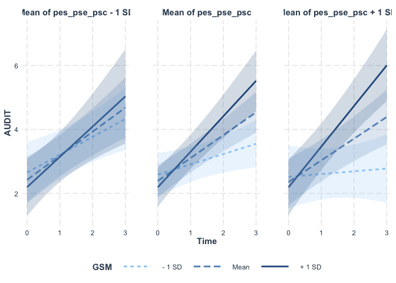<!-- -->

    ## 
    ## Running model with moderator: pea_pse_psc 
    ## Linear mixed model fit by maximum likelihood . t-tests use Satterthwaite's method ['lmerModLmerTest']
    ## Formula: model_formula
    ##    Data: df_long
    ## 
    ##       AIC       BIC    logLik -2*log(L)  df.resid 
    ##    1801.5    1848.4    -888.8    1777.5       357 
    ## 
    ## Scaled residuals: 
    ##     Min      1Q  Median      3Q     Max 
    ## -2.6613 -0.4640 -0.1212  0.3529  4.1838 
    ## 
    ## Random effects:
    ##  Groups   Name        Variance Std.Dev.
    ##  mriID    (Intercept) 4.928    2.220   
    ##  Residual             4.464    2.113   
    ## Number of obs: 369, groups:  mriID, 133
    ## 
    ## Fixed effects:
    ##                       Estimate Std. Error        df t value Pr(>|t|)    
    ## (Intercept)            3.08463    0.70909 368.41921   4.350 1.76e-05 ***
    ## sex                   -0.19017    0.49715 132.92853  -0.383 0.702678    
    ## AdChild                0.48075    0.26478 146.39383   1.816 0.071466 .  
    ## GSM                   -0.06344    0.06459 355.23819  -0.982 0.326689    
    ## pea_pse_psc           -0.91418    0.94517 366.42947  -0.967 0.334076    
    ## Time                  -0.51601    0.36666 301.26095  -1.407 0.160366    
    ## GSM:pea_pse_psc        0.10018    0.08378 341.74659   1.196 0.232617    
    ## GSM:Time               0.13521    0.03840 306.53351   3.521 0.000495 ***
    ## pea_pse_psc:Time       1.09290    0.53924 288.98724   2.027 0.043606 *  
    ## GSM:pea_pse_psc:Time  -0.08997    0.05348 291.57362  -1.682 0.093551 .  
    ## ---
    ## Signif. codes:  0 '***' 0.001 '**' 0.01 '*' 0.05 '.' 0.1 ' ' 1
    ## 
    ## Correlation of Fixed Effects:
    ##             (Intr) sex    AdChld GSM    p_ps_p Time   GSM:p__ GSM:Tm p_p_:T
    ## sex         -0.225                                                         
    ## AdChild      0.107  0.252                                                  
    ## GSM         -0.902 -0.021 -0.172                                           
    ## pea_pse_psc -0.101  0.014 -0.050  0.129                                    
    ## Time        -0.660 -0.011 -0.046  0.693  0.091                             
    ## GSM:p_ps_ps  0.132 -0.024  0.040 -0.150 -0.916 -0.103                      
    ## GSM:Time     0.599  0.029  0.047 -0.681 -0.102 -0.954  0.111               
    ## p_ps_psc:Tm  0.092 -0.051  0.025 -0.093 -0.676 -0.129  0.687   0.128       
    ## GSM:p_ps_:T -0.102  0.046 -0.028  0.102  0.613  0.128 -0.675  -0.124 -0.953
    ## # A tibble: 12 × 10
    ##    effect   group    term                 estimate std.error statistic    df    p.value conf.low conf.high
    ##    <chr>    <chr>    <chr>                   <dbl>     <dbl>     <dbl> <dbl>      <dbl>    <dbl>     <dbl>
    ##  1 fixed    <NA>     (Intercept)            3.08      0.709      4.35   368.  0.0000176   1.69      4.48  
    ##  2 fixed    <NA>     sex                   -0.190     0.497     -0.383  133.  0.703      -1.17      0.793 
    ##  3 fixed    <NA>     AdChild                0.481     0.265      1.82   146.  0.0715     -0.0425    1.00  
    ##  4 fixed    <NA>     GSM                   -0.0634    0.0646    -0.982  355.  0.327      -0.190     0.0636
    ##  5 fixed    <NA>     pea_pse_psc           -0.914     0.945     -0.967  366.  0.334      -2.77      0.944 
    ##  6 fixed    <NA>     Time                  -0.516     0.367     -1.41   301.  0.160      -1.24      0.206 
    ##  7 fixed    <NA>     GSM:pea_pse_psc        0.100     0.0838     1.20   342.  0.233      -0.0646    0.265 
    ##  8 fixed    <NA>     GSM:Time               0.135     0.0384     3.52   307.  0.000495    0.0597    0.211 
    ##  9 fixed    <NA>     pea_pse_psc:Time       1.09      0.539      2.03   289.  0.0436      0.0316    2.15  
    ## 10 fixed    <NA>     GSM:pea_pse_psc:Time  -0.0900    0.0535    -1.68   292.  0.0936     -0.195     0.0153
    ## 11 ran_pars mriID    sd__(Intercept)        2.22     NA         NA       NA  NA          NA        NA     
    ## 12 ran_pars Residual sd__Observation        2.11     NA         NA       NA  NA          NA        NA

    ## Computing profile confidence intervals ...

    ##                            2.5 %     97.5 %
    ## .sig01                1.86336422 2.62956617
    ## .sigma                1.93546342 2.31855757
    ## (Intercept)           1.68518477 4.48490112
    ## sex                  -1.17312260 0.79002712
    ## AdChild              -0.04043395 1.00482428
    ## GSM                  -0.19086497 0.06435866
    ## pea_pse_psc          -2.77171979 0.94382772
    ## Time                 -1.23652341 0.20610868
    ## GSM:pea_pse_psc      -0.06463076 0.26480433
    ## GSM:Time              0.05949937 0.21067380
    ## pea_pse_psc:Time      0.03256993 2.15338209
    ## GSM:pea_pse_psc:Time -0.19513548 0.01518479
    ##             R2m         R2c
    ## [1,] 0.01397089 0.008203319
    ## Data: df_long
    ## Models:
    ## socialMis.lme: AUDIT ~ 1 + sex + AdChild + GSM * Time + (1 | mriID)
    ## full.lme: model_formula
    ##               npar    AIC    BIC  logLik -2*log(L)  Chisq Df Pr(>Chisq)
    ## socialMis.lme    8 1799.3 1830.6 -891.64    1783.3                     
    ## full.lme        12 1801.5 1848.4 -888.75    1777.5 5.7816  4     0.2161
    ##          GSM pea_pse_psc   Time Test Estimate Std. Error       df t value  Pr(>|t|) Sig.
    ## 1   6.197971      sstest      0       -0.2933     0.5136 320.4069 -0.5711 0.5683568     
    ## 2    9.45891      sstest      0        0.0334     0.3860 202.6639  0.0865 0.9311898     
    ## 3  12.719849      sstest      0        0.3600     0.4284 251.8950  0.8404 0.4014584     
    ## 4     sstest   -0.685651      0       -0.1321     0.0927 365.7759 -1.4258 0.1547891     
    ## 5     sstest   -0.015417      0       -0.0650     0.0648 356.0632 -1.0029 0.3166088     
    ## 6     sstest    0.654816      0        0.0022     0.0782 313.4252  0.0276 0.9779657     
    ## 7   6.197971      sstest      1        0.2419     0.4135 211.5125  0.5852 0.5590601     
    ## 8    9.45891      sstest      1        0.2752     0.3446 129.6993  0.7988 0.4258870     
    ## 9  12.719849      sstest      1        0.3085     0.3846 181.3358  0.8020 0.4235776     
    ## 10    sstest   -0.685651      1        0.0648     0.0676 363.9452  0.9587 0.3383262     
    ## 11    sstest   -0.015417      1        0.0716     0.0478 358.0713  1.4991 0.1347299     
    ## 12    sstest    0.654816      1        0.0785     0.0587 323.2483  1.3375 0.1819930     
    ## 13  6.197971      sstest      2        0.7772     0.4452 263.8270  1.7457 0.0820349    .
    ## 14   9.45891      sstest      2        0.5171     0.3770 168.4177  1.3716 0.1720227     
    ## 15 12.719849      sstest      2        0.2569     0.4705 290.0044  0.5461 0.5853868     
    ## 16    sstest   -0.685651      2        0.2617     0.0829 311.4861  3.1550 0.0017617   **
    ## 17    sstest   -0.015417      2        0.2082     0.0577 318.3979  3.6071 0.0003594  ***
    ## 18    sstest    0.654816      2        0.1547     0.0742 299.9981  2.0865 0.0377767    *
    ## 19  6.197971      sstest      3        1.3124     0.5878 365.1204  2.2327 0.0261768    *
    ## 20   9.45891      sstest      3        0.7589     0.4682 287.7137  1.6209 0.1061413     
    ## 21 12.719849      sstest      3        0.2054     0.6354 368.0805  0.3233 0.7466889     
    ## 22    sstest   -0.685651      3        0.4586     0.1246 290.6892  3.6799 0.0002780  ***
    ## 23    sstest   -0.015417      3        0.3448     0.0857 297.9152  4.0226 7.301e-05  ***
    ## 24    sstest    0.654816      3        0.2310     0.1109 286.3416  2.0837 0.0380779    *
    ## 25  6.197971   -0.685651 sstest       -0.0450     0.2392 289.0837 -0.1880 0.8509712     
    ## 26   9.45891   -0.685651 sstest        0.5971     0.1549 269.3612  3.8558 0.0001443  ***
    ## 27 12.719849   -0.685651 sstest        1.2392     0.2411 300.8917  5.1395 4.965e-07  ***
    ## 28  6.197971   -0.015417 sstest        0.3138     0.1569 284.5096  1.9997 0.0464811    *
    ## 29   9.45891   -0.015417 sstest        0.7592     0.1101 268.6263  6.8940 3.866e-11  ***
    ## 30 12.719849   -0.015417 sstest        1.2046     0.1766 295.3618  6.8228 5.057e-11  ***
    ## 31  6.197971    0.654816 sstest        0.6725     0.2144 274.7510  3.1365 0.0018955   **
    ## 32   9.45891    0.654816 sstest        0.9213     0.1562 269.7148  5.8983 1.096e-08  ***
    ## 33 12.719849    0.654816 sstest        1.1701     0.2306 277.2535  5.0746 7.126e-07  ***

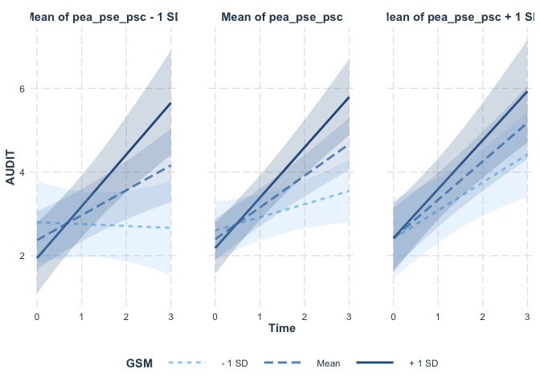<!-- -->

    ## 
    ## Running model with moderator: ssgo_auditory 
    ## Linear mixed model fit by maximum likelihood . t-tests use Satterthwaite's method ['lmerModLmerTest']
    ## Formula: model_formula
    ##    Data: df_long
    ## 
    ##       AIC       BIC    logLik -2*log(L)  df.resid 
    ##    1799.2    1846.1    -887.6    1775.2       357 
    ## 
    ## Scaled residuals: 
    ##     Min      1Q  Median      3Q     Max 
    ## -2.8226 -0.4691 -0.1305  0.3588  4.2132 
    ## 
    ## Random effects:
    ##  Groups   Name        Variance Std.Dev.
    ##  mriID    (Intercept) 5.084    2.255   
    ##  Residual             4.377    2.092   
    ## Number of obs: 369, groups:  mriID, 133
    ## 
    ## Fixed effects:
    ##                         Estimate Std. Error        df t value Pr(>|t|)    
    ## (Intercept)              3.15625    0.70463 368.65347   4.479    1e-05 ***
    ## sex                     -0.16150    0.50150 133.19209  -0.322 0.747927    
    ## AdChild                  0.47114    0.26731 146.90689   1.763 0.080059 .  
    ## GSM                     -0.07343    0.06406 339.71520  -1.146 0.252507    
    ## ssgo_auditory            1.25261    0.76439 366.42201   1.639 0.102135    
    ## Time                    -0.51784    0.36583 291.66832  -1.416 0.157981    
    ## GSM:ssgo_auditory       -0.15872    0.07707 343.84481  -2.060 0.040195 *  
    ## GSM:Time                 0.13292    0.03837 295.09017   3.464 0.000611 ***
    ## ssgo_auditory:Time      -0.38954    0.40249 291.18757  -0.968 0.333933    
    ## GSM:ssgo_auditory:Time   0.07096    0.04419 300.36059   1.606 0.109419    
    ## ---
    ## Signif. codes:  0 '***' 0.001 '**' 0.01 '*' 0.05 '.' 0.1 ' ' 1
    ## 
    ## Correlation of Fixed Effects:
    ##             (Intr) sex    AdChld GSM    ssg_dt Time   GSM:s_ GSM:Tm ssg_:T
    ## sex         -0.231                                                        
    ## AdChild      0.098  0.254                                                 
    ## GSM         -0.899 -0.019 -0.164                                          
    ## ssgo_audtry  0.103 -0.058 -0.057 -0.106                                   
    ## Time        -0.654 -0.010 -0.038  0.688 -0.088                            
    ## GSM:ssg_dtr -0.118  0.052  0.032  0.130 -0.925  0.107                     
    ## GSM:Time     0.591  0.027  0.039 -0.674  0.082 -0.955 -0.101              
    ## ssg_dtry:Tm -0.088  0.025  0.013  0.100 -0.699 -0.014  0.705  0.020       
    ## GSM:ssg_d:T  0.091 -0.021 -0.009 -0.105  0.667  0.008 -0.724 -0.023 -0.955
    ## # A tibble: 12 × 10
    ##    effect   group    term                   estimate std.error statistic    df    p.value conf.low conf.high
    ##    <chr>    <chr>    <chr>                     <dbl>     <dbl>     <dbl> <dbl>      <dbl>    <dbl>     <dbl>
    ##  1 fixed    <NA>     (Intercept)              3.16      0.705      4.48   369.  0.0000100   1.77     4.54   
    ##  2 fixed    <NA>     sex                     -0.162     0.501     -0.322  133.  0.748      -1.15     0.830  
    ##  3 fixed    <NA>     AdChild                  0.471     0.267      1.76   147.  0.0801     -0.0571   0.999  
    ##  4 fixed    <NA>     GSM                     -0.0734    0.0641    -1.15   340.  0.253      -0.199    0.0526 
    ##  5 fixed    <NA>     ssgo_auditory            1.25      0.764      1.64   366.  0.102      -0.251    2.76   
    ##  6 fixed    <NA>     Time                    -0.518     0.366     -1.42   292.  0.158      -1.24     0.202  
    ##  7 fixed    <NA>     GSM:ssgo_auditory       -0.159     0.0771    -2.06   344.  0.0402     -0.310   -0.00714
    ##  8 fixed    <NA>     GSM:Time                 0.133     0.0384     3.46   295.  0.000611    0.0574   0.208  
    ##  9 fixed    <NA>     ssgo_auditory:Time      -0.390     0.402     -0.968  291.  0.334      -1.18     0.403  
    ## 10 fixed    <NA>     GSM:ssgo_auditory:Time   0.0710    0.0442     1.61   300.  0.109      -0.0160   0.158  
    ## 11 ran_pars mriID    sd__(Intercept)          2.25     NA         NA       NA  NA          NA       NA      
    ## 12 ran_pars Residual sd__Observation          2.09     NA         NA       NA  NA          NA       NA

    ## Computing profile confidence intervals ...

    ##                              2.5 %       97.5 %
    ## .sig01                  1.89937873  2.665011577
    ## .sigma                  1.91660281  2.295681590
    ## (Intercept)             1.76731243  4.544708348
    ## sex                    -1.15343700  0.826967807
    ## AdChild                -0.05535833  0.999596709
    ## GSM                    -0.19955002  0.053127947
    ## ssgo_auditory          -0.25391208  2.757769960
    ## Time                   -1.23681713  0.202211856
    ## GSM:ssgo_auditory      -0.31042153 -0.006555048
    ## GSM:Time                0.05734979  0.208321114
    ## ssgo_auditory:Time     -1.18113303  0.406727676
    ## GSM:ssgo_auditory:Time -0.01648420  0.157900780
    ##             R2m        R2c
    ## [1,] 0.01022668 0.01770006
    ## Data: df_long
    ## Models:
    ## socialMis.lme: AUDIT ~ 1 + sex + AdChild + GSM * Time + (1 | mriID)
    ## full.lme: model_formula
    ##               npar    AIC    BIC  logLik -2*log(L)  Chisq Df Pr(>Chisq)  
    ## socialMis.lme    8 1799.3 1830.6 -891.64    1783.3                       
    ## full.lme        12 1799.2 1846.1 -887.58    1775.2 8.1383  4    0.08664 .
    ## ---
    ## Signif. codes:  0 '***' 0.001 '**' 0.01 '*' 0.05 '.' 0.1 ' ' 1
    ##          GSM ssgo_auditory   Time Test Estimate Std. Error       df t value  Pr(>|t|) Sig.
    ## 1   6.197971        sstest      0        0.2688     0.3704 293.7816  0.7258 0.4685463     
    ## 2    9.45891        sstest      0       -0.2487     0.2919 191.1007 -0.8522 0.3951562     
    ## 3  12.719849        sstest      0       -0.7663     0.3993 322.1864 -1.9189 0.0558745    .
    ## 4     sstest     -0.866959      0        0.0642     0.0864 362.5016  0.7432 0.4578592     
    ## 5     sstest      0.015031      0       -0.0758     0.0642 338.8724 -1.1805 0.2386245     
    ## 6     sstest      0.897022      0       -0.2158     0.1002 319.2466 -2.1546 0.0319423    *
    ## 7   6.197971        sstest      1        0.3191     0.3082 189.0836  1.0352 0.3018968     
    ## 8    9.45891        sstest      1        0.0329     0.2644 128.2817  0.1244 0.9011701     
    ## 9  12.719849        sstest      1       -0.2533     0.3284 238.6528 -0.7713 0.4412843     
    ## 10    sstest     -0.866959      1        0.1356     0.0669 354.5877  2.0261 0.0435025    *
    ## 11    sstest      0.015031      1        0.0582     0.0476 346.5950  1.2228 0.2222213     
    ## 12    sstest      0.897022      1       -0.0192     0.0683 327.8796 -0.2818 0.7782631     
    ## 13  6.197971        sstest      2        0.3693     0.3251 226.7992  1.1360 0.2571486     
    ## 14   9.45891        sstest      2        0.3145     0.2922 173.4095  1.0765 0.2832208     
    ## 15 12.719849        sstest      2        0.2597     0.3845 325.8985  0.6754 0.4998827     
    ## 16    sstest     -0.866959      2        0.2070     0.0867 302.6045  2.3875 0.0175764    *
    ## 17    sstest      0.015031      2        0.1922     0.0578 314.1301  3.3227 0.0009966  ***
    ## 18    sstest      0.897022      2        0.1773     0.0723 301.0798  2.4518 0.0147837    *
    ## 19  6.197971        sstest      3        0.4196     0.4114 347.1399  1.0198 0.3085208     
    ## 20   9.45891        sstest      3        0.5962     0.3627 293.2034  1.6435 0.1013460     
    ## 21 12.719849        sstest      3        0.7728     0.5287 367.6437  1.4615 0.1447316     
    ## 22    sstest     -0.866959      3        0.2784     0.1287 287.0847  2.1626 0.0313994    *
    ## 23    sstest      0.015031      3        0.3261     0.0858 294.7959  3.7994 0.0001762  ***
    ## 24    sstest      0.897022      3        0.3739     0.1084 283.2492  3.4494 0.0006474  ***
    ## 25  6.197971     -0.866959 sstest        0.2624     0.2135 276.5395  1.2293 0.2199972     
    ## 26   9.45891     -0.866959 sstest        0.4953     0.1614 273.8328  3.0696 0.0023587   **
    ## 27 12.719849     -0.866959 sstest        0.7281     0.2655 302.0001  2.7427 0.0064580   **
    ## 28  6.197971      0.015031 sstest        0.3068     0.1557 279.8949  1.9697 0.0498612    *
    ## 29   9.45891      0.015031 sstest        0.7437     0.1096 268.3875  6.7872 7.304e-11  ***
    ## 30 12.719849      0.015031 sstest        1.1806     0.1762 286.0527  6.6999 1.106e-10  ***
    ## 31  6.197971      0.897022 sstest        0.3511     0.2099 273.2216  1.6723 0.0956164    .
    ## 32   9.45891      0.897022 sstest        0.9921     0.1479 263.1210  6.7058 1.218e-10  ***
    ## 33 12.719849      0.897022 sstest        1.6331     0.2509 281.3592  6.5101 3.438e-10  ***

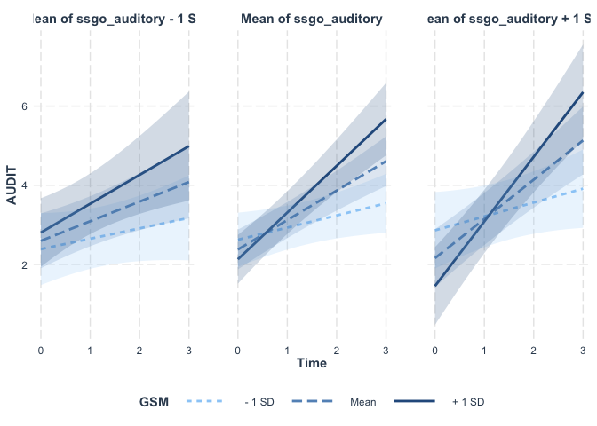<!-- -->

    ## 
    ## Running model with moderator: ssgo_default 
    ## Linear mixed model fit by maximum likelihood . t-tests use Satterthwaite's method ['lmerModLmerTest']
    ## Formula: model_formula
    ##    Data: df_long
    ## 
    ##       AIC       BIC    logLik -2*log(L)  df.resid 
    ##    1795.7    1842.6    -885.9    1771.7       357 
    ## 
    ## Scaled residuals: 
    ##     Min      1Q  Median      3Q     Max 
    ## -2.6495 -0.4604 -0.1254  0.3445  4.2791 
    ## 
    ## Random effects:
    ##  Groups   Name        Variance Std.Dev.
    ##  mriID    (Intercept) 4.836    2.199   
    ##  Residual             4.399    2.097   
    ## Number of obs: 369, groups:  mriID, 133
    ## 
    ## Fixed effects:
    ##                        Estimate Std. Error        df t value Pr(>|t|)    
    ## (Intercept)             2.94644    0.69932 368.99843   4.213 3.17e-05 ***
    ## sex                    -0.18604    0.49351 134.09655  -0.377  0.70679    
    ## AdChild                 0.46235    0.26575 146.91518   1.740  0.08399 .  
    ## GSM                    -0.05240    0.06388 347.72256  -0.820  0.41256    
    ## ssgo_default            1.34285    0.72601 363.21614   1.850  0.06518 .  
    ## Time                   -0.44036    0.36426 298.58077  -1.209  0.22766    
    ## GSM:ssgo_default       -0.14353    0.06612 334.82919  -2.171  0.03065 *  
    ## GSM:Time                0.12705    0.03826 302.47647   3.321  0.00101 ** 
    ## ssgo_default:Time       0.17453    0.40067 291.50239   0.436  0.66345    
    ## GSM:ssgo_default:Time  -0.02111    0.04147 297.83644  -0.509  0.61110    
    ## ---
    ## Signif. codes:  0 '***' 0.001 '**' 0.01 '*' 0.05 '.' 0.1 ' ' 1
    ## 
    ## Correlation of Fixed Effects:
    ##             (Intr) sex    AdChld GSM    ssg_df Time   GSM:s_ GSM:Tm ssg_:T
    ## sex         -0.217                                                        
    ## AdChild      0.109  0.256                                                 
    ## GSM         -0.901 -0.032 -0.175                                          
    ## ssgo_defalt -0.005 -0.012 -0.103 -0.011                                   
    ## Time        -0.660 -0.022 -0.045  0.696 -0.034                            
    ## GSM:ssg_dfl -0.019 -0.007  0.048  0.047 -0.926  0.060                     
    ## GSM:Time     0.598  0.042  0.045 -0.684  0.057 -0.954 -0.086              
    ## ssg_dflt:Tm -0.025 -0.048  0.032  0.061 -0.666  0.048  0.679 -0.084       
    ## GSM:ssg_d:T  0.049  0.053 -0.020 -0.089  0.597 -0.084 -0.657  0.119 -0.954
    ## # A tibble: 12 × 10
    ##    effect   group    term                  estimate std.error statistic    df    p.value conf.low conf.high
    ##    <chr>    <chr>    <chr>                    <dbl>     <dbl>     <dbl> <dbl>      <dbl>    <dbl>     <dbl>
    ##  1 fixed    <NA>     (Intercept)             2.95      0.699      4.21   369.  0.0000317   1.57      4.32  
    ##  2 fixed    <NA>     sex                    -0.186     0.494     -0.377  134.  0.707      -1.16      0.790 
    ##  3 fixed    <NA>     AdChild                 0.462     0.266      1.74   147.  0.0840     -0.0628    0.988 
    ##  4 fixed    <NA>     GSM                    -0.0524    0.0639    -0.820  348.  0.413      -0.178     0.0732
    ##  5 fixed    <NA>     ssgo_default            1.34      0.726      1.85   363.  0.0652     -0.0849    2.77  
    ##  6 fixed    <NA>     Time                   -0.440     0.364     -1.21   299.  0.228      -1.16      0.276 
    ##  7 fixed    <NA>     GSM:ssgo_default       -0.144     0.0661    -2.17   335.  0.0307     -0.274    -0.0135
    ##  8 fixed    <NA>     GSM:Time                0.127     0.0383     3.32   302.  0.00101     0.0518    0.202 
    ##  9 fixed    <NA>     ssgo_default:Time       0.175     0.401      0.436  292.  0.663      -0.614     0.963 
    ## 10 fixed    <NA>     GSM:ssgo_default:Time  -0.0211    0.0415    -0.509  298.  0.611      -0.103     0.0605
    ## 11 ran_pars mriID    sd__(Intercept)         2.20     NA         NA       NA  NA          NA        NA     
    ## 12 ran_pars Residual sd__Observation         2.10     NA         NA       NA  NA          NA        NA

    ## Computing profile confidence intervals ...

    ##                             2.5 %      97.5 %
    ## .sig01                 1.84698437  2.60386687
    ## .sigma                 1.92162336  2.30124880
    ## (Intercept)            1.56863095  4.32429514
    ## sex                   -1.16152176  0.78707886
    ## AdChild               -0.06095063  0.98793897
    ## GSM                   -0.17815553  0.07369313
    ## ssgo_default          -0.08409817  2.77055274
    ## Time                  -1.15617689  0.27695983
    ## GSM:ssgo_default      -0.27360341 -0.01359988
    ## GSM:Time               0.05162511  0.20224283
    ## ssgo_default:Time     -0.61362797  0.96220663
    ## GSM:ssgo_default:Time -0.10266068  0.06041639
    ##             R2m       R2c
    ## [1,] 0.02511824 0.0125934
    ## Data: df_long
    ## Models:
    ## socialMis.lme: AUDIT ~ 1 + sex + AdChild + GSM * Time + (1 | mriID)
    ## full.lme: model_formula
    ##               npar    AIC    BIC  logLik -2*log(L)  Chisq Df Pr(>Chisq)  
    ## socialMis.lme    8 1799.3 1830.6 -891.64    1783.3                       
    ## full.lme        12 1795.7 1842.6 -885.85    1771.7 11.586  4    0.02071 *
    ## ---
    ## Signif. codes:  0 '***' 0.001 '**' 0.01 '*' 0.05 '.' 0.1 ' ' 1
    ##          GSM ssgo_default   Time Test Estimate Std. Error       df t value  Pr(>|t|) Sig.
    ## 1   6.197971       sstest      0        0.4533     0.3794 326.9296  1.1947 0.2330866     
    ## 2    9.45891       sstest      0       -0.0148     0.2779 200.6512 -0.0531 0.9576942     
    ## 3  12.719849       sstest      0       -0.4828     0.3216 275.8467 -1.5010 0.1344887     
    ## 4     sstest    -0.907557      0        0.0779     0.0856 353.6016  0.9098 0.3635658     
    ## 5     sstest     0.016355      0       -0.0548     0.0639 347.3298 -0.8563 0.3924039     
    ## 6     sstest     0.940267      0       -0.1874     0.0912 329.0348 -2.0546 0.0407102    *
    ## 7   6.197971       sstest      1        0.4970     0.3063 218.4718  1.6224 0.1061591     
    ## 8    9.45891       sstest      1       -0.0399     0.2494 131.2718 -0.1599 0.8731811     
    ## 9  12.719849       sstest      1       -0.5768     0.2890 201.1536 -1.9954 0.0473473    *
    ## 10    sstest    -0.907557      1        0.2241     0.0662 362.7625  3.3869 0.0007842  ***
    ## 11    sstest     0.016355      1        0.0720     0.0469 351.8387  1.5338 0.1259769     
    ## 12    sstest     0.940267      1       -0.0802     0.0654 330.4202 -1.2258 0.2211620     
    ## 13  6.197971       sstest      2        0.5407     0.3223 254.0177  1.6774 0.0947020    .
    ## 14   9.45891       sstest      2       -0.0650     0.2761 176.2307 -0.2355 0.8140868     
    ## 15 12.719849       sstest      2       -0.6707     0.3669 312.8860 -1.8280 0.0684985    .
    ## 16    sstest    -0.907557      2        0.3703     0.0807 337.3318  4.5911 6.231e-06  ***
    ## 17    sstest     0.016355      2        0.1987     0.0571 316.1056  3.4823 0.0005672  ***
    ## 18    sstest     0.940267      2        0.0271     0.0832 301.1756  0.3253 0.7451529     
    ## 19  6.197971       sstest      3        0.5844     0.4173 359.8994  1.4003 0.1622928     
    ## 20   9.45891       sstest      3       -0.0902     0.3453 296.9646 -0.2611 0.7942291     
    ## 21 12.719849       sstest      3       -0.7647     0.5066 368.9727 -1.5093 0.1320732     
    ## 22    sstest    -0.907557      3        0.5165     0.1171 313.2045  4.4115 1.414e-05  ***
    ## 23    sstest     0.016355      3        0.3254     0.0851 297.4013  3.8214 0.0001616  ***
    ## 24    sstest     0.940267      3        0.1343     0.1274 291.6547  1.0538 0.2928390     
    ## 25  6.197971    -0.907557 sstest        0.3074     0.2275 287.4844  1.3514 0.1776254     
    ## 26   9.45891    -0.907557 sstest        0.7842     0.1566 276.5498  5.0066 9.879e-07  ***
    ## 27 12.719849    -0.907557 sstest        1.2610     0.2264 293.3032  5.5686 5.804e-08  ***
    ## 28  6.197971     0.016355 sstest        0.3478     0.1550 284.2770  2.2434 0.0256389    *
    ## 29   9.45891     0.016355 sstest        0.7610     0.1099 270.2772  6.9222 3.230e-11  ***
    ## 30 12.719849     0.016355 sstest        1.1742     0.1772 291.7257  6.6256 1.666e-10  ***
    ## 31  6.197971     0.940267 sstest        0.3882     0.2184 274.9320  1.7774 0.0766067    .
    ## 32   9.45891     0.940267 sstest        0.7378     0.1562 268.5805  4.7224 3.759e-06  ***
    ## 33 12.719849     0.940267 sstest        1.0874     0.2686 293.5008  4.0488 6.594e-05  ***

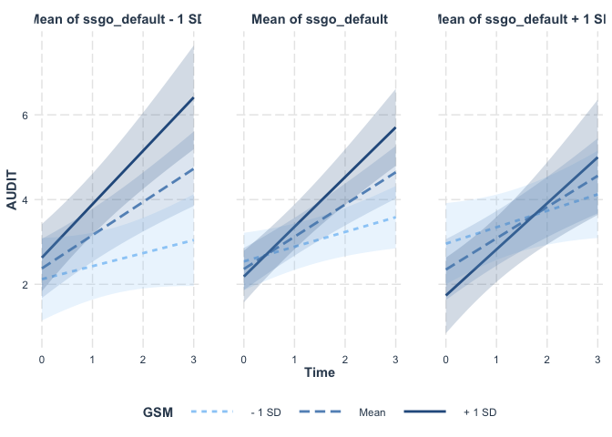<!-- -->

    ## 
    ## Running model with moderator: ssgo_memoryRetrieval 
    ## Linear mixed model fit by maximum likelihood . t-tests use Satterthwaite's method ['lmerModLmerTest']
    ## Formula: model_formula
    ##    Data: df_long
    ## 
    ##       AIC       BIC    logLik -2*log(L)  df.resid 
    ##    1801.5    1848.5    -888.8    1777.5       357 
    ## 
    ## Scaled residuals: 
    ##     Min      1Q  Median      3Q     Max 
    ## -2.5920 -0.4589 -0.1542  0.3505  4.2090 
    ## 
    ## Random effects:
    ##  Groups   Name        Variance Std.Dev.
    ##  mriID    (Intercept) 4.753    2.180   
    ##  Residual             4.520    2.126   
    ## Number of obs: 369, groups:  mriID, 133
    ## 
    ## Fixed effects:
    ##                                 Estimate Std. Error         df t value Pr(>|t|)    
    ## (Intercept)                     2.964084   0.704741 368.998463   4.206 3.27e-05 ***
    ## sex                            -0.180147   0.491831 131.455442  -0.366  0.71475    
    ## AdChild                         0.489010   0.262504 145.440134   1.863  0.06450 .  
    ## GSM                            -0.054445   0.064410 348.625906  -0.845  0.39853    
    ## ssgo_memoryRetrieval            1.455941   0.828857 363.619266   1.757  0.07983 .  
    ## Time                           -0.401543   0.366958 299.268226  -1.094  0.27473    
    ## GSM:ssgo_memoryRetrieval       -0.121170   0.081224 345.876052  -1.492  0.13666    
    ## GSM:Time                        0.122903   0.038509 304.064430   3.192  0.00156 ** 
    ## ssgo_memoryRetrieval:Time      -0.137979   0.437366 287.607625  -0.315  0.75263    
    ## GSM:ssgo_memoryRetrieval:Time  -0.003254   0.047653 292.434658  -0.068  0.94561    
    ## ---
    ## Signif. codes:  0 '***' 0.001 '**' 0.01 '*' 0.05 '.' 0.1 ' ' 1
    ## 
    ## Correlation of Fixed Effects:
    ##             (Intr) sex    AdChld GSM    ssg_mR Time   GSM:s_R GSM:Tm ss_R:T
    ## sex         -0.219                                                         
    ## AdChild      0.112  0.251                                                  
    ## GSM         -0.903 -0.025 -0.178                                           
    ## ssg_mmryRtr  0.045 -0.027  0.053 -0.068                                    
    ## Time        -0.661 -0.019 -0.049  0.694 -0.041                             
    ## GSM:ssg_mmR -0.066  0.017 -0.069  0.094 -0.945  0.058                      
    ## GSM:Time     0.599  0.038  0.051 -0.682  0.058 -0.954 -0.076               
    ## ssg_mmryR:T -0.037 -0.026 -0.053  0.067 -0.693  0.041  0.703  -0.070       
    ## GSM:ssg_R:T  0.050  0.029  0.061 -0.082  0.639 -0.063 -0.686   0.093 -0.963
    ## # A tibble: 12 × 10
    ##    effect   group    term                          estimate std.error statistic    df    p.value conf.low conf.high
    ##    <chr>    <chr>    <chr>                            <dbl>     <dbl>     <dbl> <dbl>      <dbl>    <dbl>     <dbl>
    ##  1 fixed    <NA>     (Intercept)                    2.96       0.705     4.21    369.  0.0000327   1.58      4.35  
    ##  2 fixed    <NA>     sex                           -0.180      0.492    -0.366   131.  0.715      -1.15      0.793 
    ##  3 fixed    <NA>     AdChild                        0.489      0.263     1.86    145.  0.0645     -0.0298    1.01  
    ##  4 fixed    <NA>     GSM                           -0.0544     0.0644   -0.845   349.  0.399      -0.181     0.0722
    ##  5 fixed    <NA>     ssgo_memoryRetrieval           1.46       0.829     1.76    364.  0.0798     -0.174     3.09  
    ##  6 fixed    <NA>     Time                          -0.402      0.367    -1.09    299.  0.275      -1.12      0.321 
    ##  7 fixed    <NA>     GSM:ssgo_memoryRetrieval      -0.121      0.0812   -1.49    346.  0.137      -0.281     0.0386
    ##  8 fixed    <NA>     GSM:Time                       0.123      0.0385    3.19    304.  0.00156     0.0471    0.199 
    ##  9 fixed    <NA>     ssgo_memoryRetrieval:Time     -0.138      0.437    -0.315   288.  0.753      -0.999     0.723 
    ## 10 fixed    <NA>     GSM:ssgo_memoryRetrieval:Time -0.00325    0.0477   -0.0683  292.  0.946      -0.0970    0.0905
    ## 11 ran_pars mriID    sd__(Intercept)                2.18      NA        NA        NA  NA          NA        NA     
    ## 12 ran_pars Residual sd__Observation                2.13      NA        NA        NA  NA          NA        NA

    ## Computing profile confidence intervals ...

    ##                                     2.5 %     97.5 %
    ## .sig01                         1.82170952 2.59007536
    ## .sigma                         1.94724710 2.33381469
    ## (Intercept)                    1.57379690 4.35442343
    ## sex                           -1.15209299 0.79009194
    ## AdChild                       -0.02772516 1.00858656
    ## GSM                           -0.18140085 0.07292790
    ## ssgo_memoryRetrieval          -0.17490421 3.08857566
    ## Time                          -1.12264307 0.32124548
    ## GSM:ssgo_memoryRetrieval      -0.28118717 0.03853031
    ## GSM:Time                       0.04695934 0.19858878
    ## ssgo_memoryRetrieval:Time     -0.99764229 0.72277188
    ## GSM:ssgo_memoryRetrieval:Time -0.09709793 0.09039045
    ##           R2m          R2c
    ## [1,] 0.014115 -0.002468042
    ## Data: df_long
    ## Models:
    ## socialMis.lme: AUDIT ~ 1 + sex + AdChild + GSM * Time + (1 | mriID)
    ## full.lme: model_formula
    ##               npar    AIC    BIC  logLik -2*log(L)  Chisq Df Pr(>Chisq)
    ## socialMis.lme    8 1799.3 1830.6 -891.64    1783.3                     
    ## full.lme        12 1801.5 1848.5 -888.76    1777.5 5.7627  4     0.2176
    ##          GSM ssgo_memoryRetrieval   Time Test Estimate Std. Error       df t value  Pr(>|t|) Sig.
    ## 1   6.197971               sstest      0        0.7049     0.3897 331.1552  1.8091 0.0713479    .
    ## 2    9.45891               sstest      0        0.3098     0.2716 194.9900  1.1406 0.2554242     
    ## 3  12.719849               sstest      0       -0.0853     0.3688 322.3082 -0.2314 0.8171766     
    ## 4     sstest            -0.913482      0        0.0562     0.0936 345.9412  0.6011 0.5481770     
    ## 5     sstest             0.020488      0       -0.0569     0.0646 348.6680 -0.8814 0.3787105     
    ## 6     sstest             0.954457      0       -0.1701     0.1053 347.9391 -1.6146 0.1072961     
    ## 7   6.197971               sstest      1        0.5468     0.3113 220.1817  1.7563 0.0804189    .
    ## 8    9.45891               sstest      1        0.1410     0.2449 127.3976  0.5760 0.5656132     
    ## 9  12.719849               sstest      1       -0.2647     0.3140 241.0585 -0.8430 0.4000695     
    ## 10    sstest            -0.913482      1        0.1821     0.0700 360.1163  2.6014 0.0096665   **
    ## 11    sstest             0.020488      1        0.0659     0.0475 352.2120  1.3877 0.1661174     
    ## 12    sstest             0.954457      1       -0.0503     0.0762 350.5622 -0.6598 0.5098472     
    ## 13  6.197971               sstest      2        0.3886     0.3183 242.7666  1.2211 0.2232449     
    ## 14   9.45891               sstest      2       -0.0277     0.2747 179.6377 -0.1009 0.9197513     
    ## 15 12.719849               sstest      2       -0.4441     0.3963 344.9483 -1.1205 0.2632834     
    ## 16    sstest            -0.913482      2        0.3080     0.0847 332.5728  3.6351 0.0003218  ***
    ## 17    sstest             0.020488      2        0.1887     0.0576 316.4319  3.2747 0.0011750   **
    ## 18    sstest             0.954457      2        0.0695     0.0910 309.1002  0.7637 0.4456497     
    ## 19  6.197971               sstest      3        0.2305     0.4062 356.0747  0.5675 0.5707572     
    ## 20   9.45891               sstest      3       -0.1965     0.3467 306.3659 -0.5666 0.5713926     
    ## 21 12.719849               sstest      3       -0.6234     0.5580 363.2169 -1.1172 0.2646635     
    ## 22    sstest            -0.913482      3        0.4339     0.1249 305.9184  3.4751 0.0005846  ***
    ## 23    sstest             0.020488      3        0.3116     0.0858 298.1751  3.6294 0.0003342  ***
    ## 24    sstest             0.954457      3        0.1893     0.1360 289.8746  1.3915 0.1651500     
    ## 25  6.197971            -0.913482 sstest        0.5047     0.2262 279.7724  2.2315 0.0264391    *
    ## 26   9.45891            -0.913482 sstest        0.9151     0.1551 267.6796  5.8992 1.099e-08  ***
    ## 27 12.719849            -0.913482 sstest        1.3256     0.2494 285.4050  5.3158 2.145e-07  ***
    ## 28  6.197971             0.020488 sstest        0.3570     0.1565 283.4819  2.2804 0.0233265    *
    ## 29   9.45891             0.020488 sstest        0.7575     0.1111 269.5269  6.8160 6.117e-11  ***
    ## 30 12.719849             0.020488 sstest        1.1581     0.1786 293.4856  6.4832 3.795e-10  ***
    ## 31  6.197971             0.954457 sstest        0.2093     0.2227 277.1520  0.9397 0.3481852     
    ## 32   9.45891             0.954457 sstest        0.5999     0.1619 269.7395  3.7064 0.0002551  ***
    ## 33 12.719849             0.954457 sstest        0.9906     0.2920 295.0468  3.3922 0.0007880  ***

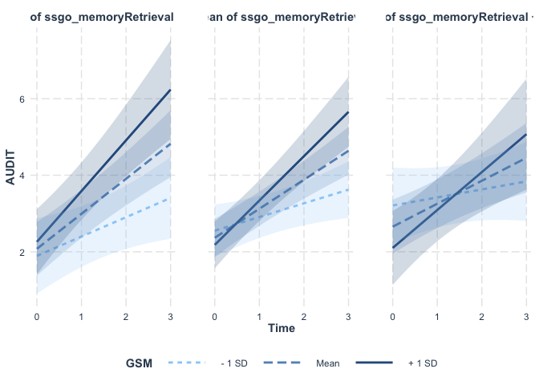<!-- -->

    ## 
    ## Running model with moderator: ssgo_visual 
    ## Linear mixed model fit by maximum likelihood . t-tests use Satterthwaite's method ['lmerModLmerTest']
    ## Formula: model_formula
    ##    Data: df_long
    ## 
    ##       AIC       BIC    logLik -2*log(L)  df.resid 
    ##    1803.8    1850.7    -889.9    1779.8       357 
    ## 
    ## Scaled residuals: 
    ##     Min      1Q  Median      3Q     Max 
    ## -2.5572 -0.4439 -0.1476  0.3431  4.2984 
    ## 
    ## Random effects:
    ##  Groups   Name        Variance Std.Dev.
    ##  mriID    (Intercept) 4.973    2.230   
    ##  Residual             4.487    2.118   
    ## Number of obs: 369, groups:  mriID, 133
    ## 
    ## Fixed effects:
    ##                       Estimate Std. Error        df t value Pr(>|t|)    
    ## (Intercept)            3.11057    0.70917 368.97600   4.386 1.51e-05 ***
    ## sex                   -0.15355    0.50745 133.05880  -0.303 0.762671    
    ## AdChild                0.49738    0.26615 147.58156   1.869 0.063636 .  
    ## GSM                   -0.07166    0.06510 344.74264  -1.101 0.271745    
    ## ssgo_visual            0.86800    0.75426 366.57646   1.151 0.250561    
    ## Time                  -0.49941    0.36878 296.82981  -1.354 0.176694    
    ## GSM:ssgo_visual       -0.09266    0.06941 348.25903  -1.335 0.182780    
    ## GSM:Time               0.13584    0.03886 301.52584   3.495 0.000544 ***
    ## ssgo_visual:Time      -0.02890    0.37838 292.03455  -0.076 0.939176    
    ## GSM:ssgo_visual:Time   0.01206    0.03810 298.85766   0.317 0.751708    
    ## ---
    ## Signif. codes:  0 '***' 0.001 '**' 0.01 '*' 0.05 '.' 0.1 ' ' 1
    ## 
    ## Correlation of Fixed Effects:
    ##             (Intr) sex    AdChld GSM    ssg_vs Time   GSM:s_ GSM:Tm ssg_:T
    ## sex         -0.216                                                        
    ## AdChild      0.108  0.259                                                 
    ## GSM         -0.899 -0.038 -0.176                                          
    ## ssgo_visual  0.066 -0.076 -0.004 -0.086                                   
    ## Time        -0.655 -0.025 -0.051  0.691 -0.048                            
    ## GSM:ssg_vsl -0.090  0.012 -0.024  0.137 -0.929  0.077                     
    ## GSM:Time     0.592  0.041  0.052 -0.677  0.071 -0.954 -0.101              
    ## ssgo_vsl:Tm -0.035 -0.009  0.000  0.065 -0.700 -0.023  0.709  0.024       
    ## GSM:ssg_v:T  0.059  0.014  0.005 -0.092  0.653  0.025 -0.712 -0.028 -0.950
    ## # A tibble: 12 × 10
    ##    effect   group    term                 estimate std.error statistic    df    p.value conf.low conf.high
    ##    <chr>    <chr>    <chr>                   <dbl>     <dbl>     <dbl> <dbl>      <dbl>    <dbl>     <dbl>
    ##  1 fixed    <NA>     (Intercept)            3.11      0.709     4.39    369.  0.0000151   1.72      4.51  
    ##  2 fixed    <NA>     sex                   -0.154     0.507    -0.303   133.  0.763      -1.16      0.850 
    ##  3 fixed    <NA>     AdChild                0.497     0.266     1.87    148.  0.0636     -0.0286    1.02  
    ##  4 fixed    <NA>     GSM                   -0.0717    0.0651   -1.10    345.  0.272      -0.200     0.0564
    ##  5 fixed    <NA>     ssgo_visual            0.868     0.754     1.15    367.  0.251      -0.615     2.35  
    ##  6 fixed    <NA>     Time                  -0.499     0.369    -1.35    297.  0.177      -1.23      0.226 
    ##  7 fixed    <NA>     GSM:ssgo_visual       -0.0927    0.0694   -1.33    348.  0.183      -0.229     0.0439
    ##  8 fixed    <NA>     GSM:Time               0.136     0.0389    3.50    302.  0.000544    0.0594    0.212 
    ##  9 fixed    <NA>     ssgo_visual:Time      -0.0289    0.378    -0.0764  292.  0.939      -0.774     0.716 
    ## 10 fixed    <NA>     GSM:ssgo_visual:Time   0.0121    0.0381    0.317   299.  0.752      -0.0629    0.0870
    ## 11 ran_pars mriID    sd__(Intercept)        2.23     NA        NA        NA  NA          NA        NA     
    ## 12 ran_pars Residual sd__Observation        2.12     NA        NA        NA  NA          NA        NA

    ## Computing profile confidence intervals ...

    ##                            2.5 %     97.5 %
    ## .sig01                1.87300811 2.64054908
    ## .sigma                1.94049309 2.32429095
    ## (Intercept)           1.71152948 4.50946585
    ## sex                  -1.15648034 0.84723189
    ## AdChild              -0.02651175 1.02409890
    ## GSM                  -0.19995197 0.05709157
    ## ssgo_visual          -0.61416639 2.35030605
    ## Time                 -1.22408365 0.22697143
    ## GSM:ssgo_visual      -0.22908495 0.04375882
    ## GSM:Time              0.05921622 0.21221867
    ## ssgo_visual:Time     -0.77330018 0.71491556
    ## GSM:ssgo_visual:Time -0.06282676 0.08699226
    ##              R2m         R2c
    ## [1,] 0.007283686 0.005917457
    ## Data: df_long
    ## Models:
    ## socialMis.lme: AUDIT ~ 1 + sex + AdChild + GSM * Time + (1 | mriID)
    ## full.lme: model_formula
    ##               npar    AIC    BIC  logLik -2*log(L)  Chisq Df Pr(>Chisq)
    ## socialMis.lme    8 1799.3 1830.6 -891.64    1783.3                     
    ## full.lme        12 1803.8 1850.7 -889.88    1779.8 3.5231  4     0.4744
    ##          GSM ssgo_visual   Time Test Estimate Std. Error       df t value  Pr(>|t|) Sig.
    ## 1   6.197971      sstest      0        0.2937     0.3888 324.5123  0.7554 0.4505654     
    ## 2    9.45891      sstest      0       -0.0084     0.2829 200.1475 -0.0299 0.9762070     
    ## 3  12.719849      sstest      0       -0.3106     0.3336 273.0110 -0.9309 0.3527161     
    ## 4     sstest   -0.964117      0        0.0177     0.0867 350.6529  0.2038 0.8386152     
    ## 5     sstest   -0.031149      0       -0.0688     0.0648 344.9820 -1.0607 0.2895491     
    ## 6     sstest    0.901819      0       -0.1552     0.0963 343.1606 -1.6117 0.1079521     
    ## 7   6.197971      sstest      1        0.3396     0.3151 221.1833  1.0778 0.2822990     
    ## 8    9.45891      sstest      1        0.0768     0.2537 130.0720  0.3026 0.7626771     
    ## 9  12.719849      sstest      1       -0.1860     0.2875 188.1782 -0.6470 0.5184146     
    ## 10    sstest   -0.964117      1        0.1419     0.0671 356.3263  2.1153 0.0350989    *
    ## 11    sstest   -0.031149      1        0.0667     0.0482 352.2332  1.3851 0.1669083     
    ## 12    sstest    0.901819      1       -0.0085     0.0670 345.6926 -0.1268 0.8991955     
    ## 13  6.197971      sstest      2        0.3855     0.3252 250.4159  1.1852 0.2370740     
    ## 14   9.45891      sstest      2        0.1620     0.2770 168.3979  0.5848 0.5594910     
    ## 15 12.719849      sstest      2       -0.0615     0.3368 277.1490 -0.1826 0.8552614     
    ## 16    sstest   -0.964117      2        0.2661     0.0858 323.1434  3.1018 0.0020929   **
    ## 17    sstest   -0.031149      2        0.2022     0.0588 321.2530  3.4358 0.0006684  ***
    ## 18    sstest    0.901819      2        0.1382     0.0703 303.0638  1.9659 0.0502240    .
    ## 19  6.197971      sstest      3        0.4313     0.4132 357.3004  1.0440 0.2971970     
    ## 20   9.45891      sstest      3        0.2472     0.3423 286.0955  0.7223 0.4707067     
    ## 21 12.719849      sstest      3        0.0631     0.4511 365.9028  0.1398 0.8888831     
    ## 22    sstest   -0.964117      3        0.3903     0.1269 303.3260  3.0761 0.0022886   **
    ## 23    sstest   -0.031149      3        0.3376     0.0874 302.0028  3.8642 0.0001365  ***
    ## 24    sstest    0.901819      3        0.2849     0.1031 280.6118  2.7647 0.0060752   **
    ## 25  6.197971   -0.964117 sstest        0.2983     0.2293 279.9846  1.3008 0.1943832     
    ## 26   9.45891   -0.964117 sstest        0.7034     0.1614 268.7287  4.3580 1.870e-05  ***
    ## 27 12.719849   -0.964117 sstest        1.1084     0.2491 291.8548  4.4502 1.222e-05  ***
    ## 28  6.197971   -0.031149 sstest        0.3411     0.1566 282.2412  2.1788 0.0301726    *
    ## 29   9.45891   -0.031149 sstest        0.7829     0.1113 270.5787  7.0351 1.632e-11  ***
    ## 30 12.719849   -0.031149 sstest        1.2246     0.1802 292.6771  6.7970 5.988e-11  ***
    ## 31  6.197971    0.901819 sstest        0.3839     0.2174 279.6712  1.7656 0.0785499    .
    ## 32   9.45891    0.901819 sstest        0.8624     0.1520 269.8218  5.6724 3.621e-08  ***
    ## 33 12.719849    0.901819 sstest        1.3408     0.2336 291.7710  5.7403 2.368e-08  ***

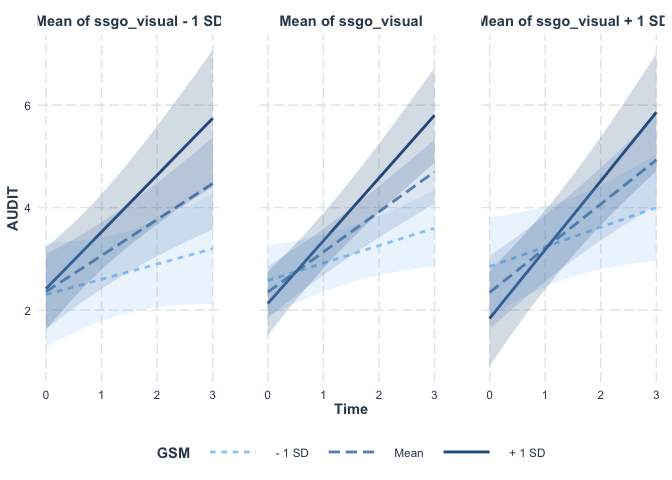<!-- -->

    ## 
    ## Running model with moderator: fsgo_salience 
    ## Linear mixed model fit by maximum likelihood . t-tests use Satterthwaite's method ['lmerModLmerTest']
    ## Formula: model_formula
    ##    Data: df_long
    ## 
    ##       AIC       BIC    logLik -2*log(L)  df.resid 
    ##    1805.9    1852.8    -891.0    1781.9       357 
    ## 
    ## Scaled residuals: 
    ##     Min      1Q  Median      3Q     Max 
    ## -2.7872 -0.4629 -0.1366  0.3415  4.1449 
    ## 
    ## Random effects:
    ##  Groups   Name        Variance Std.Dev.
    ##  mriID    (Intercept) 4.932    2.221   
    ##  Residual             4.535    2.130   
    ## Number of obs: 369, groups:  mriID, 133
    ## 
    ## Fixed effects:
    ##                         Estimate Std. Error        df t value Pr(>|t|)    
    ## (Intercept)              2.97959    0.71498 368.99752   4.167 3.84e-05 ***
    ## sex                     -0.14359    0.49944 133.31084  -0.288  0.77417    
    ## AdChild                  0.47927    0.26713 149.01405   1.794  0.07482 .  
    ## GSM                     -0.05195    0.06535 348.25453  -0.795  0.42715    
    ## fsgo_salience           -0.79389    0.74323 367.89047  -1.068  0.28615    
    ## Time                    -0.40736    0.37175 299.47178  -1.096  0.27405    
    ## GSM:fsgo_salience        0.08497    0.07619 352.24017   1.115  0.26551    
    ## GSM:Time                 0.12169    0.03895 302.56905   3.125  0.00195 ** 
    ## fsgo_salience:Time       0.25433    0.39001 281.54562   0.652  0.51487    
    ## GSM:fsgo_salience:Time  -0.02468    0.04361 284.08695  -0.566  0.57181    
    ## ---
    ## Signif. codes:  0 '***' 0.001 '**' 0.01 '*' 0.05 '.' 0.1 ' ' 1
    ## 
    ## Correlation of Fixed Effects:
    ##             (Intr) sex    AdChld GSM    fsg_sl Time   GSM:f_ GSM:Tm fsg_:T
    ## sex         -0.223                                                        
    ## AdChild      0.110  0.256                                                 
    ## GSM         -0.902 -0.023 -0.176                                          
    ## fsgo_salinc -0.010  0.055  0.054 -0.044                                   
    ## Time        -0.663 -0.021 -0.053  0.699 -0.033                            
    ## GSM:fsg_sln -0.024 -0.039 -0.034  0.078 -0.936  0.065                     
    ## GSM:Time     0.600  0.040  0.053 -0.686  0.077 -0.954 -0.112              
    ## fsg_slnc:Tm -0.029  0.011 -0.023  0.065 -0.674  0.000  0.683 -0.044       
    ## GSM:fsg_s:T  0.072 -0.011  0.041 -0.111  0.627 -0.046 -0.681  0.083 -0.957
    ## # A tibble: 12 × 10
    ##    effect   group    term                   estimate std.error statistic    df    p.value conf.low conf.high
    ##    <chr>    <chr>    <chr>                     <dbl>     <dbl>     <dbl> <dbl>      <dbl>    <dbl>     <dbl>
    ##  1 fixed    <NA>     (Intercept)              2.98      0.715      4.17   369.  0.0000384   1.57      4.39  
    ##  2 fixed    <NA>     sex                     -0.144     0.499     -0.288  133.  0.774      -1.13      0.844 
    ##  3 fixed    <NA>     AdChild                  0.479     0.267      1.79   149.  0.0748     -0.0486    1.01  
    ##  4 fixed    <NA>     GSM                     -0.0520    0.0653    -0.795  348.  0.427      -0.180     0.0766
    ##  5 fixed    <NA>     fsgo_salience           -0.794     0.743     -1.07   368.  0.286      -2.26      0.668 
    ##  6 fixed    <NA>     Time                    -0.407     0.372     -1.10   299.  0.274      -1.14      0.324 
    ##  7 fixed    <NA>     GSM:fsgo_salience        0.0850    0.0762     1.12   352.  0.266      -0.0649    0.235 
    ##  8 fixed    <NA>     GSM:Time                 0.122     0.0389     3.12   303.  0.00195     0.0451    0.198 
    ##  9 fixed    <NA>     fsgo_salience:Time       0.254     0.390      0.652  282.  0.515      -0.513     1.02  
    ## 10 fixed    <NA>     GSM:fsgo_salience:Time  -0.0247    0.0436    -0.566  284.  0.572      -0.111     0.0612
    ## 11 ran_pars mriID    sd__(Intercept)          2.22     NA         NA       NA  NA          NA        NA     
    ## 12 ran_pars Residual sd__Observation          2.13     NA         NA       NA  NA          NA        NA

    ## Computing profile confidence intervals ...

    ##                              2.5 %     97.5 %
    ## .sig01                  1.86296263 2.63190996
    ## .sigma                  1.95092099 2.33683691
    ## (Intercept)             1.56775534 4.39149002
    ## sex                    -1.13080736 0.84128417
    ## AdChild                -0.04646165 1.00803732
    ## GSM                    -0.18089752 0.07747850
    ## fsgo_salience          -2.25594746 0.66766943
    ## Time                   -1.13791345 0.32544935
    ## GSM:fsgo_salience      -0.06482748 0.23499464
    ## GSM:Time                0.04482189 0.19825690
    ## fsgo_salience:Time     -0.51235550 1.02183117
    ## GSM:fsgo_salience:Time -0.11055553 0.06101647
    ##              R2m           R2c
    ## [1,] 0.002380886 -0.0006444899
    ## Data: df_long
    ## Models:
    ## socialMis.lme: AUDIT ~ 1 + sex + AdChild + GSM * Time + (1 | mriID)
    ## full.lme: model_formula
    ##               npar    AIC    BIC  logLik -2*log(L)  Chisq Df Pr(>Chisq)
    ## socialMis.lme    8 1799.3 1830.6 -891.64    1783.3                     
    ## full.lme        12 1805.9 1852.8 -890.96    1781.9 1.3701  4     0.8494
    ##          GSM fsgo_salience   Time Test Estimate Std. Error       df t value  Pr(>|t|) Sig.
    ## 1   6.197971        sstest      0       -0.2673     0.3442 298.4860 -0.7764 0.4381112     
    ## 2    9.45891        sstest      0        0.0098     0.2631 196.7266  0.0373 0.9702623     
    ## 3  12.719849        sstest      0        0.2869     0.3787 335.8479  0.7575 0.4492736     
    ## 4     sstest     -0.907113      0       -0.1290     0.0913 358.6117 -1.4129 0.1585432     
    ## 5     sstest      0.081173      0       -0.0451     0.0661 346.6504 -0.6814 0.4960651     
    ## 6     sstest      1.069458      0        0.0389     0.1084 342.3846  0.3591 0.7197105     
    ## 7   6.197971        sstest      1       -0.1659     0.2840 192.9852 -0.5843 0.5597003     
    ## 8    9.45891        sstest      1        0.0307     0.2366 128.9975  0.1296 0.8970689     
    ## 9  12.719849        sstest      1        0.2273     0.3146 244.6988  0.7225 0.4706951     
    ## 10    sstest     -0.907113      1        0.0151     0.0716 364.3746  0.2104 0.8334718     
    ## 11    sstest      0.081173      1        0.0746     0.0479 352.5469  1.5576 0.1202293     
    ## 12    sstest      1.069458      1        0.1342     0.0754 360.0745  1.7809 0.0757689    .
    ## 13  6.197971        sstest      2       -0.0646     0.2991 231.5196 -0.2159 0.8292526     
    ## 14   9.45891        sstest      2        0.0515     0.2669 184.8926  0.1930 0.8471366     
    ## 15 12.719849        sstest      2        0.1676     0.3816 336.1936  0.4392 0.6607718     
    ## 16    sstest     -0.907113      2        0.1591     0.0869 332.0926  1.8312 0.0679728    .
    ## 17    sstest      0.081173      2        0.1943     0.0577 316.8883  3.3699 0.0008450  ***
    ## 18    sstest      1.069458      2        0.2295     0.0872 327.0006  2.6317 0.0088978   **
    ## 19  6.197971        sstest      3        0.0368     0.3807 350.4195  0.0966 0.9231287     
    ## 20   9.45891        sstest      3        0.0724     0.3390 312.4445  0.2135 0.8311118     
    ## 21 12.719849        sstest      3        0.1080     0.5324 364.9062  0.2028 0.8394073     
    ## 22    sstest     -0.907113      3        0.3032     0.1250 303.8081  2.4251 0.0158859    *
    ## 23    sstest      0.081173      3        0.3140     0.0864 297.1672  3.6358 0.0003265  ***
    ## 24    sstest      1.069458      3        0.3248     0.1324 295.0909  2.4539 0.0147113    *
    ## 25  6.197971     -0.907113 sstest        0.2550     0.2251 291.0114  1.1329 0.2581970     
    ## 26   9.45891     -0.907113 sstest        0.7248     0.1608 278.3254  4.5068 9.702e-06  ***
    ## 27 12.719849     -0.907113 sstest        1.1947     0.2473 286.1640  4.8311 2.217e-06  ***
    ## 28  6.197971      0.081173 sstest        0.3551     0.1578 285.2957  2.2501 0.0252028    *
    ## 29   9.45891      0.081173 sstest        0.7454     0.1125 272.0049  6.6246 1.857e-10  ***
    ## 30 12.719849      0.081173 sstest        1.1357     0.1828 291.5954  6.2116 1.804e-09  ***
    ## 31  6.197971      1.069458 sstest        0.4553     0.2115 267.2856  2.1521 0.0322836    *
    ## 32   9.45891      1.069458 sstest        0.7660     0.1652 267.1729  4.6381 5.509e-06  ***
    ## 33 12.719849      1.069458 sstest        1.0768     0.3078 286.4867  3.4980 0.0005433  ***

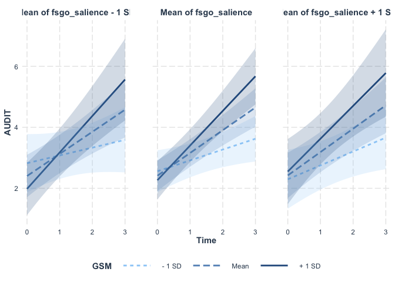<!-- -->

    ## 
    ## Running model with moderator: fsgo_subcortical 
    ## Linear mixed model fit by maximum likelihood . t-tests use Satterthwaite's method ['lmerModLmerTest']
    ## Formula: model_formula
    ##    Data: df_long
    ## 
    ##       AIC       BIC    logLik -2*log(L)  df.resid 
    ##    1796.8    1843.7    -886.4    1772.8       357 
    ## 
    ## Scaled residuals: 
    ##     Min      1Q  Median      3Q     Max 
    ## -2.9470 -0.4743 -0.1606  0.3508  4.2227 
    ## 
    ## Random effects:
    ##  Groups   Name        Variance Std.Dev.
    ##  mriID    (Intercept) 4.935    2.222   
    ##  Residual             4.385    2.094   
    ## Number of obs: 369, groups:  mriID, 133
    ## 
    ## Fixed effects:
    ##                            Estimate Std. Error        df t value Pr(>|t|)    
    ## (Intercept)                 2.98821    0.69890 368.98017   4.276 2.43e-05 ***
    ## sex                        -0.08984    0.49781 134.26075  -0.180 0.857052    
    ## AdChild                     0.41934    0.26563 150.04887   1.579 0.116519    
    ## GSM                        -0.05918    0.06349 347.84012  -0.932 0.351868    
    ## fsgo_subcortical           -1.93784    0.70627 366.49674  -2.744 0.006373 ** 
    ## Time                       -0.48671    0.36186 298.08900  -1.345 0.179645    
    ## GSM:fsgo_subcortical        0.20888    0.06907 339.05226   3.024 0.002683 ** 
    ## GSM:Time                    0.13255    0.03795 302.42050   3.493 0.000549 ***
    ## fsgo_subcortical:Time       1.14530    0.44306 291.29948   2.585 0.010225 *  
    ## GSM:fsgo_subcortical:Time  -0.11744    0.05097 295.01896  -2.304 0.021907 *  
    ## ---
    ## Signif. codes:  0 '***' 0.001 '**' 0.01 '*' 0.05 '.' 0.1 ' ' 1
    ## 
    ## Correlation of Fixed Effects:
    ##             (Intr) sex    AdChld GSM    fsg_sb Time   GSM:f_ GSM:Tm fsg_:T
    ## sex         -0.227                                                        
    ## AdChild      0.106  0.248                                                 
    ## GSM         -0.899 -0.023 -0.170                                          
    ## fsg_sbcrtcl  0.026 -0.061  0.077 -0.005                                   
    ## Time        -0.656 -0.020 -0.041  0.692  0.035                            
    ## GSM:fsg_sbc -0.016  0.034 -0.099  0.001 -0.913 -0.045                     
    ## GSM:Time     0.593  0.039  0.043 -0.679 -0.036 -0.954  0.046              
    ## fsg_sbcrt:T  0.029  0.036 -0.013 -0.049 -0.602 -0.080  0.624  0.091       
    ## GSM:fsg_s:T -0.026 -0.041  0.017  0.046  0.538  0.085 -0.607 -0.098 -0.961
    ## # A tibble: 12 × 10
    ##    effect   group    term                      estimate std.error statistic    df    p.value conf.low conf.high
    ##    <chr>    <chr>    <chr>                        <dbl>     <dbl>     <dbl> <dbl>      <dbl>    <dbl>     <dbl>
    ##  1 fixed    <NA>     (Intercept)                 2.99      0.699      4.28   369.  0.0000243   1.61      4.36  
    ##  2 fixed    <NA>     sex                        -0.0898    0.498     -0.180  134.  0.857      -1.07      0.895 
    ##  3 fixed    <NA>     AdChild                     0.419     0.266      1.58   150.  0.117      -0.106     0.944 
    ##  4 fixed    <NA>     GSM                        -0.0592    0.0635    -0.932  348.  0.352      -0.184     0.0657
    ##  5 fixed    <NA>     fsgo_subcortical           -1.94      0.706     -2.74   366.  0.00637    -3.33     -0.549 
    ##  6 fixed    <NA>     Time                       -0.487     0.362     -1.35   298.  0.180      -1.20      0.225 
    ##  7 fixed    <NA>     GSM:fsgo_subcortical        0.209     0.0691     3.02   339.  0.00268     0.0730    0.345 
    ##  8 fixed    <NA>     GSM:Time                    0.133     0.0379     3.49   302.  0.000549    0.0579    0.207 
    ##  9 fixed    <NA>     fsgo_subcortical:Time       1.15      0.443      2.58   291.  0.0102      0.273     2.02  
    ## 10 fixed    <NA>     GSM:fsgo_subcortical:Time  -0.117     0.0510    -2.30   295.  0.0219     -0.218    -0.0171
    ## 11 ran_pars mriID    sd__(Intercept)             2.22     NA         NA       NA  NA          NA        NA     
    ## 12 ran_pars Residual sd__Observation             2.09     NA         NA       NA  NA          NA        NA

    ## Computing profile confidence intervals ...

    ##                                 2.5 %      97.5 %
    ## .sig01                     1.86923013  2.62746594
    ## .sigma                     1.91867548  2.29745070
    ## (Intercept)                1.60980883  4.36674211
    ## sex                       -1.07395140  0.89165308
    ## AdChild                   -0.10357530  0.94476138
    ## GSM                       -0.18429131  0.06633043
    ## fsgo_subcortical          -3.32614967 -0.54984269
    ## Time                      -1.19780185  0.22598729
    ## GSM:fsgo_subcortical       0.07315430  0.34472628
    ## GSM:Time                   0.05774838  0.20713026
    ## fsgo_subcortical:Time      0.27376876  2.01633248
    ## GSM:fsgo_subcortical:Time -0.21764973 -0.01721060
    ##             R2m        R2c
    ## [1,] 0.01532286 0.01310619
    ## Data: df_long
    ## Models:
    ## socialMis.lme: AUDIT ~ 1 + sex + AdChild + GSM * Time + (1 | mriID)
    ## full.lme: model_formula
    ##               npar    AIC    BIC  logLik -2*log(L)  Chisq Df Pr(>Chisq)  
    ## socialMis.lme    8 1799.3 1830.6 -891.64    1783.3                       
    ## full.lme        12 1796.8 1843.7 -886.39    1772.8 10.503  4    0.03276 *
    ## ---
    ## Signif. codes:  0 '***' 0.001 '**' 0.01 '*' 0.05 '.' 0.1 ' ' 1
    ##          GSM fsgo_subcortical   Time Test Estimate Std. Error       df t value  Pr(>|t|) Sig.
    ## 1   6.197971           sstest      0       -0.6432     0.3602 293.2875 -1.7854 0.0752269    .
    ## 2    9.45891           sstest      0        0.0380     0.2877 194.0480  0.1319 0.8951691     
    ## 3  12.719849           sstest      0        0.7191     0.3704 307.9672  1.9413 0.0531308    .
    ## 4     sstest        -0.871704      0       -0.2413     0.0875 334.1188 -2.7583 0.0061297   **
    ## 5     sstest          0.01239      0       -0.0566     0.0635 348.0672 -0.8914 0.3733467     
    ## 6     sstest         0.896484      0        0.1281     0.0887 352.1456  1.4437 0.1497023     
    ## 7   6.197971           sstest      1       -0.2258     0.3041 189.3123 -0.7424 0.4587383     
    ## 8    9.45891           sstest      1        0.0724     0.2632 133.9967  0.2752 0.7835871     
    ## 9  12.719849           sstest      1        0.3706     0.3346 242.8183  1.1077 0.2690790     
    ## 10    sstest        -0.871704      1       -0.0063     0.0664 345.9656 -0.0955 0.9239422     
    ## 11    sstest          0.01239      1        0.0745     0.0469 352.2711  1.5878 0.1132395     
    ## 12    sstest         0.896484      1        0.1553     0.0695 360.2060  2.2336 0.0261205    *
    ## 13  6.197971           sstest      2        0.1917     0.3310 235.0743  0.5790 0.5631379     
    ## 14   9.45891           sstest      2        0.1069     0.3042 203.9774  0.3515 0.7256131     
    ## 15 12.719849           sstest      2        0.0221     0.4650 360.5155  0.0476 0.9620360     
    ## 16    sstest        -0.871704      2        0.2286     0.0930 320.0919  2.4574 0.0145266    *
    ## 17    sstest          0.01239      2        0.2056     0.0570 316.6314  3.6099 0.0003559  ***
    ## 18    sstest         0.896484      2        0.1826     0.0904 325.9377  2.0190 0.0443007    *
    ## 19  6.197971           sstest      3        0.6091     0.4256 348.5993  1.4312 0.1532647     
    ## 20   9.45891           sstest      3        0.1414     0.3906 329.1853  0.3620 0.7175827     
    ## 21 12.719849           sstest      3       -0.3263     0.6709 357.2864 -0.4864 0.6269740     
    ## 22    sstest        -0.871704      3        0.4635     0.1428 306.4869  3.2463 0.0012985   **
    ## 23    sstest          0.01239      3        0.3367     0.0846 297.5661  3.9799 8.669e-05  ***
    ## 24    sstest         0.896484      3        0.2099     0.1338 302.7351  1.5688 0.1177474     
    ## 25  6.197971        -0.871704 sstest       -0.0290     0.2146 288.0177 -0.1353 0.8925032     
    ## 26   9.45891        -0.871704 sstest        0.7371     0.1632 274.8222  4.5149 9.405e-06  ***
    ## 27 12.719849        -0.871704 sstest        1.5031     0.2948 291.3559  5.0992 6.152e-07  ***
    ## 28  6.197971          0.01239 sstest        0.3400     0.1544 283.2930  2.2025 0.0284357    *
    ## 29   9.45891          0.01239 sstest        0.7675     0.1092 269.7565  7.0311 1.681e-11  ***
    ## 30 12.719849          0.01239 sstest        1.1950     0.1747 291.9770  6.8390 4.673e-11  ***
    ## 31  6.197971         0.896484 sstest        0.7091     0.2102 271.6462  3.3736 0.0008500  ***
    ## 32   9.45891         0.896484 sstest        0.7980     0.1610 269.0401  4.9581 1.262e-06  ***
    ## 33 12.719849         0.896484 sstest        0.8870     0.2747 291.2125  3.2292 0.0013832   **

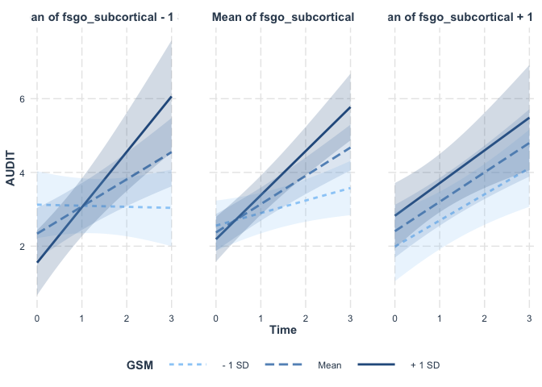<!-- -->

``` r
df_long <- df_long %>% rename(SocialMis = GSM)
```

## Step 6b: Full model controlling for StopAcc and GoRT

``` r
df_long <- df_long %>% rename(GSM = SocialMis)

moderators <- c("SUPPS_Impulsive", "BIS_Impulsive", "CDRISC_Resilience", "stateAnxiety", "traitAnxiety", "BDI_depression", "GoAcc", "GoRT", "StopAcc", "SSD", "SSRT", "pes_pse_psc", "pea_pse_psc", "ssgo_auditory", "ssgo_default", "ssgo_memoryRetrieval", "ssgo_visual", "fsgo_salience", "fsgo_subcortical")

for (mod_var in moderators) {
  # Create model formula
  formula_str <- paste("AUDIT ~ 1 + sex + AdChild + StopAcc + GoRT + GSM *", mod_var, "* Time + (1 | mriID)")
  model_formula <- as.formula(paste(formula_str, collapse = " "))

  cat("\nRunning model with moderator:", mod_var, "\n")
  full.lme <- lmer(model_formula, data = df_long, REML = FALSE, na.action = na.exclude)
  print(summary(full.lme))
  full.coef <- tidy(full.lme, conf.int = TRUE)
  print(full.coef)

  # model_compare <- anova(socialMis.lme, full.lme)
  # print(model_compare)

  # Use tidy eval to pass variable names
  # print(simple_slopes(full.lme, pred = "Time", levels=list('Time'=c(0, 1, 2, 3, 'sstest'))))
  # print(interact_plot(full.lme, pred = "Time", modx = "GSM", mod2 = !!sym(mod_var), interval = TRUE))
}
```

    ## 
    ## Running model with moderator: SUPPS_Impulsive 
    ## Linear mixed model fit by maximum likelihood . t-tests use Satterthwaite's method ['lmerModLmerTest']
    ## Formula: model_formula
    ##    Data: df_long
    ## 
    ##       AIC       BIC    logLik -2*log(L)  df.resid 
    ##    1755.0    1809.5    -863.5    1727.0       349 
    ## 
    ## Scaled residuals: 
    ##     Min      1Q  Median      3Q     Max 
    ## -2.5014 -0.4453 -0.1363  0.3570  3.5447 
    ## 
    ## Random effects:
    ##  Groups   Name        Variance Std.Dev.
    ##  mriID    (Intercept) 5.130    2.265   
    ##  Residual             4.057    2.014   
    ## Number of obs: 363, groups:  mriID, 131
    ## 
    ## Fixed effects:
    ##                           Estimate Std. Error        df t value Pr(>|t|)    
    ## (Intercept)                3.06834    0.69541 362.99372   4.412 1.35e-05 ***
    ## sex                       -0.18627    0.51754 130.83125  -0.360  0.71949    
    ## AdChild                    0.49383    0.27003 143.58415   1.829  0.06950 .  
    ## StopAcc                   -0.17261    0.56176 124.35314  -0.307  0.75915    
    ## GoRT                       0.23109    0.43904 127.00270   0.526  0.59956    
    ## GSM                       -0.06551    0.06299 335.52061  -1.040  0.29908    
    ## SUPPS_Impulsive            1.14783    0.67466 360.37584   1.701  0.08974 .  
    ## Time                      -0.38708    0.35391 287.44676  -1.094  0.27499    
    ## GSM:SUPPS_Impulsive       -0.08371    0.06370 360.37722  -1.314  0.18962    
    ## GSM:Time                   0.11975    0.03701 291.40350   3.235  0.00135 ** 
    ## SUPPS_Impulsive:Time      -0.23169    0.35550 301.53917  -0.652  0.51507    
    ## GSM:SUPPS_Impulsive:Time   0.02069    0.03734 311.09130   0.554  0.57981    
    ## ---
    ## Signif. codes:  0 '***' 0.001 '**' 0.01 '*' 0.05 '.' 0.1 ' ' 1
    ## 
    ## Correlation of Fixed Effects:
    ##              (Intr) sex    AdChld StpAcc GoRT   GSM    SUPPS_Im Time   GSM:SUPPS_Im GSM:Tm SUPPS_I:
    ## sex          -0.253                                                                                
    ## AdChild       0.083  0.281                                                                         
    ## StopAcc       0.021 -0.095 -0.117                                                                  
    ## GoRT          0.022 -0.037  0.016 -0.814                                                           
    ## GSM          -0.888 -0.020 -0.176  0.086 -0.066                                                    
    ## SUPPS_Impls  -0.116  0.085 -0.018  0.061 -0.082  0.096                                             
    ## Time         -0.649 -0.019 -0.053  0.056 -0.050  0.693  0.076                                      
    ## GSM:SUPPS_Im  0.111 -0.080  0.012 -0.032  0.053 -0.086 -0.925   -0.070                             
    ## GSM:Time      0.586  0.040  0.056 -0.059  0.046 -0.680 -0.043   -0.954  0.033                      
    ## SUPPS_Imp:T   0.085 -0.032  0.010 -0.007  0.031 -0.074 -0.684   -0.101  0.699        0.078         
    ## GSM:SUPPS_I: -0.060  0.041 -0.005 -0.003 -0.022  0.041  0.643    0.079 -0.706       -0.055 -0.954  
    ## # A tibble: 14 × 10
    ##    effect   group    term                     estimate std.error statistic    df    p.value conf.low conf.high
    ##    <chr>    <chr>    <chr>                       <dbl>     <dbl>     <dbl> <dbl>      <dbl>    <dbl>     <dbl>
    ##  1 fixed    <NA>     (Intercept)                3.07      0.695      4.41   363.  0.0000135   1.70      4.44  
    ##  2 fixed    <NA>     sex                       -0.186     0.518     -0.360  131.  0.719      -1.21      0.838 
    ##  3 fixed    <NA>     AdChild                    0.494     0.270      1.83   144.  0.0695     -0.0399    1.03  
    ##  4 fixed    <NA>     StopAcc                   -0.173     0.562     -0.307  124.  0.759      -1.28      0.939 
    ##  5 fixed    <NA>     GoRT                       0.231     0.439      0.526  127.  0.600      -0.638     1.10  
    ##  6 fixed    <NA>     GSM                       -0.0655    0.0630    -1.04   336.  0.299      -0.189     0.0584
    ##  7 fixed    <NA>     SUPPS_Impulsive            1.15      0.675      1.70   360.  0.0897     -0.179     2.47  
    ##  8 fixed    <NA>     Time                      -0.387     0.354     -1.09   287.  0.275      -1.08      0.309 
    ##  9 fixed    <NA>     GSM:SUPPS_Impulsive       -0.0837    0.0637    -1.31   360.  0.190      -0.209     0.0416
    ## 10 fixed    <NA>     GSM:Time                   0.120     0.0370     3.24   291.  0.00135     0.0469    0.193 
    ## 11 fixed    <NA>     SUPPS_Impulsive:Time      -0.232     0.355     -0.652  302.  0.515      -0.931     0.468 
    ## 12 fixed    <NA>     GSM:SUPPS_Impulsive:Time   0.0207    0.0373     0.554  311.  0.580      -0.0528    0.0942
    ## 13 ran_pars mriID    sd__(Intercept)            2.27     NA         NA       NA  NA          NA        NA     
    ## 14 ran_pars Residual sd__Observation            2.01     NA         NA       NA  NA          NA        NA     
    ## 
    ## Running model with moderator: BIS_Impulsive 
    ## Linear mixed model fit by maximum likelihood . t-tests use Satterthwaite's method ['lmerModLmerTest']
    ## Formula: model_formula
    ##    Data: df_long
    ## 
    ##       AIC       BIC    logLik -2*log(L)  df.resid 
    ##    1756.1    1810.6    -864.1    1728.1       349 
    ## 
    ## Scaled residuals: 
    ##     Min      1Q  Median      3Q     Max 
    ## -2.6448 -0.4636 -0.1383  0.3557  3.6594 
    ## 
    ## Random effects:
    ##  Groups   Name        Variance Std.Dev.
    ##  mriID    (Intercept) 5.053    2.248   
    ##  Residual             4.097    2.024   
    ## Number of obs: 363, groups:  mriID, 131
    ## 
    ## Fixed effects:
    ##                         Estimate Std. Error        df t value Pr(>|t|)    
    ## (Intercept)              3.20750    0.69489 362.97742   4.616 5.44e-06 ***
    ## sex                     -0.28006    0.51433 134.19601  -0.545  0.58699    
    ## AdChild                  0.46916    0.27023 146.02399   1.736  0.08465 .  
    ## StopAcc                 -0.19948    0.56890 128.00594  -0.351  0.72643    
    ## GoRT                     0.27990    0.44355 131.51253   0.631  0.52911    
    ## GSM                     -0.07542    0.06313 333.60293  -1.195  0.23305    
    ## BIS_Impulsive           -0.12882    0.68233 341.39648  -0.189  0.85036    
    ## Time                    -0.40946    0.35462 287.88673  -1.155  0.24919    
    ## GSM:BIS_Impulsive        0.03872    0.06459 359.73753   0.600  0.54918    
    ## GSM:Time                 0.11832    0.03727 292.02121   3.175  0.00166 ** 
    ## BIS_Impulsive:Time       0.41413    0.38673 318.87492   1.071  0.28505    
    ## GSM:BIS_Impulsive:Time  -0.05481    0.04344 325.43883  -1.262  0.20800    
    ## ---
    ## Signif. codes:  0 '***' 0.001 '**' 0.01 '*' 0.05 '.' 0.1 ' ' 1
    ## 
    ## Correlation of Fixed Effects:
    ##             (Intr) sex    AdChld StpAcc GoRT   GSM    BIS_Im Time   GSM:BIS_Im GSM:Tm BIS_I:
    ## sex         -0.250                                                                          
    ## AdChild      0.075  0.284                                                                   
    ## StopAcc      0.036 -0.094 -0.127                                                            
    ## GoRT         0.008 -0.037  0.024 -0.819                                                     
    ## GSM         -0.889 -0.019 -0.166  0.071 -0.053                                              
    ## BIS_Impulsv -0.086  0.054  0.021  0.072 -0.095  0.102                                       
    ## Time        -0.650 -0.021 -0.048  0.043 -0.037  0.693  0.046                                
    ## GSM:BIS_Imp  0.105 -0.054 -0.056  0.000  0.033 -0.117 -0.923 -0.056                         
    ## GSM:Time     0.588  0.041  0.052 -0.044  0.031 -0.680 -0.035 -0.954  0.042                  
    ## BIS_Impls:T  0.029 -0.019 -0.036 -0.039  0.057 -0.038 -0.636 -0.009  0.648     -0.018       
    ## GSM:BIS_I:T -0.022  0.029  0.046  0.039 -0.061  0.024  0.568 -0.009 -0.622      0.045 -0.959
    ## # A tibble: 14 × 10
    ##    effect   group    term                   estimate std.error statistic    df     p.value conf.low conf.high
    ##    <chr>    <chr>    <chr>                     <dbl>     <dbl>     <dbl> <dbl>       <dbl>    <dbl>     <dbl>
    ##  1 fixed    <NA>     (Intercept)              3.21      0.695      4.62   363.  0.00000544   1.84      4.57  
    ##  2 fixed    <NA>     sex                     -0.280     0.514     -0.545  134.  0.587       -1.30      0.737 
    ##  3 fixed    <NA>     AdChild                  0.469     0.270      1.74   146.  0.0846      -0.0649    1.00  
    ##  4 fixed    <NA>     StopAcc                 -0.199     0.569     -0.351  128.  0.726       -1.33      0.926 
    ##  5 fixed    <NA>     GoRT                     0.280     0.444      0.631  132.  0.529       -0.598     1.16  
    ##  6 fixed    <NA>     GSM                     -0.0754    0.0631    -1.19   334.  0.233       -0.200     0.0488
    ##  7 fixed    <NA>     BIS_Impulsive           -0.129     0.682     -0.189  341.  0.850       -1.47      1.21  
    ##  8 fixed    <NA>     Time                    -0.409     0.355     -1.15   288.  0.249       -1.11      0.289 
    ##  9 fixed    <NA>     GSM:BIS_Impulsive        0.0387    0.0646     0.600  360.  0.549       -0.0883    0.166 
    ## 10 fixed    <NA>     GSM:Time                 0.118     0.0373     3.17   292.  0.00166      0.0450    0.192 
    ## 11 fixed    <NA>     BIS_Impulsive:Time       0.414     0.387      1.07   319.  0.285       -0.347     1.18  
    ## 12 fixed    <NA>     GSM:BIS_Impulsive:Time  -0.0548    0.0434    -1.26   325.  0.208       -0.140     0.0307
    ## 13 ran_pars mriID    sd__(Intercept)          2.25     NA         NA       NA  NA           NA        NA     
    ## 14 ran_pars Residual sd__Observation          2.02     NA         NA       NA  NA           NA        NA     
    ## 
    ## Running model with moderator: CDRISC_Resilience 
    ## Linear mixed model fit by maximum likelihood . t-tests use Satterthwaite's method ['lmerModLmerTest']
    ## Formula: model_formula
    ##    Data: df_long
    ## 
    ##       AIC       BIC    logLik -2*log(L)  df.resid 
    ##    1805.6    1860.4    -888.8    1777.6       355 
    ## 
    ## Scaled residuals: 
    ##     Min      1Q  Median      3Q     Max 
    ## -2.6854 -0.4473 -0.1465  0.3544  4.1031 
    ## 
    ## Random effects:
    ##  Groups   Name        Variance Std.Dev.
    ##  mriID    (Intercept) 5.141    2.267   
    ##  Residual             4.399    2.097   
    ## Number of obs: 369, groups:  mriID, 133
    ## 
    ## Fixed effects:
    ##                             Estimate Std. Error        df t value Pr(>|t|)    
    ## (Intercept)                  2.94564    0.71303 368.99987   4.131 4.47e-05 ***
    ## sex                         -0.19317    0.51679 134.69652  -0.374  0.70914    
    ## AdChild                      0.42107    0.27428 150.61709   1.535  0.12683    
    ## StopAcc                     -0.30643    0.56481 128.70004  -0.543  0.58839    
    ## GoRT                         0.36830    0.44097 131.07132   0.835  0.40513    
    ## GSM                         -0.05734    0.06539 343.43449  -0.877  0.38112    
    ## CDRISC_Resilience            1.09400    0.65479 368.08670   1.671  0.09562 .  
    ## Time                        -0.36748    0.36839 295.70225  -0.998  0.31932    
    ## GSM:CDRISC_Resilience       -0.09405    0.05641 349.66857  -1.667  0.09638 .  
    ## GSM:Time                     0.12096    0.03866 298.61347   3.129  0.00193 ** 
    ## CDRISC_Resilience:Time      -0.31183    0.38169 321.62989  -0.817  0.41455    
    ## GSM:CDRISC_Resilience:Time   0.01295    0.03738 318.67509   0.347  0.72917    
    ## ---
    ## Signif. codes:  0 '***' 0.001 '**' 0.01 '*' 0.05 '.' 0.1 ' ' 1
    ## 
    ## Correlation of Fixed Effects:
    ##               (Intr) sex    AdChld StpAcc GoRT   GSM    CDRISC_Rs Time   GSM:CDRISC_Rs GSM:Tm CDRISC_R:
    ## sex           -0.227                                                                                   
    ## AdChild        0.083  0.275                                                                            
    ## StopAcc        0.020 -0.088 -0.127                                                                     
    ## GoRT           0.018 -0.042  0.021 -0.811                                                              
    ## GSM           -0.892 -0.038 -0.161  0.083 -0.061                                                       
    ## CDRISC_Rsln   -0.021 -0.078 -0.053  0.004  0.022  0.000                                                
    ## Time          -0.662 -0.028 -0.049  0.056 -0.047  0.701  0.059                                         
    ## GSM:CDRISC_Rs -0.027  0.056  0.083 -0.031 -0.004  0.069 -0.914    -0.010                               
    ## GSM:Time       0.601  0.045  0.049 -0.059  0.044 -0.690 -0.026    -0.955 -0.028                        
    ## CDRISC_Rs:T    0.050  0.043  0.033 -0.021  0.000 -0.027 -0.675    -0.065  0.689         0.024          
    ## GSM:CDRISC_R: -0.007 -0.039 -0.018  0.013  0.001 -0.023  0.603     0.011 -0.669         0.033 -0.947   
    ## # A tibble: 14 × 10
    ##    effect   group    term                       estimate std.error statistic    df    p.value conf.low conf.high
    ##    <chr>    <chr>    <chr>                         <dbl>     <dbl>     <dbl> <dbl>      <dbl>    <dbl>     <dbl>
    ##  1 fixed    <NA>     (Intercept)                  2.95      0.713      4.13   369.  0.0000447   1.54      4.35  
    ##  2 fixed    <NA>     sex                         -0.193     0.517     -0.374  135.  0.709      -1.22      0.829 
    ##  3 fixed    <NA>     AdChild                      0.421     0.274      1.54   151.  0.127      -0.121     0.963 
    ##  4 fixed    <NA>     StopAcc                     -0.306     0.565     -0.543  129.  0.588      -1.42      0.811 
    ##  5 fixed    <NA>     GoRT                         0.368     0.441      0.835  131.  0.405      -0.504     1.24  
    ##  6 fixed    <NA>     GSM                         -0.0573    0.0654    -0.877  343.  0.381      -0.186     0.0713
    ##  7 fixed    <NA>     CDRISC_Resilience            1.09      0.655      1.67   368.  0.0956     -0.194     2.38  
    ##  8 fixed    <NA>     Time                        -0.367     0.368     -0.998  296.  0.319      -1.09      0.358 
    ##  9 fixed    <NA>     GSM:CDRISC_Resilience       -0.0940    0.0564    -1.67   350.  0.0964     -0.205     0.0169
    ## 10 fixed    <NA>     GSM:Time                     0.121     0.0387     3.13   299.  0.00193     0.0449    0.197 
    ## 11 fixed    <NA>     CDRISC_Resilience:Time      -0.312     0.382     -0.817  322.  0.415      -1.06      0.439 
    ## 12 fixed    <NA>     GSM:CDRISC_Resilience:Time   0.0130    0.0374     0.347  319.  0.729      -0.0606    0.0865
    ## 13 ran_pars mriID    sd__(Intercept)              2.27     NA         NA       NA  NA          NA        NA     
    ## 14 ran_pars Residual sd__Observation              2.10     NA         NA       NA  NA          NA        NA     
    ## 
    ## Running model with moderator: stateAnxiety 
    ## Linear mixed model fit by maximum likelihood . t-tests use Satterthwaite's method ['lmerModLmerTest']
    ## Formula: model_formula
    ##    Data: df_long
    ## 
    ##       AIC       BIC    logLik -2*log(L)  df.resid 
    ##    1804.7    1859.5    -888.4    1776.7       355 
    ## 
    ## Scaled residuals: 
    ##     Min      1Q  Median      3Q     Max 
    ## -2.6350 -0.4422 -0.1542  0.3703  4.0881 
    ## 
    ## Random effects:
    ##  Groups   Name        Variance Std.Dev.
    ##  mriID    (Intercept) 4.884    2.210   
    ##  Residual             4.465    2.113   
    ## Number of obs: 369, groups:  mriID, 133
    ## 
    ## Fixed effects:
    ##                         Estimate Std. Error         df t value Pr(>|t|)    
    ## (Intercept)             2.869373   0.760890 366.458613   3.771 0.000189 ***
    ## sex                    -0.138829   0.506635 135.230915  -0.274 0.784487    
    ## AdChild                 0.459361   0.276460 144.888311   1.662 0.098760 .  
    ## StopAcc                -0.393960   0.555166 130.569330  -0.710 0.479201    
    ## GoRT                    0.377493   0.434149 132.505210   0.870 0.386145    
    ## GSM                    -0.060452   0.072192 333.887037  -0.837 0.402980    
    ## stateAnxiety           -1.094881   0.621598 366.038893  -1.761 0.079006 .  
    ## Time                   -0.329938   0.412578 298.920973  -0.800 0.424520    
    ## GSM:stateAnxiety        0.097299   0.053709 330.173791   1.812 0.070955 .  
    ## GSM:Time                0.117154   0.044612 301.641036   2.626 0.009079 ** 
    ## stateAnxiety:Time       0.168477   0.324604 292.185824   0.519 0.604137    
    ## GSM:stateAnxiety:Time  -0.005606   0.032183 297.135562  -0.174 0.861828    
    ## ---
    ## Signif. codes:  0 '***' 0.001 '**' 0.01 '*' 0.05 '.' 0.1 ' ' 1
    ## 
    ## Correlation of Fixed Effects:
    ##             (Intr) sex    AdChld StpAcc GoRT   GSM    sttAnx Time   GSM:sA GSM:Tm sttA:T
    ## sex         -0.210                                                                      
    ## AdChild      0.031  0.276                                                               
    ## StopAcc      0.018 -0.093 -0.124                                                        
    ## GoRT         0.004 -0.037  0.029 -0.812                                                 
    ## GSM         -0.904 -0.034 -0.093  0.076 -0.039                                          
    ## stateAnxity  0.069 -0.009 -0.059  0.009  0.002  0.025                                   
    ## Time        -0.704 -0.026 -0.011  0.048 -0.027  0.746 -0.017                            
    ## GSM:sttAnxt  0.086  0.005 -0.044  0.003 -0.025 -0.206 -0.890 -0.127                     
    ## GSM:Time     0.647  0.042  0.009 -0.045  0.018 -0.739 -0.054 -0.960  0.205              
    ## sttAnxty:Tm  0.002 -0.011 -0.028  0.052 -0.046 -0.077 -0.682 -0.045  0.697  0.144       
    ## GSM:sttAn:T -0.122  0.004  0.034 -0.049  0.054  0.210  0.597  0.206 -0.696 -0.309 -0.934
    ## # A tibble: 14 × 10
    ##    effect   group    term                  estimate std.error statistic    df   p.value conf.low conf.high
    ##    <chr>    <chr>    <chr>                    <dbl>     <dbl>     <dbl> <dbl>     <dbl>    <dbl>     <dbl>
    ##  1 fixed    <NA>     (Intercept)            2.87       0.761      3.77   366.  0.000189  1.37       4.37  
    ##  2 fixed    <NA>     sex                   -0.139      0.507     -0.274  135.  0.784    -1.14       0.863 
    ##  3 fixed    <NA>     AdChild                0.459      0.276      1.66   145.  0.0988   -0.0871     1.01  
    ##  4 fixed    <NA>     StopAcc               -0.394      0.555     -0.710  131.  0.479    -1.49       0.704 
    ##  5 fixed    <NA>     GoRT                   0.377      0.434      0.870  133.  0.386    -0.481      1.24  
    ##  6 fixed    <NA>     GSM                   -0.0605     0.0722    -0.837  334.  0.403    -0.202      0.0816
    ##  7 fixed    <NA>     stateAnxiety          -1.09       0.622     -1.76   366.  0.0790   -2.32       0.127 
    ##  8 fixed    <NA>     Time                  -0.330      0.413     -0.800  299.  0.425    -1.14       0.482 
    ##  9 fixed    <NA>     GSM:stateAnxiety       0.0973     0.0537     1.81   330.  0.0710   -0.00836    0.203 
    ## 10 fixed    <NA>     GSM:Time               0.117      0.0446     2.63   302.  0.00908   0.0294     0.205 
    ## 11 fixed    <NA>     stateAnxiety:Time      0.168      0.325      0.519  292.  0.604    -0.470      0.807 
    ## 12 fixed    <NA>     GSM:stateAnxiety:Time -0.00561    0.0322    -0.174  297.  0.862    -0.0689     0.0577
    ## 13 ran_pars mriID    sd__(Intercept)        2.21      NA         NA       NA  NA        NA         NA     
    ## 14 ran_pars Residual sd__Observation        2.11      NA         NA       NA  NA        NA         NA     
    ## 
    ## Running model with moderator: traitAnxiety 
    ## Linear mixed model fit by maximum likelihood . t-tests use Satterthwaite's method ['lmerModLmerTest']
    ## Formula: model_formula
    ##    Data: df_long
    ## 
    ##       AIC       BIC    logLik -2*log(L)  df.resid 
    ##    1806.9    1861.6    -889.4    1778.9       355 
    ## 
    ## Scaled residuals: 
    ##     Min      1Q  Median      3Q     Max 
    ## -2.6640 -0.4434 -0.1686  0.3150  4.1847 
    ## 
    ## Random effects:
    ##  Groups   Name        Variance Std.Dev.
    ##  mriID    (Intercept) 4.973    2.230   
    ##  Residual             4.472    2.115   
    ## Number of obs: 369, groups:  mriID, 133
    ## 
    ## Fixed effects:
    ##                         Estimate Std. Error         df t value Pr(>|t|)    
    ## (Intercept)             3.003812   0.778980 365.912705   3.856 0.000136 ***
    ## sex                    -0.103646   0.514865 135.584868  -0.201 0.840760    
    ## AdChild                 0.428293   0.277596 144.844578   1.543 0.125046    
    ## StopAcc                -0.389755   0.559693 131.239567  -0.696 0.487427    
    ## GoRT                    0.376516   0.439057 132.777477   0.858 0.392683    
    ## GSM                    -0.073636   0.075522 337.409155  -0.975 0.330243    
    ## traitAnxiety           -0.771819   0.600984 368.190986  -1.284 0.199859    
    ## Time                   -0.338761   0.429414 300.798230  -0.789 0.430797    
    ## GSM:traitAnxiety        0.076829   0.052224 357.710428   1.471 0.142130    
    ## GSM:Time                0.116157   0.046865 304.435243   2.479 0.013733 *  
    ## traitAnxiety:Time       0.079551   0.316718 290.898271   0.251 0.801858    
    ## GSM:traitAnxiety:Time   0.002887   0.032110 296.938497   0.090 0.928420    
    ## ---
    ## Signif. codes:  0 '***' 0.001 '**' 0.01 '*' 0.05 '.' 0.1 ' ' 1
    ## 
    ## Correlation of Fixed Effects:
    ##             (Intr) sex    AdChld StpAcc GoRT   GSM    trtAnx Time   GSM:tA GSM:Tm trtA:T
    ## sex         -0.171                                                                      
    ## AdChild      0.035  0.236                                                               
    ## StopAcc      0.006 -0.088 -0.121                                                        
    ## GoRT         0.007 -0.050  0.039 -0.811                                                 
    ## GSM         -0.906 -0.075 -0.082  0.087 -0.041                                          
    ## traitAnxity  0.025  0.047 -0.042  0.021 -0.047  0.059                                   
    ## Time        -0.715 -0.044 -0.017  0.056 -0.034  0.749 -0.030                            
    ## GSM:trtAnxt  0.151  0.020 -0.063 -0.016  0.008 -0.277 -0.874 -0.136                     
    ## GSM:Time     0.661  0.058  0.019 -0.053  0.028 -0.740 -0.026 -0.963  0.196              
    ## trtAnxty:Tm  0.012 -0.018 -0.010  0.057 -0.037 -0.075 -0.607 -0.065  0.601  0.157       
    ## GSM:trtAn:T -0.157  0.007  0.007 -0.045  0.034  0.230  0.488  0.265 -0.576 -0.363 -0.916
    ## # A tibble: 14 × 10
    ##    effect   group    term                  estimate std.error statistic    df   p.value conf.low conf.high
    ##    <chr>    <chr>    <chr>                    <dbl>     <dbl>     <dbl> <dbl>     <dbl>    <dbl>     <dbl>
    ##  1 fixed    <NA>     (Intercept)            3.00       0.779     3.86    366.  0.000136   1.47      4.54  
    ##  2 fixed    <NA>     sex                   -0.104      0.515    -0.201   136.  0.841     -1.12      0.915 
    ##  3 fixed    <NA>     AdChild                0.428      0.278     1.54    145.  0.125     -0.120     0.977 
    ##  4 fixed    <NA>     StopAcc               -0.390      0.560    -0.696   131.  0.487     -1.50      0.717 
    ##  5 fixed    <NA>     GoRT                   0.377      0.439     0.858   133.  0.393     -0.492     1.24  
    ##  6 fixed    <NA>     GSM                   -0.0736     0.0755   -0.975   337.  0.330     -0.222     0.0749
    ##  7 fixed    <NA>     traitAnxiety          -0.772      0.601    -1.28    368.  0.200     -1.95      0.410 
    ##  8 fixed    <NA>     Time                  -0.339      0.429    -0.789   301.  0.431     -1.18      0.506 
    ##  9 fixed    <NA>     GSM:traitAnxiety       0.0768     0.0522    1.47    358.  0.142     -0.0259    0.180 
    ## 10 fixed    <NA>     GSM:Time               0.116      0.0469    2.48    304.  0.0137     0.0239    0.208 
    ## 11 fixed    <NA>     traitAnxiety:Time      0.0796     0.317     0.251   291.  0.802     -0.544     0.703 
    ## 12 fixed    <NA>     GSM:traitAnxiety:Time  0.00289    0.0321    0.0899  297.  0.928     -0.0603    0.0661
    ## 13 ran_pars mriID    sd__(Intercept)        2.23      NA        NA        NA  NA         NA        NA     
    ## 14 ran_pars Residual sd__Observation        2.11      NA        NA        NA  NA         NA        NA     
    ## 
    ## Running model with moderator: BDI_depression 
    ## Linear mixed model fit by maximum likelihood . t-tests use Satterthwaite's method ['lmerModLmerTest']
    ## Formula: model_formula
    ##    Data: df_long
    ## 
    ##       AIC       BIC    logLik -2*log(L)  df.resid 
    ##    1805.9    1860.7    -889.0    1777.9       355 
    ## 
    ## Scaled residuals: 
    ##     Min      1Q  Median      3Q     Max 
    ## -2.5957 -0.4575 -0.1524  0.3538  4.2351 
    ## 
    ## Random effects:
    ##  Groups   Name        Variance Std.Dev.
    ##  mriID    (Intercept) 4.904    2.215   
    ##  Residual             4.478    2.116   
    ## Number of obs: 369, groups:  mriID, 133
    ## 
    ## Fixed effects:
    ##                          Estimate Std. Error        df t value Pr(>|t|)    
    ## (Intercept)               3.23186    0.75703 368.44678   4.269  2.5e-05 ***
    ## sex                      -0.10352    0.50948 134.87495  -0.203  0.83929    
    ## AdChild                   0.42926    0.27342 148.14354   1.570  0.11855    
    ## StopAcc                  -0.27978    0.56051 131.71520  -0.499  0.61851    
    ## GoRT                      0.27356    0.43983 133.64200   0.622  0.53502    
    ## GSM                      -0.09390    0.07201 347.12041  -1.304  0.19311    
    ## BDI_depression           -0.67487    0.60294 349.61634  -1.119  0.26378    
    ## Time                     -0.50937    0.39612 297.29006  -1.286  0.19948    
    ## GSM:BDI_depression        0.07090    0.04194 304.94197   1.690  0.09197 .  
    ## GSM:Time                  0.13907    0.04215 300.36640   3.299  0.00109 ** 
    ## BDI_depression:Time       0.51734    0.35109 302.18946   1.474  0.14165    
    ## GSM:BDI_depression:Time  -0.03959    0.03234 319.75792  -1.224  0.22184    
    ## ---
    ## Signif. codes:  0 '***' 0.001 '**' 0.01 '*' 0.05 '.' 0.1 ' ' 1
    ## 
    ## Correlation of Fixed Effects:
    ##             (Intr) sex    AdChld StpAcc GoRT   GSM    BDI_dp Time   GSM:BDI_d GSM:Tm BDI_:T
    ## sex         -0.189                                                                         
    ## AdChild      0.071  0.263                                                                  
    ## StopAcc      0.012 -0.087 -0.141                                                           
    ## GoRT         0.006 -0.045  0.048 -0.815                                                    
    ## GSM         -0.905 -0.060 -0.142  0.085 -0.043                                             
    ## BDI_deprssn -0.021  0.029 -0.091  0.057 -0.056  0.090                                      
    ## Time        -0.697 -0.039 -0.036  0.055 -0.036  0.730 -0.001                               
    ## GSM:BDI_dpr  0.164  0.009  0.030 -0.027  0.003 -0.260 -0.892 -0.127                        
    ## GSM:Time     0.643  0.055  0.037 -0.055  0.030 -0.724 -0.049 -0.959  0.183                 
    ## BDI_dprss:T  0.023 -0.031 -0.030  0.057 -0.055 -0.069 -0.650 -0.036  0.673     0.108       
    ## GSM:BDI_d:T -0.113  0.022  0.027 -0.053  0.053  0.163  0.516  0.159 -0.608    -0.233 -0.930
    ## # A tibble: 14 × 10
    ##    effect   group    term                    estimate std.error statistic    df    p.value conf.low conf.high
    ##    <chr>    <chr>    <chr>                      <dbl>     <dbl>     <dbl> <dbl>      <dbl>    <dbl>     <dbl>
    ##  1 fixed    <NA>     (Intercept)               3.23      0.757      4.27   368.  0.0000250   1.74      4.72  
    ##  2 fixed    <NA>     sex                      -0.104     0.509     -0.203  135.  0.839      -1.11      0.904 
    ##  3 fixed    <NA>     AdChild                   0.429     0.273      1.57   148.  0.119      -0.111     0.970 
    ##  4 fixed    <NA>     StopAcc                  -0.280     0.561     -0.499  132.  0.619      -1.39      0.829 
    ##  5 fixed    <NA>     GoRT                      0.274     0.440      0.622  134.  0.535      -0.596     1.14  
    ##  6 fixed    <NA>     GSM                      -0.0939    0.0720    -1.30   347.  0.193      -0.236     0.0477
    ##  7 fixed    <NA>     BDI_depression           -0.675     0.603     -1.12   350.  0.264      -1.86      0.511 
    ##  8 fixed    <NA>     Time                     -0.509     0.396     -1.29   297.  0.199      -1.29      0.270 
    ##  9 fixed    <NA>     GSM:BDI_depression        0.0709    0.0419     1.69   305.  0.0920     -0.0116    0.153 
    ## 10 fixed    <NA>     GSM:Time                  0.139     0.0422     3.30   300.  0.00109     0.0561    0.222 
    ## 11 fixed    <NA>     BDI_depression:Time       0.517     0.351      1.47   302.  0.142      -0.174     1.21  
    ## 12 fixed    <NA>     GSM:BDI_depression:Time  -0.0396    0.0323    -1.22   320.  0.222      -0.103     0.0240
    ## 13 ran_pars mriID    sd__(Intercept)           2.21     NA         NA       NA  NA          NA        NA     
    ## 14 ran_pars Residual sd__Observation           2.12     NA         NA       NA  NA          NA        NA     
    ## 
    ## Running model with moderator: GoAcc 
    ## Linear mixed model fit by maximum likelihood . t-tests use Satterthwaite's method ['lmerModLmerTest']
    ## Formula: model_formula
    ##    Data: df_long
    ## 
    ##       AIC       BIC    logLik -2*log(L)  df.resid 
    ##    1800.6    1855.4    -886.3    1772.6       355 
    ## 
    ## Scaled residuals: 
    ##     Min      1Q  Median      3Q     Max 
    ## -2.6899 -0.4843 -0.1330  0.3562  4.2305 
    ## 
    ## Random effects:
    ##  Groups   Name        Variance Std.Dev.
    ##  mriID    (Intercept) 5.004    2.237   
    ##  Residual             4.361    2.088   
    ## Number of obs: 369, groups:  mriID, 133
    ## 
    ## Fixed effects:
    ##                 Estimate Std. Error        df t value Pr(>|t|)    
    ## (Intercept)      2.96564    0.70571 368.96335   4.202 3.32e-05 ***
    ## sex             -0.09381    0.51659 135.02237  -0.182  0.85617    
    ## AdChild          0.48356    0.26966 150.23633   1.793  0.07495 .  
    ## StopAcc         -0.24991    0.58633 127.20554  -0.426  0.67067    
    ## GoRT             0.32195    0.43875 131.68962   0.734  0.46437    
    ## GSM             -0.06288    0.06490 343.76279  -0.969  0.33328    
    ## GoAcc            0.45704    0.97408 359.98546   0.469  0.63921    
    ## Time            -0.34977    0.36961 295.91057  -0.946  0.34477    
    ## GSM:GoAcc        0.01322    0.10788 320.66175   0.123  0.90252    
    ## GSM:Time         0.12391    0.03933 298.97298   3.151  0.00179 ** 
    ## GoAcc:Time      -1.06408    0.65752 300.25511  -1.618  0.10664    
    ## GSM:GoAcc:Time   0.07028    0.07665 289.51634   0.917  0.35995    
    ## ---
    ## Signif. codes:  0 '***' 0.001 '**' 0.01 '*' 0.05 '.' 0.1 ' ' 1
    ## 
    ## Correlation of Fixed Effects:
    ##             (Intr) sex    AdChld StpAcc GoRT   GSM    GoAcc  Time   GSM:GAc GSM:Tm GAcc:T
    ## sex         -0.238                                                                       
    ## AdChild      0.083  0.271                                                                
    ## StopAcc     -0.004 -0.032 -0.118                                                         
    ## GoRT         0.031 -0.055  0.017 -0.799                                                  
    ## GSM         -0.888 -0.038 -0.160  0.079 -0.069                                           
    ## GoAcc       -0.123  0.059  0.044  0.128 -0.090  0.152                                    
    ## Time        -0.654 -0.029 -0.034  0.041 -0.051  0.702  0.146                             
    ## GSM:GoAcc    0.112  0.013 -0.058  0.004  0.045 -0.185 -0.899 -0.178                      
    ## GSM:Time     0.594  0.046  0.032 -0.045  0.048 -0.694 -0.181 -0.952  0.224               
    ## GoAcc:Time   0.102  0.020 -0.054  0.025  0.029 -0.162 -0.711 -0.215  0.780   0.242       
    ## GSM:GAcc:Tm -0.117 -0.018  0.058 -0.024 -0.022  0.186  0.694  0.219 -0.806  -0.273 -0.951
    ## # A tibble: 14 × 10
    ##    effect   group    term            estimate std.error statistic    df    p.value conf.low conf.high
    ##    <chr>    <chr>    <chr>              <dbl>     <dbl>     <dbl> <dbl>      <dbl>    <dbl>     <dbl>
    ##  1 fixed    <NA>     (Intercept)       2.97      0.706      4.20   369.  0.0000332   1.58      4.35  
    ##  2 fixed    <NA>     sex              -0.0938    0.517     -0.182  135.  0.856      -1.12      0.928 
    ##  3 fixed    <NA>     AdChild           0.484     0.270      1.79   150.  0.0750     -0.0493    1.02  
    ##  4 fixed    <NA>     StopAcc          -0.250     0.586     -0.426  127.  0.671      -1.41      0.910 
    ##  5 fixed    <NA>     GoRT              0.322     0.439      0.734  132.  0.464      -0.546     1.19  
    ##  6 fixed    <NA>     GSM              -0.0629    0.0649    -0.969  344.  0.333      -0.191     0.0648
    ##  7 fixed    <NA>     GoAcc             0.457     0.974      0.469  360.  0.639      -1.46      2.37  
    ##  8 fixed    <NA>     Time             -0.350     0.370     -0.946  296.  0.345      -1.08      0.378 
    ##  9 fixed    <NA>     GSM:GoAcc         0.0132    0.108      0.123  321.  0.903      -0.199     0.225 
    ## 10 fixed    <NA>     GSM:Time          0.124     0.0393     3.15   299.  0.00179     0.0465    0.201 
    ## 11 fixed    <NA>     GoAcc:Time       -1.06      0.658     -1.62   300.  0.107      -2.36      0.230 
    ## 12 fixed    <NA>     GSM:GoAcc:Time    0.0703    0.0766     0.917  290.  0.360      -0.0806    0.221 
    ## 13 ran_pars mriID    sd__(Intercept)   2.24     NA         NA       NA  NA          NA        NA     
    ## 14 ran_pars Residual sd__Observation   2.09     NA         NA       NA  NA          NA        NA     
    ## 
    ## Running model with moderator: GoRT 
    ## Linear mixed model fit by maximum likelihood . t-tests use Satterthwaite's method ['lmerModLmerTest']
    ## Formula: model_formula
    ##    Data: df_long
    ## 
    ##       AIC       BIC    logLik -2*log(L)  df.resid 
    ##    1804.9    1855.8    -889.5    1778.9       356 
    ## 
    ## Scaled residuals: 
    ##     Min      1Q  Median      3Q     Max 
    ## -2.7033 -0.4590 -0.1470  0.3423  4.1651 
    ## 
    ## Random effects:
    ##  Groups   Name        Variance Std.Dev.
    ##  mriID    (Intercept) 5.022    2.241   
    ##  Residual             4.457    2.111   
    ## Number of obs: 369, groups:  mriID, 133
    ## 
    ## Fixed effects:
    ##                Estimate Std. Error        df t value Pr(>|t|)    
    ## (Intercept)     2.91660    0.71273 368.78787   4.092 5.25e-05 ***
    ## sex            -0.14058    0.51417 134.74524  -0.273  0.78495    
    ## AdChild         0.47656    0.27077 147.34339   1.760  0.08048 .  
    ## StopAcc        -0.34434    0.55900 127.44431  -0.616  0.53899    
    ## GoRT            0.26162    0.85313 349.60948   0.307  0.75929    
    ## GSM            -0.05269    0.06531 350.00064  -0.807  0.42034    
    ## Time           -0.38664    0.36950 300.34291  -1.046  0.29623    
    ## GoRT:GSM       -0.01096    0.07438 362.06990  -0.147  0.88289    
    ## GSM:Time        0.12244    0.03874 304.88566   3.160  0.00173 ** 
    ## GoRT:Time      -0.11830    0.42975 299.97254  -0.275  0.78329    
    ## GoRT:GSM:Time   0.03584    0.04553 303.06896   0.787  0.43180    
    ## ---
    ## Signif. codes:  0 '***' 0.001 '**' 0.01 '*' 0.05 '.' 0.1 ' ' 1
    ## 
    ## Correlation of Fixed Effects:
    ##             (Intr) sex    AdChld StpAcc GoRT   GSM    Time   GoRT:GSM GSM:Tm GRT:Tm
    ## sex         -0.220                                                                 
    ## AdChild      0.098  0.280                                                          
    ## StopAcc      0.013 -0.091 -0.119                                                   
    ## GoRT        -0.106 -0.081 -0.035 -0.405                                            
    ## GSM         -0.894 -0.046 -0.184  0.093  0.119                                     
    ## Time        -0.661 -0.025 -0.056  0.060  0.086  0.699                              
    ## GoRT:GSM     0.143  0.075  0.053 -0.014 -0.847 -0.184 -0.136                       
    ## GSM:Time     0.599  0.044  0.059 -0.064 -0.095 -0.687 -0.955  0.142                
    ## GoRT:Time    0.119 -0.004  0.042 -0.017 -0.601 -0.138 -0.158  0.678    0.167       
    ## GoRT:GSM:Tm -0.127  0.001 -0.044  0.018  0.552  0.143  0.167 -0.667   -0.171 -0.961
    ## # A tibble: 13 × 10
    ##    effect   group    term            estimate std.error statistic    df    p.value conf.low conf.high
    ##    <chr>    <chr>    <chr>              <dbl>     <dbl>     <dbl> <dbl>      <dbl>    <dbl>     <dbl>
    ##  1 fixed    <NA>     (Intercept)       2.92      0.713      4.09   369.  0.0000525   1.52      4.32  
    ##  2 fixed    <NA>     sex              -0.141     0.514     -0.273  135.  0.785      -1.16      0.876 
    ##  3 fixed    <NA>     AdChild           0.477     0.271      1.76   147.  0.0805     -0.0585    1.01  
    ##  4 fixed    <NA>     StopAcc          -0.344     0.559     -0.616  127.  0.539      -1.45      0.762 
    ##  5 fixed    <NA>     GoRT              0.262     0.853      0.307  350.  0.759      -1.42      1.94  
    ##  6 fixed    <NA>     GSM              -0.0527    0.0653    -0.807  350.  0.420      -0.181     0.0758
    ##  7 fixed    <NA>     Time             -0.387     0.370     -1.05   300.  0.296      -1.11      0.340 
    ##  8 fixed    <NA>     GoRT:GSM         -0.0110    0.0744    -0.147  362.  0.883      -0.157     0.135 
    ##  9 fixed    <NA>     GSM:Time          0.122     0.0387     3.16   305.  0.00173     0.0462    0.199 
    ## 10 fixed    <NA>     GoRT:Time        -0.118     0.430     -0.275  300.  0.783      -0.964     0.727 
    ## 11 fixed    <NA>     GoRT:GSM:Time     0.0358    0.0455     0.787  303.  0.432      -0.0538    0.125 
    ## 12 ran_pars mriID    sd__(Intercept)   2.24     NA         NA       NA  NA          NA        NA     
    ## 13 ran_pars Residual sd__Observation   2.11     NA         NA       NA  NA          NA        NA     
    ## 
    ## Running model with moderator: StopAcc 
    ## Linear mixed model fit by maximum likelihood . t-tests use Satterthwaite's method ['lmerModLmerTest']
    ## Formula: model_formula
    ##    Data: df_long
    ## 
    ##       AIC       BIC    logLik -2*log(L)  df.resid 
    ##    1804.4    1855.2    -889.2    1778.4       356 
    ## 
    ## Scaled residuals: 
    ##     Min      1Q  Median      3Q     Max 
    ## -2.7544 -0.4555 -0.1472  0.3185  4.2068 
    ## 
    ## Random effects:
    ##  Groups   Name        Variance Std.Dev.
    ##  mriID    (Intercept) 5.037    2.244   
    ##  Residual             4.444    2.108   
    ## Number of obs: 369, groups:  mriID, 133
    ## 
    ## Fixed effects:
    ##                   Estimate Std. Error        df t value Pr(>|t|)    
    ## (Intercept)        2.95935    0.71378 368.80579   4.146  4.2e-05 ***
    ## sex               -0.17264    0.51329 133.54114  -0.336  0.73714    
    ## AdChild            0.46978    0.27157 148.69809   1.730  0.08573 .  
    ## StopAcc            0.14168    1.06150 342.01286   0.133  0.89390    
    ## GoRT               0.36777    0.43797 130.12507   0.840  0.40261    
    ## GSM               -0.05849    0.06507 348.32720  -0.899  0.36931    
    ## Time              -0.37209    0.36586 296.01676  -1.017  0.30997    
    ## StopAcc:GSM       -0.07830    0.09195 363.42089  -0.852  0.39501    
    ## GSM:Time           0.12220    0.03828 300.70040   3.192  0.00156 ** 
    ## StopAcc:Time      -0.20344    0.50696 290.92007  -0.401  0.68850    
    ## StopAcc:GSM:Time   0.05012    0.05210 290.60263   0.962  0.33690    
    ## ---
    ## Signif. codes:  0 '***' 0.001 '**' 0.01 '*' 0.05 '.' 0.1 ' ' 1
    ## 
    ## Correlation of Fixed Effects:
    ##             (Intr) sex    AdChld StpAcc GoRT   GSM    Time   StA:GSM GSM:Tm StpA:T
    ## sex         -0.240                                                                
    ## AdChild      0.102  0.273                                                         
    ## StopAcc      0.100 -0.107 -0.052                                                  
    ## GoRT         0.027 -0.041  0.020 -0.401                                           
    ## GSM         -0.894 -0.021 -0.187 -0.045 -0.072                                    
    ## Time        -0.654 -0.019 -0.056  0.018 -0.052  0.690                             
    ## StopAcc:GSM -0.105  0.072 -0.012 -0.838 -0.031  0.110  0.004                      
    ## GSM:Time     0.591  0.039  0.058 -0.038  0.049 -0.678 -0.954  0.012               
    ## StopAcc:Tim  0.003  0.022  0.048 -0.605 -0.007 -0.015 -0.029  0.664   0.059       
    ## StpAc:GSM:T -0.028 -0.019 -0.059  0.540  0.002  0.034  0.059 -0.635  -0.077 -0.951
    ## # A tibble: 13 × 10
    ##    effect   group    term             estimate std.error statistic    df    p.value conf.low conf.high
    ##    <chr>    <chr>    <chr>               <dbl>     <dbl>     <dbl> <dbl>      <dbl>    <dbl>     <dbl>
    ##  1 fixed    <NA>     (Intercept)        2.96      0.714      4.15   369.  0.0000420   1.56      4.36  
    ##  2 fixed    <NA>     sex               -0.173     0.513     -0.336  134.  0.737      -1.19      0.843 
    ##  3 fixed    <NA>     AdChild            0.470     0.272      1.73   149.  0.0857     -0.0669    1.01  
    ##  4 fixed    <NA>     StopAcc            0.142     1.06       0.133  342.  0.894      -1.95      2.23  
    ##  5 fixed    <NA>     GoRT               0.368     0.438      0.840  130.  0.403      -0.499     1.23  
    ##  6 fixed    <NA>     GSM               -0.0585    0.0651    -0.899  348.  0.369      -0.186     0.0695
    ##  7 fixed    <NA>     Time              -0.372     0.366     -1.02   296.  0.310      -1.09      0.348 
    ##  8 fixed    <NA>     StopAcc:GSM       -0.0783    0.0919    -0.852  363.  0.395      -0.259     0.103 
    ##  9 fixed    <NA>     GSM:Time           0.122     0.0383     3.19   301.  0.00156     0.0469    0.198 
    ## 10 fixed    <NA>     StopAcc:Time      -0.203     0.507     -0.401  291.  0.689      -1.20      0.794 
    ## 11 fixed    <NA>     StopAcc:GSM:Time   0.0501    0.0521     0.962  291.  0.337      -0.0524    0.153 
    ## 12 ran_pars mriID    sd__(Intercept)    2.24     NA         NA       NA  NA          NA        NA     
    ## 13 ran_pars Residual sd__Observation    2.11     NA         NA       NA  NA          NA        NA     
    ## 
    ## Running model with moderator: SSD 
    ## Linear mixed model fit by maximum likelihood . t-tests use Satterthwaite's method ['lmerModLmerTest']
    ## Formula: model_formula
    ##    Data: df_long
    ## 
    ##       AIC       BIC    logLik -2*log(L)  df.resid 
    ##    1805.6    1860.4    -888.8    1777.6       355 
    ## 
    ## Scaled residuals: 
    ##     Min      1Q  Median      3Q     Max 
    ## -2.6895 -0.4613 -0.1409  0.3260  4.1644 
    ## 
    ## Random effects:
    ##  Groups   Name        Variance Std.Dev.
    ##  mriID    (Intercept) 5.028    2.242   
    ##  Residual             4.434    2.106   
    ## Number of obs: 369, groups:  mriID, 133
    ## 
    ## Fixed effects:
    ##               Estimate Std. Error        df t value Pr(>|t|)    
    ## (Intercept)    2.94397    0.71571 368.67743   4.113 4.81e-05 ***
    ## sex           -0.14823    0.51466 134.75399  -0.288  0.77379    
    ## AdChild        0.48995    0.27157 148.14346   1.804  0.07324 .  
    ## StopAcc       -0.51438    0.57813 129.38838  -0.890  0.37526    
    ## GoRT           1.58169    1.11205 137.84983   1.422  0.15719    
    ## GSM           -0.05223    0.06562 351.94622  -0.796  0.42659    
    ## SSD           -0.78711    1.15617 240.55165  -0.681  0.49666    
    ## Time          -0.41350    0.37274 302.44763  -1.109  0.26816    
    ## GSM:SSD       -0.04834    0.07117 359.65983  -0.679  0.49737    
    ## GSM:Time       0.12452    0.03917 306.60409   3.179  0.00163 ** 
    ## SSD:Time      -0.02890    0.38759 299.41500  -0.075  0.94060    
    ## GSM:SSD:Time   0.02256    0.04072 302.95987   0.554  0.57991    
    ## ---
    ## Signif. codes:  0 '***' 0.001 '**' 0.01 '*' 0.05 '.' 0.1 ' ' 1
    ## 
    ## Correlation of Fixed Effects:
    ##             (Intr) sex    AdChld StpAcc GoRT   GSM    SSD    Time   GSM:SSD GSM:Tm SSD:Tm
    ## sex         -0.214                                                                       
    ## AdChild      0.106  0.285                                                                
    ## StopAcc     -0.009 -0.106 -0.133                                                         
    ## GoRT         0.075  0.039  0.065 -0.541                                                  
    ## GSM         -0.895 -0.051 -0.192  0.112 -0.091                                           
    ## SSD         -0.153 -0.090 -0.095  0.227 -0.738  0.176                                    
    ## Time        -0.662 -0.025 -0.062  0.073 -0.066  0.698  0.129                             
    ## GSM:SSD      0.167  0.077  0.079 -0.053  0.047 -0.209 -0.628 -0.152                      
    ## GSM:Time     0.601  0.044  0.065 -0.079  0.075 -0.686 -0.140 -0.956  0.158               
    ## SSD:Time     0.142  0.003  0.056 -0.029  0.017 -0.160 -0.444 -0.211  0.693   0.220       
    ## GSM:SSD:Tim -0.147 -0.003 -0.055  0.026 -0.013  0.165  0.411  0.219 -0.686  -0.230 -0.962
    ## # A tibble: 14 × 10
    ##    effect   group    term            estimate std.error statistic    df    p.value conf.low conf.high
    ##    <chr>    <chr>    <chr>              <dbl>     <dbl>     <dbl> <dbl>      <dbl>    <dbl>     <dbl>
    ##  1 fixed    <NA>     (Intercept)       2.94      0.716     4.11    369.  0.0000481   1.54      4.35  
    ##  2 fixed    <NA>     sex              -0.148     0.515    -0.288   135.  0.774      -1.17      0.870 
    ##  3 fixed    <NA>     AdChild           0.490     0.272     1.80    148.  0.0732     -0.0467    1.03  
    ##  4 fixed    <NA>     StopAcc          -0.514     0.578    -0.890   129.  0.375      -1.66      0.629 
    ##  5 fixed    <NA>     GoRT              1.58      1.11      1.42    138.  0.157      -0.617     3.78  
    ##  6 fixed    <NA>     GSM              -0.0522    0.0656   -0.796   352.  0.427      -0.181     0.0768
    ##  7 fixed    <NA>     SSD              -0.787     1.16     -0.681   241.  0.497      -3.06      1.49  
    ##  8 fixed    <NA>     Time             -0.414     0.373    -1.11    302.  0.268      -1.15      0.320 
    ##  9 fixed    <NA>     GSM:SSD          -0.0483    0.0712   -0.679   360.  0.497      -0.188     0.0916
    ## 10 fixed    <NA>     GSM:Time          0.125     0.0392    3.18    307.  0.00163     0.0474    0.202 
    ## 11 fixed    <NA>     SSD:Time         -0.0289    0.388    -0.0746  299.  0.941      -0.792     0.734 
    ## 12 fixed    <NA>     GSM:SSD:Time      0.0226    0.0407    0.554   303.  0.580      -0.0576    0.103 
    ## 13 ran_pars mriID    sd__(Intercept)   2.24     NA        NA        NA  NA          NA        NA     
    ## 14 ran_pars Residual sd__Observation   2.11     NA        NA        NA  NA          NA        NA     
    ## 
    ## Running model with moderator: SSRT 
    ## Linear mixed model fit by maximum likelihood . t-tests use Satterthwaite's method ['lmerModLmerTest']
    ## Formula: model_formula
    ##    Data: df_long
    ## 
    ##       AIC       BIC    logLik -2*log(L)  df.resid 
    ##    1803.8    1858.5    -887.9    1775.8       355 
    ## 
    ## Scaled residuals: 
    ##     Min      1Q  Median      3Q     Max 
    ## -3.2483 -0.4719 -0.1651  0.3525  4.1548 
    ## 
    ## Random effects:
    ##  Groups   Name        Variance Std.Dev.
    ##  mriID    (Intercept) 4.852    2.203   
    ##  Residual             4.459    2.112   
    ## Number of obs: 369, groups:  mriID, 133
    ## 
    ## Fixed effects:
    ##                Estimate Std. Error        df t value Pr(>|t|)    
    ## (Intercept)     3.04562    0.71154 368.82702   4.280 2.38e-05 ***
    ## sex            -0.19805    0.50626 136.48178  -0.391  0.69626    
    ## AdChild         0.49088    0.26900 150.90788   1.825  0.07001 .  
    ## StopAcc        -0.20917    0.55595 132.10063  -0.376  0.70734    
    ## GoRT            0.31444    0.43544 134.24981   0.722  0.47148    
    ## GSM            -0.06143    0.06478 349.67750  -0.948  0.34363    
    ## SSRT           -1.30995    0.88212 365.46590  -1.485  0.13840    
    ## Time           -0.37907    0.37751 304.20486  -1.004  0.31611    
    ## GSM:SSRT        0.14825    0.07736 339.27676   1.916  0.05616 .  
    ## GSM:Time        0.12381    0.04031 309.44308   3.072  0.00232 ** 
    ## SSRT:Time       0.86439    0.43486 288.20837   1.988  0.04779 *  
    ## GSM:SSRT:Time  -0.06926    0.04320 292.28484  -1.603  0.10997    
    ## ---
    ## Signif. codes:  0 '***' 0.001 '**' 0.01 '*' 0.05 '.' 0.1 ' ' 1
    ## 
    ## Correlation of Fixed Effects:
    ##             (Intr) sex    AdChld StpAcc GoRT   GSM    SSRT   Time   GSM:SSRT GSM:Tm SSRT:T
    ## sex         -0.236                                                                        
    ## AdChild      0.107  0.270                                                                 
    ## StopAcc      0.021 -0.093 -0.119                                                          
    ## GoRT         0.028 -0.042  0.028 -0.810                                                   
    ## GSM         -0.895 -0.027 -0.187  0.082 -0.067                                            
    ## SSRT         0.047 -0.017  0.074 -0.096  0.121 -0.020                                     
    ## Time        -0.658 -0.014 -0.062  0.053 -0.054  0.697 -0.086                              
    ## GSM:SSRT    -0.009 -0.002 -0.040  0.105 -0.103 -0.001 -0.922  0.086                       
    ## GSM:Time     0.594  0.030  0.066 -0.051  0.050 -0.680  0.084 -0.954 -0.093                
    ## SSRT:Time   -0.080 -0.001 -0.052  0.061 -0.062  0.080 -0.699  0.202  0.717   -0.207       
    ## GSM:SSRT:Tm  0.090 -0.008  0.051 -0.045  0.055 -0.096  0.636 -0.236 -0.710    0.269 -0.937
    ## # A tibble: 14 × 10
    ##    effect   group    term            estimate std.error statistic    df    p.value conf.low conf.high
    ##    <chr>    <chr>    <chr>              <dbl>     <dbl>     <dbl> <dbl>      <dbl>    <dbl>     <dbl>
    ##  1 fixed    <NA>     (Intercept)       3.05      0.712      4.28   369.  0.0000238  1.65       4.44  
    ##  2 fixed    <NA>     sex              -0.198     0.506     -0.391  136.  0.696     -1.20       0.803 
    ##  3 fixed    <NA>     AdChild           0.491     0.269      1.82   151.  0.0700    -0.0406     1.02  
    ##  4 fixed    <NA>     StopAcc          -0.209     0.556     -0.376  132.  0.707     -1.31       0.891 
    ##  5 fixed    <NA>     GoRT              0.314     0.435      0.722  134.  0.471     -0.547      1.18  
    ##  6 fixed    <NA>     GSM              -0.0614    0.0648    -0.948  350.  0.344     -0.189      0.0660
    ##  7 fixed    <NA>     SSRT             -1.31      0.882     -1.49   365.  0.138     -3.04       0.425 
    ##  8 fixed    <NA>     Time             -0.379     0.378     -1.00   304.  0.316     -1.12       0.364 
    ##  9 fixed    <NA>     GSM:SSRT          0.148     0.0774     1.92   339.  0.0562    -0.00391    0.300 
    ## 10 fixed    <NA>     GSM:Time          0.124     0.0403     3.07   309.  0.00232    0.0445     0.203 
    ## 11 fixed    <NA>     SSRT:Time         0.864     0.435      1.99   288.  0.0478     0.00848    1.72  
    ## 12 fixed    <NA>     GSM:SSRT:Time    -0.0693    0.0432    -1.60   292.  0.110     -0.154      0.0158
    ## 13 ran_pars mriID    sd__(Intercept)   2.20     NA         NA       NA  NA         NA         NA     
    ## 14 ran_pars Residual sd__Observation   2.11     NA         NA       NA  NA         NA         NA     
    ## 
    ## Running model with moderator: pes_pse_psc 
    ## Linear mixed model fit by maximum likelihood . t-tests use Satterthwaite's method ['lmerModLmerTest']
    ## Formula: model_formula
    ##    Data: df_long
    ## 
    ##       AIC       BIC    logLik -2*log(L)  df.resid 
    ##    1802.0    1856.8    -887.0    1774.0       355 
    ## 
    ## Scaled residuals: 
    ##     Min      1Q  Median      3Q     Max 
    ## -2.8154 -0.4472 -0.1246  0.3863  4.3640 
    ## 
    ## Random effects:
    ##  Groups   Name        Variance Std.Dev.
    ##  mriID    (Intercept) 4.967    2.229   
    ##  Residual             4.395    2.096   
    ## Number of obs: 369, groups:  mriID, 133
    ## 
    ## Fixed effects:
    ##                       Estimate Std. Error        df t value Pr(>|t|)    
    ## (Intercept)            3.06468    0.70157 368.95842   4.368 1.63e-05 ***
    ## sex                   -0.16097    0.51030 134.71195  -0.315  0.75291    
    ## AdChild                0.54402    0.27207 151.26168   2.000  0.04734 *  
    ## StopAcc               -0.59757    0.58387 133.12956  -1.023  0.30794    
    ## GoRT                   0.53509    0.47377 133.30979   1.129  0.26074    
    ## GSM                   -0.06664    0.06401 345.06431  -1.041  0.29862    
    ## pes_pse_psc           -0.30661    0.72611 363.34740  -0.422  0.67308    
    ## Time                  -0.43275    0.36784 295.53112  -1.176  0.24036    
    ## GSM:pes_pse_psc        0.01647    0.06763 329.73410   0.244  0.80774    
    ## GSM:Time               0.12165    0.03908 300.26008   3.113  0.00203 ** 
    ## pes_pse_psc:Time      -0.61117    0.36993 288.83636  -1.652  0.09960 .  
    ## GSM:pes_pse_psc:Time   0.06043    0.03988 291.96938   1.515  0.13077    
    ## ---
    ## Signif. codes:  0 '***' 0.001 '**' 0.01 '*' 0.05 '.' 0.1 ' ' 1
    ## 
    ## Correlation of Fixed Effects:
    ##             (Intr) sex    AdChld StpAcc GoRT   GSM    ps_ps_ Time   GSM:p__ GSM:Tm ps__:T
    ## sex         -0.234                                                                       
    ## AdChild      0.098  0.265                                                                
    ## StopAcc     -0.001 -0.062 -0.156                                                         
    ## GoRT         0.036 -0.070  0.066 -0.827                                                  
    ## GSM         -0.892 -0.032 -0.184  0.102 -0.074                                           
    ## pes_pse_psc -0.047  0.039 -0.135  0.199 -0.202  0.068                                    
    ## Time        -0.650 -0.014 -0.053  0.076 -0.073  0.689  0.032                             
    ## GSM:ps_ps_p  0.045 -0.008  0.101 -0.109  0.066 -0.076 -0.917 -0.040                      
    ## GSM:Time     0.582  0.031  0.055 -0.081  0.074 -0.670 -0.050 -0.953  0.062               
    ## ps_ps_psc:T  0.017 -0.016  0.053 -0.048  0.048 -0.034 -0.725 -0.040  0.757   0.088       
    ## GSM:ps_p_:T -0.029  0.017 -0.048  0.053 -0.051  0.049  0.672  0.089 -0.752  -0.148 -0.954
    ## # A tibble: 14 × 10
    ##    effect   group    term                 estimate std.error statistic    df    p.value conf.low conf.high
    ##    <chr>    <chr>    <chr>                   <dbl>     <dbl>     <dbl> <dbl>      <dbl>    <dbl>     <dbl>
    ##  1 fixed    <NA>     (Intercept)            3.06      0.702      4.37   369.  0.0000163  1.69       4.44  
    ##  2 fixed    <NA>     sex                   -0.161     0.510     -0.315  135.  0.753     -1.17       0.848 
    ##  3 fixed    <NA>     AdChild                0.544     0.272      2.00   151.  0.0473     0.00647    1.08  
    ##  4 fixed    <NA>     StopAcc               -0.598     0.584     -1.02   133.  0.308     -1.75       0.557 
    ##  5 fixed    <NA>     GoRT                   0.535     0.474      1.13   133.  0.261     -0.402      1.47  
    ##  6 fixed    <NA>     GSM                   -0.0666    0.0640    -1.04   345.  0.299     -0.193      0.0593
    ##  7 fixed    <NA>     pes_pse_psc           -0.307     0.726     -0.422  363.  0.673     -1.73       1.12  
    ##  8 fixed    <NA>     Time                  -0.433     0.368     -1.18   296.  0.240     -1.16       0.291 
    ##  9 fixed    <NA>     GSM:pes_pse_psc        0.0165    0.0676     0.244  330.  0.808     -0.117      0.150 
    ## 10 fixed    <NA>     GSM:Time               0.122     0.0391     3.11   300.  0.00203    0.0447     0.199 
    ## 11 fixed    <NA>     pes_pse_psc:Time      -0.611     0.370     -1.65   289.  0.0996    -1.34       0.117 
    ## 12 fixed    <NA>     GSM:pes_pse_psc:Time   0.0604    0.0399     1.52   292.  0.131     -0.0181     0.139 
    ## 13 ran_pars mriID    sd__(Intercept)        2.23     NA         NA       NA  NA         NA         NA     
    ## 14 ran_pars Residual sd__Observation        2.10     NA         NA       NA  NA         NA         NA     
    ## 
    ## Running model with moderator: pea_pse_psc 
    ## Linear mixed model fit by maximum likelihood . t-tests use Satterthwaite's method ['lmerModLmerTest']
    ## Formula: model_formula
    ##    Data: df_long
    ## 
    ##       AIC       BIC    logLik -2*log(L)  df.resid 
    ##    1804.7    1859.5    -888.4    1776.7       355 
    ## 
    ## Scaled residuals: 
    ##     Min      1Q  Median      3Q     Max 
    ## -2.6918 -0.4756 -0.1195  0.3691  4.1627 
    ## 
    ## Random effects:
    ##  Groups   Name        Variance Std.Dev.
    ##  mriID    (Intercept) 4.923    2.219   
    ##  Residual             4.453    2.110   
    ## Number of obs: 369, groups:  mriID, 133
    ## 
    ## Fixed effects:
    ##                       Estimate Std. Error        df t value Pr(>|t|)    
    ## (Intercept)            3.10237    0.70980 368.13861   4.371 1.61e-05 ***
    ## sex                   -0.20887    0.50846 134.83451  -0.411 0.681874    
    ## AdChild                0.48400    0.26907 148.62774   1.799 0.074083 .  
    ## StopAcc               -0.39536    0.55541 128.61465  -0.712 0.477855    
    ## GoRT                   0.38290    0.43634 130.87729   0.878 0.381804    
    ## GSM                   -0.06742    0.06480 354.11375  -1.040 0.298879    
    ## pea_pse_psc           -0.88592    0.94537 366.66995  -0.937 0.349318    
    ## Time                  -0.53237    0.36692 300.85989  -1.451 0.147842    
    ## GSM:pea_pse_psc        0.10066    0.08369 341.93779   1.203 0.229906    
    ## GSM:Time               0.13680    0.03843 305.96779   3.559 0.000431 ***
    ## pea_pse_psc:Time       1.08536    0.53939 288.03233   2.012 0.045132 *  
    ## GSM:pea_pse_psc:Time  -0.08969    0.05346 291.22317  -1.678 0.094475 .  
    ## ---
    ## Signif. codes:  0 '***' 0.001 '**' 0.01 '*' 0.05 '.' 0.1 ' ' 1
    ## 
    ## Correlation of Fixed Effects:
    ##             (Intr) sex    AdChld StpAcc GoRT   GSM    p_ps_p Time   GSM:p__ GSM:Tm p_p_:T
    ## sex         -0.233                                                                       
    ## AdChild      0.095  0.279                                                                
    ## StopAcc      0.011 -0.088 -0.117                                                         
    ## GoRT         0.028 -0.042  0.013 -0.811                                                  
    ## GSM         -0.894 -0.031 -0.181  0.093 -0.069                                           
    ## pea_pse_psc -0.097  0.004 -0.056 -0.006  0.034  0.128                                    
    ## Time        -0.657 -0.016 -0.052  0.061 -0.051  0.694  0.090                             
    ## GSM:p_ps_ps  0.131 -0.021  0.042 -0.012  0.006 -0.151 -0.915 -0.104                      
    ## GSM:Time     0.595  0.036  0.055 -0.064  0.047 -0.682 -0.102 -0.955  0.112               
    ## p_ps_psc:Tm  0.088 -0.038  0.034 -0.017 -0.016 -0.095 -0.677 -0.129  0.687   0.129       
    ## GSM:p_ps_:T -0.099  0.036 -0.035  0.019  0.006  0.103  0.613  0.129 -0.675  -0.125 -0.953
    ## # A tibble: 14 × 10
    ##    effect   group    term                 estimate std.error statistic    df    p.value conf.low conf.high
    ##    <chr>    <chr>    <chr>                   <dbl>     <dbl>     <dbl> <dbl>      <dbl>    <dbl>     <dbl>
    ##  1 fixed    <NA>     (Intercept)            3.10      0.710      4.37   368.  0.0000161   1.71      4.50  
    ##  2 fixed    <NA>     sex                   -0.209     0.508     -0.411  135.  0.682      -1.21      0.797 
    ##  3 fixed    <NA>     AdChild                0.484     0.269      1.80   149.  0.0741     -0.0477    1.02  
    ##  4 fixed    <NA>     StopAcc               -0.395     0.555     -0.712  129.  0.478      -1.49      0.704 
    ##  5 fixed    <NA>     GoRT                   0.383     0.436      0.878  131.  0.382      -0.480     1.25  
    ##  6 fixed    <NA>     GSM                   -0.0674    0.0648    -1.04   354.  0.299      -0.195     0.0600
    ##  7 fixed    <NA>     pea_pse_psc           -0.886     0.945     -0.937  367.  0.349      -2.74      0.973 
    ##  8 fixed    <NA>     Time                  -0.532     0.367     -1.45   301.  0.148      -1.25      0.190 
    ##  9 fixed    <NA>     GSM:pea_pse_psc        0.101     0.0837     1.20   342.  0.230      -0.0640    0.265 
    ## 10 fixed    <NA>     GSM:Time               0.137     0.0384     3.56   306.  0.000431    0.0612    0.212 
    ## 11 fixed    <NA>     pea_pse_psc:Time       1.09      0.539      2.01   288.  0.0451      0.0237    2.15  
    ## 12 fixed    <NA>     GSM:pea_pse_psc:Time  -0.0897    0.0535    -1.68   291.  0.0945     -0.195     0.0155
    ## 13 ran_pars mriID    sd__(Intercept)        2.22     NA         NA       NA  NA          NA        NA     
    ## 14 ran_pars Residual sd__Observation        2.11     NA         NA       NA  NA          NA        NA     
    ## 
    ## Running model with moderator: ssgo_auditory 
    ## Linear mixed model fit by maximum likelihood . t-tests use Satterthwaite's method ['lmerModLmerTest']
    ## Formula: model_formula
    ##    Data: df_long
    ## 
    ##       AIC       BIC    logLik -2*log(L)  df.resid 
    ##    1802.2    1857.0    -887.1    1774.2       355 
    ## 
    ## Scaled residuals: 
    ##     Min      1Q  Median      3Q     Max 
    ## -2.8500 -0.4592 -0.1239  0.3711  4.1953 
    ## 
    ## Random effects:
    ##  Groups   Name        Variance Std.Dev.
    ##  mriID    (Intercept) 5.070    2.252   
    ##  Residual             4.366    2.090   
    ## Number of obs: 369, groups:  mriID, 133
    ## 
    ## Fixed effects:
    ##                         Estimate Std. Error        df t value Pr(>|t|)    
    ## (Intercept)              3.17151    0.70494 368.84706   4.499 9.16e-06 ***
    ## sex                     -0.18385    0.51219 135.19729  -0.359 0.720198    
    ## AdChild                  0.47238    0.27099 149.08215   1.743 0.083366 .  
    ## StopAcc                 -0.43820    0.56590 129.64689  -0.774 0.440139    
    ## GoRT                     0.42678    0.44171 132.52319   0.966 0.335709    
    ## GSM                     -0.07737    0.06426 337.98389  -1.204 0.229441    
    ## ssgo_auditory            1.30109    0.76687 366.28693   1.697 0.090616 .  
    ## Time                    -0.53587    0.36609 291.10909  -1.464 0.144335    
    ## GSM:ssgo_auditory       -0.16061    0.07707 343.09459  -2.084 0.037916 *  
    ## GSM:Time                 0.13461    0.03840 294.40970   3.505 0.000527 ***
    ## ssgo_auditory:Time      -0.39288    0.40218 291.33631  -0.977 0.329444    
    ## GSM:ssgo_auditory:Time   0.07157    0.04416 300.57077   1.621 0.106099    
    ## ---
    ## Signif. codes:  0 '***' 0.001 '**' 0.01 '*' 0.05 '.' 0.1 ' ' 1
    ## 
    ## Correlation of Fixed Effects:
    ##             (Intr) sex    AdChld StpAcc GoRT   GSM    ssg_dt Time   GSM:s_ GSM:Tm ssg_:T
    ## sex         -0.237                                                                      
    ## AdChild      0.087  0.280                                                               
    ## StopAcc      0.014 -0.086 -0.107                                                        
    ## GoRT         0.021 -0.040  0.009 -0.815                                                 
    ## GSM         -0.892 -0.029 -0.173  0.091 -0.065                                          
    ## ssgo_audtry  0.101 -0.045 -0.044 -0.093  0.067 -0.114                                   
    ## Time        -0.651 -0.014 -0.044  0.062 -0.052  0.690 -0.093                            
    ## GSM:ssg_dtr -0.116  0.043  0.024  0.047 -0.027  0.134 -0.924  0.109                     
    ## GSM:Time     0.588  0.033  0.046 -0.063  0.047 -0.676  0.088 -0.955 -0.104              
    ## ssg_dtry:Tm -0.086  0.019  0.008  0.024 -0.009  0.102 -0.698 -0.012  0.705  0.018       
    ## GSM:ssg_d:T  0.090 -0.017 -0.005 -0.025  0.015 -0.107  0.667  0.007 -0.724 -0.022 -0.955
    ## # A tibble: 14 × 10
    ##    effect   group    term                   estimate std.error statistic    df     p.value conf.low conf.high
    ##    <chr>    <chr>    <chr>                     <dbl>     <dbl>     <dbl> <dbl>       <dbl>    <dbl>     <dbl>
    ##  1 fixed    <NA>     (Intercept)              3.17      0.705      4.50   369.  0.00000916   1.79     4.56   
    ##  2 fixed    <NA>     sex                     -0.184     0.512     -0.359  135.  0.720       -1.20     0.829  
    ##  3 fixed    <NA>     AdChild                  0.472     0.271      1.74   149.  0.0834      -0.0631   1.01   
    ##  4 fixed    <NA>     StopAcc                 -0.438     0.566     -0.774  130.  0.440       -1.56     0.681  
    ##  5 fixed    <NA>     GoRT                     0.427     0.442      0.966  133.  0.336       -0.447    1.30   
    ##  6 fixed    <NA>     GSM                     -0.0774    0.0643    -1.20   338.  0.229       -0.204    0.0490 
    ##  7 fixed    <NA>     ssgo_auditory            1.30      0.767      1.70   366.  0.0906      -0.207    2.81   
    ##  8 fixed    <NA>     Time                    -0.536     0.366     -1.46   291.  0.144       -1.26     0.185  
    ##  9 fixed    <NA>     GSM:ssgo_auditory       -0.161     0.0771    -2.08   343.  0.0379      -0.312   -0.00901
    ## 10 fixed    <NA>     GSM:Time                 0.135     0.0384     3.51   294.  0.000527     0.0590   0.210  
    ## 11 fixed    <NA>     ssgo_auditory:Time      -0.393     0.402     -0.977  291.  0.329       -1.18     0.399  
    ## 12 fixed    <NA>     GSM:ssgo_auditory:Time   0.0716    0.0442     1.62   301.  0.106       -0.0153   0.158  
    ## 13 ran_pars mriID    sd__(Intercept)          2.25     NA         NA       NA  NA           NA       NA      
    ## 14 ran_pars Residual sd__Observation          2.09     NA         NA       NA  NA           NA       NA      
    ## 
    ## Running model with moderator: ssgo_default 
    ## Linear mixed model fit by maximum likelihood . t-tests use Satterthwaite's method ['lmerModLmerTest']
    ## Formula: model_formula
    ##    Data: df_long
    ## 
    ##       AIC       BIC    logLik -2*log(L)  df.resid 
    ##    1799.0    1853.7    -885.5    1771.0       355 
    ## 
    ## Scaled residuals: 
    ##     Min      1Q  Median      3Q     Max 
    ## -2.6709 -0.4729 -0.1195  0.3452  4.2655 
    ## 
    ## Random effects:
    ##  Groups   Name        Variance Std.Dev.
    ##  mriID    (Intercept) 4.829    2.197   
    ##  Residual             4.390    2.095   
    ## Number of obs: 369, groups:  mriID, 133
    ## 
    ## Fixed effects:
    ##                        Estimate Std. Error        df t value Pr(>|t|)    
    ## (Intercept)             2.97156    0.70059 368.95839   4.242 2.81e-05 ***
    ## sex                    -0.21377    0.50404 136.07580  -0.424 0.672150    
    ## AdChild                 0.46843    0.26849 149.01938   1.745 0.083097 .  
    ## StopAcc                -0.33038    0.55003 129.41672  -0.601 0.549115    
    ## GoRT                    0.36948    0.44185 133.83505   0.836 0.404517    
    ## GSM                    -0.05622    0.06409 346.38307  -0.877 0.381029    
    ## ssgo_default            1.27341    0.73329 364.67342   1.737 0.083306 .  
    ## Time                   -0.45468    0.36453 298.20928  -1.247 0.213267    
    ## GSM:ssgo_default       -0.14223    0.06608 334.71332  -2.152 0.032083 *  
    ## GSM:Time                0.12845    0.03830 301.92308   3.354 0.000898 ***
    ## ssgo_default:Time       0.17397    0.40028 291.75336   0.435 0.664160    
    ## GSM:ssgo_default:Time  -0.02105    0.04143 298.06578  -0.508 0.611834    
    ## ---
    ## Signif. codes:  0 '***' 0.001 '**' 0.01 '*' 0.05 '.' 0.1 ' ' 1
    ## 
    ## Correlation of Fixed Effects:
    ##             (Intr) sex    AdChld StpAcc GoRT   GSM    ssg_df Time   GSM:s_ GSM:Tm ssg_:T
    ## sex         -0.227                                                                      
    ## AdChild      0.100  0.275                                                               
    ## StopAcc      0.013 -0.092 -0.121                                                        
    ## GoRT         0.034 -0.040  0.045 -0.796                                                 
    ## GSM         -0.893 -0.039 -0.183  0.093 -0.078                                          
    ## ssgo_defalt -0.016  0.014 -0.090  0.013 -0.099 -0.008                                   
    ## Time        -0.657 -0.026 -0.051  0.059 -0.051  0.697 -0.032                            
    ## GSM:ssg_dfl -0.017 -0.011  0.045 -0.005  0.021  0.046 -0.920  0.060                     
    ## GSM:Time     0.594  0.047  0.052 -0.062  0.048 -0.685  0.056 -0.954 -0.086              
    ## ssg_dflt:Tm -0.024 -0.049  0.030  0.008 -0.003  0.061 -0.660  0.048  0.679 -0.085       
    ## GSM:ssg_d:T  0.048  0.053 -0.018 -0.009  0.003 -0.089  0.591 -0.084 -0.657  0.119 -0.954
    ## # A tibble: 14 × 10
    ##    effect   group    term                  estimate std.error statistic    df    p.value conf.low conf.high
    ##    <chr>    <chr>    <chr>                    <dbl>     <dbl>     <dbl> <dbl>      <dbl>    <dbl>     <dbl>
    ##  1 fixed    <NA>     (Intercept)             2.97      0.701      4.24   369.  0.0000281   1.59      4.35  
    ##  2 fixed    <NA>     sex                    -0.214     0.504     -0.424  136.  0.672      -1.21      0.783 
    ##  3 fixed    <NA>     AdChild                 0.468     0.268      1.74   149.  0.0831     -0.0621    0.999 
    ##  4 fixed    <NA>     StopAcc                -0.330     0.550     -0.601  129.  0.549      -1.42      0.758 
    ##  5 fixed    <NA>     GoRT                    0.369     0.442      0.836  134.  0.405      -0.504     1.24  
    ##  6 fixed    <NA>     GSM                    -0.0562    0.0641    -0.877  346.  0.381      -0.182     0.0698
    ##  7 fixed    <NA>     ssgo_default            1.27      0.733      1.74   365.  0.0833     -0.169     2.72  
    ##  8 fixed    <NA>     Time                   -0.455     0.365     -1.25   298.  0.213      -1.17      0.263 
    ##  9 fixed    <NA>     GSM:ssgo_default       -0.142     0.0661    -2.15   335.  0.0321     -0.272    -0.0122
    ## 10 fixed    <NA>     GSM:Time                0.128     0.0383     3.35   302.  0.000898    0.0531    0.204 
    ## 11 fixed    <NA>     ssgo_default:Time       0.174     0.400      0.435  292.  0.664      -0.614     0.962 
    ## 12 fixed    <NA>     GSM:ssgo_default:Time  -0.0210    0.0414    -0.508  298.  0.612      -0.103     0.0605
    ## 13 ran_pars mriID    sd__(Intercept)         2.20     NA         NA       NA  NA          NA        NA     
    ## 14 ran_pars Residual sd__Observation         2.10     NA         NA       NA  NA          NA        NA     
    ## 
    ## Running model with moderator: ssgo_memoryRetrieval 
    ## Linear mixed model fit by maximum likelihood . t-tests use Satterthwaite's method ['lmerModLmerTest']
    ## Formula: model_formula
    ##    Data: df_long
    ## 
    ##       AIC       BIC    logLik -2*log(L)  df.resid 
    ##    1805.1    1859.8    -888.5    1777.1       355 
    ## 
    ## Scaled residuals: 
    ##     Min      1Q  Median      3Q     Max 
    ## -2.6134 -0.4620 -0.1495  0.3650  4.1947 
    ## 
    ## Random effects:
    ##  Groups   Name        Variance Std.Dev.
    ##  mriID    (Intercept) 4.757    2.181   
    ##  Residual             4.511    2.124   
    ## Number of obs: 369, groups:  mriID, 133
    ## 
    ## Fixed effects:
    ##                                 Estimate Std. Error         df t value Pr(>|t|)    
    ## (Intercept)                     2.980333   0.705657 368.956016   4.223 3.03e-05 ***
    ## sex                            -0.200869   0.503344 133.493899  -0.399  0.69048    
    ## AdChild                         0.488786   0.266792 147.696190   1.832  0.06895 .  
    ## StopAcc                        -0.279688   0.549942 127.710136  -0.509  0.61193    
    ## GoRT                            0.295588   0.430977 130.220542   0.686  0.49402    
    ## GSM                            -0.057298   0.064641 347.221223  -0.886  0.37602    
    ## ssgo_memoryRetrieval            1.433056   0.829025 363.708239   1.729  0.08473 .  
    ## Time                           -0.414108   0.367309 298.638301  -1.127  0.26047    
    ## GSM:ssgo_memoryRetrieval       -0.120104   0.081175 345.919644  -1.480  0.13990    
    ## GSM:Time                        0.124139   0.038557 303.211466   3.220  0.00142 ** 
    ## ssgo_memoryRetrieval:Time      -0.143014   0.437158 287.165503  -0.327  0.74380    
    ## GSM:ssgo_memoryRetrieval:Time  -0.002466   0.047639 291.792155  -0.052  0.95876    
    ## ---
    ## Signif. codes:  0 '***' 0.001 '**' 0.01 '*' 0.05 '.' 0.1 ' ' 1
    ## 
    ## Correlation of Fixed Effects:
    ##             (Intr) sex    AdChld StpAcc GoRT   GSM    ssg_mR Time   GSM:s_R GSM:Tm ss_R:T
    ## sex         -0.227                                                                       
    ## AdChild      0.101  0.278                                                                
    ## StopAcc      0.013 -0.094 -0.120                                                         
    ## GoRT         0.025 -0.035  0.019 -0.811                                                  
    ## GSM         -0.895 -0.035 -0.186  0.093 -0.070                                           
    ## ssg_mmryRtr  0.043 -0.020  0.055  0.017 -0.036 -0.066                                    
    ## Time        -0.658 -0.023 -0.055  0.060 -0.053  0.695 -0.039                             
    ## GSM:ssg_mmR -0.065  0.016 -0.068 -0.015  0.018  0.092 -0.945  0.057                      
    ## GSM:Time     0.595  0.044  0.059 -0.065  0.051 -0.684  0.056 -0.954 -0.075               
    ## ssg_mmryR:T -0.036 -0.029 -0.057  0.029 -0.019  0.069 -0.692  0.042  0.702  -0.071       
    ## GSM:ssg_R:T  0.050  0.032  0.064 -0.035  0.026 -0.085  0.637 -0.065 -0.685   0.095 -0.963
    ## # A tibble: 14 × 10
    ##    effect   group    term                          estimate std.error statistic    df    p.value conf.low conf.high
    ##    <chr>    <chr>    <chr>                            <dbl>     <dbl>     <dbl> <dbl>      <dbl>    <dbl>     <dbl>
    ##  1 fixed    <NA>     (Intercept)                    2.98       0.706     4.22    369.  0.0000303   1.59      4.37  
    ##  2 fixed    <NA>     sex                           -0.201      0.503    -0.399   133.  0.690      -1.20      0.795 
    ##  3 fixed    <NA>     AdChild                        0.489      0.267     1.83    148.  0.0690     -0.0384    1.02  
    ##  4 fixed    <NA>     StopAcc                       -0.280      0.550    -0.509   128.  0.612      -1.37      0.808 
    ##  5 fixed    <NA>     GoRT                           0.296      0.431     0.686   130.  0.494      -0.557     1.15  
    ##  6 fixed    <NA>     GSM                           -0.0573     0.0646   -0.886   347.  0.376      -0.184     0.0698
    ##  7 fixed    <NA>     ssgo_memoryRetrieval           1.43       0.829     1.73    364.  0.0847     -0.197     3.06  
    ##  8 fixed    <NA>     Time                          -0.414      0.367    -1.13    299.  0.260      -1.14      0.309 
    ##  9 fixed    <NA>     GSM:ssgo_memoryRetrieval      -0.120      0.0812   -1.48    346.  0.140      -0.280     0.0396
    ## 10 fixed    <NA>     GSM:Time                       0.124      0.0386    3.22    303.  0.00142     0.0483    0.200 
    ## 11 fixed    <NA>     ssgo_memoryRetrieval:Time     -0.143      0.437    -0.327   287.  0.744      -1.00      0.717 
    ## 12 fixed    <NA>     GSM:ssgo_memoryRetrieval:Time -0.00247    0.0476   -0.0518  292.  0.959      -0.0962    0.0913
    ## 13 ran_pars mriID    sd__(Intercept)                2.18      NA        NA        NA  NA          NA        NA     
    ## 14 ran_pars Residual sd__Observation                2.12      NA        NA        NA  NA          NA        NA     
    ## 
    ## Running model with moderator: ssgo_visual 
    ## Linear mixed model fit by maximum likelihood . t-tests use Satterthwaite's method ['lmerModLmerTest']
    ## Formula: model_formula
    ##    Data: df_long
    ## 
    ##       AIC       BIC    logLik -2*log(L)  df.resid 
    ##    1807.1    1861.9    -889.6    1779.1       355 
    ## 
    ## Scaled residuals: 
    ##     Min      1Q  Median      3Q     Max 
    ## -2.5810 -0.4450 -0.1335  0.3445  4.2787 
    ## 
    ## Random effects:
    ##  Groups   Name        Variance Std.Dev.
    ##  mriID    (Intercept) 4.969    2.229   
    ##  Residual             4.477    2.116   
    ## Number of obs: 369, groups:  mriID, 133
    ## 
    ## Fixed effects:
    ##                       Estimate Std. Error        df t value Pr(>|t|)    
    ## (Intercept)            3.12475    0.70962 368.99957   4.403  1.4e-05 ***
    ## sex                   -0.17088    0.51962 135.05584  -0.329 0.742771    
    ## AdChild                0.50020    0.27060 149.87241   1.848 0.066504 .  
    ## StopAcc               -0.35961    0.55799 129.28725  -0.644 0.520409    
    ## GoRT                   0.35414    0.43628 131.98253   0.812 0.418407    
    ## GSM                   -0.07515    0.06536 343.10334  -1.150 0.251056    
    ## ssgo_visual            0.86165    0.75367 366.53398   1.143 0.253672    
    ## Time                  -0.51301    0.36902 296.50299  -1.390 0.165516    
    ## GSM:ssgo_visual       -0.09237    0.06939 348.01811  -1.331 0.183993    
    ## GSM:Time               0.13713    0.03890 301.02982   3.525 0.000489 ***
    ## ssgo_visual:Time      -0.03370    0.37814 291.97169  -0.089 0.929050    
    ## GSM:ssgo_visual:Time   0.01276    0.03809 298.45366   0.335 0.737785    
    ## ---
    ## Signif. codes:  0 '***' 0.001 '**' 0.01 '*' 0.05 '.' 0.1 ' ' 1
    ## 
    ## Correlation of Fixed Effects:
    ##             (Intr) sex    AdChld StpAcc GoRT   GSM    ssg_vs Time   GSM:s_ GSM:Tm ssg_:T
    ## sex         -0.222                                                                      
    ## AdChild      0.097  0.287                                                               
    ## StopAcc      0.011 -0.098 -0.122                                                        
    ## GoRT         0.022 -0.035  0.018 -0.811                                                 
    ## GSM         -0.891 -0.050 -0.187  0.098 -0.067                                          
    ## ssgo_visual  0.065 -0.071 -0.002  0.001 -0.010 -0.086                                   
    ## Time        -0.652 -0.030 -0.057  0.058 -0.046  0.692 -0.048                            
    ## GSM:ssg_vsl -0.088  0.005 -0.030  0.017  0.004  0.139 -0.929  0.078                     
    ## GSM:Time     0.589  0.049  0.061 -0.060  0.042 -0.679  0.071 -0.955 -0.103              
    ## ssgo_vsl:Tm -0.034 -0.013 -0.004  0.026 -0.016  0.067 -0.700 -0.022  0.709  0.022       
    ## GSM:ssg_v:T  0.058  0.019  0.010 -0.036  0.024 -0.095  0.653  0.023 -0.712 -0.026 -0.950
    ## # A tibble: 14 × 10
    ##    effect   group    term                 estimate std.error statistic    df    p.value conf.low conf.high
    ##    <chr>    <chr>    <chr>                   <dbl>     <dbl>     <dbl> <dbl>      <dbl>    <dbl>     <dbl>
    ##  1 fixed    <NA>     (Intercept)            3.12      0.710     4.40    369.  0.0000140   1.73      4.52  
    ##  2 fixed    <NA>     sex                   -0.171     0.520    -0.329   135.  0.743      -1.20      0.857 
    ##  3 fixed    <NA>     AdChild                0.500     0.271     1.85    150.  0.0665     -0.0345    1.03  
    ##  4 fixed    <NA>     StopAcc               -0.360     0.558    -0.644   129.  0.520      -1.46      0.744 
    ##  5 fixed    <NA>     GoRT                   0.354     0.436     0.812   132.  0.418      -0.509     1.22  
    ##  6 fixed    <NA>     GSM                   -0.0751    0.0654   -1.15    343.  0.251      -0.204     0.0534
    ##  7 fixed    <NA>     ssgo_visual            0.862     0.754     1.14    367.  0.254      -0.620     2.34  
    ##  8 fixed    <NA>     Time                  -0.513     0.369    -1.39    297.  0.166      -1.24      0.213 
    ##  9 fixed    <NA>     GSM:ssgo_visual       -0.0924    0.0694   -1.33    348.  0.184      -0.229     0.0441
    ## 10 fixed    <NA>     GSM:Time               0.137     0.0389    3.53    301.  0.000489    0.0606    0.214 
    ## 11 fixed    <NA>     ssgo_visual:Time      -0.0337    0.378    -0.0891  292.  0.929      -0.778     0.711 
    ## 12 fixed    <NA>     GSM:ssgo_visual:Time   0.0128    0.0381    0.335   298.  0.738      -0.0622    0.0877
    ## 13 ran_pars mriID    sd__(Intercept)        2.23     NA        NA        NA  NA          NA        NA     
    ## 14 ran_pars Residual sd__Observation        2.12     NA        NA        NA  NA          NA        NA     
    ## 
    ## Running model with moderator: fsgo_salience 
    ## Linear mixed model fit by maximum likelihood . t-tests use Satterthwaite's method ['lmerModLmerTest']
    ## Formula: model_formula
    ##    Data: df_long
    ## 
    ##       AIC       BIC    logLik -2*log(L)  df.resid 
    ##    1809.3    1864.0    -890.6    1781.3       355 
    ## 
    ## Scaled residuals: 
    ##     Min      1Q  Median      3Q     Max 
    ## -2.7880 -0.4807 -0.1375  0.3520  4.1273 
    ## 
    ## Random effects:
    ##  Groups   Name        Variance Std.Dev.
    ##  mriID    (Intercept) 4.931    2.221   
    ##  Residual             4.524    2.127   
    ## Number of obs: 369, groups:  mriID, 133
    ## 
    ## Fixed effects:
    ##                         Estimate Std. Error        df t value Pr(>|t|)    
    ## (Intercept)              2.99766    0.71570 368.96202   4.188 3.52e-05 ***
    ## sex                     -0.16134    0.51054 135.32887  -0.316   0.7525    
    ## AdChild                  0.48334    0.27115 151.05362   1.783   0.0767 .  
    ## StopAcc                 -0.35780    0.55688 129.12468  -0.643   0.5217    
    ## GoRT                     0.35406    0.43621 132.47798   0.812   0.4184    
    ## GSM                     -0.05588    0.06558 346.79387  -0.852   0.3947    
    ## fsgo_salience           -0.77316    0.74447 367.78377  -1.039   0.2997    
    ## Time                    -0.42513    0.37215 298.78681  -1.142   0.2542    
    ## GSM:fsgo_salience        0.08281    0.07626 351.85003   1.086   0.2782    
    ## GSM:Time                 0.12346    0.03899 301.77588   3.166   0.0017 ** 
    ## fsgo_salience:Time       0.25196    0.39005 281.31857   0.646   0.5188    
    ## GSM:fsgo_salience:Time  -0.02395    0.04361 283.75331  -0.549   0.5833    
    ## ---
    ## Signif. codes:  0 '***' 0.001 '**' 0.01 '*' 0.05 '.' 0.1 ' ' 1
    ## 
    ## Correlation of Fixed Effects:
    ##             (Intr) sex    AdChld StpAcc GoRT   GSM    fsg_sl Time   GSM:f_ GSM:Tm fsg_:T
    ## sex         -0.230                                                                      
    ## AdChild      0.099  0.281                                                               
    ## StopAcc      0.009 -0.092 -0.120                                                        
    ## GoRT         0.028 -0.036  0.024 -0.811                                                 
    ## GSM         -0.895 -0.033 -0.185  0.096 -0.074                                          
    ## fsgo_salinc -0.005  0.039  0.043  0.012  0.032 -0.042                                   
    ## Time        -0.661 -0.024 -0.058  0.064 -0.059  0.700 -0.033                            
    ## GSM:fsg_sln -0.028 -0.026 -0.026 -0.004 -0.032  0.077 -0.936  0.065                     
    ## GSM:Time     0.597  0.044  0.059 -0.067  0.056 -0.688  0.076 -0.954 -0.112              
    ## fsg_slnc:Tm -0.032  0.021 -0.014 -0.024 -0.006  0.062 -0.675 -0.001  0.684 -0.043       
    ## GSM:fsg_s:T  0.075 -0.021  0.033  0.012  0.019 -0.109  0.628 -0.046 -0.682  0.082 -0.957
    ## # A tibble: 14 × 10
    ##    effect   group    term                   estimate std.error statistic    df    p.value conf.low conf.high
    ##    <chr>    <chr>    <chr>                     <dbl>     <dbl>     <dbl> <dbl>      <dbl>    <dbl>     <dbl>
    ##  1 fixed    <NA>     (Intercept)              3.00      0.716      4.19   369.  0.0000352   1.59      4.41  
    ##  2 fixed    <NA>     sex                     -0.161     0.511     -0.316  135.  0.752      -1.17      0.848 
    ##  3 fixed    <NA>     AdChild                  0.483     0.271      1.78   151.  0.0767     -0.0524    1.02  
    ##  4 fixed    <NA>     StopAcc                 -0.358     0.557     -0.643  129.  0.522      -1.46      0.744 
    ##  5 fixed    <NA>     GoRT                     0.354     0.436      0.812  132.  0.418      -0.509     1.22  
    ##  6 fixed    <NA>     GSM                     -0.0559    0.0656    -0.852  347.  0.395      -0.185     0.0731
    ##  7 fixed    <NA>     fsgo_salience           -0.773     0.744     -1.04   368.  0.300      -2.24      0.691 
    ##  8 fixed    <NA>     Time                    -0.425     0.372     -1.14   299.  0.254      -1.16      0.307 
    ##  9 fixed    <NA>     GSM:fsgo_salience        0.0828    0.0763     1.09   352.  0.278      -0.0672    0.233 
    ## 10 fixed    <NA>     GSM:Time                 0.123     0.0390     3.17   302.  0.00170     0.0467    0.200 
    ## 11 fixed    <NA>     fsgo_salience:Time       0.252     0.390      0.646  281.  0.519      -0.516     1.02  
    ## 12 fixed    <NA>     GSM:fsgo_salience:Time  -0.0240    0.0436    -0.549  284.  0.583      -0.110     0.0619
    ## 13 ran_pars mriID    sd__(Intercept)          2.22     NA         NA       NA  NA          NA        NA     
    ## 14 ran_pars Residual sd__Observation          2.13     NA         NA       NA  NA          NA        NA     
    ## 
    ## Running model with moderator: fsgo_subcortical 
    ## Linear mixed model fit by maximum likelihood . t-tests use Satterthwaite's method ['lmerModLmerTest']
    ## Formula: model_formula
    ##    Data: df_long
    ## 
    ##       AIC       BIC    logLik -2*log(L)  df.resid 
    ##    1800.0    1854.8    -886.0    1772.0       355 
    ## 
    ## Scaled residuals: 
    ##     Min      1Q  Median      3Q     Max 
    ## -2.9538 -0.4832 -0.1434  0.3712  4.2046 
    ## 
    ## Random effects:
    ##  Groups   Name        Variance Std.Dev.
    ##  mriID    (Intercept) 4.927    2.220   
    ##  Residual             4.375    2.092   
    ## Number of obs: 369, groups:  mriID, 133
    ## 
    ## Fixed effects:
    ##                            Estimate Std. Error        df t value Pr(>|t|)    
    ## (Intercept)                 3.00424    0.69920 368.92051   4.297 2.22e-05 ***
    ## sex                        -0.11158    0.50809 136.36906  -0.220  0.82651    
    ## AdChild                     0.42310    0.26993 152.88340   1.567  0.11907    
    ## StopAcc                    -0.39709    0.56143 130.95363  -0.707  0.48065    
    ## GoRT                        0.38416    0.43517 133.39449   0.883  0.37894    
    ## GSM                        -0.06304    0.06374 346.40269  -0.989  0.32334    
    ## fsgo_subcortical           -1.91519    0.70787 366.80800  -2.706  0.00714 ** 
    ## Time                       -0.50266    0.36215 297.73557  -1.388  0.16618    
    ## GSM:fsgo_subcortical        0.20840    0.06901 339.12895   3.020  0.00272 ** 
    ## GSM:Time                    0.13410    0.03799 301.90276   3.530  0.00048 ***
    ## fsgo_subcortical:Time       1.14197    0.44289 291.13093   2.578  0.01042 *  
    ## GSM:fsgo_subcortical:Time  -0.11676    0.05096 294.65976  -2.291  0.02265 *  
    ## ---
    ## Signif. codes:  0 '***' 0.001 '**' 0.01 '*' 0.05 '.' 0.1 ' ' 1
    ## 
    ## Correlation of Fixed Effects:
    ##             (Intr) sex    AdChld StpAcc GoRT   GSM    fsg_sb Time   GSM:f_ GSM:Tm fsg_:T
    ## sex         -0.233                                                                      
    ## AdChild      0.096  0.274                                                               
    ## StopAcc      0.008 -0.080 -0.122                                                        
    ## GoRT         0.025 -0.045  0.019 -0.812                                                 
    ## GSM         -0.892 -0.034 -0.181  0.098 -0.069                                          
    ## fsg_sbcrtcl  0.024 -0.047  0.090 -0.073  0.037 -0.013                                   
    ## Time        -0.653 -0.025 -0.048  0.062 -0.050  0.693  0.030                            
    ## GSM:fsg_sbc -0.015  0.030 -0.100  0.016 -0.008  0.002 -0.912 -0.044                     
    ## GSM:Time     0.590  0.045  0.051 -0.065  0.047 -0.681 -0.031 -0.954  0.044              
    ## fsg_sbcrt:T  0.027  0.043 -0.006 -0.015 -0.008 -0.051 -0.598 -0.080  0.623  0.092       
    ## GSM:fsg_s:T -0.023 -0.049  0.010  0.012  0.014  0.048  0.533  0.086 -0.605 -0.099 -0.961
    ## # A tibble: 14 × 10
    ##    effect   group    term                      estimate std.error statistic    df    p.value conf.low conf.high
    ##    <chr>    <chr>    <chr>                        <dbl>     <dbl>     <dbl> <dbl>      <dbl>    <dbl>     <dbl>
    ##  1 fixed    <NA>     (Intercept)                 3.00      0.699      4.30   369.  0.0000222   1.63      4.38  
    ##  2 fixed    <NA>     sex                        -0.112     0.508     -0.220  136.  0.827      -1.12      0.893 
    ##  3 fixed    <NA>     AdChild                     0.423     0.270      1.57   153.  0.119      -0.110     0.956 
    ##  4 fixed    <NA>     StopAcc                    -0.397     0.561     -0.707  131.  0.481      -1.51      0.714 
    ##  5 fixed    <NA>     GoRT                        0.384     0.435      0.883  133.  0.379      -0.477     1.24  
    ##  6 fixed    <NA>     GSM                        -0.0630    0.0637    -0.989  346.  0.323      -0.188     0.0623
    ##  7 fixed    <NA>     fsgo_subcortical           -1.92      0.708     -2.71   367.  0.00714    -3.31     -0.523 
    ##  8 fixed    <NA>     Time                       -0.503     0.362     -1.39   298.  0.166      -1.22      0.210 
    ##  9 fixed    <NA>     GSM:fsgo_subcortical        0.208     0.0690     3.02   339.  0.00272     0.0727    0.344 
    ## 10 fixed    <NA>     GSM:Time                    0.134     0.0380     3.53   302.  0.000480    0.0593    0.209 
    ## 11 fixed    <NA>     fsgo_subcortical:Time       1.14      0.443      2.58   291.  0.0104      0.270     2.01  
    ## 12 fixed    <NA>     GSM:fsgo_subcortical:Time  -0.117     0.0510    -2.29   295.  0.0227     -0.217    -0.0165
    ## 13 ran_pars mriID    sd__(Intercept)             2.22     NA         NA       NA  NA          NA        NA     
    ## 14 ran_pars Residual sd__Observation             2.09     NA         NA       NA  NA          NA        NA

``` r
df_long <- df_long %>% rename(SocialMis = GSM)
```

## Slope contrasts for some full models

### SSRT

``` r
# There was no significant moderation of SSRT, but we still plot it.
df_long <- df_long %>% rename(GSM = SocialMis)
full.lme <- lmer(AUDIT ~ 1 + sex + AdChild + GSM * SSRT * Time + (1 | mriID), data = df_long, REML = FALSE, na.action = na.exclude)

# Calculate mean and SD
pre_mean <- mean(df_long$GSM, na.rm = TRUE)
pre_sd <- sd(df_long$GSM, na.rm = TRUE)
mod_mean <- mean(df_long$SSRT, na.rm = TRUE)
mod_sd <- sd(df_long$SSRT, na.rm = TRUE)

# Define moderator levels and then compare simple slopes
emtr <- emtrends(full.lme, var = "Time", specs = c("GSM", "SSRT"),
  at = list(GSM = c(pre_mean - pre_sd, pre_mean, pre_mean + pre_sd), SSRT = c(mod_mean - mod_sd, mod_mean, mod_mean + mod_sd)))
print(emtr)
```

    ##    GSM   SSRT Time.trend    SE  df lower.CL upper.CL
    ##   6.20 -0.862     0.0135 0.222 279  -0.4244    0.451
    ##   9.46 -0.862     0.6129 0.152 273   0.3135    0.912
    ##  12.72 -0.862     1.2122 0.212 278   0.7949    1.629
    ##   6.20 -0.126     0.3379 0.158 291   0.0264    0.649
    ##   9.46 -0.126     0.7670 0.113 279   0.5446    0.989
    ##  12.72 -0.126     1.1960 0.185 303   0.8327    1.559
    ##   6.20  0.609     0.6622 0.218 301   0.2326    1.092
    ##   9.46  0.609     0.9211 0.167 293   0.5928    1.249
    ##  12.72  0.609     1.1799 0.267 315   0.6552    1.704
    ## 
    ## Results are averaged over the levels of: sex 
    ## Degrees-of-freedom method: kenward-roger 
    ## Confidence level used: 0.95

``` r
contrast(emtr, method = "pairwise")
```

    ##  contrast                                                                                    estimate    SE  df t.ratio p.value
    ##  (GSM6.19797115661952 SSRT-0.862063463421794) - (GSM9.45891029810298 SSRT-0.862063463421794)  -0.5993 0.155 284  -3.862  0.0044
    ##  (GSM6.19797115661952 SSRT-0.862063463421794) - (GSM12.7198494395864 SSRT-0.862063463421794)  -1.1987 0.310 284  -3.862  0.0044
    ##  (GSM6.19797115661952 SSRT-0.862063463421794) - (GSM6.19797115661952 SSRT-0.1263838371977)    -0.3244 0.153 289  -2.114  0.4656
    ##  (GSM6.19797115661952 SSRT-0.862063463421794) - (GSM9.45891029810298 SSRT-0.1263838371977)    -0.7534 0.202 289  -3.737  0.0069
    ##  (GSM6.19797115661952 SSRT-0.862063463421794) - (GSM12.7198494395864 SSRT-0.1263838371977)    -1.1825 0.302 297  -3.912  0.0036
    ##  (GSM6.19797115661952 SSRT-0.862063463421794) - GSM6.19797115661952 SSRT0.609295789026393     -0.6487 0.307 289  -2.114  0.4656
    ##  (GSM6.19797115661952 SSRT-0.862063463421794) - GSM9.45891029810298 SSRT0.609295789026393     -0.9075 0.287 290  -3.157  0.0456
    ##  (GSM6.19797115661952 SSRT-0.862063463421794) - GSM12.7198494395864 SSRT0.609295789026393     -1.1663 0.366 307  -3.183  0.0420
    ##  (GSM9.45891029810298 SSRT-0.862063463421794) - (GSM12.7198494395864 SSRT-0.862063463421794)  -0.5993 0.155 284  -3.862  0.0044
    ##  (GSM9.45891029810298 SSRT-0.862063463421794) - (GSM6.19797115661952 SSRT-0.1263838371977)     0.2750 0.160 296   1.723  0.7318
    ##  (GSM9.45891029810298 SSRT-0.862063463421794) - (GSM9.45891029810298 SSRT-0.1263838371977)    -0.1541 0.113 289  -1.367  0.9093
    ##  (GSM9.45891029810298 SSRT-0.862063463421794) - (GSM12.7198494395864 SSRT-0.1263838371977)    -0.5832 0.183 307  -3.183  0.0420
    ##  (GSM9.45891029810298 SSRT-0.862063463421794) - GSM6.19797115661952 SSRT0.609295789026393     -0.0494 0.272 296  -0.182  1.0000
    ##  (GSM9.45891029810298 SSRT-0.862063463421794) - GSM9.45891029810298 SSRT0.609295789026393     -0.3082 0.225 289  -1.367  0.9093
    ##  (GSM9.45891029810298 SSRT-0.862063463421794) - GSM12.7198494395864 SSRT0.609295789026393     -0.5670 0.301 308  -1.881  0.6276
    ##  (GSM12.7198494395864 SSRT-0.862063463421794) - (GSM6.19797115661952 SSRT-0.1263838371977)     0.8743 0.275 291   3.181  0.0425
    ##  (GSM12.7198494395864 SSRT-0.862063463421794) - (GSM9.45891029810298 SSRT-0.1263838371977)     0.4452 0.181 282   2.453  0.2598
    ##  (GSM12.7198494395864 SSRT-0.862063463421794) - (GSM12.7198494395864 SSRT-0.1263838371977)     0.0162 0.155 298   0.105  1.0000
    ##  (GSM12.7198494395864 SSRT-0.862063463421794) - GSM6.19797115661952 SSRT0.609295789026393      0.5500 0.319 296   1.723  0.7318
    ##  (GSM12.7198494395864 SSRT-0.862063463421794) - GSM9.45891029810298 SSRT0.609295789026393      0.2911 0.259 284   1.123  0.9704
    ##  (GSM12.7198494395864 SSRT-0.862063463421794) - GSM12.7198494395864 SSRT0.609295789026393      0.0323 0.309 298   0.105  1.0000
    ##  (GSM6.19797115661952 SSRT-0.1263838371977) - (GSM9.45891029810298 SSRT-0.1263838371977)      -0.4291 0.130 312  -3.310  0.0285
    ##  (GSM6.19797115661952 SSRT-0.1263838371977) - (GSM12.7198494395864 SSRT-0.1263838371977)      -0.8581 0.259 312  -3.310  0.0285
    ##  (GSM6.19797115661952 SSRT-0.1263838371977) - GSM6.19797115661952 SSRT0.609295789026393       -0.3244 0.153 289  -2.114  0.4656
    ##  (GSM6.19797115661952 SSRT-0.1263838371977) - GSM9.45891029810298 SSRT0.609295789026393       -0.5832 0.183 307  -3.183  0.0420
    ##  (GSM6.19797115661952 SSRT-0.1263838371977) - GSM12.7198494395864 SSRT0.609295789026393       -0.8420 0.327 321  -2.577  0.2004
    ##  (GSM9.45891029810298 SSRT-0.1263838371977) - (GSM12.7198494395864 SSRT-0.1263838371977)      -0.4291 0.130 312  -3.310  0.0285
    ##  (GSM9.45891029810298 SSRT-0.1263838371977) - GSM6.19797115661952 SSRT0.609295789026393        0.1047 0.200 310   0.523  0.9999
    ##  (GSM9.45891029810298 SSRT-0.1263838371977) - GSM9.45891029810298 SSRT0.609295789026393       -0.1541 0.113 289  -1.367  0.9093
    ##  (GSM9.45891029810298 SSRT-0.1263838371977) - GSM12.7198494395864 SSRT0.609295789026393       -0.4129 0.220 318  -1.874  0.6320
    ##  (GSM12.7198494395864 SSRT-0.1263838371977) - GSM6.19797115661952 SSRT0.609295789026393        0.5338 0.300 316   1.778  0.6968
    ##  (GSM12.7198494395864 SSRT-0.1263838371977) - GSM9.45891029810298 SSRT0.609295789026393        0.2750 0.160 296   1.723  0.7318
    ##  (GSM12.7198494395864 SSRT-0.1263838371977) - GSM12.7198494395864 SSRT0.609295789026393        0.0162 0.155 298   0.105  1.0000
    ##  GSM6.19797115661952 SSRT0.609295789026393 - GSM9.45891029810298 SSRT0.609295789026393        -0.2588 0.178 324  -1.457  0.8745
    ##  GSM6.19797115661952 SSRT0.609295789026393 - GSM12.7198494395864 SSRT0.609295789026393        -0.5176 0.355 324  -1.457  0.8745
    ##  GSM9.45891029810298 SSRT0.609295789026393 - GSM12.7198494395864 SSRT0.609295789026393        -0.2588 0.178 324  -1.457  0.8745
    ## 
    ## Results are averaged over the levels of: sex 
    ## Degrees-of-freedom method: kenward-roger 
    ## P value adjustment: tukey method for comparing a family of 9 estimates

``` r
# Plot and save simple slopes
print(simple_slopes(full.lme, pred = "Time", levels=list('Time'=c(0, 1, 2, 3, 'sstest'))))
```

    ##          GSM      SSRT   Time Test Estimate Std. Error       df t value  Pr(>|t|) Sig.
    ## 1   6.197971    sstest      0       -0.4402     0.4744 328.0838 -0.9279  0.354154     
    ## 2    9.45891    sstest      0        0.0588     0.3494 211.6059  0.1682  0.866611     
    ## 3  12.719849    sstest      0        0.5577     0.3808 258.1448  1.4644  0.144306     
    ## 4     sstest -0.862063      0       -0.1913     0.0931 338.3481 -2.0552  0.040623    *
    ## 5     sstest -0.126384      0       -0.0787     0.0654 348.3046 -1.2033  0.229675     
    ## 6     sstest  0.609296      0        0.0338     0.0794 353.6914  0.4256  0.670627     
    ## 7   6.197971    sstest      1        0.0007     0.3865 229.4690  0.0019  0.998490     
    ## 8    9.45891    sstest      1        0.2682     0.3145 140.4195  0.8528  0.395242     
    ## 9  12.719849    sstest      1        0.5357     0.3374 170.1979  1.5878  0.114179     
    ## 10    sstest -0.862063      1       -0.0075     0.0689 361.3519 -0.1090  0.913280     
    ## 11    sstest -0.126384      1        0.0528     0.0484 353.3914  1.0924  0.275382     
    ## 12    sstest  0.609296      1        0.1132     0.0571 340.1134  1.9819  0.048297    *
    ## 13  6.197971    sstest      2        0.4416     0.3980 253.9123  1.1095  0.268260     
    ## 14   9.45891    sstest      2        0.4777     0.3486 184.1708  1.3703  0.172250     
    ## 15 12.719849    sstest      2        0.5137     0.4106 263.8924  1.2510  0.212033     
    ## 16    sstest -0.862063      2        0.1763     0.0724 347.4463  2.4361  0.015348    *
    ## 17    sstest -0.126384      2        0.1844     0.0589 320.5088  3.1322  0.001895   **
    ## 18    sstest  0.609296      2        0.1925     0.0773 297.1319  2.4912  0.013278    *
    ## 19  6.197971    sstest      3        0.8825     0.5022 355.0497  1.7575  0.079698    .
    ## 20   9.45891    sstest      3        0.6871     0.4357 299.0482  1.5772  0.115808     
    ## 21 12.719849    sstest      3        0.4917     0.5563 361.2739  0.8840  0.377284     
    ## 22    sstest -0.862063      3        0.3601     0.1007 309.4175  3.5758  0.000405  ***
    ## 23    sstest -0.126384      3        0.3160     0.0875 301.8721  3.6096  0.000359  ***
    ## 24    sstest  0.609296      3        0.2719     0.1202 294.3645  2.2621  0.024423    *
    ## 25  6.197971 -0.862063 sstest        0.0135     0.2196 272.7487  0.0616  0.950904     
    ## 26   9.45891 -0.862063 sstest        0.6129     0.1502 266.4634  4.0814 5.921e-05  ***
    ## 27 12.719849 -0.862063 sstest        1.2122     0.2092 271.4542  5.7934 1.907e-08  ***
    ## 28  6.197971 -0.126384 sstest        0.3379     0.1561 283.9723  2.1640  0.031297    *
    ## 29   9.45891 -0.126384 sstest        0.7670     0.1115 272.1427  6.8781 4.155e-11  ***
    ## 30 12.719849 -0.126384 sstest        1.1960     0.1820 295.8425  6.5706 2.256e-10  ***
    ## 31  6.197971  0.609296 sstest        0.6622     0.2153 294.1377  3.0756  0.002299   **
    ## 32   9.45891  0.609296 sstest        0.9211     0.1645 285.6629  5.5991 5.057e-08  ***
    ## 33 12.719849  0.609296 sstest        1.1799     0.2627 307.6381  4.4905 1.006e-05  ***

``` r
# png('interact_plot_time_socialmis_ssrt.png', width = 1600, height = 1067, res = 300)
tiff('interact_plot_time_socialmis_ssrt.tiff', width = 6000, height = 4000, res = 800)
p <- interact_plot(full.lme, pred = "Time", modx = GSM, mod2 = SSRT, interval = TRUE, modx.labels = c('Low', 'Mean', 'High'), mod2.labels = c('Fast SSRT', 'Mean SSRT', 'Slow SSRT')) + theme(panel.grid = element_blank(), axis.line = element_line(color = "black"), axis.line.y.right = element_blank(), axis.line.x.top = element_blank(), axis.ticks = element_line(color = "black"))
# p <- interact_plot(full.lme, pred = "Time", modx = GSM, mod2 = SSRT, interval = TRUE, modx.labels = c('Low', 'Mean', 'High'), mod2.values = c(-1, 1), mod2.labels = c('Fast SSRT', 'Slow SSRT')) + theme(panel.grid = element_blank(), axis.line = element_line(color = "black"), axis.line.y.right = element_blank(), axis.line.x.top = element_blank(), axis.ticks = element_line(color = "black"))
print(p)
dev.off()
```

    ## quartz_off_screen 
    ##                 2

``` r
p <- interact_plot(full.lme, pred = "Time", modx = GSM, mod2 = SSRT, interval = TRUE, modx.labels = c('Low', 'Mean', 'High'), mod2.labels = c('Fast SSRT', 'Mean SSRT', 'Slow SSRT')) + theme(panel.grid = element_blank(), axis.line = element_line(color = "black"), axis.line.y.right = element_blank(), axis.line.x.top = element_blank(), axis.ticks = element_line(color = "black"))
print(p)
```

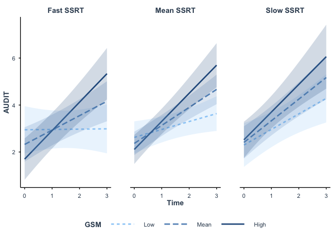<!-- -->

``` r
p <- interact_plot(full.lme, pred = "Time", modx = SSRT, interval = TRUE, modx.labels = c('Fast', 'Mean', 'Slow')) + theme(panel.grid = element_blank(), axis.line = element_line(color = "black"),
    axis.line.y.right = element_blank(), axis.line.x.top = element_blank(), axis.ticks = element_line(color = "black"))
print(p)
```

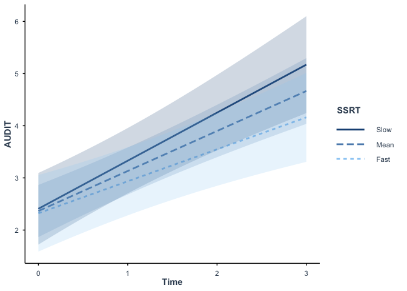<!-- -->

``` r
p <- interact_plot(full.lme, pred = "GSM", modx = SSRT, interval = TRUE, modx.labels = c('Fast', 'Mean', 'Slow')) + theme(panel.grid = element_blank(), axis.line = element_line(color = "black"),
    axis.line.y.right = element_blank(), axis.line.x.top = element_blank(), axis.ticks = element_line(color = "black"))
print(p)
```

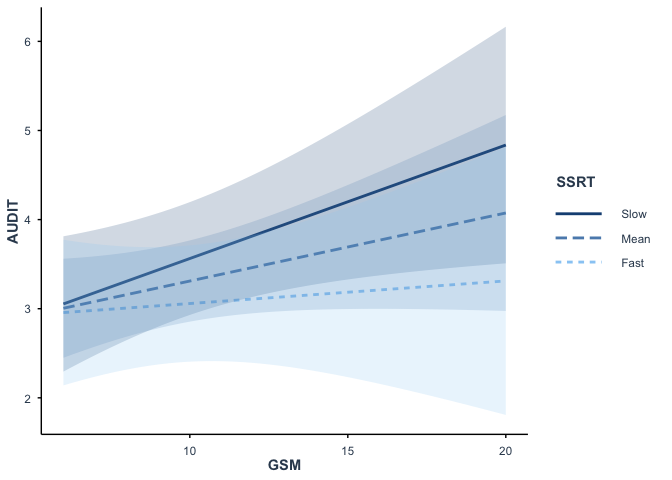<!-- -->

``` r
df_long <- df_long %>% rename(SocialMis = GSM)
```

### PES

``` r
# There was no significant moderation of PES, but we still plot it.
df_long <- df_long %>% rename(GSM = SocialMis)
df_long <- df_long %>% rename(PES = pes_pse_psc)
full.lme <- lmer(AUDIT ~ 1 + sex + AdChild + GSM * PES * Time + (1 | mriID), data = df_long, REML = FALSE, na.action = na.exclude)

# Calculate mean and SD
pre_mean <- mean(df_long$GSM, na.rm = TRUE)
pre_sd <- sd(df_long$GSM, na.rm = TRUE)
mod_mean <- mean(df_long$PES, na.rm = TRUE)
mod_sd <- sd(df_long$PES, na.rm = TRUE)

# Define moderator levels and compare simple slopes
emtr <- emtrends(full.lme, var = "Time", specs = c("GSM", "PES"),
  at = list(GSM = c(pre_mean - pre_sd, pre_mean, pre_mean + pre_sd), PES = c(mod_mean - mod_sd, mod_mean, mod_mean + mod_sd)))
print(emtr)
```

    ##    GSM     PES Time.trend    SE  df lower.CL upper.CL
    ##   6.20 -0.9315     0.5573 0.206 290   0.1511    0.964
    ##   9.46 -0.9315     0.7518 0.168 285   0.4217    1.082
    ##  12.72 -0.9315     0.9463 0.294 304   0.3679    1.525
    ##   6.20  0.0394     0.3218 0.158 290   0.0112    0.632
    ##   9.46  0.0394     0.7152 0.114 279   0.4915    0.939
    ##  12.72  0.0394     1.1086 0.184 301   0.7463    1.471
    ##   6.20  1.0103     0.0863 0.230 286  -0.3660    0.539
    ##   9.46  1.0103     0.6787 0.151 268   0.3815    0.976
    ##  12.72  1.0103     1.2710 0.227 286   0.8239    1.718
    ## 
    ## Results are averaged over the levels of: sex 
    ## Degrees-of-freedom method: kenward-roger 
    ## Confidence level used: 0.95

``` r
contrast(emtr, method = "pairwise")
```

    ##  contrast                                                                                  estimate    SE  df t.ratio p.value
    ##  (GSM6.19797115661952 PES-0.931468315630987) - (GSM9.45891029810298 PES-0.931468315630987)  -0.1945 0.191 310  -1.020  0.9838
    ##  (GSM6.19797115661952 PES-0.931468315630987) - (GSM12.7198494395864 PES-0.931468315630987)  -0.3889 0.381 310  -1.020  0.9838
    ##  (GSM6.19797115661952 PES-0.931468315630987) - GSM6.19797115661952 PES0.0394384187777627     0.2355 0.151 285   1.560  0.8256
    ##  (GSM6.19797115661952 PES-0.931468315630987) - GSM9.45891029810298 PES0.0394384187777627    -0.1579 0.192 298  -0.821  0.9962
    ##  (GSM6.19797115661952 PES-0.931468315630987) - GSM12.7198494395864 PES0.0394384187777627    -0.5513 0.290 307  -1.900  0.6145
    ##  (GSM6.19797115661952 PES-0.931468315630987) - GSM6.19797115661952 PES1.01034515318651       0.4710 0.302 285   1.560  0.8256
    ##  (GSM6.19797115661952 PES-0.931468315630987) - GSM9.45891029810298 PES1.01034515318651      -0.1213 0.250 282  -0.484  0.9999
    ##  (GSM6.19797115661952 PES-0.931468315630987) - GSM12.7198494395864 PES1.01034515318651      -0.7137 0.305 290  -2.338  0.3228
    ##  (GSM9.45891029810298 PES-0.931468315630987) - (GSM12.7198494395864 PES-0.931468315630987)  -0.1945 0.191 310  -1.020  0.9838
    ##  (GSM9.45891029810298 PES-0.931468315630987) - GSM6.19797115661952 PES0.0394384187777627     0.4300 0.186 299   2.306  0.3419
    ##  (GSM9.45891029810298 PES-0.931468315630987) - GSM9.45891029810298 PES0.0394384187777627     0.0366 0.112 276   0.327  1.0000
    ##  (GSM9.45891029810298 PES-0.931468315630987) - GSM12.7198494395864 PES0.0394384187777627    -0.3568 0.153 290  -2.338  0.3228
    ##  (GSM9.45891029810298 PES-0.931468315630987) - GSM6.19797115661952 PES1.01034515318651       0.6655 0.281 285   2.371  0.3041
    ##  (GSM9.45891029810298 PES-0.931468315630987) - GSM9.45891029810298 PES1.01034515318651       0.0731 0.224 276   0.327  1.0000
    ##  (GSM9.45891029810298 PES-0.931468315630987) - GSM12.7198494395864 PES1.01034515318651      -0.5192 0.283 284  -1.832  0.6611
    ##  (GSM12.7198494395864 PES-0.931468315630987) - GSM6.19797115661952 PES0.0394384187777627     0.6244 0.346 309   1.807  0.6778
    ##  (GSM12.7198494395864 PES-0.931468315630987) - GSM9.45891029810298 PES0.0394384187777627     0.2310 0.247 304   0.937  0.9906
    ##  (GSM12.7198494395864 PES-0.931468315630987) - GSM12.7198494395864 PES0.0394384187777627    -0.1624 0.187 293  -0.867  0.9944
    ##  (GSM12.7198494395864 PES-0.931468315630987) - GSM6.19797115661952 PES1.01034515318651       0.8599 0.373 299   2.306  0.3419
    ##  (GSM12.7198494395864 PES-0.931468315630987) - GSM9.45891029810298 PES1.01034515318651       0.2676 0.332 295   0.806  0.9966
    ##  (GSM12.7198494395864 PES-0.931468315630987) - GSM12.7198494395864 PES1.01034515318651      -0.3248 0.375 293  -0.867  0.9944
    ##  GSM6.19797115661952 PES0.0394384187777627 - GSM9.45891029810298 PES0.0394384187777627      -0.3934 0.128 310  -3.063  0.0594
    ##  GSM6.19797115661952 PES0.0394384187777627 - GSM12.7198494395864 PES0.0394384187777627      -0.7868 0.257 310  -3.063  0.0594
    ##  GSM6.19797115661952 PES0.0394384187777627 - GSM6.19797115661952 PES1.01034515318651         0.2355 0.151 285   1.560  0.8256
    ##  GSM6.19797115661952 PES0.0394384187777627 - GSM9.45891029810298 PES1.01034515318651        -0.3568 0.153 290  -2.338  0.3228
    ##  GSM6.19797115661952 PES0.0394384187777627 - GSM12.7198494395864 PES1.01034515318651        -0.9492 0.287 298  -3.302  0.0294
    ##  GSM9.45891029810298 PES0.0394384187777627 - GSM12.7198494395864 PES0.0394384187777627      -0.3934 0.128 310  -3.063  0.0594
    ##  GSM9.45891029810298 PES0.0394384187777627 - GSM6.19797115661952 PES1.01034515318651         0.6289 0.204 293   3.085  0.0561
    ##  GSM9.45891029810298 PES0.0394384187777627 - GSM9.45891029810298 PES1.01034515318651         0.0366 0.112 276   0.327  1.0000
    ##  GSM9.45891029810298 PES0.0394384187777627 - GSM12.7198494395864 PES1.01034515318651        -0.5558 0.206 291  -2.700  0.1522
    ##  GSM12.7198494395864 PES0.0394384187777627 - GSM6.19797115661952 PES1.01034515318651         1.0223 0.305 301   3.347  0.0255
    ##  GSM12.7198494395864 PES0.0394384187777627 - GSM9.45891029810298 PES1.01034515318651         0.4300 0.186 299   2.306  0.3419
    ##  GSM12.7198494395864 PES0.0394384187777627 - GSM12.7198494395864 PES1.01034515318651        -0.1624 0.187 293  -0.867  0.9944
    ##  GSM6.19797115661952 PES1.01034515318651 - GSM9.45891029810298 PES1.01034515318651          -0.5924 0.172 299  -3.453  0.0181
    ##  GSM6.19797115661952 PES1.01034515318651 - GSM12.7198494395864 PES1.01034515318651          -1.1847 0.343 299  -3.453  0.0181
    ##  GSM9.45891029810298 PES1.01034515318651 - GSM12.7198494395864 PES1.01034515318651          -0.5924 0.172 299  -3.453  0.0181
    ## 
    ## Results are averaged over the levels of: sex 
    ## Degrees-of-freedom method: kenward-roger 
    ## P value adjustment: tukey method for comparing a family of 9 estimates

``` r
# Plot and save simple slopes
print(simple_slopes(full.lme, pred = "Time", levels=list('Time'=c(0, 1, 2, 3, 'sstest'))))
```

    ##          GSM       PES   Time Test Estimate Std. Error       df t value  Pr(>|t|) Sig.
    ## 1   6.197971    sstest      0       -0.0703     0.3621 319.8203 -0.1941 0.8462371     
    ## 2    9.45891    sstest      0       -0.0364     0.2713 193.9835 -0.1340 0.8935097     
    ## 3  12.719849    sstest      0       -0.0025     0.3352 294.5287 -0.0073 0.9941578     
    ## 4     sstest -0.931468      0       -0.0703     0.0922 342.1322 -0.7617 0.4467779     
    ## 5     sstest  0.039438      0       -0.0602     0.0637 346.5732 -0.9451 0.3452446     
    ## 6     sstest  1.010345      0       -0.0501     0.0902 336.9647 -0.5554 0.5790036     
    ## 7   6.197971    sstest      1       -0.3128     0.2934 207.9890 -1.0661 0.2876264     
    ## 8    9.45891    sstest      1       -0.0740     0.2447 127.5943 -0.3025 0.7627982     
    ## 9  12.719849    sstest      1        0.1648     0.2789 183.9337  0.5910 0.5552667     
    ## 10    sstest -0.931468      1       -0.0106     0.0672 345.8327 -0.1581 0.8744790     
    ## 11    sstest  0.039438      1        0.0605     0.0474 349.0796  1.2749 0.2031787     
    ## 12    sstest  1.010345      1        0.1316     0.0623 351.0174  2.1104 0.0355327    *
    ## 13  6.197971    sstest      2       -0.5554     0.2970 219.4139 -1.8698 0.0628494    .
    ## 14   9.45891    sstest      2       -0.1117     0.2685 168.0354 -0.4159 0.6780379     
    ## 15 12.719849    sstest      2        0.3320     0.3400 290.6000  0.9767 0.3295098     
    ## 16    sstest -0.931468      2        0.0490     0.0847 311.0440  0.5785 0.5633442     
    ## 17    sstest  0.039438      2        0.1811     0.0588 312.3522  3.0787 0.0022634   **
    ## 18    sstest  1.010345      2        0.3132     0.0709 316.3042  4.4173 1.374e-05  ***
    ## 19  6.197971    sstest      3       -0.7980     0.3708 336.5626 -2.1521 0.0320963    *
    ## 20   9.45891    sstest      3       -0.1493     0.3320 286.1073 -0.4497 0.6532493     
    ## 21 12.719849    sstest      3        0.4993     0.4752 368.9519  1.0508 0.2940362     
    ## 22    sstest -0.931468      3        0.1086     0.1283 296.2078  0.8464 0.3980021     
    ## 23    sstest  0.039438      3        0.3018     0.0877 295.2792  3.4422 0.0006603  ***
    ## 24    sstest  1.010345      3        0.4949     0.1075 290.1037  4.6047 6.188e-06  ***
    ## 25  6.197971 -0.931468 sstest        0.5573     0.2037 281.5139  2.7363 0.0066081   **
    ## 26   9.45891 -0.931468 sstest        0.7518     0.1655 276.3355  4.5424 8.316e-06  ***
    ## 27 12.719849 -0.931468 sstest        0.9463     0.2897 295.1005  3.2660 0.0012192   **
    ## 28  6.197971  0.039438 sstest        0.3218     0.1557 281.2073  2.0666 0.0396878    *
    ## 29   9.45891  0.039438 sstest        0.7152     0.1122 270.3874  6.3754 7.850e-10  ***
    ## 30 12.719849  0.039438 sstest        1.1086     0.1816 292.5228  6.1063 3.237e-09  ***
    ## 31  6.197971  1.010345 sstest        0.0863     0.2268 276.8354  0.3806 0.7037634     
    ## 32   9.45891  1.010345 sstest        0.6787     0.1491 259.6918  4.5530 8.135e-06  ***
    ## 33 12.719849  1.010345 sstest        1.2710     0.2241 277.1576  5.6710 3.565e-08  ***

``` r
tiff('interact_plot_time_socialmis_pes.tiff', width = 6000, height = 4000, res = 800)
p <- interact_plot(full.lme, pred = "Time", modx = GSM, mod2 = PES, interval = TRUE, modx.labels = c("Low", "Mean", "High"), mod2.labels = c('Low PES', 'Mean PES', 'High PES')) + theme(panel.grid = element_blank(), axis.line = element_line(color = "black"), axis.line.y.right = element_blank(), axis.line.x.top = element_blank(), axis.ticks = element_line(color = "black"))
print(p)
dev.off()
```

    ## quartz_off_screen 
    ##                 2

``` r
p <- interact_plot(full.lme, pred = "Time", modx = GSM, mod2 = PES, interval = TRUE, modx.labels = c("Low", "Mean", "High"), mod2.labels = c('Low PES', 'Mean PES', 'High PES')) + theme(panel.grid = element_blank(), axis.line = element_line(color = "black"), axis.line.y.right = element_blank(), axis.line.x.top = element_blank(), axis.ticks = element_line(color = "black"))
print(p)
```

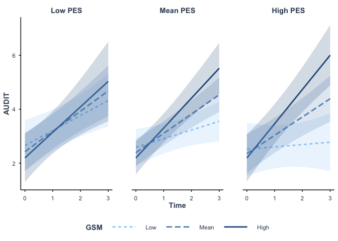<!-- -->

``` r
df_long <- df_long %>% rename(SocialMis = GSM)
df_long <- df_long %>% rename(pes_pse_psc = PES)
```

### fsgo_subcortical

``` r
df_long <- df_long %>% rename(GSM = SocialMis, FSGOSub = fsgo_subcortical)
full.lme <- lmer(AUDIT ~ 1 + sex + AdChild + GSM * FSGOSub * Time + (1 | mriID), data = df_long, REML = FALSE, na.action = na.exclude)

# Calculate mean and SD
pre_mean <- mean(df_long$GSM, na.rm = TRUE)
pre_sd <- sd(df_long$GSM, na.rm = TRUE)
mod_mean <- mean(df_long$FSGOSub, na.rm = TRUE)
mod_sd <- sd(df_long$FSGOSub, na.rm = TRUE)

# Define moderator levels and compare simple slopes
emtr <- emtrends(full.lme, var = "Time", specs = c("GSM", "FSGOSub"),
  at = list(GSM = c(pre_mean - pre_sd, pre_mean, pre_mean + pre_sd), FSGOSub = c(mod_mean - mod_sd, mod_mean, mod_mean + mod_sd)))
print(emtr)
```

    ##    GSM FSGOSub Time.trend    SE  df lower.CL upper.CL
    ##   6.20 -0.8717     -0.029 0.218 296  -0.4571    0.399
    ##   9.46 -0.8717      0.737 0.165 282   0.4115    1.063
    ##  12.72 -0.8717      1.503 0.299 299   0.9148    2.091
    ##   6.20  0.0124      0.340 0.156 291   0.0321    0.648
    ##   9.46  0.0124      0.768 0.111 277   0.5499    0.985
    ##  12.72  0.0124      1.195 0.177 299   0.8463    1.544
    ##   6.20  0.8965      0.709 0.213 279   0.2900    1.128
    ##   9.46  0.8965      0.798 0.163 276   0.4771    1.119
    ##  12.72  0.8965      0.887 0.279 299   0.3388    1.435
    ## 
    ## Results are averaged over the levels of: sex 
    ## Degrees-of-freedom method: kenward-roger 
    ## Confidence level used: 0.95

``` r
contrast(emtr, method = "pairwise")
```

    ##  contrast                                                                                          estimate    SE  df t.ratio p.value
    ##  (GSM6.19797115661952 FSGOSub-0.871703632455224) - (GSM9.45891029810298 FSGOSub-0.871703632455224)  -0.7661 0.202 308  -3.784  0.0057
    ##  (GSM6.19797115661952 FSGOSub-0.871703632455224) - (GSM12.7198494395864 FSGOSub-0.871703632455224)  -1.5321 0.405 308  -3.784  0.0057
    ##  (GSM6.19797115661952 FSGOSub-0.871703632455224) - GSM6.19797115661952 FSGOSub0.012390168492683     -0.3690 0.148 284  -2.497  0.2377
    ##  (GSM6.19797115661952 FSGOSub-0.871703632455224) - GSM9.45891029810298 FSGOSub0.012390168492683     -0.7966 0.198 300  -4.021  0.0024
    ##  (GSM6.19797115661952 FSGOSub-0.871703632455224) - GSM12.7198494395864 FSGOSub0.012390168492683     -1.2241 0.297 308  -4.124  0.0016
    ##  (GSM6.19797115661952 FSGOSub-0.871703632455224) - GSM6.19797115661952 FSGOSub0.89648396944059      -0.7381 0.296 284  -2.497  0.2377
    ##  (GSM6.19797115661952 FSGOSub-0.871703632455224) - GSM9.45891029810298 FSGOSub0.89648396944059      -0.8270 0.259 287  -3.195  0.0408
    ##  (GSM6.19797115661952 FSGOSub-0.871703632455224) - GSM12.7198494395864 FSGOSub0.89648396944059      -0.9160 0.341 299  -2.685  0.1577
    ##  (GSM9.45891029810298 FSGOSub-0.871703632455224) - (GSM12.7198494395864 FSGOSub-0.871703632455224)  -0.7661 0.202 308  -3.784  0.0057
    ##  (GSM9.45891029810298 FSGOSub-0.871703632455224) - GSM6.19797115661952 FSGOSub0.012390168492683      0.3970 0.178 293   2.226  0.3917
    ##  (GSM9.45891029810298 FSGOSub-0.871703632455224) - GSM9.45891029810298 FSGOSub0.012390168492683     -0.0305 0.121 281  -0.251  1.0000
    ##  (GSM9.45891029810298 FSGOSub-0.871703632455224) - GSM12.7198494395864 FSGOSub0.012390168492683     -0.4580 0.171 299  -2.685  0.1577
    ##  (GSM9.45891029810298 FSGOSub-0.871703632455224) - GSM6.19797115661952 FSGOSub0.89648396944059       0.0280 0.258 278   0.109  1.0000
    ##  (GSM9.45891029810298 FSGOSub-0.871703632455224) - GSM9.45891029810298 FSGOSub0.89648396944059      -0.0610 0.243 281  -0.251  1.0000
    ##  (GSM9.45891029810298 FSGOSub-0.871703632455224) - GSM12.7198494395864 FSGOSub0.89648396944059      -0.1499 0.348 295  -0.430  1.0000
    ##  (GSM12.7198494395864 FSGOSub-0.871703632455224) - GSM6.19797115661952 FSGOSub0.012390168492683      1.1631 0.352 305   3.306  0.0289
    ##  (GSM12.7198494395864 FSGOSub-0.871703632455224) - GSM9.45891029810298 FSGOSub0.012390168492683      0.7356 0.269 301   2.737  0.1393
    ##  (GSM12.7198494395864 FSGOSub-0.871703632455224) - GSM12.7198494395864 FSGOSub0.012390168492683      0.3081 0.228 298   1.350  0.9151
    ##  (GSM12.7198494395864 FSGOSub-0.871703632455224) - GSM6.19797115661952 FSGOSub0.89648396944059       0.7941 0.357 293   2.226  0.3917
    ##  (GSM12.7198494395864 FSGOSub-0.871703632455224) - GSM9.45891029810298 FSGOSub0.89648396944059       0.7051 0.365 295   1.934  0.5906
    ##  (GSM12.7198494395864 FSGOSub-0.871703632455224) - GSM12.7198494395864 FSGOSub0.89648396944059       0.6162 0.456 298   1.350  0.9151
    ##  GSM6.19797115661952 FSGOSub0.012390168492683 - GSM9.45891029810298 FSGOSub0.012390168492683        -0.4275 0.125 310  -3.410  0.0207
    ##  GSM6.19797115661952 FSGOSub0.012390168492683 - GSM12.7198494395864 FSGOSub0.012390168492683        -0.8550 0.251 310  -3.410  0.0207
    ##  GSM6.19797115661952 FSGOSub0.012390168492683 - GSM6.19797115661952 FSGOSub0.89648396944059         -0.3690 0.148 284  -2.497  0.2377
    ##  GSM6.19797115661952 FSGOSub0.012390168492683 - GSM9.45891029810298 FSGOSub0.89648396944059         -0.4580 0.171 299  -2.685  0.1577
    ##  GSM6.19797115661952 FSGOSub0.012390168492683 - GSM12.7198494395864 FSGOSub0.89648396944059         -0.5469 0.326 305  -1.679  0.7590
    ##  GSM9.45891029810298 FSGOSub0.012390168492683 - GSM12.7198494395864 FSGOSub0.012390168492683        -0.4275 0.125 310  -3.410  0.0207
    ##  GSM9.45891029810298 FSGOSub0.012390168492683 - GSM6.19797115661952 FSGOSub0.89648396944059          0.0585 0.189 289   0.309  1.0000
    ##  GSM9.45891029810298 FSGOSub0.012390168492683 - GSM9.45891029810298 FSGOSub0.89648396944059         -0.0305 0.121 281  -0.251  1.0000
    ##  GSM9.45891029810298 FSGOSub0.012390168492683 - GSM12.7198494395864 FSGOSub0.89648396944059         -0.1194 0.252 301  -0.474  0.9999
    ##  GSM12.7198494395864 FSGOSub0.012390168492683 - GSM6.19797115661952 FSGOSub0.89648396944059          0.4860 0.285 299   1.704  0.7436
    ##  GSM12.7198494395864 FSGOSub0.012390168492683 - GSM9.45891029810298 FSGOSub0.89648396944059          0.3970 0.178 293   2.226  0.3917
    ##  GSM12.7198494395864 FSGOSub0.012390168492683 - GSM12.7198494395864 FSGOSub0.89648396944059          0.3081 0.228 298   1.350  0.9151
    ##  GSM6.19797115661952 FSGOSub0.89648396944059 - GSM9.45891029810298 FSGOSub0.89648396944059          -0.0889 0.187 303  -0.476  0.9999
    ##  GSM6.19797115661952 FSGOSub0.89648396944059 - GSM12.7198494395864 FSGOSub0.89648396944059          -0.1779 0.374 303  -0.476  0.9999
    ##  GSM9.45891029810298 FSGOSub0.89648396944059 - GSM12.7198494395864 FSGOSub0.89648396944059          -0.0889 0.187 303  -0.476  0.9999
    ## 
    ## Results are averaged over the levels of: sex 
    ## Degrees-of-freedom method: kenward-roger 
    ## P value adjustment: tukey method for comparing a family of 9 estimates

``` r
# Plot and save simple slopes
print(simple_slopes(full.lme, pred = "Time", levels=list('Time'=c(0, 1, 2, 3, 'sstest'))))
```

    ##          GSM   FSGOSub   Time Test Estimate Std. Error       df t value  Pr(>|t|) Sig.
    ## 1   6.197971    sstest      0       -0.6432     0.3602 293.2875 -1.7854 0.0752269    .
    ## 2    9.45891    sstest      0        0.0380     0.2877 194.0480  0.1319 0.8951691     
    ## 3  12.719849    sstest      0        0.7191     0.3704 307.9672  1.9413 0.0531308    .
    ## 4     sstest -0.871704      0       -0.2413     0.0875 334.1188 -2.7583 0.0061297   **
    ## 5     sstest   0.01239      0       -0.0566     0.0635 348.0672 -0.8914 0.3733467     
    ## 6     sstest  0.896484      0        0.1281     0.0887 352.1456  1.4437 0.1497023     
    ## 7   6.197971    sstest      1       -0.2258     0.3041 189.3123 -0.7424 0.4587383     
    ## 8    9.45891    sstest      1        0.0724     0.2632 133.9967  0.2752 0.7835871     
    ## 9  12.719849    sstest      1        0.3706     0.3346 242.8183  1.1077 0.2690790     
    ## 10    sstest -0.871704      1       -0.0063     0.0664 345.9656 -0.0955 0.9239422     
    ## 11    sstest   0.01239      1        0.0745     0.0469 352.2711  1.5878 0.1132395     
    ## 12    sstest  0.896484      1        0.1553     0.0695 360.2060  2.2336 0.0261205    *
    ## 13  6.197971    sstest      2        0.1917     0.3310 235.0743  0.5790 0.5631379     
    ## 14   9.45891    sstest      2        0.1069     0.3042 203.9774  0.3515 0.7256131     
    ## 15 12.719849    sstest      2        0.0221     0.4650 360.5155  0.0476 0.9620360     
    ## 16    sstest -0.871704      2        0.2286     0.0930 320.0919  2.4574 0.0145266    *
    ## 17    sstest   0.01239      2        0.2056     0.0570 316.6314  3.6099 0.0003559  ***
    ## 18    sstest  0.896484      2        0.1826     0.0904 325.9377  2.0190 0.0443007    *
    ## 19  6.197971    sstest      3        0.6091     0.4256 348.5993  1.4312 0.1532647     
    ## 20   9.45891    sstest      3        0.1414     0.3906 329.1853  0.3620 0.7175827     
    ## 21 12.719849    sstest      3       -0.3263     0.6709 357.2864 -0.4864 0.6269740     
    ## 22    sstest -0.871704      3        0.4635     0.1428 306.4869  3.2463 0.0012985   **
    ## 23    sstest   0.01239      3        0.3367     0.0846 297.5661  3.9799 8.669e-05  ***
    ## 24    sstest  0.896484      3        0.2099     0.1338 302.7351  1.5688 0.1177474     
    ## 25  6.197971 -0.871704 sstest       -0.0290     0.2146 288.0177 -0.1353 0.8925032     
    ## 26   9.45891 -0.871704 sstest        0.7371     0.1632 274.8222  4.5149 9.405e-06  ***
    ## 27 12.719849 -0.871704 sstest        1.5031     0.2948 291.3559  5.0992 6.152e-07  ***
    ## 28  6.197971   0.01239 sstest        0.3400     0.1544 283.2930  2.2025 0.0284357    *
    ## 29   9.45891   0.01239 sstest        0.7675     0.1092 269.7565  7.0311 1.681e-11  ***
    ## 30 12.719849   0.01239 sstest        1.1950     0.1747 291.9770  6.8390 4.673e-11  ***
    ## 31  6.197971  0.896484 sstest        0.7091     0.2102 271.6462  3.3736 0.0008500  ***
    ## 32   9.45891  0.896484 sstest        0.7980     0.1610 269.0401  4.9581 1.262e-06  ***
    ## 33 12.719849  0.896484 sstest        0.8870     0.2747 291.2125  3.2292 0.0013832   **

``` r
# png('interact_plot_time_socialmis_fsgo_subcortical.png', width = 1600, height = 1067, res = 300)
tiff('interact_plot_time_socialmis_fsgo_subcortical.tiff', width = 6000, height = 4000, res = 800)
p <- interact_plot(full.lme, pred = "Time", modx = GSM, mod2 = FSGOSub, interval = TRUE, modx.labels = c("Low", "Mean", "High"), mod2.labels = c('Low Subcortical Activation', 'Mean Subcortical Activation', 'High Subcortical Activation')) + theme(panel.grid = element_blank(), axis.line = element_line(color = "black"), axis.line.y.right = element_blank(), axis.line.x.top = element_blank(), axis.ticks = element_line(color = "black"))
# p <- interact_plot(full.lme, pred = "Time", modx = GSM, mod2 = FSGOSub, interval = TRUE, modx.labels = c('Low', 'Mean', 'High'), mod2.values = c(-1, 1), mod2.labels = c('Low Subcortical Activation', 'High Subcortical Activation')) + theme(panel.grid = element_blank(), axis.line = element_line(color = "black"), axis.line.y.right = element_blank(), axis.line.x.top = element_blank(), axis.ticks = element_line(color = "black"))
print(p)
dev.off()
```

    ## quartz_off_screen 
    ##                 2

``` r
p <- interact_plot(full.lme, pred = "Time", modx = GSM, mod2 = FSGOSub, interval = TRUE, modx.labels = c("Low", "Mean", "High"), mod2.labels = c('Low Subcortical Activation', 'Mean Subcortical Activation', 'High Subcortical Activation')) + theme(panel.grid = element_blank(), axis.line = element_line(color = "black"), axis.line.y.right = element_blank(), axis.line.x.top = element_blank(), axis.ticks = element_line(color = "black"))
print(p)
```

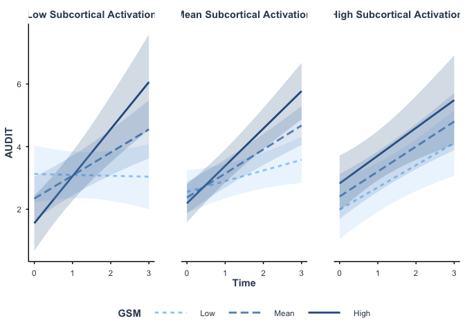<!-- -->

``` r
p <- interact_plot(full.lme, pred = "FSGOSub", modx = Time, interval = TRUE) + theme(panel.grid = element_blank(), axis.line = element_line(color = "black"),
    axis.line.y.right = element_blank(), axis.line.x.top = element_blank(), axis.ticks = element_line(color = "black"))
print(p)
```

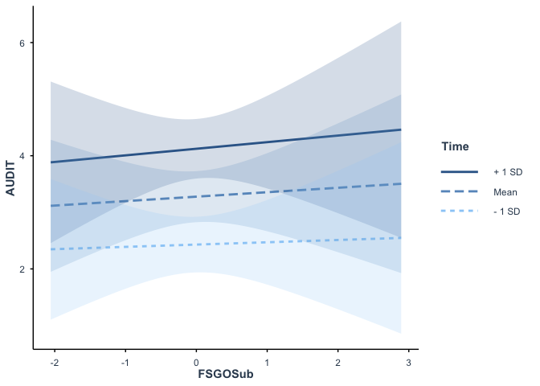<!-- -->

``` r
p <- interact_plot(full.lme, pred = "GSM", modx = FSGOSub, interval = TRUE, modx.labels = c("Low subcortical activation", "Mean subcortical activation", "High subcortical activation")) + theme(panel.grid = element_blank(), axis.line = element_line(color = "black"),
    axis.line.y.right = element_blank(), axis.line.x.top = element_blank(), axis.ticks = element_line(color = "black"))
print(p)
```

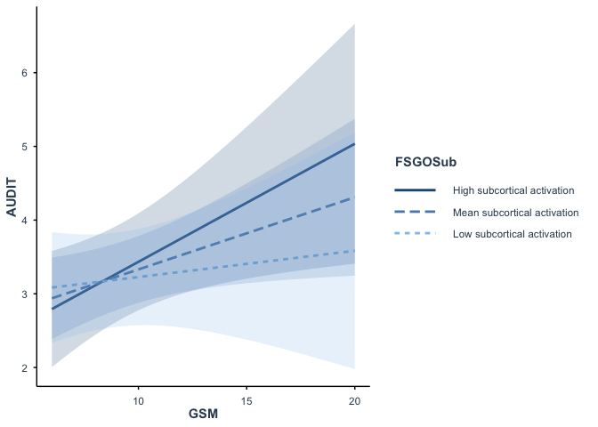<!-- -->

``` r
p <- interact_plot(full.lme, pred = "Time", modx = FSGOSub, interval = TRUE, modx.labels = c("Low subcortical activation", "Mean subcortical activation", "High subcortical activation")) + theme(panel.grid = element_blank(), axis.line = element_line(color = "black"),
    axis.line.y.right = element_blank(), axis.line.x.top = element_blank(), axis.ticks = element_line(color = "black"))
print(p)
```

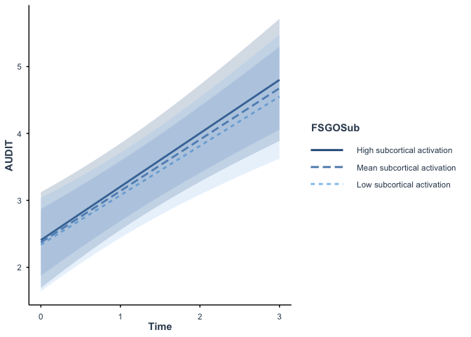<!-- -->

``` r
df_long <- df_long %>% rename(SocialMis = GSM, fsgo_subcortical = FSGOSub)

# Plot the distributions of FS- and Go-subcortical activations
mean_fs_subcortical <- mean(dfUnscaled$fs_subcortical, na.rm = TRUE)
mean_go_subcortical <- mean(dfUnscaled$go_subcortical, na.rm = TRUE)
ggplot(dfUnscaled, aes(x = fs_subcortical)) +
  geom_density(aes(fill = "fs_subcortical"), alpha = 0.5) +
  geom_density(aes(x = go_subcortical, fill = "go_subcortical"), alpha = 0.5) +
  geom_vline(xintercept = mean_fs_subcortical, color = "#377eb8", linetype = "dashed", linewidth = 1) +
  geom_vline(xintercept = mean_go_subcortical, color = "#e41a1c", linetype = "dashed", linewidth = 1) +
  labs(title = "Subcortical activations in FS vs. Go", x = "Activations", y = "Density", fill = "Variable") +
  scale_fill_manual(name = NULL, values = c("fs_subcortical" = "#377eb8", "go_subcortical" = "#e41a1c"),
                    labels = c("fs_subcortical" = "FS subcortical activation", "go_subcortical" = "Go subcortical activation")) +
  theme_classic()
```

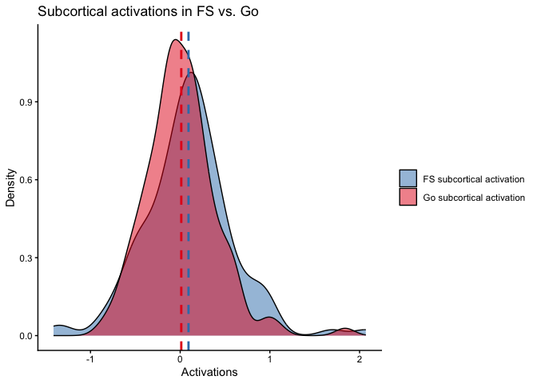<!-- -->

# Supplementary analyses

## Run a one-sample t-test to examine if network activations (extracted from SS-FS map) differ from zero

``` r
# ss_vars <- c("ss_somatomotorHand", "ss_somatomotorMouth", "ss_cinguloOpercularTaskControl", "ss_auditory", "ss_default", "ss_memoryRetrieval", "ss_visual", "ss_frontoParietalTaskControl", "ss_salience", "ss_subcortical", "ss_ventralAttention", "ss_dorsalAttention", "ss_cerebellar")
# fs_vars <- c("fs_somatomotorHand", "fs_somatomotorMouth", "fs_cinguloOpercularTaskControl", "fs_auditory", "fs_default", "fs_memoryRetrieval", "fs_visual", "fs_frontoParietalTaskControl", "fs_salience", "fs_subcortical", "fs_ventralAttention", "fs_dorsalAttention", "fs_cerebellar")
# ssgo_vars <- c("ssgo_somatomotorHand", "ssgo_somatomotorMouth", "ssgo_cinguloOpercularTaskControl", "ssgo_auditory", "ssgo_default", "ssgo_memoryRetrieval", "ssgo_visual", "ssgo_frontoParietalTaskControl", "ssgo_salience", "ssgo_subcortical", "ssgo_ventralAttention", "ssgo_dorsalAttention", "ssgo_cerebellar")
fsgo_vars <- c("fsgo_somatomotorHand", "fsgo_somatomotorMouth", "fsgo_cinguloOpercularTaskControl", "fsgo_auditory", "fsgo_default", "fsgo_memoryRetrieval", "fsgo_visual", "fsgo_frontoParietalTaskControl", "fsgo_salience", "fsgo_subcortical", "fsgo_ventralAttention", "fsgo_dorsalAttention", "fsgo_cerebellar")
# ssfs_vars <- c("ssfs_somatomotorHand", "ssfs_somatomotorMouth", "ssfs_cinguloOpercularTaskControl", "ssfs_auditory", "ssfs_default", "ssfs_memoryRetrieval", "ssfs_visual", "ssfs_frontoParietalTaskControl", "ssfs_salience", "ssfs_subcortical", "ssfs_ventralAttention", "ssfs_dorsalAttention", "ssfs_cerebellar")
# fsss_vars <- c("fsss_somatomotorHand", "fsss_somatomotorMouth", "fsss_cinguloOpercularTaskControl", "fsss_auditory", "fsss_default", "fsss_memoryRetrieval", "fsss_visual", "fsss_frontoParietalTaskControl", "fsss_salience", "fsss_subcortical", "fsss_ventralAttention", "fsss_dorsalAttention", "fsss_cerebellar")
# contrastNetworks <- c(ssgo_vars, ssfs_vars, fsss_vars)
#
for (v in fsgo_vars) {
  cat("\nOne-sample t-test for", v, ":\n")
  print(t.test(dfUnscaled[[v]], mu = 0, na.rm = TRUE))}
```

    ## 
    ## One-sample t-test for fsgo_somatomotorHand :
    ## 
    ##  One Sample t-test
    ## 
    ## data:  dfUnscaled[[v]]
    ## t = -6.4805, df = 132, p-value = 1.667e-09
    ## alternative hypothesis: true mean is not equal to 0
    ## 95 percent confidence interval:
    ##  -0.6478615 -0.3448486
    ## sample estimates:
    ##  mean of x 
    ## -0.4963551 
    ## 
    ## 
    ## One-sample t-test for fsgo_somatomotorMouth :
    ## 
    ##  One Sample t-test
    ## 
    ## data:  dfUnscaled[[v]]
    ## t = -1.8055, df = 132, p-value = 0.07328
    ## alternative hypothesis: true mean is not equal to 0
    ## 95 percent confidence interval:
    ##  -0.30270201  0.01381099
    ## sample estimates:
    ##  mean of x 
    ## -0.1444455 
    ## 
    ## 
    ## One-sample t-test for fsgo_cinguloOpercularTaskControl :
    ## 
    ##  One Sample t-test
    ## 
    ## data:  dfUnscaled[[v]]
    ## t = 7.1931, df = 132, p-value = 4.25e-11
    ## alternative hypothesis: true mean is not equal to 0
    ## 95 percent confidence interval:
    ##  0.3801440 0.6685285
    ## sample estimates:
    ## mean of x 
    ## 0.5243363 
    ## 
    ## 
    ## One-sample t-test for fsgo_auditory :
    ## 
    ##  One Sample t-test
    ## 
    ## data:  dfUnscaled[[v]]
    ## t = -3.8042, df = 132, p-value = 0.0002167
    ## alternative hypothesis: true mean is not equal to 0
    ## 95 percent confidence interval:
    ##  -0.3871999 -0.1222816
    ## sample estimates:
    ##  mean of x 
    ## -0.2547407 
    ## 
    ## 
    ## One-sample t-test for fsgo_default :
    ## 
    ##  One Sample t-test
    ## 
    ## data:  dfUnscaled[[v]]
    ## t = -2.6469, df = 132, p-value = 0.009112
    ## alternative hypothesis: true mean is not equal to 0
    ## 95 percent confidence interval:
    ##  -0.35650479 -0.05155309
    ## sample estimates:
    ##  mean of x 
    ## -0.2040289 
    ## 
    ## 
    ## One-sample t-test for fsgo_memoryRetrieval :
    ## 
    ##  One Sample t-test
    ## 
    ## data:  dfUnscaled[[v]]
    ## t = 4.8462, df = 132, p-value = 3.475e-06
    ## alternative hypothesis: true mean is not equal to 0
    ## 95 percent confidence interval:
    ##  0.2027013 0.4823039
    ## sample estimates:
    ## mean of x 
    ## 0.3425026 
    ## 
    ## 
    ## One-sample t-test for fsgo_visual :
    ## 
    ##  One Sample t-test
    ## 
    ## data:  dfUnscaled[[v]]
    ## t = 13.539, df = 132, p-value < 2.2e-16
    ## alternative hypothesis: true mean is not equal to 0
    ## 95 percent confidence interval:
    ##  1.016889 1.364871
    ## sample estimates:
    ## mean of x 
    ##   1.19088 
    ## 
    ## 
    ## One-sample t-test for fsgo_frontoParietalTaskControl :
    ## 
    ##  One Sample t-test
    ## 
    ## data:  dfUnscaled[[v]]
    ## t = 11.106, df = 132, p-value < 2.2e-16
    ## alternative hypothesis: true mean is not equal to 0
    ## 95 percent confidence interval:
    ##  0.6578588 0.9430014
    ## sample estimates:
    ## mean of x 
    ## 0.8004301 
    ## 
    ## 
    ## One-sample t-test for fsgo_salience :
    ## 
    ##  One Sample t-test
    ## 
    ## data:  dfUnscaled[[v]]
    ## t = 15.764, df = 132, p-value < 2.2e-16
    ## alternative hypothesis: true mean is not equal to 0
    ## 95 percent confidence interval:
    ##  1.002120 1.289697
    ## sample estimates:
    ## mean of x 
    ##  1.145908 
    ## 
    ## 
    ## One-sample t-test for fsgo_subcortical :
    ## 
    ##  One Sample t-test
    ## 
    ## data:  dfUnscaled[[v]]
    ## t = 2.6517, df = 132, p-value = 0.00899
    ## alternative hypothesis: true mean is not equal to 0
    ## 95 percent confidence interval:
    ##  0.02046487 0.14066135
    ## sample estimates:
    ##  mean of x 
    ## 0.08056311 
    ## 
    ## 
    ## One-sample t-test for fsgo_ventralAttention :
    ## 
    ##  One Sample t-test
    ## 
    ## data:  dfUnscaled[[v]]
    ## t = 15.429, df = 132, p-value < 2.2e-16
    ## alternative hypothesis: true mean is not equal to 0
    ## 95 percent confidence interval:
    ##  0.9717938 1.2576126
    ## sample estimates:
    ## mean of x 
    ##  1.114703 
    ## 
    ## 
    ## One-sample t-test for fsgo_dorsalAttention :
    ## 
    ##  One Sample t-test
    ## 
    ## data:  dfUnscaled[[v]]
    ## t = 10.628, df = 132, p-value < 2.2e-16
    ## alternative hypothesis: true mean is not equal to 0
    ## 95 percent confidence interval:
    ##  0.5766640 0.8404025
    ## sample estimates:
    ## mean of x 
    ## 0.7085332 
    ## 
    ## 
    ## One-sample t-test for fsgo_cerebellar :
    ## 
    ##  One Sample t-test
    ## 
    ## data:  dfUnscaled[[v]]
    ## t = 3.6448, df = 132, p-value = 0.0003836
    ## alternative hypothesis: true mean is not equal to 0
    ## 95 percent confidence interval:
    ##  0.08245882 0.27818994
    ## sample estimates:
    ## mean of x 
    ## 0.1803244

``` r
#
# # Partial correlation
# for (v in fsgo_vars) {
#   cat("\nPartial correlation between", v, " and PES, controlling for GoAcc:\n")
#   print(pcor.test(dfUnscaled$pes_pse_psc, dfUnscaled[[v]], dfUnscaled$GoRT))}
```

## Run a MANOVA to test the differences in network activations during SS vs FS, then use DA to see which networks contribute to the differences the most.

``` r
# network_names <- c(
#   "somatomotorHand", "somatomotorMouth", "cinguloOpercularTaskControl", "auditory", "default",
#   "memoryRetrieval", "visual", "frontoParietalTaskControl", "salience", "subcortical",
#   "ventralAttention", "dorsalAttention", "cerebellar")
#
# # Order columns: ss_*, then fs_*
# ss_cols <- paste0("ss_", network_names)
# fs_cols <- paste0("fs_", network_names)
# Y <- as.matrix(dfUnscaled[, c(ss_cols, fs_cols)])
#
# condition <- factor(rep(c("ss", "fs"), each = 13))
# network <- factor(rep(network_names, 2), levels = network_names)
#
# manova_res <- manova(Y ~ 1)
# within <- data.frame(condition, network)
# summary(Anova(manova_res, idata = within, idesign = ~condition * network, type = "III"), multivariate = TRUE)
```

### Post-hoc analyses with LDA for MANOVA

``` r
# # 1. Reshape to long format
# dfUnscaled_long <- dfUnscaled %>%
#   mutate(Subj = row_number()) %>%
#   pivot_longer(
#     cols = c(ss_cols, fs_cols),
#     names_to = c("condition", "network"),
#     names_pattern = "(ss|fs)_(.*)",
#     values_to = "activation")
#
# # 2. Fit the model
# fit <- lm(activation ~ condition * network + Subj, data = dfUnscaled_long)
#
# # 3. Post hoc pairwise comparisons
# emm <- emmeans(fit, ~ condition | network)
# pairs(emm, adjust = "bonferroni", reverse = TRUE)
#
# # Prepare data for LDA: stack ss_ and fs_ rows
# ss_data <- dfUnscaled[, ss_cols]
# fs_data <- dfUnscaled[, fs_cols]
# # Ensure column names match
# colnames(ss_data) <- colnames(fs_data) <- network_names
#
# # Stack the data
# lda_df <- rbind(
#   data.frame(condition = "ss", ss_data),
#   data.frame(condition = "fs", fs_data)
# )
# lda_df$condition <- factor(lda_df$condition)
#
# # Run LDA
# lda_res <- lda(condition ~ ., data = lda_df)
# print(lda_res)
#
# # Get the coefficients for the first discriminant function
# loadings <- lda_res$scaling[, 1]
# # Sort by absolute value (descending)
# contribution <- sort(abs(loadings), decreasing = TRUE)
# print(contribution)
```

### Post-hoc analyses with Press’s Q for MANOVA

``` r
# # Function to compute Press's Q
# press_q <- function(n, correct, k) {
#   acc <- correct / n
#   q <- n * ((acc - 1/k)^2) / ((1 - 1/k) * (1/k))
#   pval <- 1 - pchisq(q, df = 1)
#   list(Q = q, p.value = pval)}
#
# results <- data.frame(network = character(), accuracy = numeric(), Q = numeric(), p.value = numeric())
#
# for (net in network_names) {
#   # Prepare data
#   lda_df <- rbind(
#     data.frame(condition = "ss", value = dfUnscaled[[paste0("ss_", net)]]),
#     data.frame(condition = "fs", value = dfUnscaled[[paste0("fs_", net)]])
#   )
#   lda_df$condition <- factor(lda_df$condition)
#   lda_df <- na.omit(lda_df)
#
#   # LDA
#   lda_res <- lda(condition ~ value, data = lda_df)
#   pred <- predict(lda_res)$class
#   correct <- sum(pred == lda_df$condition)
#   n <- nrow(lda_df)
#
#   # Press's Q
#   pq <- press_q(n, correct, k = 2)
#
#   results <- rbind(results, data.frame(
#     network = net,
#     accuracy = correct / n,
#     Q = pq$Q,
#     p.value = pq$p.value))}
#
# print(results)
```

## ss and fs activation distributions

``` r
# # Calculate means for cinguloOpercularTaskControl
# mean_ss1 <- mean(dfUnscaled$ss_cinguloOpercularTaskControl, na.rm = TRUE)
# mean_fs1 <- mean(dfUnscaled$fs_cinguloOpercularTaskControl, na.rm = TRUE)
#
# p1 <- ggplot(dfUnscaled) +
#   geom_density(aes(x = ss_cinguloOpercularTaskControl, fill = "ss"), alpha = 0.5) +
#   geom_density(aes(x = fs_cinguloOpercularTaskControl, fill = "fs"), alpha = 0.5) +
#   geom_vline(xintercept = mean_ss1, color = "#377eb8", linetype = "dashed", size = 1) +
#   geom_vline(xintercept = mean_fs1, color = "#e41a1c", linetype = "dashed", size = 1) +
#   labs(title = "Distribution: cinguloOpercularTaskControl", x = "Activation", y = "Density", fill = "Condition") +
#   theme_classic()
#
# # Calculate means for subcortical
# mean_ss2 <- mean(dfUnscaled$ss_subcortical, na.rm = TRUE)
# mean_fs2 <- mean(dfUnscaled$fs_subcortical, na.rm = TRUE)
#
# p2 <- ggplot(dfUnscaled) +
#   geom_density(aes(x = ss_subcortical, fill = "ss"), alpha = 0.5) +
#   geom_density(aes(x = fs_subcortical, fill = "fs"), alpha = 0.5) +
#   geom_vline(xintercept = mean_ss2, color = "#377eb8", linetype = "dashed", size = 1) +
#   geom_vline(xintercept = mean_fs2, color = "#e41a1c", linetype = "dashed", size = 1) +
#   labs(title = "Distribution: subcortical", x = "Activation", y = "Density", fill = "Condition") +
#   theme_classic()
#
# # Calculate means for ventralAttention
# mean_ss3 <- mean(dfUnscaled$ss_ventralAttention, na.rm = TRUE)
# mean_fs3 <- mean(dfUnscaled$fs_ventralAttention, na.rm = TRUE)
#
# p3 <- ggplot(dfUnscaled) +
#   geom_density(aes(x = ss_ventralAttention, fill = "ss"), alpha = 0.5) +
#   geom_density(aes(x = fs_ventralAttention, fill = "fs"), alpha = 0.5) +
#   geom_vline(xintercept = mean_ss3, color = "#377eb8", linetype = "dashed", size = 1) +
#   geom_vline(xintercept = mean_fs3, color = "#e41a1c", linetype = "dashed", size = 1) +
#   labs(title = "Distribution: ventralAttention", x = "Activation", y = "Density", fill = "Condition") +
#   theme_classic()
#
# ggarrange(p1, p2, p3, ncol = 1, nrow = 3, common.legend = TRUE, legend = "right")
```

### ANOVA compares networks based on the medium of AUDIT and GSM

``` r
# dfUnscaled$AUDIT_ave <- rowMeans(dfUnscaled[, c("AUDIT_T0", "AUDIT_T1", "AUDIT_T2", "AUDIT_T3")], na.rm = TRUE)
# audit_medium <- median(dfUnscaled$AUDIT_ave, na.rm = TRUE)
# dfUnscaled$AUDIT_ave_level <- ifelse(dfUnscaled$AUDIT_ave >= audit_medium, 1, 0)
# dfUnscaled$SocialMis_ave <- rowMeans(dfUnscaled[, c("SocialMis_T0", "SocialMis_T1", "SocialMis_T2", "SocialMis_T3")], na.rm = TRUE)
# socialmis_medium <- median(dfUnscaled$SocialMis_ave, na.rm = TRUE)
# dfUnscaled$SocialMis_ave_level <- ifelse(dfUnscaled$SocialMis_ave >= socialmis_medium, 1, 0)
#
# table(dfUnscaled$AUDIT_ave_level)
# table(dfUnscaled$SocialMis_ave_level)
#
# # Create the group column
# dfUnscaled$group <- with(dfUnscaled, ifelse(AUDIT_ave_level == 1 & SocialMis_ave_level == 1, "high_audit_high_gsm",
#                              ifelse(AUDIT_ave_level == 1 & SocialMis_ave_level == 0, "high_audit_lowgsm",
#                              ifelse(AUDIT_ave_level == 0 & SocialMis_ave_level == 1, "low_audit_high_gsm",
#                              "low_audit_low_gsm"))))
#
# # Count the number of each group
# table(dfUnscaled$group)
#
# # ANOVA for cinguloOpercularTaskControl
# anova_cingulo <- aov(cinguloOpercularTaskControl ~ group, data = dfUnscaled)
# summary(anova_cingulo)
# pw_cingulo <- pairwise.t.test(dfUnscaled$cinguloOpercularTaskControl, dfUnscaled$group, p.adjust.method = "bonferroni")
# print(pw_cingulo)
#
# # ANOVA for subcortical
# anova_subcortical <- aov(subcortical ~ group, data = dfUnscaled)
# summary(anova_subcortical)
# pw_subcortical <- pairwise.t.test(dfUnscaled$subcortical, dfUnscaled$group, p.adjust.method = "bonferroni")
# print(pw_subcortical)
#
# # ANOVA for ventralAttention
# anova_ventral <- aov(ventralAttention ~ group, data = dfUnscaled)
# summary(anova_ventral)
# pw_ventralAttention <- pairwise.t.test(dfUnscaled$ventralAttention, dfUnscaled$group, p.adjust.method = "bonferroni")
# print(pw_ventralAttention)
#
# # Helper function to plot
# plot_bar <- function(var, ylab) {
#   dfUnscaled %>%
#     group_by(group) %>%
#     summarise(mean = mean(.data[[var]], na.rm = TRUE),
#               se = sd(.data[[var]], na.rm = TRUE)/sqrt(n())) %>%
#     ggplot(aes(x = group, y = mean, fill = group)) +
#     geom_bar(stat = "identity", color = "black", width = 0.7) +
#     geom_errorbar(aes(ymin = mean - se, ymax = mean + se), width = 0.2) +
#     labs(title = ylab, x = "Group", y = "Mean Activation") + theme_classic() +
#     theme(legend.position = "none")}
#
# p1 <- plot_bar("cinguloOpercularTaskControl", "Cingulo Opercular Task Control")
# p2 <- plot_bar("subcortical", "Subcortical")
# p3 <- plot_bar("ventralAttention", "Ventral Attention")
# ggarrange(p1, p2, p3, ncol = 1, nrow = 3)
```
